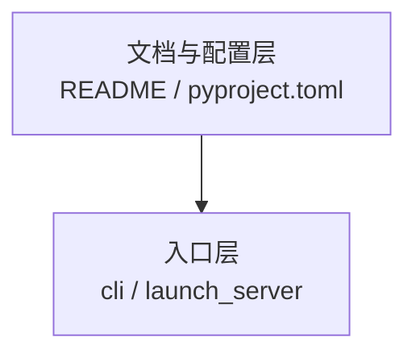

# Obsidian 语法规范（源码阅读 Vault）

> **维护者文档**：命名、双链、frontmatter。AI 代理须遵守 [[AGENTS]] 与本页。  
> **读者不必阅读本页。**

---

## 1. 本 vault 特点

| 维度 | 说明 |
|------|------|
| 核心单元 | 专题模块 `{模块名}-{文档类型}.md` |
| frontmatter | 全库强制（`type` + `tags` + 可选 `module`） |
| 架构图 | Mermaid 流程图 + 部分 ASCII |
| 对照源码 | `sglang/`、`slime/` upstream（读者可选） |
| 关系维度 | 数据流 / 调用链 / 专题依赖 |

---

## 2. 文件命名（强约束）

Obsidian Graph 用**文件名**作节点标签。禁止在多个目录重复使用 `README.md`、`01-核心概念.md` 等泛化名。

### 2.1 专题模块

目录 `{阶段}/{NN-ModuleName}/` 内文件命名：

| 旧名（禁止） | 新名（必须） | doc_type tag |
|-------------|-------------|--------------|
| `README.md` | `{NN-ModuleName}-00-MOC.md` | `sglang/doc/moc` |
| `01-核心概念.md` | `{NN-ModuleName}-01-核心概念.md` | `sglang/doc/concept` |
| `02-源码走读.md` | `{NN-ModuleName}-02-源码走读.md` | `sglang/doc/walkthrough` |
| `03-数据流与交互.md` | `{NN-ModuleName}-03-数据流与交互.md` | `sglang/doc/dataflow` |
| `04-关键问题.md` | `{NN-ModuleName}-04-关键问题.md` | `sglang/doc/faq` |
| `checkpoint.md` | `{NN-ModuleName}-05-checkpoint.md` | `sglang/doc/checkpoint` |

示例：`07-Scheduler/07-Scheduler-01-核心概念.md` → 图谱节点 **「07-Scheduler-01-核心概念」**；文件管理器按 `00→05` 与五件套阅读顺序一致。

### 2.2 阶段 / 总索引

| 文件 | 用途 |
|------|------|
| `SGLang源码阅读指南.md` | `sglang_reading/` 总入口 |
| `Slime源码阅读指南.md` | `slime_reading/` 总入口 |

### 2.2.1 双库文件名冲突（强约束）

SGLang 与 Slime 共用部分阶段目录名（如 `00-方法论`、`01-启动与入口`）。**Vault 内文件名必须全局唯一**。

| 冲突文件（禁止在 slime 侧裸用） | Slime 侧命名 |
|--------------------------------|--------------|
| `00-方法论-*.md`（六件套） | `Slime-00-方法论-*.md` |
| `01-启动与入口-00-MOC.md` | `Slime-01-启动与入口-00-MOC.md` |
| `术语表.md`（总结层） | `Slime-术语表.md` |
| `业务域流程.md` | `Slime-业务域流程.md` |
| `模块依赖图.md` | `Slime-模块依赖图.md` |

双链示例：

```markdown
[[00-方法论-00-MOC]]              ← SGLang 方法论
[[Slime-00-方法论-00-MOC]]        ← Slime 方法论
[[Slime-术语表]]                   ← Slime 术语表（勿用 [[术语表]]）
[[术语表]]                         ← SGLang 术语表
[[与SGLang阅读对照]]               ← Slime 侧双库对照
[[与Slime阅读对照]]                ← SGLang 侧双库对照
[[91_dashboard/dual-library-path]] ← 双库联合路径
[[91_dashboard/cross-library-map]] ← 跨库专题对照（canonical）
```

Slime 专题模块（如 `08-RolloutManager-01-核心概念`）与 SGLang 无冲突，**无需** `Slime-` 前缀。

### 2.3 SGLang 阶段 MOC 示例

| 文件 | 用途 |
|------|------|
| `01-启动与入口-00-MOC.md` | SGLang 阶段 I 入口 |
| `07-总结与索引-00-MOC.md` | SGLang 总结层入口 |

### 2.4 标准 frontmatter（批次文档）

```yaml
---
type: batch-doc          # 或 module-moc / stage-moc / index-doc
module: 07-Scheduler
batch: "07"
doc_type: concept        # moc | concept | walkthrough | dataflow | faq | checkpoint
title: "批次 07 · Scheduler · 核心概念"
tags:
  - sglang/batch/07
  - sglang/module/scheduler
  - sglang/doc/concept
aliases:
  - "01-核心概念"       # 兼容旧称
updated: 2026-07-02
---
```

Slime 批次将 `sglang/` 前缀换为 `slime/`：

```yaml
tags:
  - slime/batch/08
  - slime/module/rollout-manager
  - slime/doc/concept
```

---

## 3. Mermaid（高频渲染问题）

### 3.1 换行：必须用 `<br/>`

Obsidian 内置 Mermaid **不会**把 `\n` 解析为换行，会显示为字面量 `\n`（见批次 01 架构图修复前的问题）。



| 写法 | Obsidian 渲染 |
|------|---------------|
| `["标题\n副标题"]` | ❌ 显示 `\n` 字符 |
| `["标题<br/>副标题"]` | ✅ 两行文本 |
| 边标签 `\|"ZMQ PUSH<br/>TokenizedReq"\|` | ✅ 多行边标签 |

### 3.2 手工修复

Mermaid 标签内将 `\n` 改为 `<br/>`。不要改动 Python 源码块中的 `"\n\n"` 等字符串。

### 3.3 其他 Mermaid 建议

- 节点 ID 用英文短名（`SCH`、`TM`），中文放引号标签内
- 复杂说明写在 Mermaid 图下方的 Markdown 正文，不要塞进节点
- `subgraph` 标题含特殊字符时用双引号包裹
- 单图节点数建议 &lt; 20；更大图拆成多图或改 ASCII

### 3.4 图谱配置注意（`.obsidian/graph.json`）

- **禁止** 搜索框使用 `-path:sglang`（会误排除 `sglang_reading/`，图谱空白）
- **禁止** 颜色组使用 `tag:#sglang/doc/xxx`（斜杠导致 Obsidian 截断查询）
- **推荐** 颜色组用 frontmatter 属性：`[doc_type:concept]`、`[type:stage-moc]`

---

## 4. 双链 WikiLinks

### 4.1 推荐写法

```markdown
[[07-Scheduler-01-核心概念|Scheduler 核心概念]]
[[07-Scheduler-00-MOC]]
[[全链路请求追踪]]
```

## 写作规范（读者向）

- **禁止**在 H1、正文、Mermaid、双链 alias 中使用「批次 NN」——这是维护者进度编号，不是读者语言。
- 用**模块名 / 专题名**（如「启动链路与 CLI」「HTTP Server 入口」）替代。
- frontmatter 保留 `batch:` 与 `tags: sglang/batch/NN` 供图谱过滤；读者界面不展示。
- 正文以中文为主；若内嵌 README、docstring、help text 等长英文源码摘录，须在代码块后补一段 `中文释义` 或等价中文说明。标识符、函数名、CLI flag、协议名可保留英文。

### 4.2 禁止误链

以下出现在 **代码块** 或 **行内代码** 中，**不是** Obsidian 双链，勿改：

```python
Optional[Callable[[], bool]]
yield b"data: " + chunk + b"\n\n"
```

```toml
[[tool.setuptools-rust.ext-modules]]
```

代码块、Python 类型标注、TOML 表头中的 `[[path.md-MOC|[` 会被 Obsidian 误解析 — 须避免。

### 4.3 相对链接

| 方式 | 优点 | 适用 |
|------|------|------|
| `[文本]]` | GitHub 兼容好 | 已有批次正文，可保留 |
| `[[path\|alias]]`（实际写 `|` 非 `\|`） | 图谱、反向链接 | 新建索引、跨批次引用 |

迁移已完成：**全库使用双链**，相对路径仅保留在 `_TEMPLATE/README.md` 说明中。

---

## 5. Markdown 结构

- 每篇笔记 **一个 H1**（用 frontmatter `title` / 模块名；**禁止**在 H1 写「批次 NN」）
- 标题不跳级（`##` 后直接 `####` 禁止）
- 表格、列表、代码块前后空一行
- 下划线文件名（如 `__init__.py`）在正文用反引号包裹，避免被解析为斜体

---

## 6. Callouts（可选）

Obsidian 标注块可用于调试备忘：

```markdown
> [!tip] 调试提示
> Prefill 卡住时先查 [[sglang_reading/02-请求调度/07-Scheduler/04-关键问题|Scheduler 关键问题]]。
```

---

## 7. 图谱阅读

默认过滤（复制到 Graph 搜索框）：

```text
(path:sglang_reading OR path:slime_reading) -path:_TEMPLATE
```

SGLang MOC 主干：

```text
tag:#sglang/doc/moc OR tag:#sglang/stage-moc -path:_TEMPLATE -path:sglang
```

Slime MOC 主干：

```text
tag:#slime/doc/moc -path:_TEMPLATE path:slime_reading
```

详见 [[90_meta/obsidian-graph-presets]]。

---

## 8. 检查清单（发布前）

- [ ] 文件名含模块前缀，无泛化 `README` / `01-核心概念`
- [ ] frontmatter 含 `tags`
- [ ] Mermaid 块内无 `\n` 字面量
- [ ] 双链目标存在
- [ ] H1 唯一
- [ ] 读者向文档无内部编号树、无论文库话术

---

## 9. 维护工具

| 工具 | 用途 |
|------|------|
| `90_meta/audit_wikilinks.mjs` | 断链扫描 |

---

## 10. 参考

- [[AGENTS]] — AI 代理指南
- [[index]] — 读者首页

---

*最后更新: 2026-07-03 — 读者/维护分层*
