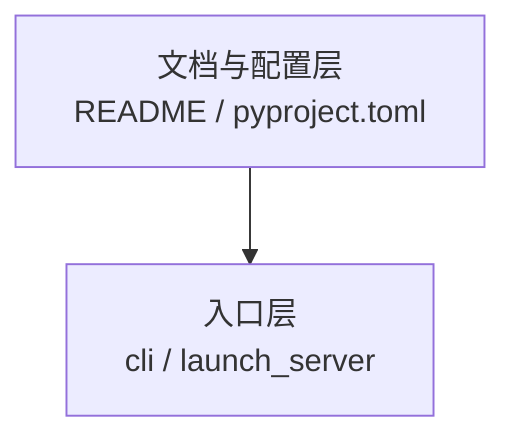

# Obsidian 语法规范（源码阅读 Vault）

> 继承自 **OPD** / **ESC_papers** 的 vault 管理习惯，针对 **SGLang 源码阅读** 场景裁剪。  
> AI 代理处理本 vault 时须遵守 [[AGENTS]] 与本页。

---

## 1. 与论文 vault 的差异

| 维度 | OPD / ESC_papers | 本 vault（源码阅读） |
|------|------------------|----------------------|
| 核心单元 | 论文笔记 `@citekey` | 批次模块 `{模块名}-{文档类型}`（如 `07-Scheduler-核心概念`） |
| 必备 frontmatter | 全库强制 | **全库强制**（`type` + `tags` + `module`/`batch`） |
| 架构图 | 优先 ASCII 盒状图 | Mermaid 流程图 + 部分 ASCII |
| PDF | `10_pdfs/` | 无；对照 `sglang/` 源码 |
| 关系维度 | builds_on / extends … | 数据流 / 调用链 / 批次依赖 |

---

## 2. 文件命名（图谱可读性 — 强约束）

Obsidian Graph 用**文件名**作节点标签。禁止在多个目录重复使用 `README.md`、`01-核心概念.md` 等泛化名。

### 2.1 批次模块（32 个）

目录 `{阶段}/{NN-ModuleName}/` 内文件命名：

| 旧名（禁止） | 新名（必须） | doc_type tag |
|-------------|-------------|--------------|
| `README.md` | `{NN-ModuleName}-00-MOC.md` | `sglang/doc/moc` |
| `01-核心概念.md` | `{NN-ModuleName}-01-核心概念.md` | `sglang/doc/concept` |
| `02-源码走读.md` | `{NN-ModuleName}-02-源码走读.md` | `sglang/doc/walkthrough` |
| `03-数据流与交互.md` | `{NN-ModuleName}-03-数据流与交互.md` | `sglang/doc/dataflow` |
| `04-关键问题.md` | `{NN-ModuleName}-04-关键问题.md` | `sglang/doc/faq` |
| `checkpoint.md` | `{NN-ModuleName}-05-checkpoint.md` | `sglang/doc/checkpoint` |

示例：`07-Scheduler/07-Scheduler-01-核心概念.md` → 图谱节点 **「07-Scheduler-01-核心概念」**；文件管理器按 `00→05` 与五件套阅读顺序一致。

### 2.2 阶段 / 总索引

| 文件 | 用途 |
|------|------|
| `SGLang源码阅读指南.md` | `sglang_reading/` 总入口（原 README） |
| `01-启动与入口-00-MOC.md` | 阶段 I 入口（原阶段 README） |
| `07-总结与索引-00-MOC.md` | 批次 30 入口 |

### 2.3 标准 frontmatter（批次文档）

```yaml
---
type: batch-doc          # 或 module-moc / stage-moc / index-doc
module: 07-Scheduler
batch: "07"
doc_type: concept        # moc | concept | walkthrough | dataflow | faq | checkpoint
title: "批次 07 · Scheduler · 核心概念"
tags:
  - sglang/batch/07
  - sglang/module/scheduler
  - sglang/doc/concept
aliases:
  - "01-核心概念"       # 兼容旧称
updated: 2026-07-02
---
```

---

## 3. Mermaid（高频渲染问题）

### 3.1 换行：必须用 `<br/>`

Obsidian 内置 Mermaid **不会**把 `\n` 解析为换行，会显示为字面量 `\n`（见批次 01 架构图修复前的问题）。



| 写法 | Obsidian 渲染 |
|------|---------------|
| `["标题\n副标题"]` | ❌ 显示 `\n` 字符 |
| `["标题<br/>副标题"]` | ✅ 两行文本 |
| 边标签 `\|"ZMQ PUSH<br/>TokenizedReq"\|` | ✅ 多行边标签 |

### 3.2 批量修复

```bash
python 90_meta/fix_mermaid_newlines.py
```

脚本**仅**处理 ` ```mermaid ` 围栏内的 `\n`，不会改动 Python 源码块中的 `"\n\n"` 等字符串。

### 3.3 其他 Mermaid 建议

- 节点 ID 用英文短名（`SCH`、`TM`），中文放引号标签内
- 复杂说明写在 Mermaid 图下方的 Markdown 正文，不要塞进节点
- `subgraph` 标题含特殊字符时用双引号包裹
- 单图节点数建议 &lt; 20；更大图拆成多图或改 ASCII

### 3.4 图谱配置注意（`.obsidian/graph.json`）

- **禁止** 搜索框使用 `-path:sglang`（会误排除 `sglang_reading/`，图谱空白）
- **禁止** 颜色组使用 `tag:#sglang/doc/xxx`（斜杠导致 Obsidian 截断查询）
- **推荐** 颜色组用 frontmatter 属性：`[doc_type:concept]`、`[type:stage-moc]`

---

## 4. 双链 WikiLinks

### 4.1 推荐写法

```markdown
[[07-Scheduler-01-核心概念|Scheduler 核心概念]]
[[07-Scheduler-00-MOC]]
[[全链路请求追踪]]
```

## 写作规范（读者向）

- **禁止**在 H1、正文、Mermaid、双链 alias 中使用「批次 NN」——这是维护者进度编号，不是读者语言。
- 用**模块名 / 专题名**（如「启动链路与 CLI」「HTTP Server 入口」）替代。
- frontmatter 保留 `batch:` 与 `tags: sglang/batch/NN` 供图谱过滤；读者界面不展示。
- 维护脚本：`90_meta/strip_reader_batch_wording.mjs`、`90_meta/strip_batch_pass2.mjs`

### 4.2 禁止误链

以下出现在 **代码块** 或 **行内代码** 中，**不是** Obsidian 双链，勿改：

```python
Optional[Callable[[], bool]]
yield b"data: " + chunk + b"\n\n"
```

```toml
[[tool.setuptools-rust.ext-modules]]
```

ESC/OPD 维护经验：ASCII 图、Python 类型标注、TOML 表头中的 `[[path.md-MOC|[` 会被误解析 — 本 vault 同样适用。

### 4.3 相对链接

| 方式 | 优点 | 适用 |
|------|------|------|
| `[文本]]` | GitHub 兼容好 | 已有批次正文，可保留 |
| `[[path\|alias]]`（实际写 `|` 非 `\|`） | 图谱、反向链接 | 新建索引、跨批次引用 |

迁移已完成：**全库使用双链**，相对路径仅保留在 PLAN/模板说明中。

---

## 5. Markdown 结构

- 每篇笔记 **一个 H1**（`# 批次 NN：…` 或 `# 模块名`）
- 标题不跳级（`##` 后直接 `####` 禁止）
- 表格、列表、代码块前后空一行
- 下划线文件名（如 `__init__.py`）在正文用反引号包裹，避免被解析为斜体

---

## 6. Callouts（可选）

Obsidian 标注块可用于调试备忘：

```markdown
> [!tip] 调试提示
> Prefill 卡住时先查 [[sglang_reading/02-请求调度/07-Scheduler/04-关键问题|Scheduler 关键问题]]。

> [!warning] 归档
> `_archive/` 下为过时草稿，请勿从主路径链入。
```

---

## 7. 图谱阅读

默认过滤（复制到 Graph 搜索框）：

```text
tag:#sglang/doc/moc OR tag:#sglang/stage-moc -path:_archive -path:_TEMPLATE -path:sglang
```

详见 [[obsidian-graph-presets]]。

---

## 8. 检查清单（发布前）

- [ ] 文件名含模块前缀，无泛化 `README` / `01-核心概念`
- [ ] frontmatter 含 `tags`（至少 batch + doc_type）
- [ ] Mermaid 块内无 `\n` 字面量
- [ ] 双链目标存在；无 `./0X-*.md` 旧路径
- [ ] H1 唯一
- [ ] 未修改 `.obsidian/`

---

## 9. 维护脚本

| 脚本 | 用途 |
|------|------|
| `90_meta/obsidian_fix_reading_order.mjs` | 批次文件加 `00`–`05` 阅读序前缀 + 双链重写 |
| `90_meta/audit_wikilinks.mjs` | 扫描断链与 sidebar 排序 |
| `90_meta/obsidian_fix_remaining_links.py` | 修补残留旧路径链接 |
| `90_meta/obsidian_cleanup_wikilinks.py` | 清理丑陋 alias、目录链接 |
| `90_meta/fix_mermaid_newlines.py` | Mermaid `\n` → `<br/>` |

---

## 10. 参考

- [[AGENTS]] — vault 总指南
- [[index]] — vault 首页
- `F:\ESC_papers\obsidian_1.12.7_claude_rules.md` — 完整 Obsidian 语法参考（论文库版）
- `F:\ESC_papers\50_outputs\ESC-Papers-Vault-盘点策略与检查规范.md` — 四维度质量检查体系

---

*最后更新: 2026-07-02 — 唯一文件名 + tag 图谱 + 全库双链*
