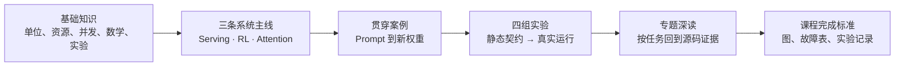

# AI Infra 入门课程

> **课程目标：** 用 SGLang、Slime、FlashAttention 三个真实系统建立可迁移的对象、时序、资源与证据模型，而不是背三棵目录树。

## 你为什么要读

三套框架分别暴露服务、RL 闭环和 GPU kernel 的关键边界。本课程把它们组织成同一条因果链，让你知道宏观症状应落到哪类对象、哪层证据，而不是在庞大源码树里随机搜索。

## 你最终要具备什么能力

- 沿一次请求解释 text/token/request/batch/KV/tensor/text delta 的对象变化。
- 沿一次 RL 迭代解释 prompt/Sample/train batch/advantage/loss/weight version 的因果链。
- 沿一次 attention 调用解释 Python API/C++ params/dispatch/tile/online softmax/O-LSE。
- 遇到慢、错、挂、漂移时，先判断失效边界，再选择 log、metric、trace、profile、CPU test 或 GPU e2e。
- 所有性能结论都绑定版本、硬件、workload、指标观察点和正确性门槛。

## 为什么把三套源码放在一起

| 尺度 | 框架主角 | 主要对象 | 典型问题 |
|------|----------|----------|----------|
| 服务系统 | SGLang | request、batch、KV、worker result | 排队、回程、cache、吞吐与尾延迟 |
| RL 闭环 | Slime | Sample、ObjectRef、advantage、weight version | group、陈旧、训练、同步与恢复 |
| GPU 算子 | FlashAttention | tensor、params、tile、LSE、gradient | IO、数值、dispatch 与硬件特化 |

同一次回答会穿过三个尺度。只懂一层，容易拿错证据：用 GPU utilization 解释 HTTP 背压、用 reward 曲线解释旧策略 rollout，或用 attention 公式替代 HBM traffic 实测。

## 课程路线



### 第一阶段：共同语言

| 文档 | 学完后的产物 |
|------|--------------|
| [[LLM推理与Token]] | token、sequence、scheduled tokens 和 KV payload 账 |
| [[并发进程与背压]] | 边界/容量/完成/取消表 |
| [[GPU内存与算子]] | GPU 六类内存和 tile 生命周期图 |
| [[分布式通信与并行]] | rank-group 坐标与控制/数据/提交三面图 |
| [[RL后训练数学基础]] | 四种 policy/logprob 身份表与 ratio 手算 |
| [[性能指标与实验方法]] | 可复现实验模板 |

### 第二阶段：只走最短主线

1. [[推理Serving主线]]：请求账、执行账、回程账。
2. [[Attention算子主线]]：API、dispatch、kernel 三层契约。
3. [[RL训练闭环主线]]：五只钟、六个交接边界。

这一阶段先形成因果图，不要求把所有专题读完。遇到不懂的名词再跳到专题核心概念，避免按文件树失去主线。

### 第三阶段：用一个案例贯穿三库

[[从Prompt到新权重]] 应被复述成闭环，而不是线性目录：

```text
prompt group
→ Slime 为每个样本调用 rollout policy
→ SGLang request / scheduler / KV / model forward
→ 实际 attention backend 产生 attention output
→ token / response 回到 Slime reward 与 train data
→ advantage / policy loss / optimizer
→ engine 提交新权重版本
→ 下一次 rollout policy 改变
```

要求同时保留 request id、Sample/group、KV location 和 policy version 四本身份账；它们相关但不同名。

FlashAttention 在课程中承担 kernel/IO 心智模型，不表示每次 SGLang 请求都直接调用本仓库的 FlashAttention 实现。SGLang 可能选择 FlashInfer、Triton、FlashAttention 或平台专用 backend；只有 dispatch 与 profiler 证据才能证明真实 kernel。贯穿案例会显式保留这条边界。

### 第四阶段：实验与证据升级

| 实验 | 静态/低环境模式 | 完整环境模式 |
|------|-----------------|--------------|
| [[SGLang服务实验]] | 定位请求、调度、回程对象 | 真实服务、stream、overlap 与指标 |
| [[FlashAttention性能实验]] | reference/dispatch/源码契约 | CUDA 数值、benchmark、profiler |
| [[Slime闭环实验]] | 主循环、Sample、loss、updater 静态/CPU 检查 | Ray + Megatron + SGLang 闭环 |
| [[跨库一致性实验]] | 字段与版本不变量 | 请求—训练—更新行为对照 |

环境限制必须进入结论：静态检查通过、CPU contract 通过和 GPU e2e 通过是三种不同证据。

## 建议学习节奏

每个主题循环四步：

1. **画模型：** 只画对象、所有者、箭头和完成信号。
2. **找证据：** 到源码走读核对调用点、shape 和失败分支。
3. **做验证：** 先最小静态/CPU，再按环境升级。
4. **写反例：** 说明这个模型在哪个配置、版本或硬件下失效。

不要用阅读数量作为进度。一次能解释的故障、一个被证伪的假设和一份可复现实验记录，比“读完 50 篇”更接近掌握。

## 深入入口

- Serving 与生产：[[SGLang学习指南]]
- RL 后训练与扩展：[[Slime学习指南]]
- Attention kernel：[[FlashAttention学习指南]]
- 横向主题：[[三框架知识地图]]
- 最终验收：[[课程完成标准]]

## Obsidian 使用建议

- Bookmark 本页、当前主线、当前实验和当前专题；文件夹只负责物理归档。
- 在专题页用 Local Graph 深度 1–2 查看语义邻居，不以全局图谱替代学习顺序。
- 用 Properties/Bases 按 `framework`、`topic`、`type`、`learning_role` 筛选。
- 修改实现或遇到证据争议时，按文档的 `source_baseline` 回到对应 upstream；笔记不是源码的永久替代品。
