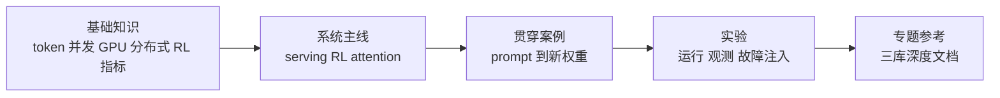

# AI Infra 入门课程

## 学习目标

这条课程不是要求你按文件树读完三套框架，而是借助三个真实系统建立一套可迁移的 AI Infra 心智模型：

- 用 SGLang 理解请求、调度、KV Cache、模型执行和生产 serving。
- 用 Slime 理解 rollout、训练数据、分布式训练和权重一致性。
- 用 FlashAttention 理解 tensor 如何穿过 API、binding、dispatch 和 GPU kernel。
- 用统一实验方法解释延迟、吞吐、显存、通信和正确性之间的取舍。

## 为什么这三套源码要一起读

AI 应用看到的是一次回答，AI Infra 看到的是三种尺度同时运转：服务层在管理请求和 KV，训练层在管理样本和权重版本，kernel 层在管理 tile 与数据搬运。只懂其中一层，排障时就容易出现经典错位：拿 GPU 利用率解释 HTTP 背压，拿 reward 曲线解释旧权重 rollout，或拿 attention 公式解释 HBM traffic。

SGLang、Slime 和 FlashAttention 恰好把这三种尺度摊开。课程会反复训练同一个动作：先看宏观生命周期，再把异常缩小到一次对象交接，最后用源码或实验确认。

## 课程地图



## 基础知识

先完成这些内容。它们负责解释后续文档默认使用、但原知识库没有集中讲清的先验。

| 主题 | 读完能解决什么 |
|------|----------------|
| [[LLM推理与Token]] | 解释 token、prefill、decode、KV Cache 和请求输出 |
| [[并发进程与背压]] | 分清 coroutine、进程、Actor、队列、IPC 和取消语义 |
| [[GPU内存与算子]] | 建立 HBM、shared memory、register、带宽和显存账 |
| [[分布式通信与并行]] | 分清 DP、TP、PP、CP、EP、collective 和 rank group |
| [[RL后训练数学基础]] | 理解 reward、logprob、advantage、ratio、KL 和更新闭环 |
| [[性能指标与实验方法]] | 设计可复现对照实验，不用单次数字替代结论 |

## 系统主线

基础知识读完后，只走三条短主线。这里先建立系统边界，不要求阅读所有专题文档。

1. [[推理Serving主线]]：一个请求如何进入 GPU，再流式返回。
2. [[Attention算子主线]]：一个 Q/K/V tensor 如何被 tile 化并写回输出。
3. [[RL训练闭环主线]]：一组 prompt 如何变成训练信号和新权重。

## 贯穿案例

[[从Prompt到新权重]] 使用同一组对象贯穿三库：

```text
prompt group
  -> Slime Sample / rollout_id
  -> SGLang rid / Req / ScheduleBatch
  -> QKV / KV slot / attention tile
  -> reward / advantage / policy loss
  -> optimizer step / weight_version
  -> 下一轮 rollout
```

这是全课程的核心验收。读者如果只能分别解释三个框架，却不能复述这条对象生命周期，仍未形成 AI Infra 全局模型。

## 实验路径

| 实验 | 主要观测 |
|------|----------|
| [[SGLang服务实验]] | TTFT、TPOT、KV 使用率、prefix hit、overlap |
| [[FlashAttention性能实验]] | 正确性、shape dispatch、kernel 时间、HBM traffic |
| [[Slime闭环实验]] | Sample 字段、DP split、loss、weight version |
| [[跨库一致性实验]] | 请求版本、KV 生命周期、训练与 rollout 权重一致性 |

每个实验都有静态模式和运行模式。没有对应 GPU 时仍可完成源码定位和对象契约检查；有 GPU 时再补性能数据。

## 深入方式

完成课程后，再按任务进入参考层：

- 推理与生产：[[SGLang学习指南]]
- RL 后训练与扩展：[[Slime学习指南]]
- Attention kernel：[[FlashAttention学习指南]]
- 按主题横向跳转：[[knowledge_maps/三框架知识地图]]
- 综合验收：[[课程完成标准]]

## 如何使用 Obsidian

- 把本页、当前实验和当前专题加入 Bookmarks，不依赖文件夹位置记忆入口。
- 在专题页打开 Local Graph，深度设为 1 或 2，查看上下游而不是浏览全库大图。
- 使用 Properties/Bases 按 `framework`、`topic`、`type`、`learning_role` 筛选内容。
- aliases 只用于真实同义词和缩写；课程链接始终指向唯一语义文件名。
