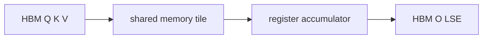

# GPU 内存与算子

## 学习目标

读完后，你应该能区分模型权重、activation、KV Cache、临时 workspace，并能用“计算受限还是带宽受限”解释 prefill、decode 和 FlashAttention 的不同优化方向。

## 存储层级

| 层级 | 特点 | 常见用途 |
|------|------|----------|
| HBM | 容量最大，延迟和能耗最高 | 权重、KV、输入输出 tensor |
| L2 Cache | 芯片共享缓存 | 重用权重或数据块 |
| Shared Memory | CTA 内共享、容量有限 | Q/K/V tile、流水缓冲 |
| Register | 每线程最快、最稀缺 | accumulator、row max/sum |

FlashAttention 的核心不是不计算 score，而是不把完整 `S` 和 `P` 写到 HBM：[[FlashAttention-Attention-IO-核心概念]]。

## 四本显存账

```text
总显存 = 模型权重 + KV Cache + activation/workspace + runtime 预留
```

- 推理时通常由权重和 KV Cache 主导。
- 训练时 activation、梯度、optimizer state 也很大。
- kernel workspace 可能随 shape、split 数或 deterministic 模式变化。
- allocator 碎片和 graph capture buffer 会让理论值与实际值不同。

## 计算受限与带宽受限

Arithmetic intensity 可以粗略理解为“每搬一个 byte 做多少计算”。

- 长 prompt prefill 有较大矩阵，通常更容易利用 Tensor Core。
- 单 token decode 需要反复读权重和历史 KV，更容易受带宽限制。
- Online softmax 通过减少 HBM traffic 改善 attention 的 IO 行为。

## Tile 为什么重要

GPU kernel 不会让一个线程计算完整 attention。它把 Q/K/V 切成 tile，让 CTA 和 warp 协作：



Tile 过大可能造成 shared memory 或 register 压力，降低 occupancy；过小则增加循环和调度开销。

## 运行验证

阅读 [[FlashAttention-前向全链路]]，列出 `Q/K/V`、`acc_s`、`row_max/row_sum`、`acc_o`、`O/LSE` 分别位于哪个存储层级。

预期：完整 `P` 不应出现在常规 HBM 输出中；局部 probability tile 仍会在寄存器中短暂存在。

## 复盘

- 显存容量和 HBM 带宽是两个不同问题。
- Decode 性能不能只看 FLOPs。
- Kernel 优化必须同时考虑 tile、occupancy、访存和数值状态。
- 下一篇读 [[分布式通信与并行]]。

