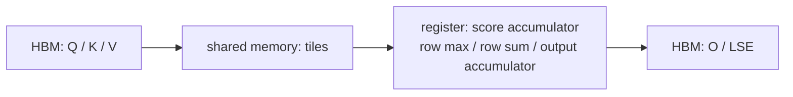

# GPU 内存与算子

## 你为什么要读

“显存不够”和“GPU 跑不满”是两类问题。前者关心哪些长期/临时对象同时存活，后者关心数据搬运、并行度和指令吞吐。FlashAttention、SGLang KV 管理和 Slime colocate 都在解决不同层次的内存问题，不能只用一个 `nvidia-smi` 数字解释。

## GPU 存储层级：容量、作用域、速度一起看

| 层级 | 作用域 | 特点 | 常见对象 |
|------|--------|------|----------|
| HBM / device memory | 整张 GPU | 容量最大、带宽高但离计算单元最远 | 权重、KV、输入输出、workspace |
| L2 cache | GPU 共享 | 硬件管理的片上缓存 | 跨 CTA 的数据重用 |
| shared memory | CTA / thread block | 软件显式组织、容量有限 | Q/K/V tile、双缓冲、通信暂存 |
| register | 单线程 | 最快且最稀缺，过多会压 occupancy | MMA accumulator、row max/sum、地址状态 |

“越快越好”不成立：对象必须适合该层的容量和作用域。register spill、shared-memory 超额或低重用都会抵消理论优势。

## 六本 GPU 内存账

```text
进程可见占用
≈ 参数/权重
 + optimizer/gradient/master weight
 + activation 与 autograd 保存状态
 + KV / prefix / persistent cache
 + kernel 与通信 workspace
 + allocator / graph capture / runtime 预留与碎片
```

| 场景 | 常见主导项 | 需要特别核对 |
|------|------------|--------------|
| LLM inference | 权重、KV、graph/cache buffer | 并发与长度分布、KV dtype/layout |
| training | 参数、梯度、optimizer、activation | micro-batch、recompute、parallel shard |
| colocate RL | 训练状态与 rollout 权重/KV 的时间重叠 | sleep/wake、offload/onload 的峰值 |
| 单个 kernel | 输入输出、workspace、临时 accumulator | shape、split、deterministic 与 arch |

不要把理论 tensor 字节和进程峰值画等号。缓存 allocator 通常不会立刻归还 device memory；graph capture 还可能要求地址稳定。

## 计算受限与带宽受限

Arithmetic intensity 是“每搬运一个 byte 能做多少有效计算”的近似视角：

```text
arithmetic intensity = operations / bytes moved
```

- 大矩阵和长 prompt prefill 更可能接近计算吞吐上限，但小 batch、shape 或通信仍可能使其低效。
- 单 token decode 会重复读取大量权重和历史 KV，通常更容易受内存带宽与 batch 利用率限制。
- 一个 kernel duration 下降，可能来自少搬数据、更多并行、更好指令或更少工作；必须结合 bytes、FLOPs 和数值语义判断。

Roofline 是诊断模型，不是给所有 workload 贴永久标签。同一算子随 shape、dtype、架构和融合方式变化，瓶颈可以迁移。

## FlashAttention 为什么从 IO 入手

标准 attention 的数学对象包含 score/probability 矩阵，但 GPU 实现不必把完整矩阵写回 HBM。FlashAttention 用 Q/K/V tile 和 online softmax 状态，在片上分块累积输出分子与归一化状态，最后写 O/LSE。



关键严谨点：FA2 主循环里的 `acc_s` / `rP` 主要表示当前尺度下的未归一化指数权重，不应笼统称为“局部最终 probability”。归一化由 online softmax 缩放和 epilogue 共同完成。详见 [[FlashAttention-FA2-Forward-核心概念]]。

## Tile 的三重权衡

| tile 变大 | 可能收益 | 可能代价 |
|-----------|----------|----------|
| K/V 重用更多 | HBM transaction 更少、MMA 更饱满 | shared memory、register 增加 |
| 循环次数减少 | 控制开销下降 | 可驻留 CTA 减少、occupancy 下降 |
| 每块工作更多 | amortize launch/metadata | 尾块浪费、shape 适配变差 |

因此 tile 参数必须与 head dim、causal、dropout、架构和 kernel variant 一起解释；不存在脱离 workload 的“最大 tile 最快”。

## 可执行验证

沿 [[FlashAttention-前向全链路]] 建一张对象表：Q/K/V、score accumulator、row max/sum、output accumulator、O、LSE 分别在哪个层级、存活多久、是否写回 HBM。

预期：常规 forward 不把完整 N×N probability 矩阵作为输出写回 HBM；测试/return-softmax 路径和 dropout 调试输出是条件分支，不能反推常规路径。

若有 CUDA profiler，再固定 shape/arch/dtype，对比 kernel duration、HBM bytes、register/shared-memory 与 occupancy；不要只看单个 utilization 百分比。

## 复盘

- 容量、带宽、延迟、occupancy 是不同维度。
- HBM 已分配、allocator reserved 和 tensor live bytes 不是同一个数。
- FlashAttention 的核心收益来自分块计算与减少中间 HBM materialization，不是少算 attention 数学。
- 优化判断必须绑定 shape、dtype、架构与数值契约。

下一篇：[[分布式通信与并行]]。
