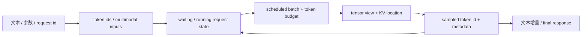

# LLM 推理与 Token

## 你为什么要读

AI Infra 不直接调度“文字”，而是调度 token、请求状态、KV 地址和 GPU batch。字符数相近的请求，token 数、prefill 成本和可服务并发可能完全不同。先把这些单位分清，后面读 SGLang scheduler、Slime rollout 和 FlashAttention shape 才不会混账。

## 一条请求的最小生命周期

假设 prompt 被编码成 20 个 token，模型最终生成 4 个 token：

```text
文本 + sampling 参数
  → tokenizer: 20 个 input token
  → prefill: 处理 prompt，建立每层历史 KV
  → decode 1: 读历史 KV，选出第 1 个新 token，并把它的 KV 追加进 cache
  → decode 2..4: 重复单步追加
  → detokenize / stream: token 增量变成文本增量
```

“prefill 一次处理 20 token”是逻辑模型。真实 serving 可能把长 prompt 做 chunked prefill，也可能把多个请求的 token 合进同一次 forward；decode 也可能使用 speculative、multi-token 或特殊模型路径。

| 阶段 | 主要计算 | 主要状态 | 常见压力 |
|------|----------|----------|----------|
| tokenize | text → ids、chat template | tokenizer 配置 | CPU、输入长度、模板漂移 |
| prefill | prompt Q/K/V 与 causal attention | 新建 KV、prefix reuse | TTFT、算力、长上下文内存 |
| decode | 当前 query 读取历史 KV | 追加一个或多个位置 | HBM/KV 带宽、batch 利用率、TPOT |
| detokenize | ids → 增量文本 | UTF-8/merge window、已发送文本 | CPU、流式边界、回程背压 |

## 六种数量不要混淆

| 名称 | 它数什么 | 为什么重要 |
|------|----------|------------|
| request concurrency | 系统内同时存活的请求 | 决定队列、状态对象和连接压力 |
| prompt length | 输入 token 数 | 决定 prefill 工作与初始 KV |
| response length | 已生成/计划生成的 token 数 | 决定 decode 轮数与追加 KV |
| sequence length | 当前 prompt + response 的有效长度 | 决定 attention 可见历史 |
| sequence batch size | 本次 forward 含多少条序列 | 不等于本轮实际计算的 token 数 |
| scheduled token count | 本轮 prefill/decode 实际处理多少 token | continuous/chunked batching 的直接预算 |

Continuous batching 改变的是每一轮的成员和 token 配额：完成的请求离开，waiting/running 请求按 scheduler 规则补入。它不是“固定 batch 里谁先结束谁空着”。

## KV Cache 到底保存什么

自回归 Transformer 的每层会为每个历史位置保存 K 和 V。decode 时仍要为新位置计算当前层的 Q/K/V，但历史位置的 K/V 可以直接读取，不必重算整段 prompt。

对普通 dense KV layout，一条序列的粗略数据量是：

```text
KV bytes ≈ sequence_tokens
           × num_layers
           × 2                 # K 和 V
           × num_kv_heads
           × head_dim
           × bytes_per_element
```

这只是 payload 下界，不含 page/slot 对齐、allocator metadata、预留空间和碎片。GQA/MQA 通过减少 `num_kv_heads` 降低 KV；MLA、量化 KV、滑窗、跨层共享和分层缓存会让这个公式失效，应回到具体实现。

## 请求对象如何改变形态



循环箭头表示 decode 后请求回到 running 状态，直到 stop、length、abort 或 error。不同层的 id 也有不同作用：API request id、内部 request object、KV slot 和 batch index 不能互换。

对应源码主线见 [[SGLang-HTTP请求全链路]]；KV 物理地址见 [[SGLang-KV-Cache]]。

## 可执行验证

选择你实际使用的 tokenizer，对以下文本打印 token ids 和长度：

```text
hello world
hello  world
你好，世界
<system prompt> + 同一句用户问题
```

记录 tokenizer 名称、revision、是否应用 chat template。预期：空格、语言、特殊 token 和模板都会改变 token 数；不能用字符数替代容量规划。

再手算一个 KV payload：给定 layers、KV heads、head dim、dtype 和 sequence length，使用上式计算下界，并明确它不等于框架可用容量。

## 复盘

- prefill 建立历史状态，decode 按位置追加；二者的 shape 与瓶颈不同。
- serving 同时有请求数、序列数和 token 数三种 batch 口径。
- KV Cache 用显存避免历史 K/V 重算，但不消除新 token 的逐层计算。
- 任何容量或性能结论都要写 tokenizer、长度分布和测量边界。

下一篇：[[并发进程与背压]]。
