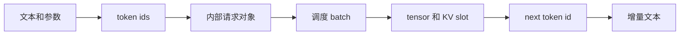

# LLM 推理与 Token

## 学习目标

读完后，你应该能解释一条文本请求为什么会经历 tokenize、prefill、decode、detokenize，并能区分 token 数、请求数、batch 大小和 KV Cache 占用。

## 一个最小请求

假设输入文本被 tokenizer 编成 20 个 token，模型生成 4 个 token：

```text
输入文字 -> 20 个 input token
prefill  -> 一次处理 20 个 token，建立每层 KV
decode   -> 每轮新增 1 个 token，共执行 4 轮
输出     -> 4 个 token 逐步 detokenize 成文字
```

Prefill 和 decode 的压力不同：

| 阶段 | 主要工作 | 常见瓶颈 |
|------|----------|----------|
| Prefill | 对整段 prompt 做矩阵计算并写 KV | 计算量、长 prompt、TTFT |
| Decode | 每轮读取历史 KV 并生成一个新 token | HBM 带宽、batch 利用率、TPOT |

## 四种数量不要混淆

| 名称 | 含义 |
|------|------|
| request count | 同时存在多少条用户请求 |
| sequence length | 一条请求当前包含多少 token |
| batch size | 本轮 GPU forward 合并多少条序列 |
| token budget | 本轮或整个 KV pool 能承载多少 token |

Continuous batching 改变的是每轮 batch 的成员。某条请求结束后，新请求可以立即进入，不必等待整个静态 batch 完成。

## KV Cache 保存什么

Transformer 每层都会为历史 token 产生 K/V。Decode 新 token 只需要计算当前 token 的 Q/K/V，然后让 Q 读取历史 K/V，不需要重新计算整个 prompt。

一个粗略显存模型：

```text
KV bytes ≈ token_count × layers × 2(K+V) × kv_heads × head_dim × dtype_bytes
```

这不是精确容量公式，但足以解释为什么并发数、序列长度、GQA/MQA 和 dtype 会共同决定可服务容量。

## 请求对象如何改变形态



对应 SGLang 主线：[[SGLang-HTTP请求全链路]]。

## 运行验证

选择任意 tokenizer，对同一句文本打印 token ids 和长度，再改变空格、语言或 system prompt。

预期：看起来接近的文本不一定有相同 token 数；容量规划必须以 token 分布而不是字符数为依据。

## 复盘

- Prefill 面向整段输入，decode 面向逐 token 输出。
- KV Cache 用显存换取避免重复计算。
- serving 的核心调度单位最终是 token 和 KV slot，不是字符串。
- 下一篇读 [[并发进程与背压]]，理解这些对象如何跨进程流动。

