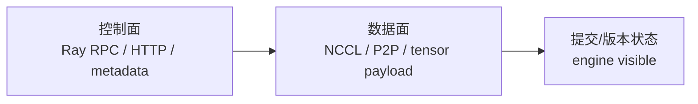

# 分布式通信与并行

## 你为什么要读

一个 global rank 往往同时属于 data、tensor、pipeline、context、expert 等多个 group。遇到 hang 或错值时，“rank 3 出问题”信息不够；必须知道它在什么 group、哪一步协议、持有什么 tensor 片段。

## 并行维度先按“切什么”区分

| 维度 | 切分对象 | 典型通信 | 主要代价 |
|------|----------|----------|----------|
| DP | batch / 样本副本 | gradient all-reduce 或 reduce-scatter | 参数/optimizer 分片与同步 |
| TP | 单层权重与 activation 维度 | all-reduce、all-gather、reduce-scatter | 高频层内通信 |
| PP | 连续层/stage | activation 与 gradient send/recv | bubble、micro-batch 调度 |
| CP | 长序列/context token | ring/P2P、all-gather 或专用 attention 通信 | 序列切片与完整语义恢复 |
| SP | 与 TP 配合的 sequence activation 分片 | reduce-scatter / all-gather | activation 内存与布局 |
| EP | MoE expert | token dispatch/combine、all-to-all | 路由不均与可变通信量 |

同名维度在不同框架/版本中的具体布局可能不同；表格只给心智模型。`world_size = DP×TP×PP×CP×EP` 也不总能机械套用，因为某些 group 组合、共享或模型特性会改变计算方式，应以实际 group builder 为准。

## Rank 有多重坐标

排障记录至少写：

```text
global rank / node rank / local GPU
DP rank / TP rank / PP stage / CP rank / EP rank
process group id or members
tensor global shape / local shape / dtype / device
```

同一进程在 TP group 里可能是 rank 1，在 DP group 里又是 rank 0。只看 global rank 无法判断它应该参与哪个 collective。

## Collective 是群体协议，不是普通函数

collective 的正确性需要组内所有参与者满足同一份契约：

1. 使用同一个 process group 和相容的 world size。
2. 以一致顺序进入对应 collective。
3. tensor shape/split、dtype、device 满足该操作要求。
4. stream/event 依赖使输入已就绪、输出被正确等待。
5. 没有更早的 rank 异常让其余成员永远等待。

注意：不同 collective 的 shape 契约不同，不能简化成“所有 rank tensor shape 必须完全相同”。例如变长 all-to-all 可以有显式 split sizes；必须核对具体 API。

排查 hang 时先找最早没有进入协议的 rank，而不是只盯着最后打印 NCCL 日志的 rank。

## 控制面与数据面



- 控制面决定谁参与、tensor 名/shape、地址、版本和时序。
- 数据面搬运 activation、gradient 或权重 payload。
- 提交面决定新状态何时对请求可见。

Ray RPC 成功只证明控制调用返回；NCCL 完成只证明 payload collective 完成；二者都不能单独证明 engine 已原子切到新版本。

## 在 Slime 与 SGLang 中怎样映射

- Slime PlacementGroup 决定 actor、critic、rollout engine 的 Ray placement，但 Megatron 才建立训练 rank groups。
- RayTrainGroup fan-out 控制调用；actor 内部的 Megatron/NCCL 执行数据面协议。
- SGLang 的 TP/PP/DP、普通/PD、worker 拓扑有多种控制路径；不能概括成“Scheduler 永远只让入口 rank 拉请求再广播”。应按实际 mode 查看 Scheduler/worker loop。
- 权重同步可能用 distributed collective、CUDA IPC/tensor、full disk 或 delta disk；介质不同，完成与失败状态也不同。

## 权重更新应守住的不变量

不要背固定步骤“暂停 → 清 KV → broadcast → 恢复”，因为不同 updater 并不共享完全相同的实现。应检查：

| 不变量 | 要问的问题 |
|--------|------------|
| writer/reader 集合 | 哪些 train rank 写，哪些 engine rank 读？ |
| metadata 一致 | 参数名、shape、dtype、bucket、offset、version 是否一致？ |
| quiescence/lock | 是否允许生成与更新重叠；谁持有 engine lock？ |
| payload 完整 | collective、文件或 IPC 是否全部完成并可见？ |
| cache 语义 | 模型变更后哪些 KV/prefix cache 必须失效，何时失效？ |
| commit/version | engine 在哪个动作后报告新 version？ |
| failure state | 中途失败有没有 rollback，还是需要显式重建/重试？ |

当前 Slime 各路径没有一个可以想当然套用的统一事务 rollback。详见 [[Slime-权重同步]]。

## 可执行验证

阅读 [[Slime-分布式权重同步-数据流]]，分别画：

1. Ray/control metadata 通道；
2. NCCL 或其他 payload 通道；
3. engine commit/version 通道。

预期：三条线能用同一组参数/bucket/version 对齐。再选择一次 collective hang，记录每个 rank 的“进入前最后日志”，寻找第一个协议分叉，而不是只记录超时 rank。

## 复盘

- 并行维度描述切分对象和通信协议，不是 GPU 数的别名。
- rank 必须带 group 坐标，tensor 必须带 global/local shape。
- 控制调用完成、payload 完成和新状态可见是三件事。
- collective hang 往往是更早的分支/异常造成的群体症状。

下一篇：[[RL后训练数学基础]]。
