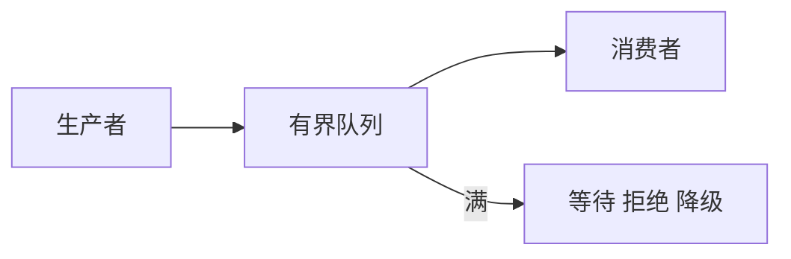

# 并发、进程与背压

## 学习目标

读完后，你应该能分清 coroutine、线程、进程、Ray Actor、消息队列和 collective，并能判断“请求卡住”发生在等待、通信还是计算阶段。

## 五种并发边界

| 边界 | 适合解决什么 | 典型对象 |
|------|--------------|----------|
| coroutine | 同进程内等待网络或队列 | HTTP handler、async generator |
| thread | 阻塞库、后台任务 | tokenizer pool、编译任务 |
| process | 隔离 Python runtime 和 GPU 上下文 | Scheduler、Detokenizer |
| Ray Actor | 跨机器的有状态远程对象 | RolloutManager、Megatron Actor |
| collective | 一组 rank 同步传 tensor | broadcast、all-reduce、all-gather |

它们不是可以互换的“并发写法”。每种边界都改变了错误传播、取消、序列化和资源所有权。

## 背压是什么

生产者比消费者快时，系统必须限制生产速度，否则队列、内存或显存会持续增长。

常见策略：

- 等待：上游 coroutine 挂起，延迟增加但不丢数据。
- 拒绝：快速返回 overload，保护核心系统。
- 合并：把多个通知或输出 chunk 合并。
- 丢弃：仅适合可丢的统计或旧状态。
- 降级：缩短输出、关闭昂贵功能或切换后端。

## 所有权与生命周期

跨进程调试时始终问四个问题：

1. 当前对象由谁创建。
2. 谁持有可变状态。
3. 通过什么通道发送给下一跳。
4. 请求取消或异常时由谁释放资源。

SGLang 的 `rid`、Slime 的 `rollout_id`、Ray `ObjectRef` 都是在跨边界后重新关联状态的标识。

## 两个真实映射

SGLang：HTTP coroutine 等待 TokenizerManager 的事件；Scheduler 与 Detokenizer 位于子进程；ZMQ 传递请求和输出。

Slime：主控进程拿到的是 Ray ObjectRef；训练数据真正位于 Object Store 或远程 Actor；`ray.get` 是同步边界，不是普通函数返回。

## 运行验证

沿 [[SGLang-HTTP请求全链路]] 画出每条箭头的通信方式，并标注“同进程调用、ZMQ、GPU collective、事件唤醒”。

预期：至少能区分 HTTP 无输出是 Scheduler 未产生 token、Detokenizer 未产生文本，还是等待事件没有被唤醒。

## 复盘

- async 解决等待，不自动解决 CPU 或 GPU 并行。
- 进程和 Actor 隔离状态，也增加序列化与恢复成本。
- 背压是稳定性机制，不只是性能优化。
- 下一篇读 [[GPU内存与算子]]。

