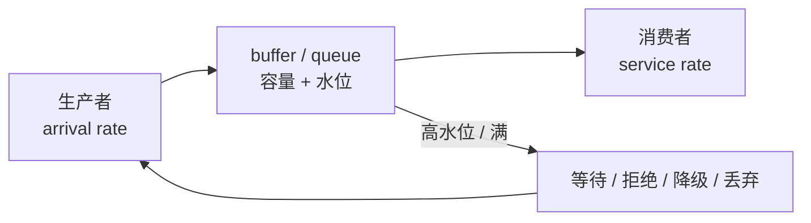

# 并发、进程与背压

## 你为什么要读

AI Infra 的“卡住”可能是 coroutine 等网络、线程占住 event loop、进程 IPC 没回、Ray ObjectRef 未就绪、GPU stream 未完成，或 collective 少了一个 rank。它们表面都是延迟不再推进，恢复方式却完全不同。

## 七种边界，各有自己的所有权

| 边界 | 主要用途 | 共享什么 | 失败/等待如何暴露 |
|------|----------|----------|-------------------|
| coroutine / task | 同进程并发等待 I/O、队列、timer | Python heap、event loop | await 不返回、取消传播、event loop 被阻塞 |
| thread | 包装阻塞库、CPU worker、后台服务 | 进程地址空间 | lock、GIL、线程泄漏、异常不一定传主线程 |
| process | 隔离 Python runtime、CPU/GPU context | 仅显式 IPC/SHM | 子进程退出、pipe/ZMQ 断开、序列化错误 |
| Ray Actor | 跨进程/机器的有状态对象 | actor 内状态 | ObjectRef error、actor restart、placement pending |
| queue / channel | 解耦生产与消费 | 消息协议 | backlog、容量满、丢弃或阻塞 |
| GPU stream / event | GPU 工作异步提交与依赖 | device memory | host 已返回但 kernel 未完成、跨流竞态 |
| collective group | 多 rank 协同传 tensor | group 成员与调用顺序 | 某 rank 缺席时其他 rank 常表现为 hang |

`async` 只让等待期间 event loop 可以做别的事；同步 HTTP、`time.sleep`、重 CPU 计算或 `ray.get` 放进 async 函数，仍可能阻塞整个 loop。

## 背压：容量必须有所有者

生产速率长期高于消费速率时，系统只有两类结局：显式限速，或隐式把队列/内存/延迟撑爆。

| 策略 | 何时适合 | 必须说明的语义 |
|------|----------|----------------|
| 等待 | 数据不能丢，调用者能承受排队 | timeout、取消后资源如何释放 |
| 拒绝 | 保护核心服务、允许客户端重试 | 错误码、retry/backoff、幂等 |
| 合并 | 中间状态可覆盖、输出可批处理 | 合并后是否改变顺序或完成语义 |
| 丢弃 | metrics、过期心跳等可丢数据 | 丢哪一类、是否可观测 |
| 降级 | 可牺牲功能换稳定性 | 输出长度、精度或后端变化要显式 |

“队列是无界的”不是没有背压策略，而是把背压推迟到内存耗尽或尾延迟失控。

## 跨边界时保留五本账

1. **所有权：** 谁创建并修改对象？
2. **身份：** 用哪个 id 把请求、样本和结果重新关联？
3. **容量：** 队列、并发 semaphore、Object Store 或 KV pool 的上限在哪里？
4. **完成：** 什么事件表示下一跳可以安全消费？
5. **取消/失败：** inflight 工作、锁、slot 和缓存由谁清理？

SGLang 的 request id、Slime 的 `rollout_id`、Sample 的 `index/group_index` 和 Ray `ObjectRef` 作用域不同。它们都能关联状态，但不能互相替代，更不能把 `rollout_id` 当 weight version。

## 两个真实映射

### SGLang

HTTP handler/TokenizerManager、Scheduler、Detokenizer 和 GPU worker 之间可能跨 coroutine、进程与 IPC。无输出可能是请求尚未调度、GPU 尚未产 token、detokenize 窗口尚未形成文本，或最终事件没有提交；要沿对象和 channel 定位。

### Slime

driver 调 `generate.remote` / `train.remote` 得到 ObjectRef，真正数据可能位于 Ray object store 或 actor 进程。`ray.get` 形成 host 同步点；actor 内部随后还可能进入 NCCL collective。外层 future 完成不代表所有外部副作用都具有事务回滚。

## 可执行验证

沿 [[SGLang-HTTP请求全链路]] 画一张通信表：

| 箭头 | 边界类型 | payload | 容量/背压 | 完成信号 | 失败下一跳 |
|------|----------|---------|-----------|----------|------------|

至少覆盖 HTTP、内部 IPC、GPU 执行和输出事件。预期：你能把“没有 token”“有 token 无文本”“文本未返回客户端”分成不同阶段。

再沿 [[Slime-训练主循环]] 标出 `.remote`、ObjectRef 与 `ray.get`；说明同步主循环和异步预取在哪些位置形成屏障。

## 复盘

- concurrency 是多项工作重叠，parallelism 是同时执行；二者不必同时发生。
- 每跨一次进程/actor/collective，错误传播、序列化和资源释放规则都会改变。
- 背压必须同时定义容量、策略、超时和取消语义。
- “async 函数”内部仍可能包含同步阻塞链。

下一篇：[[GPU内存与算子]]。
