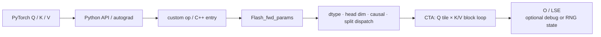

# Attention 算子主线

## 你为什么要读

这篇追踪 FA2 dense forward 的主路径：Python 如何规范 shape/参数，C++ 如何构造参数包并 dispatch，CUDA kernel 如何在不 materialize 完整 N×N probability 的情况下得到 O/LSE。读完应能分清数学中间量、片上临时量和真正的 API 输出。

## 三层契约

| 层 | 主要对象 | 必须证明 |
|----|----------|----------|
| API / autograd | Q/K/V、mask/dropout/softcap、输出与保存状态 | shape、dtype、stride、梯度需求正确 |
| C++ / dispatch | `Flash_fwd_params`、head dim/dtype/causal/split traits | 参数单位、指针、模板实例一致 |
| CUDA kernel | tile、online softmax、output accumulator、epilogue | 数值状态同尺度，mask/dropout/写回正确 |

## 对象生命周期



常规 forward 的核心输出是 O/LSE；dropout、`return_attn_probs`、split-KV 和 autograd 会增加 RNG、debug `S_dmask` 或 accumulator 等条件对象。不能把条件分支说成所有调用都“只返回两个 tensor”。

## Kernel 主循环：顺序不能写错

```text
load Q / K tile
→ QK^T × softmax_scale
→ optional softcap
→ causal/local/sequence mask 与 ALiBi 等修正
→ 用新 row max 重缩放历史 row sum 与 acc_o
→ 计算当前尺度的未归一化指数权重
→ optional dropout 作用于乘 V 的权重副本
→ 权重 × V，累积输出分子
→ 扫描下一个 K/V block
→ epilogue 最终归一化并写 O / LSE
```

`acc_s` / `rP` 不应直接叫“当前 probability tile”：它在主循环里主要是当前 online-softmax 尺度下的未归一化指数权重。dropout 后乘 V 的副本也不是 API 意义的最终 softmax probability。详见 [[FlashAttention-Online-Softmax]]。

## 五个关键不变量

1. **IO：** 常规路径不把完整 score/probability 矩阵写到 HBM。
2. **尺度：** row max 更新时，历史 row sum 与 output accumulator 使用同一个 `exp(old_max-new_max)` 缩放。
3. **顺序：** softcap、mask/bias、exp/online update 的先后与 backward 重算一致。
4. **dispatch：** 原始 head dim、padding 后 dim、模板 `kHeadDim` 和 stride/shape 检查不能混淆。
5. **backward state：** backward 仍需要 Q/K/V 以及 forward 保存的 O/LSE，dropout 时还需一致 RNG；不是只靠 O/LSE/RNG 凭空恢复输入。

## 三类 forward 路径不要混用心智模型

| 路径 | 写回/归并 | 典型用途 |
|------|-----------|----------|
| standard | 单 CTA/常规 epilogue 直接写 O/LSE | 普通 dense forward |
| aligned single-split | 使用 split 路径布局但只有一个有效 split | 特定 dispatch/对齐条件 |
| multi-split KV | 每 split 写 partial O/LSE，再 combine | 长 K/V 或 KV-cache split |

看到 accumulator pointer 或 combine kernel 时，先确认是否真的 `num_splits > 1`；不要把所有 split dispatch 都描述为多份结果归并。

## 从症状回到层级

| 症状 | 先看 |
|------|------|
| Python 直接拒绝 shape/dtype | API/C++ check 与支持矩阵 |
| 只在 causal/不等长时错 | bottom-right 对齐、tile mask、扫描边界 |
| dropout 固定倍率偏差 | 未归一化权重、dropout scale、RNG counter |
| 全 mask 行 NaN/LSE 异常 | row max/sum 哨兵与 epilogue |
| 数值对但性能异常 | dispatch variant、tile、split、arch 与 workload |

## 运行验证

完成 [[FlashAttention性能实验]]：

1. 用 PyTorch fp32 reference 验证 O；需要梯度时验证 dQ/dK/dV。
2. 覆盖 causal/non-causal、不等长 Q/K、GQA、多个 head dim 和 dropout 开关。
3. 记录 GPU、CUDA、dtype、shape、warmup、重复次数和容差。
4. profiler 同时观察 kernel、workspace/combine 和 HBM bytes。

预期：数值在声明容差内；常规输出不含完整 N×N probability；不同 shape/flag 可进入不同 dispatch。当前环境无 CUDA extension 时，只能完成源码与 reference 静态验收，不冒充 GPU 通过。

## 深入入口

- 前向全景：[[FlashAttention-前向全链路]]
- IO 原理：[[FlashAttention-Attention-IO]]
- 数值状态：[[FlashAttention-Online-Softmax]]
- FA2 kernel：[[FlashAttention-FA2-Forward]]
- 梯度重算：[[FlashAttention-Backward]]
- Decode append/paged KV：[[FlashAttention-KV-Cache]]
