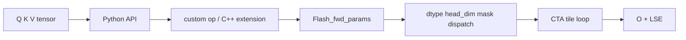

# Attention 算子主线

## 读者任务

这篇追踪一次 dense forward：Q/K/V 如何从 PyTorch API 进入 C++ 参数包、模板 dispatch 和 CUDA kernel，最后只写回 O 与 LSE。

## 先建立心理模型

标准公式会画出完整 score 和 probability matrix；高性能实现更关心这些中间量是否必须离开当前 tile。FA2 forward 像一场严格的“随算随清”：局部 `S/P` 可以存在，但完整矩阵不应长期占用 HBM；真正跨 K/V block 留下的是 row max、row sum 和输出累加器。

## 对象生命周期



## Kernel 主循环

```text
load Q/K tile
-> QK^T 得到局部 score
-> mask
-> online softmax 更新 row_max / row_sum
-> 重缩放 acc_o
-> 当前 probability tile 乘 V
-> 扫描下一个 K/V tile
-> 归一化并写 O/LSE
```

## 关键不变量

- 常规路径不把完整 S/P 写回 HBM。
- 新 row max 出现时，历史 row sum 和 acc_o 必须使用同一缩放。
- C++ shape/dtype/stride 检查必须与模板实例支持范围一致。
- Forward 保存的 O/LSE/RNG 必须足够 backward 重算。
- KV cache 路径是 decode 专门入口，不应与训练 backward 混为一谈。

## 运行验证

操作：完成 [[FlashAttention性能实验]] 的 PyTorch reference 对比、benchmark 和 profiler 观测，并记录 dtype、shape、mask 与硬件信息。

预期：输出误差在 dtype 容差内；不同 head dim、causal、dropout 会进入不同模板组合；常规输出中没有完整 attention probability 矩阵。

## 深入入口

- 完整证据：[[FlashAttention-前向全链路]]
- IO 原理：[[FlashAttention-Attention-IO]]
- Online softmax：[[FlashAttention-Online-Softmax]]
- FA2 forward：[[FlashAttention-FA2-Forward]]
- Backward：[[FlashAttention-Backward]]
- Decode KV：[[FlashAttention-KV-Cache]]
