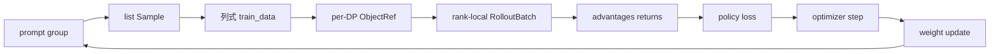

# RL 训练闭环主线

## 读者任务

这篇只追踪一组 prompt 如何经过 rollout、reward、训练和权重同步，最终让下一轮 rollout 使用新 policy。

## 先建立心理模型

RL 闭环里至少有四只钟：`rollout_id` 标记编排轮次，Sample 记录生成事实，optimizer step 推进训练参数，`weight_version` 标记推理侧实际加载版本。四只钟不自动同步；Slime 的工程价值，就是在 Ray、Megatron 和 SGLang 之间把它们对齐。

## 对象生命周期

## 六个边界

| 边界 | 必须保持的语义 |
|------|----------------|
| PlacementGroup | rollout、actor、critic 的 GPU 所有权 |
| RolloutManager | Sample 到训练数据的转换和 rollout 分组 |
| Ray ObjectRef | 主进程不直接持有所有 rank 数据 |
| Megatron data iterator | 执行预先计算的 micro-batch 顺序 |
| loss | current/old/ref logprob 与 advantage 口径一致 |
| weight sync | 暂停、flush、传输、版本更新、恢复的顺序一致 |

## 关键不变量

- 同一个 prompt 的多条 response 在需要 group baseline 时不能被错误拆散。
- PP 非 last stage 不应假装拥有完整 advantage/logprob 输出。
- DP normalization 必须使用正确 group 和 mask。
- 下一轮 rollout 开始前，所有可更新 engine 应看到同一 weight version。

## 运行验证

操作：按 [[Slime闭环实验]] 分别运行 debug rollout/train 路径，保存日志，并检查 Sample、loss 与 weight version。

预期：`debug_rollout_only` 能生成 Sample 而不训练；`debug_train_only` 能使用已保存数据复现 loss；真实闭环中 weight version 应随更新前进。

## 深入入口

- 完整证据：[[Slime-RL训练全链路]]
- Sample：[[Slime-Sample数据契约]]
- 训练步骤：[[Slime-训练步骤]]
- Advantage：[[Slime-Advantage计算]]
- Policy loss：[[Slime-Policy-Loss]]
- 权重同步：[[Slime-分布式权重同步]]
