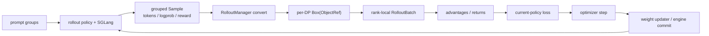

# RL 训练闭环主线

## 你为什么要读

这篇追踪一组 prompt 怎样变成 samples、训练 batch、optimizer step 和新 rollout policy。重点不是背 `generate → train → update`，而是解释每一步使用的对象、policy 身份和版本；同步与异步 loop 在这些钟表上并不相同。

## 五只钟与四种身份

| 状态 | 表示什么 | 不能冒充 |
|------|----------|----------|
| `rollout_id` | driver 编排轮次 | Sample group id、weight version |
| Sample `index/group_index` | 样本与比较组身份 | policy 版本 |
| optimizer step | 训练参数更新次数 | engine 已完成加载 |
| updater/engine version | rollout engine 可见权重版本 | 每条 Sample 自动携带的字段 |
| sample age | 生成到训练的时间/step 差 | 单凭 rollout_id 就能精确推出 |

policy 还要分 rollout、old、current、reference；详见 [[RL后训练数学基础]]。

## 对象生命周期

回环连接到“rollout policy”，不是 prompt：DataSource 仍提供 prompt，新权重改变的是下一次生成分布。

## 闭环的六个交接边界

| 边界 | 必须保持的语义 | 常见失败 |
|------|----------------|----------|
| Placement / lifecycle | actor、critic、engine 的调度与显存所有权 | colocate 峰值重叠、actor pending |
| DataSource → rollout | prompt group、repeat、buffer/续训身份 | group 拆散、重复/丢样本 |
| generate → reward/filter | token/logprob/status 与 RM 长度 | `strict=False` 静默截短、fan-out 嵌套 |
| Sample → train ObjectRef | 拍平、字段转换、DP split | rank batch 不等、mask/length 错位 |
| advantage → policy loss | reward/value/KL 与 current/old/ref 口径 | baseline 混淆、CP reducer 分叉 |
| actor → rollout engine | updater 介质、lock、commit/version | 半更新、旧 engine、无统一 rollback |

## 同步与异步的版本差别

### 同步 `train.py`

第 `n` 轮 generate 完成后训练，再更新 engine；下一轮 generate 通常发生在更新之后。首次 rollout 前还有一次 initial weight push。

### `train_async.py`

第 `n+1` 轮 generate 会在第 `n` 轮训练时提前启动。到 `update_weights_interval` 边界，driver 先等待 next-generation future，再更新，避免单次 generation 中途换权重；已生成样本不会因此变新。该入口不支持 colocate。

### fully async

持续生成、训练和版本队列的语义更复杂，应单独阅读 [[Slime-其他Rollout路径]]；不要把它等同于 `train_async.py` 的一轮预取。

## 五个关键不变量

1. 需要 group baseline 的 response 在 normalization 前保留正确组身份。
2. token、response length、loss mask、logprob 和 advantage 位于相容空间。
3. advantage 的核心计算只在 pipeline last stage 执行；CP/DP 归约按真实 group 和 mask 完成。
4. current/old/rollout/reference logprob 的来源与配置一致。
5. 同步 loop 下一轮生成前应完成计划中的 engine 更新；异步 loop 则必须明确允许的 staleness，而不是宣称所有 engine/sample 随时同版本。

## 权重同步不要背固定动作序列

distributed、tensor/IPC、full disk 和 delta disk 的暂停、传输、cache、commit 与失败状态不同。统一检查的是 writer/reader、metadata、payload、lock/quiescence、cache 失效、engine version 和失败恢复；详见 [[Slime-权重同步]]。

## 运行验证

按 [[Slime闭环实验]] 分三层：

1. `debug_rollout_only`：验证 Sample、reward、trace；预期在 train-data conversion 前返回，actor 不训练。
2. `load_debug_rollout_data` / `debug_train_only`：重放固定数据，验证 advantage/loss；预期不实例化 SGLang serving 路径。
3. 真实闭环：记录 initial push、每轮 generate/train/update、engine version、sample 数和失败数。

没有完整 GPU/Ray/Megatron/SGLang 环境时，完成静态调用链和 CPU contract；不要仅凭日志中出现 `update_weights` 就宣称所有 engine 数值一致。

## 深入入口

- 全链路：[[Slime-RL训练全链路]]
- Rollout 对象：[[Slime-Rollout生成]]
- Sample：[[Slime-Sample数据契约]]
- 训练分层：[[Slime-训练后端]]
- Advantage：[[Slime-Advantage计算]]
- Policy loss：[[Slime-Policy-Loss]]
- 权重发布：[[Slime-权重同步]]
