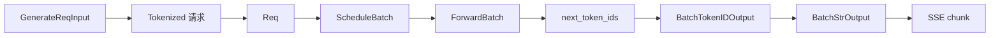

# 推理 Serving 主线

## 读者任务

这篇只保留一条最短主线：一个流式 generate 请求如何从 HTTP 进入 SGLang，经过调度和 GPU forward，再以文本 chunk 返回。

## 先建立心理模型

请求进入 runtime 后会完成两次“降维”：外部协议先降成内部请求状态，内部请求再降成 GPU 可执行 tensor。返回时反向上升：token id 变成增量文本，再变成协议 chunk。每一层只保留下一位消费者需要的信息，这正是职责边界存在的原因。

## 对象生命周期

## 七个边界

| 边界 | 责任 | 不应承担 |
|------|------|----------|
| HTTP route | 校验协议、暴露 stream | 调度和 GPU 计算 |
| TokenizerManager | tokenization、请求状态、rid | KV 资源仲裁 |
| Scheduler receiver | 收包、rank 同步 | 文本处理 |
| Scheduler | batch admission、prefill/decode、retract | kernel 实现 |
| ModelRunner | 构造执行输入、graph/eager 选路 | HTTP 生命周期 |
| Detokenizer | token id 到增量文本 | GPU forward |
| TokenizerManager output | 唤醒等待请求 | 修改模型状态 |

## 关键不变量

- `rid` 在请求生命周期内唯一。
- 只有指定入口 rank 拉取外部请求，其他 rank 获得同步视图。
- Prefill 完成但未结束的请求进入 running batch。
- Decode 前必须有下一 token 的 KV 空间；不足时可能 retract。
- 输出先经过 token id 通道，再经过文本通道。

## 运行验证

操作：完成 [[SGLang服务实验]] 的服务启动、`curl -N` 流式请求和 overlap 对照，并记录 Scheduler 与 Detokenizer 日志。

预期：关闭 overlap 后调用关系更直观；吞吐和延迟如何变化必须由同一 workload 的对照结果说明。如果有 token id 而没有文本，应优先检查 Detokenizer，而不是 GPU forward。

## 深入入口

- 完整证据：[[SGLang-HTTP请求全链路]]
- 调度：[[SGLang-Scheduler]]
- KV：[[SGLang-KV-Cache]]
- Attention backend：[[SGLang-Attention]]
- 生产排障：[[SGLang-生产排障]]
