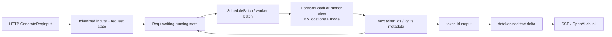

# 推理 Serving 主线

## 你为什么要读

这篇只追踪标准 HTTP 流式 generate：协议输入怎样变成可调度请求，怎样变成 GPU 执行视图，又怎样从 token id 逐层提交为客户端文本。目标不是记进程名，而是在“无首 token、有 token 无文本、文本未 flush”三种症状之间做第一跳分诊。

## 先建立三本账

| 账本 | 追踪对象 | 核心问题 |
|------|----------|----------|
| 请求账 | external request → internal `Req` | 谁拥有状态、何时 waiting/running/finished？ |
| 执行账 | schedule batch → worker/forward view → result | 本轮算哪些 token、KV 地址在哪里、结果何时提交？ |
| 回程账 | token id → detokenized delta → protocol chunk | token 已产生、文本已形成、客户端已收到分别何时？ |

这些对象不是每层“无损降维”。跨边界时常会生成借用视图、snapshot、metadata 或聚合输出；必须看下一位消费者真正读取什么，以及原对象需存活多久。

## 标准流式生命周期

循环表示未完成请求提交新 token 后继续进入下一轮 decode。skip-tokenizer、embedding、native gRPC、PP/PD、speculative 和多 worker 会改变某些回程/执行节点；图只描述普通文本生成基线。

## 边界与所有者

| 边界 | 主要责任 | 失败时先看 |
|------|----------|------------|
| HTTP/API route | 协议校验、stream 生命周期、错误映射 | 请求是否进入 TokenizerManager |
| TokenizerManager | tokenize、请求状态/事件、输入输出关联 | request id、等待事件、abort/final commit |
| Scheduler/receiver loop | 收请求、prefix/KV 准入、prefill/decode/retract、跨 rank 协调 | waiting/running batch 与 KV 预算 |
| worker / ModelRunner | 消费执行视图、选 eager/graph/backend、运行 model 与 sampling | forward mode、metadata、stream/event |
| Detokenizer | token ids 到可安全提交的文本增量 | decode window、UTF-8、已发送文本 |
| API output layer | 文本/usage/finish reason 变成协议 chunk | 最终 flush、连接取消、错误传播 |

不要把 ModelRunner 说成 HTTP 请求所有者，也不要把 Scheduler 说成 tokenizer。职责分离使同一 request id 在不同对象里有不同局部状态。

## 五个关键不变量

1. **身份：** API id、内部 request object、batch index 和 KV location 能正确关联，但不互相冒充。
2. **准入：** prefill/decode 只有在 token/KV/调度预算允许时进入执行；不足可能等待、chunk、retract 或 abort。
3. **执行视图：** eager、CUDA graph、DP padding、speculative 等路径使用的 shape/metadata 必须与本轮 live batch 一致。
4. **提交：** GPU 结果产生不等于 request 状态和 token output 已提交；overlap 路径还存在 live/snapshot/result 对象。
5. **回程：** token id 已有不等于可见文本已形成；可见文本已有也不等于客户端连接已收到 final chunk。

SGLang 的 rank/worker/PP/PD loop 不止一种，不能统一概括成“固定入口 rank拉取、其他 rank广播”。具体拓扑回到 [[SGLang-Scheduler]] 与 [[SGLang-请求调度]]。

## 按症状定位

| 症状 | 第一检查点 | 下一跳 |
|------|------------|--------|
| 一直没有首 token | queue/prefill admission、KV、worker forward | [[SGLang-生产排障]] |
| scheduler 已有 token id，无文本 | Detokenizer 输入、decode window、skip-tokenizer 分支 | [[SGLang-Detokenizer]] |
| 有文本 delta，客户端不更新 | TokenizerManager/output event、API stream flush | [[SGLang-HTTP请求全链路]] |
| overlap 开关后结果错位 | live batch、snapshot、result/FutureMap 所有权 | [[SGLang-Scheduler-排障指南]] |
| 只有长请求/高并发失败 | token budget、KV allocation、retract/abort | [[SGLang-KV-Cache]] |

## 运行验证

完成 [[SGLang服务实验]]：固定模型、请求集、并发和输出长度，发送 `curl -N` 流式请求，并对比 overlap 开/关。

记录：

- client 侧 TTFT/文本 chunk；
- TokenizerManager request id 与完成事件；
- Scheduler waiting/running/prefill/decode；
- Detokenizer token-id 输入和文本 delta；
- 失败/abort/final 数量。

预期：关闭 overlap 可能让调用关系更易观察，但性能方向必须由同 workload 实测；不能预设一定更慢或更快。

## 深入入口

- 完整生命周期：[[SGLang-HTTP请求全链路]]
- 调度与提交：[[SGLang-Scheduler]]
- KV 地址与容量：[[SGLang-KV-Cache]]
- 执行对象：[[SGLang-ModelRunner]]
- Attention backend：[[SGLang-Attention]]
- 生产分诊：[[SGLang-生产排障]]
