# 从 Prompt 到新权重

一个 prompt 穿过 Slime、SGLang 和 attention kernel 时，不会一直保持同一个对象，也不会天然携带一枚贯穿到底的 ID。真正可靠的理解方式，是同时维护四本账：

1. **训练编排账**：这是第几个 rollout step，何时训练、何时同步权重。
2. **样本聚合账**：哪些训练 Sample 属于同一次 rollout execution，loss 分母怎样聚合。
3. **服务请求账**：SGLang 为哪条 HTTP 请求分配了 request id，它经历了怎样的队列与 KV 生命周期。
4. **权重版本账**：生成 chunk 使用了哪版权重，engine 更新后何时允许下一轮请求进入。

这四本账可以互相连接，但字段名不能互换。尤其要避免三个常见误解：

- `generate_rollout(..., rollout_id=42)` 的函数参数不等于每个 `Sample.rollout_id` 都是 42。
- SGLang 的 request id 默认进入 trace 属性，不会自动成为 `Sample.rid` 字段。
- `Sample` 的真实字段是 `weight_versions: list[str]`，不是 `weight_version: str`。

## 读者任务

读完后，你应该能够：

- 沿 prompt、token、Q/K/V、response、Sample、train batch、新权重复述一次完整闭环。
- 解释 rollout step、`Sample.rollout_id`、SGLang request id、`weight_versions` 的不同所有者。
- 判断哪些关联由当前源码自动保存，哪些需要 trace、日志或自定义 metadata 补齐。
- 在版本错乱、样本聚合错误和 attention backend 误判时找到正确排查入口。

## 场景

本例使用一个 prompt group，每个 prompt 生成四条 response：

| 事实 | 示例值 | 它属于哪本账 |
|------|--------|--------------|
| rollout 函数参数 | `rollout_step = 42` | 训练编排账 |
| prompt group | 1 个 prompt，4 个 samples | 样本组织 |
| 输入长度 | 128 tokens | 请求与 tensor 账 |
| 最大生成长度 | 64 tokens | 请求预算 |
| serving engine 版本 | `"17"` | 权重版本账 |
| SGLang request id | server 生成，例如 UUID | 服务请求账 |
| `Sample.rollout_id` | 默认可为 `None`；compact siblings 必须显式共享 | loss 聚合账 |

版本写成字符串 `"17"`，因为 Slime updater 向 SGLang 发送的是字符串版本。文中的“v17”只是一种人类可读叫法，不是 dataclass 字段值格式。

## 全局时间线

```mermaid
flowchart LR
    P["Prompt group"]
    RS["rollout step 42"]
    REQ["SGLang request<br/>meta_info.id"]
    B["Req / ScheduleBatch"]
    Q["Q/K/V + KV slots"]
    K["实际 attention kernel"]
    OUT["tokens / logprobs / meta_info"]
    S["Sample<br/>weight_versions"]
    L["advantage / policy loss"]
    O["optimizer step"]
    W["engine weight version 18"]

    P --> RS --> REQ --> B --> Q --> K --> OUT --> S --> L --> O --> W
```



箭头表示对象生命周期，不表示这些对象共享同一种 ID。

## 第一站：Slime 组织 prompt group

默认 rollout 中，一个 group 是同一 prompt 的多次采样。`GenerateState.submit_generate_tasks` 为每个 group 创建一个异步任务，group 内再为每个 `Sample` 创建生成任务。

这里要先分开两个“rollout id”概念：

| 名称 | 位置 | 语义 |
|------|------|------|
| rollout 函数参数 | `generate_rollout(args, rollout_id, ...)` | 当前编排轮次，用于数据获取、确定性生成、debug dump 等 |
| `Sample.rollout_id` | `Sample` dataclass | 同一次 rollout execution 的训练聚合单位；compact/subagent siblings 必须共享 |

`Sample` 的真实字段证明了后者是可空的样本属性，而不是全局轮次号的必然副本：

```python
# 来源：slime/utils/types.py L106
    rollout_id: int | None = None
```

版本账则明确采用复数列表：

```python
# 来源：slime/utils/types.py L120
    weight_versions: list[str] = field(default_factory=list)
```

首次阅读只需记住：`group_index` 组织同 prompt 多采样，`Sample.rollout_id` 组织 loss 聚合，rollout step 组织训练循环。三者不是同一坐标。

## 第二站：Slime 发出 SGLang 请求

默认 `generate` 请求包含 sampling 参数和 `return_logprob=True`；文本样本发送 `input_ids`，多模态样本可发送 `text + image_data`。它没有显式设置 `rid`：

```python
# 来源：slime/rollout/sglang_rollout.py L175-L203
    # Prepare payload for sglang server
    payload = {
        "sampling_params": sampling_params,
        "return_logprob": True,
    }

    if args.use_rollout_routing_replay:
        payload["return_routed_experts"] = True

    images = sample.multimodal_inputs.get("images") if sample.multimodal_inputs else None
    if images:
        payload["image_data"] = [encode_image_for_rollout_engine(image) for image in images]
        # For single-turn multimodal requests, send text so SGLang expands the
        # image placeholders with its own processor rules.
        payload["text"] = sample.prompt
    else:
        payload["input_ids"] = prompt_ids

    if not sample.tokens:
        sample.tokens = prompt_ids

    # Use session_id for consistent hashing routing (SGLang Model Gateway)
    headers = None
    if sample.session_id:
        if getattr(args, "router_policy", None) == "consistent_hashing":
            headers = {"X-SMG-Routing-Key": sample.session_id}

    with trace_span(sample, "sglang_generate", attrs={"max_new_tokens": sampling_params["max_new_tokens"]}) as span:
        output = await post(url, payload, headers=headers)
        span.update(build_sglang_meta_trace_attrs(output["meta_info"]))
```

因此，SGLang 会为请求生成或规范化自己的 request id。若需要从 Sample 反查 request，默认抓手不是 `sample.rid`，而是 Sample 的 trace carrier。

## 第三站：SGLang 把请求变成 GPU 工作

从服务框架视角，对象大致经历：

```text
input_ids
→ GenerateReqInput
→ TokenizedGenerateReqInput
→ Req
→ ScheduleBatch(EXTEND / DECODE)
→ ForwardBatch
→ model forward
→ token ids
→ detokenized response
```

这一段要抓住所有权：

- TokenizerManager 持有外部请求等待状态和 response 汇合。
- Scheduler 决定 continuous batching、prefill/decode、KV 预算和 retract。
- ModelRunner 把 `ForwardBatch` 变成具体 tensor 与 kernel 调用。
- Detokenizer 把 token ids 增量还原为文本。

完整源码证据见 [[SGLang-HTTP请求全链路]]。贯穿案例不重复粘贴整条 serving 主线。

## 第四站：Attention kernel 只看 tensor 契约

假设某层使用 `Hq=32`、`D=128`，GQA 下 K/V head 数可能少于 Q head。进入 attention backend 后，kernel 看到的是：

- Q/K/V 或 paged KV 的地址、dtype、shape、stride。
- causal/window mask、sequence length、block table 等 metadata。
- tile 切分、online softmax 状态和输出 O/LSE。

它通常不知道 Slime 的 rollout step，也不知道 `Sample.rollout_id`。SGLang request id 只可能通过 profiler range、trace 或上层日志间接关联，绝不会自动成为 CUDA kernel 参数。

还要避免另一个常见误解：SGLang 的 attention backend 可能是 FlashInfer、Triton、FlashAttention 或平台专用实现。只有实际 dispatch 或 profiler 证据才能证明本次请求进入了哪个 kernel。算法与 IO 模型见 [[FlashAttention-Attention-IO]]，实际 backend 选择见 [[SGLang-Attention-源码走读]]。

## 第五站：Response 怎样写进 Sample

SGLang 返回 `text` 和 `meta_info`。Slime 从 `output_token_logprobs` 拆出 token id 与 logprob，再统一调用 `append_response_tokens`：

```python
# 来源：slime/rollout/sglang_rollout.py L205-L218
    if "output_token_logprobs" in output["meta_info"]:
        new_response_tokens = [item[1] for item in output["meta_info"]["output_token_logprobs"]]
        new_response_log_probs = [item[0] for item in output["meta_info"]["output_token_logprobs"]]
    else:
        new_response_tokens, new_response_log_probs = [], []

    sample.append_response_tokens(
        args,
        tokens=new_response_tokens,
        log_probs=new_response_log_probs,
        trainable=True,
        meta_info=output["meta_info"],
        text=output["text"],
    )
```

真实的 Sample 形态应写成：

```text
Sample(
  index=...,
  group_index=...,
  rollout_id=None 或 compact siblings 共享的整数,
  tokens=[prompt tokens..., response tokens...],
  response_length=64,
  loss_mask=[1, 1, ...],
  reward=...,
  rollout_log_probs=[...],
  weight_versions=["17"],
  status=Sample.Status.COMPLETED,
)
```

`weight_versions` 只在带 `finish_reason` 的终态 metadata 上追加：

```python
# 来源：slime/utils/types.py L360-L377
        if not update_terminal_info or "finish_reason" not in meta_info:
            return

        if getattr(args, "sglang_speculative_algorithm", False):
            # cannot directly use spec info from sglang because of partial rollout.
            self.spec_info.add(meta_info=meta_info)

        # Collect prefix cache statistics
        self.prefix_cache_info.add(meta_info=meta_info)

        if "weight_version" in meta_info:
            self.weight_versions.append(meta_info["weight_version"])

        match meta_info["finish_reason"]["type"]:
            case "length":
                self.status = Sample.Status.TRUNCATED
```

为什么是列表？普通单轮生成通常只有一个元素；partial rollout、多轮 agent 或同一 Sample 多次续写可能经历多个终态 generation segment，列表可以保留每段实际使用的版本。若出现 `['17', '18']`，它不是格式错误，而是需要判断同一训练样本是否跨过了权重更新边界。

## SGLang request id 到底保存在哪里

SGLang response 的 `meta_info["id"]` 会被转换成 trace span 属性 `sglang_request_id`：

```python
# 来源：slime/utils/trace_utils.py L146-L158
def build_sglang_meta_trace_attrs(meta: dict[str, Any]) -> dict[str, Any]:
    attrs: dict[str, Any] = {}
    try:
        attrs.update({key: meta[key] for key in SGLANG_TRACE_META_KEYS if key in meta and meta[key] is not None})
        finish_reason = meta.get("finish_reason")
        if isinstance(finish_reason, dict) and finish_reason.get("type") is not None:
            attrs["finish_reason"] = finish_reason["type"]
        elif finish_reason is not None:
            attrs["finish_reason"] = finish_reason

        if meta.get("id") is not None:
            attrs["sglang_request_id"] = meta["id"]
```

但是 `append_response_tokens` 不会把 `id` 复制到一个顶层 `Sample.rid` 字段。于是有三种观测级别：

| 级别 | 能否反查 request id | 做法 |
|------|--------------------|------|
| 只保存标准 Sample 字段 | 不保证 | `Sample` 没有 `rid` 字段 |
| 保存 Sample trace carrier | 可以 | 查 `sglang_generate` span 的 `sglang_request_id` |
| 自定义强关联 | 可以且更直接 | 自定义 generate 把 `meta_info.id` 写入 `sample.metadata`，并规定 schema |

这就是“可追溯性”和“dataclass 契约”的区别：系统已经采集 trace，不代表每个 ID 都应该再复制成 Sample 顶层字段。

## 第六站：Sample 变成训练信号

假设四条 response reward 为 `[1.0, 0.6, 0.2, 0.2]`。GRPO 在 group 内构造相对 advantage；训练 actor 重新计算 current logprob，再与 rollout/old logprob 构造 ratio 和 clipped policy loss。

这里的关键不变量是：

- 同 prompt 的 response group 不能在 advantage 计算前被错误拆散。
- `rollout_log_probs`、`loss_mask`、response tokens 必须等长。
- compact rollout 拆出的 siblings 必须共享 `Sample.rollout_id`，否则 loss 聚合会把一次 execution 重复计数。
- `weight_versions` 用于解释 off-policy 程度，但它本身不参与默认 policy loss 公式。

建议观测 reward 分布、advantage 均值/方差、KL、clip fraction、gradient norm，以及 rollout/train logprob 差。

## 第七站：Optimizer step 之后同步新权重

训练完成一次 optimizer step 后，updater 把版本从 `17` 推进到 `18`。典型同步闸门是：

1. 暂停新 generation。
2. flush 依赖旧权重的 prefix/KV 状态。
3. 通过 Ray/HTTP 发送 names、dtype、shape、目标版本等控制 metadata。
4. 通过 NCCL、tensor IPC、full disk 或 delta disk 传输权重数据。
5. Engine 加载完成并记录 `"18"`。
6. 所有参与者确认后恢复 generation。

下一次**终态 generation segment** 应把 `"18"` 追加进对应 Sample 的 `weight_versions`。若仍出现 `"17"`，可能是 engine 没更新、请求在更新前已经进入、外部 engine 被遗漏，或版本 metadata 没被带回；不能只凭训练 step 的时间戳判断。

## 四本账的关联矩阵

| 想回答的问题 | 首选字段 | 默认是否自动保存 | 缺失时怎么办 |
|--------------|----------|------------------|--------------|
| 这是第几轮训练编排 | rollout 函数参数 /日志 step | 是 | 查 RolloutManager 日志与 dump 路径 |
| 哪些 Sample 属于同一次 execution | `Sample.rollout_id` | 默认路径可空，compact 必填 | 查 flatten 前结构与 train_data `rollout_ids` |
| 哪条 SGLang 请求生成了它 | trace span `sglang_request_id` | trace carrier 中保存 | 导出 trace，或自定义写入 `sample.metadata` |
| 使用了哪版权重 | `Sample.weight_versions` | 终态 metadata 含版本时保存 | 对比 engine `/model_info` 或版本端点 |
| 进入了哪个 attention kernel | profiler / backend dispatch | 不在 Sample 中 | 查 SGLang backend 日志与 GPU trace |

## 跨库不变量

| 不变量 | 破坏后的表现 |
|--------|--------------|
| SGLang request state 对应正确 KV slot | 输出串线、错误 token 或非法访问 |
| Sample 的 token、logprob、loss mask 长度对齐 | 训练前校验失败或 loss 错位 |
| compact siblings 共享 `Sample.rollout_id` | 一次 execution 被重复计入 loss |
| terminal metadata 保留所有 `weight_versions` | 无法判断样本是否跨版本 |
| kernel 地址、stride、block table 一致 | 隐蔽数值错误或 GPU 非法访问 |
| 权重更新与旧 KV 生命周期隔离 | 新权重继续复用旧模型产生的 KV |

## 运行验证

### 1. 静态确认字段和 request payload

从知识库根目录执行：

```powershell
rg -n "rollout_id:|weight_versions:" slime/slime/utils/types.py
rg -n "payload =|return_logprob|sample.append_response_tokens" slime/slime/rollout/sglang_rollout.py
rg -n 'sglang_request_id|meta.get\("id"\)' slime/slime/utils/trace_utils.py
```

预期：`Sample` 命中复数 `weight_versions`；默认 payload 不出现显式 `rid`；trace helper 把 response `id` 映射为 `sglang_request_id`。

### 2. 仅用 Python 标准库做静态契约检查

这一步不导入 Slime，因此不要求 Torch、HTTPX 或匹配的 NumPy ABI：

```powershell
@'
import ast
from pathlib import Path

types_tree = ast.parse(Path("slime/slime/utils/types.py").read_text(encoding="utf-8"))
sample_cls = next(n for n in types_tree.body if isinstance(n, ast.ClassDef) and n.name == "Sample")
sample_fields = [n.target.id for n in sample_cls.body if isinstance(n, ast.AnnAssign)]

rollout_tree = ast.parse(Path("slime/slime/rollout/sglang_rollout.py").read_text(encoding="utf-8"))
generate_fn = next(n for n in rollout_tree.body if isinstance(n, ast.AsyncFunctionDef) and n.name == "generate")
payload_assign = next(
    n for n in ast.walk(generate_fn)
    if isinstance(n, ast.Assign)
    and any(isinstance(t, ast.Name) and t.id == "payload" for t in n.targets)
    and isinstance(n.value, ast.Dict)
)
payload_keys = [k.value for k in payload_assign.value.keys if isinstance(k, ast.Constant)]

trace_text = Path("slime/slime/utils/trace_utils.py").read_text(encoding="utf-8")
print("weight_versions" in sample_fields, "weight_version" in sample_fields, "rid" in sample_fields)
print("payload_keys=", payload_keys)
print("trace_maps_request_id=", 'attrs["sglang_request_id"] = meta["id"]' in trace_text)
'@ | python -
```

预期：

```text
True False False
payload_keys= ['sampling_params', 'return_logprob']
trace_maps_request_id= True
```

### 3. Slime Python 依赖完整时验证终态行为

前提：当前 Python 环境能正常导入 Slime、Torch 和 HTTPX，且 Torch/NumPy ABI 匹配；不需要 GPU。

```powershell
$env:PYTHONPATH = (Resolve-Path "slime").Path
@'
from types import SimpleNamespace
from slime.utils.types import Sample

s = Sample(index=7)
s.append_response_tokens(
    SimpleNamespace(sglang_speculative_algorithm=False),
    tokens=[101],
    log_probs=[-0.25],
    text="A",
    meta_info={
        "finish_reason": {"type": "stop"},
        "weight_version": "17",
        "prompt_tokens": 3,
    },
)
print(s.weight_versions, s.status.value, s.response_length, s.loss_mask)
'@ | python -
```

预期输出包含：

```text
['17'] completed 1 [1]
```

若版本列表为空，先检查 metadata 是否含 `finish_reason`；中间 streaming chunk 有版本字段也不会更新终态账本。

如果导入阶段失败，应记录缺失依赖或 ABI 冲突，并使用上面的标准库静态替代，不能把环境问题误判为契约错误。

### 4. 做真实跨库关联

继续完成 [[跨库一致性实验]]。关联表至少应区分：

- `rollout_step`
- `sample.index` / `sample.group_index`
- `sample.rollout_id`
- `trace_id` / `sglang_request_id`
- `weight_versions`
- TTFT、reward、KL

预期不是“每一列都天然非空”，而是任何空值都有明确原因和补齐方案。

## 复盘

把一次 prompt 到新权重压缩成五句话：

1. Slime 先组织 prompt group；rollout step 管编排，`Sample.rollout_id` 管训练聚合。
2. 默认请求不传 `rid`；SGLang 生成 request id，Slime 把它写进 trace span。
3. SGLang 把请求变成 batch、KV 与 tensor；attention kernel 只执行 tensor 契约。
4. 终态 response 通过 `append_response_tokens` 写入 Sample，版本落在 `weight_versions` 列表。
5. Optimizer step 后，权重同步闸门必须让 engine 版本与 KV 生命周期一起收口，下一轮再开始生成。

## 下一站

- 样本字段与追加规则：[[Slime-Sample数据契约-源码走读]]
- SGLang 请求全链路：[[SGLang-HTTP请求全链路]]
- Attention IO 与 kernel：[[FlashAttention-Attention-IO]]
- 权重同步：[[Slime-分布式权重同步]] · [[Slime-磁盘权重同步]]
