# 从 Prompt 到新权重

## 读者任务

这篇用同一组 prompt 串起 Slime、SGLang 和 FlashAttention。目标不是记住所有函数，而是持续记录对象形态、资源所有者、版本和可观测指标。

把 `rollout_id`、`rid` 和 `weight_version` 看成三枚不同的路标：它们分别回答“这是第几轮训练编排”“这是哪条服务请求”“生成时用了哪版权重”。路标不能互换，但必须能互相追溯；否则出了问题，只剩时间戳拼图。

## 场景

一次 rollout 包含一个 prompt group，每个 prompt 生成四条 response。假设某条 prompt 有 128 个输入 token，每条 response 最多 64 token；SGLang 当前 rollout engine 的 `weight_version` 为 `v17`。

## 全局时间线

```mermaid
flowchart LR
    P["Prompt group"] --> R["Slime rollout_id"]
    R --> H["SGLang HTTP request rid"]
    H --> B["ScheduleBatch"]
    B --> Q["QKV + KV slots"]
    Q --> F["FlashAttention tile"]
    F --> T["response tokens"]
    T --> S["Sample reward logprob"]
    S --> A["advantage policy loss"]
    A --> O["optimizer step"]
    O --> W["weight_version v18"]
```



## Slime 发起 rollout

RolloutManager 为本轮分配 `rollout_id`，从 DataSource 取得 prompt，并调用 SGLang rollout 函数。此时必须记录：

| 字段 | 示例 |
|------|------|
| rollout_id | 42 |
| prompt group size | 4 responses |
| sampling params | temperature、top_p、max_new_tokens |
| expected weight version | v17 |

## SGLang 接收请求

每条生成请求获得 `rid`。TokenizerManager 负责 tokenization 和请求状态，Scheduler 把 tokenized 输入变成 `Req`，并按 KV 预算决定何时 prefill。

对象变化：

```text
prompt string
-> input_ids[128]
-> Req(prefix_indices, output_ids, sampling_params)
-> ScheduleBatch(EXTEND)
-> ForwardBatch
```

需要观测：TTFT、waiting queue、matched prefix tokens、KV usage。

## Attention kernel 执行

模型某层产生 Q/K/V。假设 batch 内该序列使用 `H=32`、`D=128`；GQA 下 K/V head 可能少于 Q head。Attention backend 根据 forward mode 和 paged KV metadata 调用具体 kernel。

FlashAttention 视角只接收 tensor、stride、shape、mask 和 KV 地址。它不知道 `rollout_id` 或 `rid`，但上层必须保证这些 tensor 对应正确请求和 KV slot。

Kernel 内：score tile 短暂存在，online softmax 维护 row max/sum，最终写回 O/LSE。

## Response 变成 Sample

SGLang 返回 token、文本、logprob、延迟和 weight version。Slime 把这些字段装入 Sample：

```text
Sample(
  tokens,
  response_length,
  loss_mask,
  reward,
  rollout_log_probs,
  rollout_id,
  weight_version="v17"
)
```

Reward/filter 必须在 DP split 前完成，否则不同 rank 可能对样本保留策略产生不一致。

## 训练信号

四条 response reward 假设为 `[1.0, 0.6, 0.2, 0.2]`。GRPO group baseline 产生一正一弱正两负的相对信号。训练 actor 重新计算 current logprob，结合 old/rollout logprob 得到 ratio，再计算 policy loss。

需要观测：reward 分布、advantage 均值/方差、KL、clip fraction、gradient norm，以及 rollout/train logprob 差。

## 权重同步

Optimizer step 后，训练侧准备把 v18 推到 rollout engine：

1. 暂停新 generation。
2. flush 依赖旧权重的 prefix/KV 状态。
3. Ray 发送 names/dtypes/shapes 等 metadata。
4. NCCL 或其他 transport 发送 tensor payload。
5. Engine 完成加载并记录 v18。
6. 所有参与者确认后恢复 generation。

下一轮 Sample 必须报告 v18。若仍报告 v17，应检查 engine 是否被跳过、版本字段是否透传、或 generation 是否在更新完成前恢复。

## 跨库不变量

| 不变量 | 破坏后的表现 |
|--------|--------------|
| rid 对应正确 KV slot | 输出串线或错误 token |
| Sample 保留生成版本 | 无法判断 off-policy 程度 |
| group response 不被错误拆散 | advantage baseline 错误 |
| kernel 地址与 block table 一致 | 隐蔽数值错误或非法访问 |
| 权重与 KV cache 同版本 | 新权重读取旧 KV，结果不一致 |

## 运行验证

完成 [[跨库一致性实验]]，至少输出一张包含 `rollout_id/rid/weight_version/TTFT/reward/KL` 的关联表。

预期：同一 Sample 能反查生成请求和权重版本；权重更新后下一轮版本单调前进；没有对象只能依靠日志时间猜测关联。
