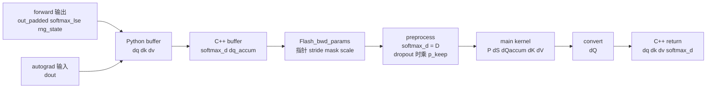

# Backward · 数据流

## 读者任务

这篇只看对象形态和边界：同一套 backward 公式在 dense、varlen、dropout、deterministic、GQA/MQA 下，哪些字段变了，哪些不变量没变。

## Dense 路径对象生命周期



| 阶段 | 对象形态 | 关键不变量 |
|------|----------|------------|
| Python `ctx` | `q/k/v/out_padded/softmax_lse/rng_state` | 不保存完整 `P` |
| Python backward | `dout_padded`、预分配 `dq/dk/dv` | head dim padding 与 forward 对齐 |
| C++ `mha_bwd` | Tensor 检查、`softmax_d`、`dq_accum` | fp16/bf16、last dim contiguous、head dim <= 256 |
| `Flash_bwd_params` | 指针和 stride | LSE、mask、scale 语义沿用 forward |
| preprocess | `dsoftmax_sum` | 每个 query 行一个点积；dropout 时乘 `p_keep` 与内部 `dP` 标尺对齐 |
| main kernel | tile 内 `P/dP/dS` 与梯度累积 | 不跨 tile 保存完整 `P` |
| convert/GQA sum | 最终 `dQ/dK/dV` | dQ split 与 KV head group 被归并；dQ/dK 接管 `scale/p_keep`，dV 接管 `1/p_keep` |

## Dense 与 varlen 的差异

数学公式不变，地址解释变了。Dense 直接用 `[batch, seqlen, head, dim]`；varlen 把 token pack 成 `total_q/total_k`，由 `cu_seqlens_q/k` 表示每个 batch 样本边界。

| 路径 | `q/k/v` 形态 | `softmax_lse` 形态 | batch 边界 | `Flash_bwd_params` 标记 |
|------|--------------|--------------------|------------|--------------------------|
| dense | `[b, seqlen, h, d]` | `[b, h, seqlen_q]` | 固定长度隐含在 stride 中 | `unpadded_lse=false` |
| varlen | `[total, h, d]` | `[h, total_q]` | `cu_seqlens_q/k` | `unpadded_lse=true`、`total_q` |

```cpp
// 来源：csrc/flash_attn/flash_api.cpp L976-L1000
std::vector<at::Tensor>
mha_varlen_bwd(const at::Tensor &dout,  // total_q x num_heads, x head_size
               const at::Tensor &q,   // total_q x num_heads x head_size, total_q := \sum_{i=0}^{b} s_i
               const at::Tensor &k,   // total_k x num_heads_k x head_size, total_k := \sum_{i=0}^{b} s_i
               const at::Tensor &v,   // total_k x num_heads_k x head_size, total_k := \sum_{i=0}^{b} s_i
               const at::Tensor &out,   // total_q x num_heads x head_size
               const at::Tensor &softmax_lse,    // h x total_q, softmax logsumexp
               std::optional<at::Tensor> &dq_,   // total_q x num_heads x head_size, total_q := \sum_{i=0}^{b} s_i
               std::optional<at::Tensor> &dk_,   // total_k x num_heads_k x head_size, total_k := \sum_{i=0}^{b} s_i
               std::optional<at::Tensor> &dv_,   // total_k x num_heads_k x head_size, total_k := \sum_{i=0}^{b} s_i
               const at::Tensor &cu_seqlens_q,  // b+1
               const at::Tensor &cu_seqlens_k,  // b+1
               std::optional<at::Tensor> &alibi_slopes_, // num_heads or b x num_heads
               const int max_seqlen_q,
               const int max_seqlen_k,          // max sequence length to choose the kernel
               const float p_dropout,         // probability to drop
               const float softmax_scale,
               const bool zero_tensors,
               const bool is_causal,
               int window_size_left,
               int window_size_right,
               const float softcap,
               const bool deterministic,
               std::optional<at::Generator> gen_,
               std::optional<at::Tensor> &rng_state) {
```

```cpp
// 来源：csrc/flash_attn/flash_api.cpp L1102-L1121
auto opts = q.options();
auto softmax_d = torch::empty({num_heads, total_q + 128 * batch_size}, opts.dtype(at::kFloat));
at::Tensor dq_accum;
if (loop) {
    // We don't want to allocate dq_accum of size (batch, seqlen_q_rounded, num_heads, head_size_rounded)
    // because that would be too large if there is a very long sequence and the rest of the sequences are short.
    // Instead, we allocate dq_accum of size (total_q + 128 * batch, num_heads, head_size_rounded).
    // Note that 128 is the max block size on the seqlen_q dimension.
    // For dQ, the i-th sequence is stored in indices from cu_seqlens[i] + 128 * i to
    // cu_seqlens[i + 1] * 128 * i - 1. This ensures that the i-th sequence and (i + 1)-th sequence will
    // be at least 128 apart. It's ok for us to do atomicAdds up to 128 rows beyond what we're normally
    // allowed to do. So we won't have to do any bound checking, and performance should stay the same.
    // Same holds for softmax_d, since LSE is stored in unpadded format.
    if (!deterministic) {
        dq_accum = torch::empty({total_q + 128 * batch_size, num_heads, head_size_rounded}, opts.dtype(at::kFloat));
    } else {
        const int nsplits = (get_num_sm(get_current_device()) + batch_size * num_heads - 1) / (batch_size * num_heads);
        dq_accum = torch::zeros({nsplits, total_q + 128 * batch_size, num_heads, head_size_rounded}, opts.dtype(at::kFloat));
    }
}
```

参数装配把 packed 边界、unpadded LSE 和 `total_q` 一起交给 kernel：

```cpp
// 来源：csrc/flash_attn/flash_api.cpp L1139-L1165
Flash_bwd_params params;

set_params_dgrad(params,
                 batch_size,
                 max_seqlen_q, max_seqlen_k,
                 seqlen_q_rounded, seqlen_k_rounded,
                 num_heads, num_heads_k,
                 head_size, head_size_rounded,
                 q, k, v, out,
                 dout, dq, dk_expanded, dv_expanded,
                 cu_seqlens_q.data_ptr(),
                 cu_seqlens_k.data_ptr(),
                 loop ? dq_accum.data_ptr() : nullptr,
                 nullptr,
                 nullptr,
                 softmax_lse.data_ptr(),
                 softmax_d.data_ptr(),
                 p_dropout,
                 softmax_scale,
                 window_size_left,
                 window_size_right,
                 softcap,
                 deterministic,
                 /*unpadded_lse*/true);
params.dq_accum_split_stride = !deterministic ? 0 : dq_accum.stride(0);
params.total_q = total_q;
```

varlen 里的 `total_q + 128 * batch_size` 是为了给每段序列边界留出 block padding，避免主 kernel 对 atomic add 做过多边界检查。读 varlen 时，先转换下标空间，再套同一套 `D/P/dS` 公式。

## Dropout 的数据边界

Dropout backward 不是重新随机一次，而是用 forward 返回的 `rng_state` 复现同一个 mask。Python 保存它，C++ 把它写进 params，kernel 用它构造 `Dropout` 对象。

```python
# 来源：flash_attn/flash_attn_interface.py L855-L878
out_padded, softmax_lse, S_dmask, rng_state = _wrapped_flash_attn_forward(
    q,
    k,
    v,
    dropout_p,
    softmax_scale,
    causal=causal,
    window_size_left=window_size[0],
    window_size_right=window_size[1],
    softcap=softcap,
    alibi_slopes=alibi_slopes,
    return_softmax=return_softmax and dropout_p > 0,
)
if is_grad:
    ctx.save_for_backward(q, k, v, out_padded, softmax_lse, rng_state)
    ctx.dropout_p = dropout_p
    ctx.softmax_scale = softmax_scale
    ctx.causal = causal
    ctx.window_size = window_size
    ctx.softcap = softcap
    ctx.alibi_slopes = alibi_slopes
    ctx.deterministic = deterministic
out = out_padded[..., :head_size_og]
return out if not return_softmax else (out, softmax_lse, S_dmask)
```

```cpp
// 来源：csrc/flash_attn/src/flash_bwd_kernel.h L448-L449
FLASH_NAMESPACE::Dropout dropout(params.rng_state[0], params.rng_state[1], params.p_dropout_in_uint8_t,
                       bidb, bidh, tidx, params.h);
```

重算概率后，dropout 用与 forward 相同的 batch/head/lane/block 坐标复现 mask，并把它编码进符号位：

```cpp
// 来源：csrc/flash_attn/src/flash_bwd_kernel.h L537-L550
if constexpr (Is_dropout) {
    int warp_id = tidx / 32;
    int block_row_idx = m_block * (kBlockM / 16) + warp_id % AtomLayoutMS;
    // Need col to be multiples of 32, since we're doing dropout with block of 16 x 32
    static_assert(MMA_N_SdP % 2 == 0);
    int block_col_idx = n_block * (kBlockN / 32) + (warp_id / AtomLayoutMS) * (MMA_N_SdP / 2);
    dropout.template apply_dropout</*encode_dropout_in_sign_bit=*/true>(
        acc_s, block_row_idx, block_col_idx, AtomLayoutMS
    );
}
// Convert scores from fp32 to fp16/bf16
Tensor rP = !Is_dropout
    ? FLASH_NAMESPACE::convert_type<Element>(acc_s)
    : FLASH_NAMESPACE::convert_type_relu<Element>(acc_s);
```

如果 dropout 训练中出现梯度不稳定，先确认 forward/backward 使用的是同一个 `rng_state` 和同一套 block 坐标，而不是只看 `dropout_p`。还要查标尺所有权：preprocess 的 `dsoftmax_sum` 乘 `p_keep`，最终 dQ/dK 再乘 `softmax_scale / p_keep`，dV 乘 `1 / p_keep`。

## Deterministic 的归约边界

非 deterministic 路径可以让不同 K split 更自由地累积 `dQaccum`。deterministic 路径显式引入 `nsplits` 维，并在 convert 阶段按固定 split 数归并。

```cpp
// 来源：csrc/flash_attn/flash_api.cpp L890-L895
if (!deterministic) {
    dq_accum = torch::empty({batch_size, seqlen_q_rounded, num_heads, head_size_rounded}, opts.dtype(at::kFloat));
} else {
    const int nsplits = (get_num_sm(get_current_device()) + batch_size * num_heads - 1) / (batch_size * num_heads);
    dq_accum = torch::zeros({nsplits, batch_size, seqlen_q_rounded, num_heads, head_size_rounded}, opts.dtype(at::kFloat));
}
```

```cpp
// 来源：csrc/flash_attn/src/flash_bwd_launch_template.h L74-L82
const int num_m_block = (params.seqlen_q + Kernel_traits::kBlockM - 1) / Kernel_traits::kBlockM;
dim3 grid_m(num_m_block, params.b, params.h);
const int num_n_block = (params.seqlen_k + Kernel_traits::kBlockN - 1) / Kernel_traits::kBlockN;
int gridDimx = num_n_block;
if (params.deterministic) {
    int num_sm = get_num_sm(get_current_device());
    gridDimx = (num_sm + params.b * params.h - 1) / (params.b * params.h);
}
dim3 grid_n(gridDimx, params.b, params.h);
```

```cpp
// 来源：csrc/flash_attn/src/flash_bwd_launch_template.h L119-L125
auto kernel_dq = &flash_bwd_convert_dq_kernel<Kernel_traits>;
if (Kernel_traits::kSmemdQSize >= 48 * 1024)  {
    C10_CUDA_CHECK(cudaFuncSetAttribute(
        kernel_dq, cudaFuncAttributeMaxDynamicSharedMemorySize, Kernel_traits::kSmemdQSize));
}
kernel_dq<<<grid_m, Kernel_traits::kNThreads, Kernel_traits::kSmemdQSize, stream>>>(params, !params.deterministic ? 1 : gridDimx);
C10_CUDA_KERNEL_LAUNCH_CHECK();
```

因此 deterministic 是归约所有权开关，不是数值公式开关：默认路径的多个 sequence-K 工作块向共享 `dQaccum` atomic add；确定性路径按 `blockIdx.x` 选择隔离 split，convert 再按固定 `0..nsplits-1` 顺序求和。它改变临时显存、归约顺序和性能成本。

## GQA/MQA 的 `dK/dV` 回收边界

Forward 中多个 Q head group 共享同一个 KV head。Backward 先按 Q head 数生成 expanded `dk/dv`，再把同一个 KV head 的多个 group 贡献求和。

```cpp
// 来源：csrc/flash_attn/flash_api.cpp L900-L907
at::Tensor dk_expanded, dv_expanded;
if (num_heads_k != num_heads) {  // MQA / GQA
    dk_expanded = torch::empty({batch_size, seqlen_k, num_heads, head_size}, opts);
    dv_expanded = torch::empty({batch_size, seqlen_k, num_heads, head_size}, opts);
} else {
    dk_expanded = dk;
    dv_expanded = dv;
}
```

```cpp
// 来源：csrc/flash_attn/flash_api.cpp L967-L971
// For MQA/GQA we need to sum dK and dV across the groups
if (num_heads_k != num_heads) {
    at::sum_out(dk, at::reshape(dk_expanded, {batch_size, seqlen_k, num_heads_k, num_heads / num_heads_k, head_size}), {3});
    at::sum_out(dv, at::reshape(dv_expanded, {batch_size, seqlen_k, num_heads_k, num_heads / num_heads_k, head_size}), {3});
}
```

排查 GQA 梯度 shape 时，不要只看最终 `dk/dv`；中间 expanded buffer 的 head 维是按 Q heads 展开的。

## 与 KV cache API 的边界

`flash_attn_with_kvcache` 服务 decode 推理，会原地更新 KV cache，并支持 paged KV、cache remap、RoPE 和 SplitKV。它不是训练 autograd 路径，接口文档明确不支持 backward。

```python
# 来源：flash_attn/flash_attn_interface.py L1542-L1546
If window_size != (-1, -1), implements sliding window local attention. Query at position i
will only attend to keys between
[i + seqlen_k - seqlen_q - window_size[0], i + seqlen_k - seqlen_q + window_size[1]] inclusive.

Note: Does not support backward pass.
```

这条边界很实用：训练长上下文看 dense/varlen backward；decode serving 延迟问题看 [[FlashAttention-KV-Cache]]。

## 复盘

- Dense 与 varlen 共用 backward 公式，区别在 layout、`cu_seqlens` 和 LSE/`dQaccum` 地址解释。
- Dropout 的关键状态是 `rng_state`，deterministic 的关键状态是 split 维和归约顺序。
- GQA/MQA 的 `dK/dV` 必须把多个 Q group 的贡献加回真实 KV head。
