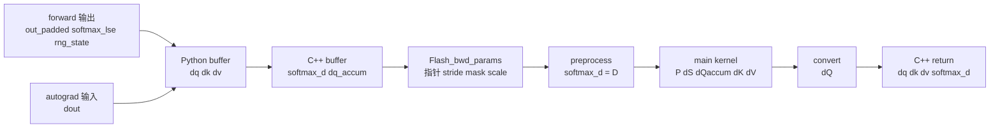

# Backward · 数据流

## 读者任务

这篇只看对象形态和边界：同一套 backward 公式在 dense、varlen、dropout、deterministic、GQA/MQA 下，哪些字段变了，哪些不变量没变。

## Dense 路径对象生命周期



| 阶段 | 对象形态 | 关键不变量 |
|------|----------|------------|
| Python `ctx` | `q/k/v/out_padded/softmax_lse/rng_state` | 不保存完整 `P` |
| Python backward | `dout_padded`、预分配 `dq/dk/dv` | head dim padding 与 forward 对齐 |
| C++ `mha_bwd` | Tensor 检查、`softmax_d`、`dq_accum` | fp16/bf16、last dim contiguous、head dim <= 256 |
| `Flash_bwd_params` | 指针和 stride | LSE、mask、scale 语义沿用 forward |
| preprocess | `dsoftmax_sum` | 每个 query 行一个 `D=sum(dO*O)` |
| main kernel | tile 内 `P/dP/dS` 与梯度累积 | 不跨 tile 保存完整 `P` |
| convert/GQA sum | 最终 `dQ/dK/dV` | split 和 head group 被归并 |

## Dense 与 varlen 的差异

数学公式不变，地址解释变了。Dense 直接用 `[batch, seqlen, head, dim]`；varlen 把 token pack 成 `total_q/total_k`，由 `cu_seqlens_q/k` 表示每个 batch 样本边界。

| 路径 | `q/k/v` 形态 | `softmax_lse` 形态 | batch 边界 | `Flash_bwd_params` 标记 |
|------|--------------|--------------------|------------|--------------------------|
| dense | `[b, seqlen, h, d]` | `[b, h, seqlen_q]` | 固定长度隐含在 stride 中 | `unpadded_lse=false` |
| varlen | `[total, h, d]` | `[h, total_q]` | `cu_seqlens_q/k` | `unpadded_lse=true`、`total_q` |

```cpp
// 来源：csrc/flash_attn/flash_api.cpp L976-L1000
mha_varlen_bwd(const at::Tensor &dout,
               const at::Tensor &q,
               const at::Tensor &k,
               const at::Tensor &v,
               const at::Tensor &out,
               const at::Tensor &softmax_lse,
               std::optional<at::Tensor> &dq_,
               std::optional<at::Tensor> &dk_,
               std::optional<at::Tensor> &dv_,
               const at::Tensor &cu_seqlens_q,
               const at::Tensor &cu_seqlens_k,
               ...)
```

```cpp
// 来源：csrc/flash_attn/flash_api.cpp L1102-L1165
auto softmax_d = torch::empty({num_heads, total_q + 128 * batch_size}, opts.dtype(at::kFloat));
if (!deterministic) {
    dq_accum = torch::empty({total_q + 128 * batch_size, num_heads, head_size_rounded}, opts.dtype(at::kFloat));
} else {
    dq_accum = torch::zeros({nsplits, total_q + 128 * batch_size, num_heads, head_size_rounded}, opts.dtype(at::kFloat));
}
set_params_dgrad(params, ..., cu_seqlens_q.data_ptr(), cu_seqlens_k.data_ptr(), ...,
                 softmax_lse.data_ptr(), softmax_d.data_ptr(), ..., /*unpadded_lse*/true);
params.total_q = total_q;
```

varlen 里的 `total_q + 128 * batch_size` 是为了给每段序列边界留出 block padding，避免主 kernel 对 atomic add 做过多边界检查。读 varlen 时，先转换下标空间，再套同一套 `D/P/dS` 公式。

## Dropout 的数据边界

Dropout backward 不是重新随机一次，而是用 forward 返回的 `rng_state` 复现同一个 mask。Python 保存它，C++ 把它写进 params，kernel 用它构造 `Dropout` 对象。

```python
# 来源：flash_attn/flash_attn_interface.py L855-L878
out_padded, softmax_lse, S_dmask, rng_state = _wrapped_flash_attn_forward(...)
if is_grad:
    ctx.save_for_backward(q, k, v, out_padded, softmax_lse, rng_state)
```

```cpp
// 来源：csrc/flash_attn/src/flash_bwd_kernel.h L448-L550
FLASH_NAMESPACE::Dropout dropout(params.rng_state[0], params.rng_state[1],
                       params.p_dropout_in_uint8_t, bidb, bidh, tidx, params.h);
...
dropout.template apply_dropout</*encode_dropout_in_sign_bit=*/true>(
    acc_s, block_row_idx, block_col_idx, AtomLayoutMS
);
```

如果 dropout 训练中出现梯度不稳定，先确认 forward/backward 使用的是同一个 `rng_state`，而不是只看 `dropout_p` 数值。

## Deterministic 的归约边界

非 deterministic 路径可以让不同 K split 更自由地累积 `dQaccum`。deterministic 路径显式引入 `nsplits` 维，并在 convert 阶段按固定 split 数归并。

```cpp
// 来源：csrc/flash_attn/flash_api.cpp L889-L895
if (!deterministic) {
    dq_accum = torch::empty({batch_size, seqlen_q_rounded, num_heads, head_size_rounded}, opts.dtype(at::kFloat));
} else {
    const int nsplits = (get_num_sm(get_current_device()) + batch_size * num_heads - 1) / (batch_size * num_heads);
    dq_accum = torch::zeros({nsplits, batch_size, seqlen_q_rounded, num_heads, head_size_rounded}, opts.dtype(at::kFloat));
}
```

```cpp
// 来源：csrc/flash_attn/src/flash_bwd_launch_template.h L72-L125
int gridDimx = num_n_block;
if (params.deterministic) {
    int num_sm = get_num_sm(get_current_device());
    gridDimx = (num_sm + params.b * params.h - 1) / (params.b * params.h);
}
...
flash_bwd_convert_dq_kernel<Kernel_traits><<<grid_m, Kernel_traits::kNThreads, Kernel_traits::kSmemdQSize, stream>>>(
    params, !params.deterministic ? 1 : gridDimx);
```

因此 deterministic 是可复现性开关，不是数值公式开关。它改变归约布局和性能成本。

## GQA/MQA 的 `dK/dV` 回收边界

Forward 中多个 Q head group 共享同一个 KV head。Backward 先按 Q head 数生成 expanded `dk/dv`，再把同一个 KV head 的多个 group 贡献求和。

```cpp
// 来源：csrc/flash_attn/flash_api.cpp L900-L907
if (num_heads_k != num_heads) {
    dk_expanded = torch::empty({batch_size, seqlen_k, num_heads, head_size}, opts);
    dv_expanded = torch::empty({batch_size, seqlen_k, num_heads, head_size}, opts);
} else {
    dk_expanded = dk;
    dv_expanded = dv;
}
```

```cpp
// 来源：csrc/flash_attn/flash_api.cpp L967-L970
if (num_heads_k != num_heads) {
    at::sum_out(dk, at::reshape(dk_expanded, {batch_size, seqlen_k, num_heads_k, num_heads / num_heads_k, head_size}), {3});
    at::sum_out(dv, at::reshape(dv_expanded, {batch_size, seqlen_k, num_heads_k, num_heads / num_heads_k, head_size}), {3});
}
```

排查 GQA 梯度 shape 时，不要只看最终 `dk/dv`；中间 expanded buffer 的 head 维是按 Q heads 展开的。

## 与 KV cache API 的边界

`flash_attn_with_kvcache` 服务 decode 推理，会原地更新 KV cache，并支持 paged KV、cache remap、RoPE 和 SplitKV。它不是训练 autograd 路径，接口文档明确不支持 backward。

```python
# 来源：flash_attn/flash_attn_interface.py L1312-L1451
def flash_attn_with_kvcache(...):
    """If k and v are not None, k_cache and v_cache will be updated *inplace* ...
    Note: Does not support backward pass.
    """
```

这条边界很实用：训练长上下文看 dense/varlen backward；decode serving 延迟问题看 [[FlashAttention-KV-Cache]]。

## 复盘

- Dense 与 varlen 共用 backward 公式，区别在 layout、`cu_seqlens` 和 LSE/`dQaccum` 地址解释。
- Dropout 的关键状态是 `rng_state`，deterministic 的关键状态是 split 维和归约顺序。
- GQA/MQA 的 `dK/dV` 必须把多个 Q group 的贡献加回真实 KV head。
