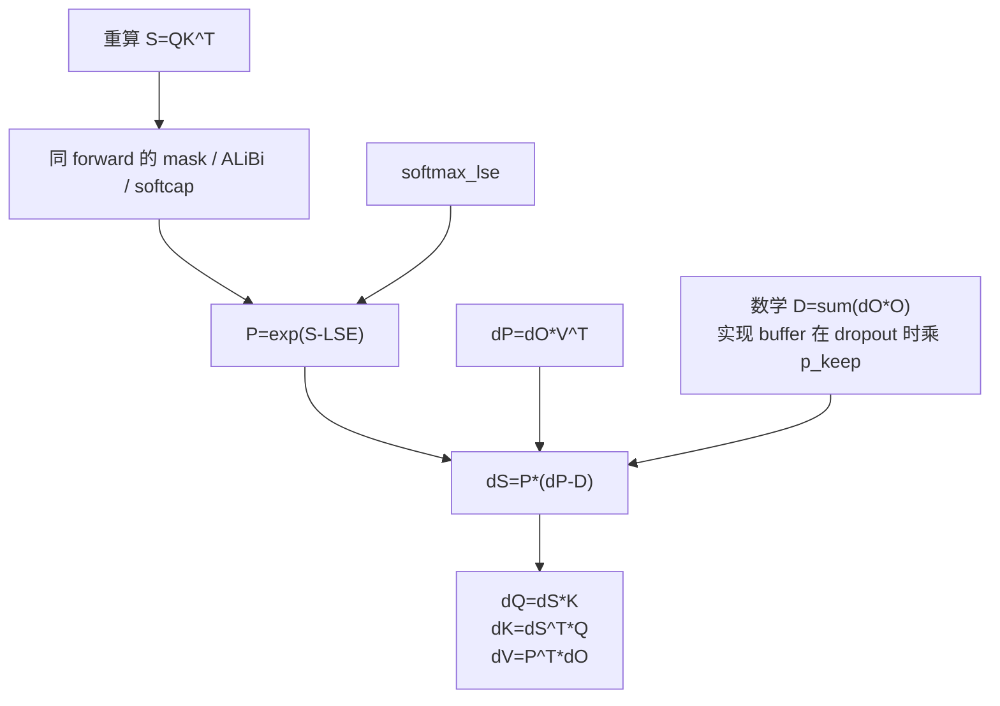

# Backward · 核心概念

## 读者为什么要读

如果只理解 forward，容易误以为 FlashAttention 的训练收益来自“更快算完 attention”。Backward 才暴露更关键的训练取舍：它不保存完整 `P = softmax(QK^T)`，而是在反向阶段用 `Q/K/V/O/LSE/RNG` 重算 tile 内概率，用更多计算换掉 `O(seqlen_q * seqlen_k)` 的显存状态。

这篇先建立模型，不追逐所有模板细节。读完你应该能解释：

- forward 为什么必须保存 `out` 和 `softmax_lse`。
- 数学上的 `D = sum(dO * O)` 与 dropout 实现里乘过 `p_keep` 的 `dsoftmax_sum` 为什么不能混为一谈。
- backward 主 kernel 为什么需要重算 score、mask、dropout 和 `P`。
- deterministic、varlen、GQA 为什么是 layout/归约问题，不是新的数学公式。

## 先建立模型

Backward 像一次“带账本的重算”。Forward 没有把整张 `P` 存进账本，只留下足够恢复每个 query 行概率分布的摘要。

| forward 留下什么 | backward 用它做什么 | 缺失会怎样 |
|------------------|---------------------|------------|
| `q/k/v` | 重算 `S = QK^T`，并参与 `dQ/dK/dV` GEMM | 无法恢复 score 或梯度 |
| `out` | 计算行级点积；dropout 实现会再乘 `p_keep` 与内部 `dP` 对齐 | softmax backward 缺行归一项 |
| `softmax_lse` | 用 `exp(S - LSE)` 重建 tile 内 `P` | 数值不稳定，且无法对齐 forward softmax |
| `rng_state` | dropout 时复现 forward 的 mask | dropout backward 与 forward 不一致 |
| mask/ALiBi/softcap 参数 | 让重算 score 走同一语义 | 梯度对应的不是同一次 forward |



## 源码证据：forward 保存的不是 `P`

`FlashAttnFunc.forward` 在训练时保存 `q/k/v/out_padded/softmax_lse/rng_state`。这里没有保存完整 attention matrix；`S_dmask` 只在 `return_softmax` 的测试/调试路径返回。

```python
# 来源：flash_attn/flash_attn_interface.py L855-L878
out_padded, softmax_lse, S_dmask, rng_state = _wrapped_flash_attn_forward(
    q,
    k,
    v,
    dropout_p,
    softmax_scale,
    causal=causal,
    window_size_left=window_size[0],
    window_size_right=window_size[1],
    softcap=softcap,
    alibi_slopes=alibi_slopes,
    return_softmax=return_softmax and dropout_p > 0,
)
if is_grad:
    ctx.save_for_backward(q, k, v, out_padded, softmax_lse, rng_state)
    ctx.dropout_p = dropout_p
    ctx.softmax_scale = softmax_scale
    ctx.causal = causal
    ctx.window_size = window_size
    ctx.softcap = softcap
    ctx.alibi_slopes = alibi_slopes
    ctx.deterministic = deterministic
out = out_padded[..., :head_size_og]
return out if not return_softmax else (out, softmax_lse, S_dmask)
```

这个保存集合就是 backward 的契约边界：`out` 和 `softmax_lse` 是紧凑状态，`rng_state` 在 dropout 时承载正确性；实现为了统一协议，即使 dropout 为零也保存这个两元素 tensor。完整 `P` 被有意丢掉。

## 源码证据：数学 `D` 与实现 `dsoftmax_sum` 有一层标尺差

softmax backward 对每个 query 行需要一个标量：

```text
D_i = sum_j dO_i[j] * O_i[j]
dS_i = P_i * (dP_i - D_i)
```

无 dropout 时，`dsoftmax_sum` 就是这个行标量。dropout 时 forward 输出 O 已含 `1/p_keep`，而主 kernel 暂不把 `dP` 乘 `1/p_keep`；因此 preprocess 把点积再乘 `p_keep`，让两者处于同一内部标尺，最终缩放延后到梯度写出。

```cpp
// 来源：csrc/flash_attn/src/flash_bwd_preprocess_kernel.h L24-L51
template <int THREADS_PER_ROW, typename Engine0, typename Layout0, typename Engine1, typename Layout1>
inline __device__ void dot_do_o(Tensor<Engine0, Layout0> const &do_, Tensor<Engine0, Layout0> const &o,
                                Tensor<Engine1, Layout1> &dP_sum, const int gdP_col_stride, const float scale) {
    static_assert(Layout0::rank == 3, "Only support 3D Tensor");
    static_assert(Layout1::rank == 1, "Only support 1D Tensor");
    CUTE_STATIC_ASSERT_V(do_.layout() == o.layout());
    // Reshape do_ and o from (8, kBlockM / 32, kHeadDim / 64) to (kBlockM / 32, 8 * kHeadDim / 64)
    // The last coordinate is the "page".
    Tensor do_reshaped = make_tensor(do_.data(), make_layout(get<1>(do_.layout()),
                                                             make_layout(get<0>(do_.layout()),
                                                                         get<2>(do_.layout()))));
    Tensor o_reshaped = make_tensor(o.data(), do_reshaped.layout());
    Tensor do_fp32 = FLASH_NAMESPACE::convert_type<float>(do_reshaped);
    Tensor o_fp32 = FLASH_NAMESPACE::convert_type<float>(o_reshaped);
    #pragma unroll
    for (int mi = 0; mi < size<0>(do_reshaped); ++mi) {
        float dP_sum_cur = do_fp32(mi, 0) * o_fp32(mi, 0);
        #pragma unroll
        for (int ni = 1; ni < size<1>(do_reshaped); ni++) {
            dP_sum_cur += do_fp32(mi, ni) * o_fp32(mi, ni);
        }
        FLASH_NAMESPACE::SumOp<float> sum_op;
        dP_sum_cur = FLASH_NAMESPACE::Allreduce<THREADS_PER_ROW>::run(dP_sum_cur, sum_op) * scale;
        if (threadIdx.x % THREADS_PER_ROW == 0) {
            dP_sum(mi * gdP_col_stride + threadIdx.x / THREADS_PER_ROW) = dP_sum_cur;
        }
    }
}
```

这解释了 `out` 的地位：它不是为了给用户再返回一次结果，而是 softmax 反向公式的一部分。

## 源码证据：tile 内重建 `P`，再形成 `dS`

主 backward kernel 先用 Q/K 重算 scores，再用 forward 保存的 LSE 做归一化。随后计算 `dP = dO V^T`，把它和 `D` 合成 `dS`。

```cpp
// 来源：csrc/flash_attn/src/flash_bwd_kernel.h L474-L489
FLASH_NAMESPACE::gemm(acc_s, tSrQ, tSrK, tSsQ, tSsK, tiled_mma_sdp,
            smem_tiled_copy_QdO, smem_tiled_copy_KV, smem_thr_copy_QdO, smem_thr_copy_KV);

if constexpr (Is_softcap) {
    FLASH_NAMESPACE::apply_softcap(acc_s, params.softcap);
}

// Reshape acc_s from (MMA=4, MMA_N, MMA_N) to (row=(2, MMA_N), col=(2, MMA_N))
Tensor scores = make_tensor(acc_s.data(), FLASH_NAMESPACE::convert_layout_acc_rowcol(acc_s.layout()));
// if (cute::thread(32, 0)) { print(scores); }

// Softcapping - calculating dTanh and scaling dS later with it
[[maybe_unused]] Tensor dtanh = make_tensor_like(scores);
if constexpr (Is_softcap) {
    FLASH_NAMESPACE::calculate_dtanh(scores, dtanh, params.softcap);
}
```

ALiBi 与 causal/local/OOB mask 在两段之间按 forward 的坐标语义重放；完成这些语义变换后，LSE 才把 score 还原成概率：

```cpp
// 来源：csrc/flash_attn/src/flash_bwd_kernel.h L534-L536
// if (cute::thread(32, 0)) { print(scores); }
// Compute the exponential value.
FLASH_NAMESPACE::scale_apply_exp2</*scale_max=*/false>(scores, lse, params.scale_softmax_log2);
```

```cpp
// 来源：csrc/flash_attn/src/flash_bwd_kernel.h L577-L595
FLASH_NAMESPACE::gemm</*A_in_regs=*/false, /*B_in_regs=*/Kernel_traits::Is_V_in_regs>(
    acc_dp, tdPrdO, tdPrV, tdPsdO, tdPsV, tiled_mma_sdp,
    smem_tiled_copy_QdO, smem_tiled_copy_KV, smem_thr_copy_QdO, smem_thr_copy_KV
);

// Reshape acc_dp from (MMA=4, MMA_N, MMA_N) to (row=(2, MMA_N), col=(2, MMA_N))
Tensor dS = make_tensor(acc_dp.data(), scores.layout());
auto pointwise_mult = [](float p, float dp, float d) {
    return p * (!Is_dropout || p >= 0 ? dp - d : d);
};
#pragma unroll
for (int mi = 0; mi < size<0>(dS); ++mi) {
    #pragma unroll
    for (int ni = 0; ni < size<1>(dS); ++ni) {
        float scaled_ds = pointwise_mult(scores(mi, ni), dS(mi, ni), dP_sum(mi));
        if constexpr (Is_softcap) { scaled_ds *= dtanh(mi, ni); }
        dS(mi, ni) = scaled_ds;
    }
}
```

`scores` 在归一化后就是当前 tile 的 `P`。dropout 路径把 mask 编进符号位：后续给 `dV` 的低精度 P 用 ReLU 清掉 dropped 位置，而 `pointwise_mult` 根据符号选择 softmax derivative 分支。源码里的复杂度来自“如何在 mask、dropout、local window、softcap、并行 split 下仍然重建同一个 P 和同一套内部标尺”。

## 三个梯度的来源

| 梯度 | 数学来源 | 源码中的核心动作 |
|------|----------|------------------|
| `dV` | `P^T dO` | 用重建的 `P` 与 `dO` 做 GEMM |
| `dQ` | `dS K` | 用 `dS` 乘 K，写入或累积到 `dQaccum` |
| `dK` | `dS^T Q` | 用 `dS` 与 Q 做 GEMM，写入 `dK` |

```cpp
// 来源：csrc/flash_attn/src/flash_bwd_kernel.h L635-L636
FLASH_NAMESPACE::gemm(acc_dv, tdVrPt, tdVrdO, tdVsPt, tdVsdOt, tiled_mma_dkv,
            smem_tiled_copy_PdSt, smem_tiled_copy_QdOt, smem_thr_copy_PdSt, smem_thr_copy_QdOt);
```

```cpp
// 来源：csrc/flash_attn/src/flash_bwd_kernel.h L655-L656
FLASH_NAMESPACE::gemm(acc_dq, tdQrdS, tdQrKt, tdQsdS, tdQsKt, tiled_mma_dq,
            smem_tiled_copy_dS, smem_tiled_copy_Kt, smem_thr_copy_dS, smem_thr_copy_Kt);
```

```cpp
// 来源：csrc/flash_attn/src/flash_bwd_kernel.h L689-L690
FLASH_NAMESPACE::gemm(acc_dk, tdKrdSt, tdKrQt, tdKsdSt, tdKsQt, tiled_mma_dkv,
            smem_tiled_copy_PdSt, smem_tiled_copy_QdOt, smem_thr_copy_PdSt, smem_thr_copy_QdOt);
```

所以 backward 不是“多一次 forward”那么简单。它重算 score/probability，同时还要执行 `dO V^T`、`P^T dO`、`dS K`、`dS^T Q`，并处理跨 tile 累积。

## 复盘

1. FlashAttention backward 的训练收益来自不保存完整 `P`，但它必须保存 `O/LSE/RNG` 这类足够重算的摘要。
2. 数学上的 `D=sum(dO*O)` 是行级账本；dropout 实现中的 `dsoftmax_sum` 会乘 `p_keep`，与暂未做 `1/p_keep` 缩放的内部 `dP` 对齐。
3. `softmax_lse` 让 backward 在每个 tile 内恢复与 forward 一致的概率标尺。
4. deterministic、varlen、GQA 改变的是 buffer layout、地址解释和归约方式，不改变 `dS = P*(dP-D)` 这条主公式。
