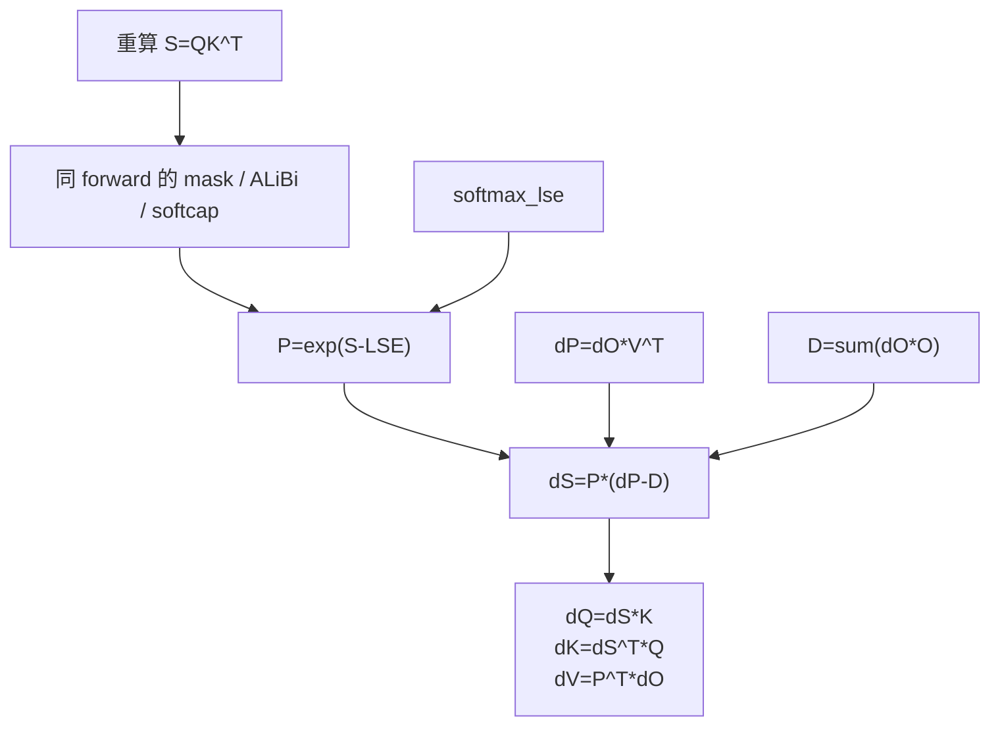

# Backward · 核心概念

## 读者为什么要读

如果只理解 forward，容易误以为 FlashAttention 的训练收益来自“更快算完 attention”。Backward 才暴露更关键的训练取舍：它不保存完整 `P = softmax(QK^T)`，而是在反向阶段用 `Q/K/V/O/LSE/RNG` 重算 tile 内概率，用更多计算换掉 `O(seqlen_q * seqlen_k)` 的显存状态。

这篇先建立模型，不追逐所有模板细节。读完你应该能解释：

- forward 为什么必须保存 `out` 和 `softmax_lse`。
- `D = sum(dO * O)` 为什么是 softmax backward 的行级锚点。
- backward 主 kernel 为什么需要重算 score、mask、dropout 和 `P`。
- deterministic、varlen、GQA 为什么是 layout/归约问题，不是新的数学公式。

## 先建立模型

Backward 像一次“带账本的重算”。Forward 没有把整张 `P` 存进账本，只留下足够恢复每个 query 行概率分布的摘要。

| forward 留下什么 | backward 用它做什么 | 缺失会怎样 |
|------------------|---------------------|------------|
| `q/k/v` | 重算 `S = QK^T`，并参与 `dQ/dK/dV` GEMM | 无法恢复 score 或梯度 |
| `out` | 计算 `D = sum(dO * O)` | softmax backward 缺行归一项 |
| `softmax_lse` | 用 `exp(S - LSE)` 重建 tile 内 `P` | 数值不稳定，且无法对齐 forward softmax |
| `rng_state` | dropout 时复现 forward 的 mask | dropout backward 与 forward 不一致 |
| mask/ALiBi/softcap 参数 | 让重算 score 走同一语义 | 梯度对应的不是同一次 forward |



## 源码证据：forward 保存的不是 `P`

`FlashAttnFunc.forward` 在训练时保存 `q/k/v/out_padded/softmax_lse/rng_state`。这里没有保存完整 attention matrix；`S_dmask` 只在 `return_softmax` 的测试/调试路径返回。

```python
# 来源：flash_attn/flash_attn_interface.py L855-L878
out_padded, softmax_lse, S_dmask, rng_state = _wrapped_flash_attn_forward(
    q,
    k,
    v,
    dropout_p,
    softmax_scale,
    causal=causal,
    window_size_left=window_size[0],
    window_size_right=window_size[1],
    softcap=softcap,
    alibi_slopes=alibi_slopes,
    return_softmax=return_softmax and dropout_p > 0,
)
if is_grad:
    ctx.save_for_backward(q, k, v, out_padded, softmax_lse, rng_state)
```

这个保存集合就是 backward 的契约边界：`out` 和 `softmax_lse` 是压缩摘要，`rng_state` 是 dropout 正确性状态，完整 `P` 被有意丢掉。

## 源码证据：`D=sum(dO*O)` 是第一张反向账

softmax backward 对每个 query 行需要一个标量：

```text
D_i = sum_j dO_i[j] * O_i[j]
dS_i = P_i * (dP_i - D_i)
```

源码用独立 preprocess kernel 计算这个行标量，并写到 `dsoftmax_sum`，后面的主 kernel 会按 tile 读取它。

```cpp
// 来源：csrc/flash_attn/src/flash_bwd_preprocess_kernel.h L24-L51
float dP_sum_cur = do_fp32(mi, 0) * o_fp32(mi, 0);
for (int ni = 1; ni < size<1>(do_reshaped); ni++) {
    dP_sum_cur += do_fp32(mi, ni) * o_fp32(mi, ni);
}
dP_sum_cur = FLASH_NAMESPACE::Allreduce<THREADS_PER_ROW>::run(dP_sum_cur, sum_op) * scale;
if (threadIdx.x % THREADS_PER_ROW == 0) {
    dP_sum(mi * gdP_col_stride + threadIdx.x / THREADS_PER_ROW) = dP_sum_cur;
}
```

这解释了 `out` 的地位：它不是为了给用户再返回一次结果，而是 softmax 反向公式的一部分。

## 源码证据：tile 内重建 `P`，再形成 `dS`

主 backward kernel 先用 Q/K 重算 scores，再用 forward 保存的 LSE 做归一化。随后计算 `dP = dO V^T`，把它和 `D` 合成 `dS`。

```cpp
// 来源：csrc/flash_attn/src/flash_bwd_kernel.h L474-L536
FLASH_NAMESPACE::gemm(acc_s, tSrQ, tSrK, tSsQ, tSsK, tiled_mma_sdp,
            smem_tiled_copy_QdO, smem_tiled_copy_KV, smem_thr_copy_QdO, smem_thr_copy_KV);
if constexpr (Is_softcap) {
    FLASH_NAMESPACE::apply_softcap(acc_s, params.softcap);
}
if (Has_alibi) {
    alibi.apply_alibi(scores, n_block * kBlockN + ..., m_block * kBlockM + ..., AtomLayoutMS * 16);
}
FLASH_NAMESPACE::scale_apply_exp2</*scale_max=*/false>(scores, lse, params.scale_softmax_log2);
```

```cpp
// 来源：csrc/flash_attn/src/flash_bwd_kernel.h L577-L593
FLASH_NAMESPACE::gemm</*A_in_regs=*/false, /*B_in_regs=*/Kernel_traits::Is_V_in_regs>(
    acc_dp, tdPrdO, tdPrV, tdPsdO, tdPsV, tiled_mma_sdp,
    smem_tiled_copy_QdO, smem_tiled_copy_KV, smem_thr_copy_QdO, smem_thr_copy_KV
);
Tensor dS = make_tensor(acc_dp.data(), scores.layout());
auto pointwise_mult = [](float p, float dp, float d) {
    return p * (!Is_dropout || p >= 0 ? dp - d : d);
};
float scaled_ds = pointwise_mult(scores(mi, ni), dS(mi, ni), dP_sum(mi));
```

`scores` 在归一化后就是当前 tile 的 `P`。源码里的大多数复杂度来自“如何在 mask、dropout、local window、softcap、并行 split 下仍然重建同一个 `P`”。

## 三个梯度的来源

| 梯度 | 数学来源 | 源码中的核心动作 |
|------|----------|------------------|
| `dV` | `P^T dO` | 用重建的 `P` 与 `dO` 做 GEMM |
| `dQ` | `dS K` | 用 `dS` 乘 K，写入或累积到 `dQaccum` |
| `dK` | `dS^T Q` | 用 `dS` 与 Q 做 GEMM，写入 `dK` |

```cpp
// 来源：csrc/flash_attn/src/flash_bwd_kernel.h L635-L690
FLASH_NAMESPACE::gemm(acc_dv, tdVrPt, tdVrdO, tdVsPt, tdVsdOt, tiled_mma_dkv,
            smem_tiled_copy_PdSt, smem_tiled_copy_QdOt, smem_thr_copy_PdSt, smem_thr_copy_QdOt);
FLASH_NAMESPACE::gemm(acc_dq, tdQrdS, tdQrKt, tdQsdS, tdQsKt, tiled_mma_dq,
            smem_tiled_copy_dS, smem_tiled_copy_Kt, smem_thr_copy_dS, smem_thr_copy_Kt);
FLASH_NAMESPACE::gemm(acc_dk, tdKrdSt, tdKrQt, tdKsdSt, tdKsQt, tiled_mma_dkv,
            smem_tiled_copy_PdSt, smem_tiled_copy_QdOt, smem_thr_copy_PdSt, smem_thr_copy_QdOt);
```

所以 backward 不是“多一次 forward”那么简单。它重算 score/probability，同时还要执行 `dO V^T`、`P^T dO`、`dS K`、`dS^T Q`，并处理跨 tile 累积。

## 复盘

1. FlashAttention backward 的训练收益来自不保存完整 `P`，但它必须保存 `O/LSE/RNG` 这类足够重算的摘要。
2. `D=sum(dO*O)` 是 softmax backward 的行级账本，先由 preprocess kernel 生成。
3. `softmax_lse` 让 backward 在每个 tile 内恢复与 forward 一致的概率标尺。
4. deterministic、varlen、GQA 改变的是 buffer layout、地址解释和归约方式，不改变 `dS = P*(dP-D)` 这条主公式。
