# Backward · 源码走读

## 读者任务

这篇沿一条 dense training backward 主线走源码：用户调用 `flash_attn_func` 完成 forward 后，PyTorch autograd 把上游 `dO` 交给 `FlashAttnFunc.backward`，最终 CUDA kernel 写出 `dQ/dK/dV`。

读完你应该能回答：

- Python 层保存哪些状态，哪些状态故意不保存。
- C++ `mha_bwd` 如何把 Tensor 语义压成 `Flash_bwd_params`。
- launch template 为什么拆成 preprocess、main、convert 三段。
- 主 kernel 如何把 `QK` 重算、LSE、`dO V^T` 和 `D` 拼成 `dS`。

## 长文读法

这篇按 backward 的“少存储、重计算”主线读：forward 只保存 Q/K/V/O/LSE/RNG，Python backward 分配 `dQ/dK/dV` 并过桥，C++ `mha_bwd` 做设备、dtype、shape 和 buffer 检查，再把状态压进 `Flash_bwd_params`；launch 先算 `D=sum(dO*O)`，主 kernel 重算 `P` 和 `dS`，最后用 tiled GEMM 写出梯度。

| 你的任务 | 先读 | 抓住什么 |
|----------|------|----------|
| 建立 backward 全链路 | 1 到 4 | Python autograd 负责状态和过桥，C++ 是安全检查与参数压缩边界 |
| 排查显存保存策略 | 1 | 不保存完整 `P`，只保存能支撑重算的摘要 |
| 排查 deterministic / GQA | 5 | buffer 形态暴露 deterministic 和 MQA/GQA 分叉 |
| 排查 kernel 参数 | 6 | `Flash_bwd_params` 把指针、stride、LSE、dropout、window 等压成 kernel 契约 |
| 理解 launch 三段 | 7 | 先 preprocess `D`，再主 kernel，最后 convert / reduce `dQ` |
| 理解主 kernel 数学 | 8 到 9 | 重算 scores / `P`，用 `dO V^T` 和 `D` 得到 `dS`，再算 `dQ/dK/dV` |

## 主线地图

```mermaid
flowchart LR
    A["FlashAttnFunc.forward<br/>保存 Q/K/V/O/LSE/RNG"]
    B["FlashAttnFunc.backward<br/>收到 dO"]
    C["_flash_attn_backward<br/>custom op"]
    D["flash_attn_gpu.bwd<br/>pybind"]
    E["mha_bwd<br/>检查与 buffer"]
    F["set_params_dgrad<br/>Flash_bwd_params"]
    G["flash_bwd_dot_do_o<br/>D=sum(dO*O)"]
    H["flash_bwd_dq_dk_dv<br/>重算 P/dS"]
    I["flash_bwd_convert_dq<br/>归并 dQ"]
    J["返回 dQ/dK/dV"]
    A --> B --> C --> D --> E --> F --> G --> H --> I --> J
```



## 1. Autograd 保存“能重算”的最小集合

系统压力是训练显存。保存完整 attention matrix 会把内存重新拉回 `seqlen_q * seqlen_k` 级别，所以 forward 只把 backward 必须用的摘要放进 `ctx`。

```python
# 来源：flash_attn/flash_attn_interface.py L828-L878
class FlashAttnFunc(torch.autograd.Function):
    @staticmethod
    def forward(ctx, q, k, v, dropout_p, softmax_scale, causal, window_size,
                softcap, alibi_slopes, deterministic, return_softmax, is_grad_enabled):
        is_grad = is_grad_enabled and any(x.requires_grad for x in [q, k, v])
        if softmax_scale is None:
            softmax_scale = q.shape[-1] ** (-0.5)
        head_size_og = q.size(3)
        if head_size_og % 8 != 0:
            q = torch.nn.functional.pad(q, [0, 8 - head_size_og % 8])
            k = torch.nn.functional.pad(k, [0, 8 - head_size_og % 8])
            v = torch.nn.functional.pad(v, [0, 8 - head_size_og % 8])
        out_padded, softmax_lse, S_dmask, rng_state = _wrapped_flash_attn_forward(...)
        if is_grad:
            ctx.save_for_backward(q, k, v, out_padded, softmax_lse, rng_state)
            ctx.dropout_p = dropout_p
            ctx.softmax_scale = softmax_scale
            ctx.causal = causal
            ctx.window_size = window_size
            ctx.softcap = softcap
            ctx.alibi_slopes = alibi_slopes
            ctx.deterministic = deterministic
```

这里有两个容易漏掉的边界：

- `out_padded` 被保存，而不是裁回原始 head dim 的 `out`；backward 看到的 shape 要与 padding 后的 Q/K/V 对齐。
- `S_dmask` 没有进入 `ctx.save_for_backward`；完整概率矩阵不是训练 backward 的状态来源。

## 2. Python backward 只分配输出并过桥

`FlashAttnFunc.backward` 拿到上游 `dout` 后，创建 `dq/dk/dv`，必要时 pad `dout`，然后调用 `_wrapped_flash_attn_backward`。梯度公式不在 Python 里实现。

```python
# 来源：flash_attn/flash_attn_interface.py L880-L910
@staticmethod
def backward(ctx, dout, *args):
    q, k, v, out, softmax_lse, rng_state = ctx.saved_tensors
    dq, dk, dv = torch.empty_like(q), torch.empty_like(k), torch.empty_like(v)
    head_size_og = dout.size(3)
    dout_padded = dout
    if head_size_og % 8 != 0:
        dout_padded = torch.nn.functional.pad(dout, [0, 8 - head_size_og % 8])
    _wrapped_flash_attn_backward(
        dout_padded, q, k, v, out, softmax_lse, dq, dk, dv,
        ctx.dropout_p, ctx.softmax_scale, ctx.causal,
        ctx.window_size[0], ctx.window_size[1],
        ctx.softcap, ctx.alibi_slopes, ctx.deterministic,
        rng_state=rng_state,
    )
    dq = dq[..., : dout.shape[-1]]
```

这个函数的读法是“状态交接”，不是“数学实现”：它保证 C++ 收到 padding 后一致的 `q/k/v/out/dout` 和已经分配好的输出 buffer。

## 3. Custom op 声明 mutation，再调用 extension

`_flash_attn_backward` 是 Python 到 C++ 的窄桥。它声明 `dq/dk/dv` 会被写入，规范化最后一维 contiguous，然后调用 `flash_attn_gpu.bwd`。

```python
# 来源：flash_attn/flash_attn_interface.py L252-L301
@_torch_custom_op_wrapper("flash_attn::_flash_attn_backward", mutates_args=("dq", "dk", "dv"), device_types="cuda")
def _flash_attn_backward(...):
    dout, q, k, v, out = [maybe_contiguous(x) for x in (dout, q, k, v, out)]
    (
        dq,
        dk,
        dv,
        softmax_d,
    ) = flash_attn_gpu.bwd(
        dout, q, k, v, out, softmax_lse,
        dq, dk, dv, alibi_slopes,
        dropout_p, softmax_scale, causal,
        window_size_left, window_size_right,
        softcap, deterministic, None, rng_state,
    )
    return softmax_d
```

`softmax_d` 是 `D=sum(dO*O)` 的可观测返回值，主要用于调试和测试。普通 autograd 回传只需要 `dq/dk/dv`。

## 4. C++ `mha_bwd` 是安全边界

C++ 入口先拒绝不支持的组合：GPU 架构、dtype、device、stride、head dim、head 数整除关系都在 kernel launch 前检查。

```cpp
// 来源：csrc/flash_attn/flash_api.cpp L770-L835
mha_bwd(const at::Tensor &dout,
        const at::Tensor &q,
        const at::Tensor &k,
        const at::Tensor &v,
        const at::Tensor &out,
        const at::Tensor &softmax_lse,
        std::optional<at::Tensor> &dq_,
        std::optional<at::Tensor> &dk_,
        std::optional<at::Tensor> &dv_,
        ...)
{
    at::cuda::CUDAGuard device_guard{q.device()};
    auto [cc_major, cc_minor] = get_compute_capability(get_current_device());
    TORCH_CHECK(cc_major >= 8, "FlashAttention only supports Ampere GPUs or newer.");
    TORCH_CHECK(q_dtype == torch::kFloat16 || q_dtype == torch::kBFloat16,
                "FlashAttention only support fp16 and bf16 data type");
    TORCH_CHECK(q.stride(-1) == 1, "Input tensor must have contiguous last dimension");
    TORCH_CHECK(head_size % 8 == 0, "head_size should be a multiple of 8");
    TORCH_CHECK(head_size <= 256, "FlashAttention backward only supports head dimension at most 256");
    TORCH_CHECK(num_heads % num_heads_k == 0, "Number of heads in key/value must divide number of heads in query");
}
```

读这段时要把它看成 kernel 前的契约编译：后面的 CUDA 模板不再适合处理 Python/Tensor 层的歧义。

## 5. Buffer 分配暴露 deterministic 与 GQA 的分叉

`mha_bwd` 分配 `softmax_d` 和 `dq_accum`。非 deterministic 路径用一个普通 fp32 `dQaccum`；deterministic 路径多一个 split 维，并把它初始化为 0。

```cpp
// 来源：csrc/flash_attn/flash_api.cpp L881-L907
bool loop = true;
auto softmax_d = torch::empty({batch_size, num_heads, seqlen_q_rounded}, opts.dtype(at::kFloat));
at::Tensor dq_accum;
if (loop) {
    if (!deterministic) {
        dq_accum = torch::empty({batch_size, seqlen_q_rounded, num_heads, head_size_rounded}, opts.dtype(at::kFloat));
    } else {
        const int nsplits = (get_num_sm(get_current_device()) + batch_size * num_heads - 1) / (batch_size * num_heads);
        dq_accum = torch::zeros({nsplits, batch_size, seqlen_q_rounded, num_heads, head_size_rounded}, opts.dtype(at::kFloat));
    }
}
if (num_heads_k != num_heads) {
    dk_expanded = torch::empty({batch_size, seqlen_k, num_heads, head_size}, opts);
    dv_expanded = torch::empty({batch_size, seqlen_k, num_heads, head_size}, opts);
}
```

这两个分叉对应两个常见问题：

- `deterministic=True` 会更慢且占更多临时显存，因为归约结构要更稳定。
- MQA/GQA 的 `dK/dV` 先按 Q head 展开计算，最后再沿 group 维求和。

## 6. `Flash_bwd_params` 把 backward 状态压成 kernel 契约

`set_params_dgrad` 先复用 `set_params_fprop`，再追加 `dO/dQ/dK/dV/dQaccum/dsoftmax_sum` 等反向字段。

```cpp
// 来源：csrc/flash_attn/flash_api.cpp L161-L241
void set_params_dgrad(Flash_bwd_params &params, ..., const at::Tensor q,
                      const at::Tensor k, const at::Tensor v, const at::Tensor out,
                      const at::Tensor dout, at::Tensor dq, at::Tensor dk, at::Tensor dv,
                      void *cu_seqlens_q_d, void *cu_seqlens_k_d,
                      void *dq_accum_d, void *dk_accum_d, void *dv_accum_d,
                      void *softmax_lse_d, void *dsoftmax_sum_d, ...)
{
    set_params_fprop(params, ..., q, k, v, out, cu_seqlens_q_d, cu_seqlens_k_d,
                     nullptr, nullptr, softmax_lse_d, ...);
    params.do_ptr = dout.data_ptr();
    params.dq_ptr = dq.data_ptr();
    params.dk_ptr = dk.data_ptr();
    params.dv_ptr = dv.data_ptr();
    params.dq_accum_ptr = dq_accum_d;
    params.dsoftmax_sum = dsoftmax_sum_d;
    params.deterministic = deterministic;
}
```

对应结构体在 `flash.h` 里继承 forward 参数。这个继承关系很重要：backward 沿用 forward 的 shape、mask、scale、LSE 解释方式，只增加梯度相关指针。

```cpp
// 来源：csrc/flash_attn/src/flash.h L147-L185
struct Flash_bwd_params : public Flash_fwd_params {
    void *__restrict__ do_ptr;
    void *__restrict__ dq_ptr;
    void *__restrict__ dk_ptr;
    void *__restrict__ dv_ptr;
    void *__restrict__ dq_accum_ptr;
    void *__restrict__ dk_accum_ptr;
    void *__restrict__ dv_accum_ptr;
    void *__restrict__ dsoftmax_sum;
    bool deterministic;
    index_t dq_accum_split_stride;
};
```

## 7. Launch 顺序先算 `D`，再算梯度

`run_flash_bwd_seqk_parallel` 的顺序就是 backward 公式依赖顺序：先启动 `flash_bwd_dot_do_o_kernel` 计算 `D`，再启动主 kernel 计算 `dQ/dK/dV`，最后启动 `flash_bwd_convert_dq_kernel` 把 fp32/split 累积转换成最终 `dQ`。

```cpp
// 来源：csrc/flash_attn/src/flash_bwd_launch_template.h L72-L125
if (!params.deterministic) {
    flash_bwd_dot_do_o_kernel<true, Kernel_traits><<<grid_m, Kernel_traits::kNThreads, 0, stream>>>(params);
} else {
    flash_bwd_dot_do_o_kernel<false, Kernel_traits><<<grid_m, Kernel_traits::kNThreads, 0, stream>>>(params);
}
...
auto kernel = &flash_bwd_dq_dk_dv_loop_seqk_parallel_kernel<Kernel_traits, ...>;
kernel<<<grid_n, Kernel_traits::kNThreads, smem_size_dq_dk_dv, stream>>>(params);
...
flash_bwd_convert_dq_kernel<Kernel_traits><<<grid_m, Kernel_traits::kNThreads, Kernel_traits::kSmemdQSize, stream>>>(
    params, !params.deterministic ? 1 : gridDimx);
```

`Clear_dQaccum` 在非 deterministic preprocess 路径为 `true`，说明这一步还承担清理后续 atomic/add 区域的职责。

## 8. 主 kernel 重算 `P` 与 `dS`

主 kernel 的核心顺序是：

1. `Q x K` 重算 scores。
2. 应用 softcap、ALiBi、causal/local mask。
3. 用 LSE 做 `exp(score - LSE)` 得到 tile 内 `P`。
4. dropout 场景用 forward RNG 状态复现 mask。
5. 计算 `dP = dO V^T`。
6. 用 `dS = P * (dP - D)` 得到 softmax 输入梯度。

```cpp
// 来源：csrc/flash_attn/src/flash_bwd_kernel.h L474-L550
FLASH_NAMESPACE::gemm(acc_s, tSrQ, tSrK, tSsQ, tSsK, tiled_mma_sdp,
            smem_tiled_copy_QdO, smem_tiled_copy_KV, smem_thr_copy_QdO, smem_thr_copy_KV);
if constexpr (Is_softcap) {
    FLASH_NAMESPACE::apply_softcap(acc_s, params.softcap);
}
if (Has_alibi) {
    alibi.apply_alibi(scores, n_block * kBlockN + ..., m_block * kBlockM + ..., AtomLayoutMS * 16);
}
FLASH_NAMESPACE::scale_apply_exp2</*scale_max=*/false>(scores, lse, params.scale_softmax_log2);
if constexpr (Is_dropout) {
    dropout.template apply_dropout</*encode_dropout_in_sign_bit=*/true>(acc_s, ...);
}
```

```cpp
// 来源：csrc/flash_attn/src/flash_bwd_kernel.h L577-L593
FLASH_NAMESPACE::gemm</*A_in_regs=*/false, /*B_in_regs=*/Kernel_traits::Is_V_in_regs>(
    acc_dp, tdPrdO, tdPrV, tdPsdO, tdPsV, tiled_mma_sdp,
    smem_tiled_copy_QdO, smem_tiled_copy_KV, smem_thr_copy_QdO, smem_thr_copy_KV
);
Tensor dS = make_tensor(acc_dp.data(), scores.layout());
float scaled_ds = pointwise_mult(scores(mi, ni), dS(mi, ni), dP_sum(mi));
if constexpr (Is_softcap) { scaled_ds *= dtanh(mi, ni); }
dS(mi, ni) = scaled_ds;
```

如果这里的 LSE、mask、dropout RNG 任意一个与 forward 不一致，backward 算出的梯度就不是同一次 forward 的梯度。

## 9. `dQ/dK/dV` 是三组 tiled GEMM

形成 `dS` 后，梯度回到矩阵乘：

```cpp
// 来源：csrc/flash_attn/src/flash_bwd_kernel.h L635-L690
FLASH_NAMESPACE::gemm(acc_dv, tdVrPt, tdVrdO, tdVsPt, tdVsdOt, tiled_mma_dkv,
            smem_tiled_copy_PdSt, smem_tiled_copy_QdOt, smem_thr_copy_PdSt, smem_thr_copy_QdOt);
...
FLASH_NAMESPACE::gemm(acc_dq, tdQrdS, tdQrKt, tdQsdS, tdQsKt, tiled_mma_dq,
            smem_tiled_copy_dS, smem_tiled_copy_Kt, smem_thr_copy_dS, smem_thr_copy_Kt);
...
FLASH_NAMESPACE::gemm(acc_dk, tdKrdSt, tdKrQt, tdKsdSt, tdKsQt, tiled_mma_dkv,
            smem_tiled_copy_PdSt, smem_tiled_copy_QdOt, smem_thr_copy_PdSt, smem_thr_copy_QdOt);
```

`dQ` 最麻烦，因为多个 K split 可能贡献同一行 Q 的梯度，所以它通过 `dQaccum` 和 `convert_dQ` 做累积与类型转换。`dK/dV` 在 GQA/MQA 场景还要回到 C++ 做 group sum。

```cpp
// 来源：csrc/flash_attn/flash_api.cpp L967-L973
if (num_heads_k != num_heads) {
    at::sum_out(dk, at::reshape(dk_expanded, {batch_size, seqlen_k, num_heads_k, num_heads / num_heads_k, head_size}), {3});
    at::sum_out(dv, at::reshape(dv_expanded, {batch_size, seqlen_k, num_heads_k, num_heads / num_heads_k, head_size}), {3});
}
return { dq, dk, dv, softmax_d };
```

## 运行验证

最小验证可以直接比较 FlashAttention 与 PyTorch reference 的 backward 梯度。示例需要已安装当前仓库扩展和 CUDA 环境：

```powershell
python - <<'PY'
import torch
from flash_attn import flash_attn_func

torch.manual_seed(0)
q = torch.randn(2, 128, 4, 64, device="cuda", dtype=torch.float16, requires_grad=True)
k = torch.randn(2, 128, 4, 64, device="cuda", dtype=torch.float16, requires_grad=True)
v = torch.randn(2, 128, 4, 64, device="cuda", dtype=torch.float16, requires_grad=True)

out = flash_attn_func(q, k, v, dropout_p=0.0, causal=True, deterministic=True)
loss = out.float().square().mean()
loss.backward()
print(q.grad.norm().item(), k.grad.norm().item(), v.grad.norm().item())
PY
```

预期现象：`q/k/v.grad` 都存在且范数为有限值。若这里报 head dim、dtype、contiguous 或 GPU 架构错误，先回到 `mha_bwd` 的检查段，而不是直接怀疑 kernel 主循环。

## 复盘

- Python 层负责保存状态、padding 对齐和输出 buffer；C++ 层负责拒绝不支持组合并装配 `Flash_bwd_params`。
- Launch template 的三段顺序对应公式依赖：先 `D`，再 `dS` 与梯度 GEMM，最后归并 `dQ`。
- 主 kernel 的正确性依赖 forward/backward 的 LSE、mask、dropout RNG、softcap 参数完全一致。
