# Backward · 源码走读

## 读者任务

这篇沿一条 dense training backward 主线走源码：用户调用 `flash_attn_func` 完成 forward 后，PyTorch autograd 把上游 `dO` 交给 `FlashAttnFunc.backward`，最终 CUDA kernel 写出 `dQ/dK/dV`。

读完你应该能回答：

- Python 层保存哪些状态，哪些状态故意不保存。
- C++ `mha_bwd` 如何把 Tensor 语义压成 `Flash_bwd_params`。
- launch template 为什么拆成 preprocess、main、convert 三段。
- 主 kernel 如何把 `QK` 重算、LSE、`dO V^T` 和 `D` 拼成 `dS`。

## 长文读法

这篇按 backward 的“少存储、重计算”主线读：forward 只保存 Q/K/V/O/LSE/RNG，Python backward 分配 `dQ/dK/dV` 并过桥，C++ `mha_bwd` 做设备、dtype、shape 和 buffer 检查，再把状态压进 `Flash_bwd_params`；launch 先算 `D=sum(dO*O)`，主 kernel 重算 `P` 和 `dS`，最后用 tiled GEMM 写出梯度。

| 你的任务 | 先读 | 抓住什么 |
|----------|------|----------|
| 建立 backward 全链路 | 1 到 4 | Python autograd 负责状态和过桥，C++ 是安全检查与参数压缩边界 |
| 排查显存保存策略 | 1 | 不保存完整 `P`，只保存能支撑重算的摘要 |
| 排查 deterministic / GQA | 5 | buffer 形态暴露 deterministic 和 MQA/GQA 分叉 |
| 排查 kernel 参数 | 6 | `Flash_bwd_params` 把指针、stride、LSE、dropout、window 等压成 kernel 契约 |
| 理解 launch 三段 | 7 | 先 preprocess `D`，再主 kernel，最后 convert / reduce `dQ` |
| 理解主 kernel 数学 | 8 到 9 | 重算 scores / `P`，用 `dO V^T` 和 `D` 得到 `dS`，再算 `dQ/dK/dV` |

## 主线地图

```mermaid
flowchart LR
    A["FlashAttnFunc.forward<br/>保存 Q/K/V/O/LSE/RNG"]
    B["FlashAttnFunc.backward<br/>收到 dO"]
    C["_flash_attn_backward<br/>custom op"]
    D["flash_attn_gpu.bwd<br/>pybind"]
    E["mha_bwd<br/>检查与 buffer"]
    F["set_params_dgrad<br/>Flash_bwd_params"]
    G["flash_bwd_dot_do_o<br/>D=sum(dO*O)"]
    H["flash_bwd_dq_dk_dv<br/>重算 P/dS"]
    I["flash_bwd_convert_dq<br/>归并 dQ"]
    J["返回 dQ/dK/dV"]
    A --> B --> C --> D --> E --> F --> G --> H --> I --> J
```



## 1. Autograd 保存“足以重算”的紧凑集合

系统压力是训练显存。保存完整 attention matrix 会把内存重新拉回 `seqlen_q * seqlen_k` 级别，所以 forward 保存 Q/K/V、输出 O、每行 LSE 和 RNG state，而不保存完整 P。这里说“紧凑”而不说理论最小：实现为了统一协议，即使 dropout 为零也会返回并保存两元素 RNG tensor。

```python
# 来源：flash_attn/flash_attn_interface.py L855-L878
out_padded, softmax_lse, S_dmask, rng_state = _wrapped_flash_attn_forward(
    q,
    k,
    v,
    dropout_p,
    softmax_scale,
    causal=causal,
    window_size_left=window_size[0],
    window_size_right=window_size[1],
    softcap=softcap,
    alibi_slopes=alibi_slopes,
    return_softmax=return_softmax and dropout_p > 0,
)
if is_grad:
    ctx.save_for_backward(q, k, v, out_padded, softmax_lse, rng_state)
    ctx.dropout_p = dropout_p
    ctx.softmax_scale = softmax_scale
    ctx.causal = causal
    ctx.window_size = window_size
    ctx.softcap = softcap
    ctx.alibi_slopes = alibi_slopes
    ctx.deterministic = deterministic
out = out_padded[..., :head_size_og]
return out if not return_softmax else (out, softmax_lse, S_dmask)
```

这里有两个容易漏掉的边界：

- `out_padded` 被保存，而不是裁回原始 head dim 的 `out`；backward 看到的 shape 要与 padding 后的 Q/K/V 对齐。
- `S_dmask` 没有进入 `ctx.save_for_backward`；完整概率矩阵不是训练 backward 的状态来源。

## 2. Python backward 只分配输出并过桥

`FlashAttnFunc.backward` 拿到上游 `dout` 后，创建 `dq/dk/dv`，必要时 pad `dout`，然后调用 `_wrapped_flash_attn_backward`。梯度公式不在 Python 里实现。

```python
# 来源：flash_attn/flash_attn_interface.py L880-L911
@staticmethod
def backward(ctx, dout, *args):
    q, k, v, out, softmax_lse, rng_state = ctx.saved_tensors
    dq, dk, dv = torch.empty_like(q), torch.empty_like(k), torch.empty_like(v)
    head_size_og = dout.size(3)
    dout_padded = dout
    if head_size_og % 8 != 0:
        dout_padded = torch.nn.functional.pad(dout, [0, 8 - head_size_og % 8])
    _wrapped_flash_attn_backward(
        dout_padded,
        q,
        k,
        v,
        out,
        softmax_lse,
        dq,
        dk,
        dv,
        ctx.dropout_p,
        ctx.softmax_scale,
        ctx.causal,
        ctx.window_size[0],
        ctx.window_size[1],
        ctx.softcap,
        ctx.alibi_slopes,
        ctx.deterministic,
        rng_state=rng_state,
    )
    dq = dq[..., : dout.shape[-1]]  # We could have padded the head dimension
    dk = dk[..., : dout.shape[-1]]
    dv = dv[..., : dout.shape[-1]]
    return dq, dk, dv, None, None, None, None, None, None, None, None, None
```

这个函数的读法是“状态交接”，不是“数学实现”：它保证 C++ 收到 padding 后一致的 `q/k/v/out/dout` 和已经分配好的输出 buffer。

## 3. Custom op 声明 mutation，再调用 extension

`_flash_attn_backward` 是 Python 到 C++ 的窄桥。它声明 `dq/dk/dv` 会被写入，规范化最后一维 contiguous，然后调用 `flash_attn_gpu.bwd`。

```python
# 来源：flash_attn/flash_attn_interface.py L252-L301
@_torch_custom_op_wrapper("flash_attn::_flash_attn_backward", mutates_args=("dq", "dk", "dv"), device_types="cuda")
def _flash_attn_backward(
    dout: torch.Tensor,
    q: torch.Tensor,
    k: torch.Tensor,
    v: torch.Tensor,
    out: torch.Tensor,
    softmax_lse: torch.Tensor,
    dq: Optional[torch.Tensor],
    dk: Optional[torch.Tensor],
    dv: Optional[torch.Tensor],
    dropout_p: float,
    softmax_scale: float,
    causal: bool,
    window_size_left: int,
    window_size_right: int,
    softcap: float,
    alibi_slopes: Optional[torch.Tensor],
    deterministic: bool,
    rng_state: Optional[torch.Tensor] = None,
) -> torch.Tensor:
    # dq, dk, dv are allocated by us so they should already be contiguous
    dout, q, k, v, out = [maybe_contiguous(x) for x in (dout, q, k, v, out)]
    (
        dq,
        dk,
        dv,
        softmax_d,
    ) = flash_attn_gpu.bwd(
        dout,
        q,
        k,
        v,
        out,
        softmax_lse,
        dq,
        dk,
        dv,
        alibi_slopes,
        dropout_p,
        softmax_scale,
        causal,
        window_size_left,
        window_size_right,
        softcap,
        deterministic,
        None,
        rng_state,
    )
    return softmax_d
```

`softmax_d` 是 `D=sum(dO*O)` 的可观测返回值；custom op 把它返回给调用方，但 `FlashAttnFunc.backward` 不接这个返回值，普通 autograd 回传只消费被原地写入的 `dq/dk/dv`。

## 4. C++ `mha_bwd` 是安全边界

C++ 入口先拒绝不支持的组合：GPU 架构、dtype、device、stride、head dim、head 数整除关系都在 kernel launch 前检查。

```cpp
// 来源：csrc/flash_attn/flash_api.cpp L796-L834
// Otherwise the kernel will be launched from cuda:0 device
at::cuda::CUDAGuard device_guard{q.device()};

auto [cc_major, cc_minor] = get_compute_capability(get_current_device());
bool is_sm8x_min = cc_major >= 8;
TORCH_CHECK(is_sm8x_min, "FlashAttention only supports Ampere GPUs or newer.");

bool is_dropout = p_dropout > 0.0;
auto stream = at::cuda::getCurrentCUDAStream().stream();

auto q_dtype = q.dtype();
TORCH_CHECK(q_dtype == torch::kFloat16 || q_dtype == torch::kBFloat16,
            "FlashAttention only support fp16 and bf16 data type");
TORCH_CHECK(k.dtype() == q_dtype, "query and key must have the same dtype");
TORCH_CHECK(v.dtype() == q_dtype, "query and value must have the same dtype");
TORCH_CHECK(out.dtype() == q_dtype, "query and out must have the same dtype");
TORCH_CHECK(dout.dtype() == q_dtype, "query and dout must have the same dtype");

CHECK_DEVICE(q); CHECK_DEVICE(k); CHECK_DEVICE(v);
CHECK_DEVICE(out); CHECK_DEVICE(dout); CHECK_DEVICE(softmax_lse);

TORCH_CHECK(q.stride(-1) == 1, "Input tensor must have contiguous last dimension");
TORCH_CHECK(k.stride(-1) == 1, "Input tensor must have contiguous last dimension");
TORCH_CHECK(v.stride(-1) == 1, "Input tensor must have contiguous last dimension");
TORCH_CHECK(out.stride(-1) == 1, "out tensor must have contiguous last dimension");
TORCH_CHECK(dout.stride(-1) == 1, "dout tensor must have contiguous last dimension");

const auto sizes = q.sizes();

const int batch_size = sizes[0];
const int seqlen_q = sizes[1];
const int num_heads = sizes[2];
const int head_size = sizes[3];
const int seqlen_k = k.size(1);
const int num_heads_k = k.size(2);
TORCH_CHECK(batch_size > 0, "batch size must be positive");
TORCH_CHECK(head_size % 8 == 0, "head_size should be a multiple of 8");
TORCH_CHECK(head_size <= 256, "FlashAttention backward only supports head dimension at most 256");
TORCH_CHECK(num_heads % num_heads_k == 0, "Number of heads in key/value must divide number of heads in query");
```

读这段时要把它看成 kernel 前的契约编译：后面的 CUDA 模板不再适合处理 Python/Tensor 层的歧义。

## 5. Buffer 分配暴露 deterministic 与 GQA 的分叉

`mha_bwd` 分配 `softmax_d` 和 `dq_accum`。非 deterministic 路径用一个普通 fp32 `dQaccum`；deterministic 路径多一个 split 维，并把它初始化为 0。

```cpp
// 来源：csrc/flash_attn/flash_api.cpp L881-L907
// bool loop = seqlen_k > blocksize_c;
// TODO: change later, for now set to true for simplicity
bool loop = true;

auto opts = q.options();
auto softmax_d = torch::empty({batch_size, num_heads, seqlen_q_rounded}, opts.dtype(at::kFloat));
at::Tensor dq_accum;
at::Tensor dk_accum, dv_accum;
if (loop) {
    if (!deterministic) {
        dq_accum = torch::empty({batch_size, seqlen_q_rounded, num_heads, head_size_rounded}, opts.dtype(at::kFloat));
    } else {
        const int nsplits = (get_num_sm(get_current_device()) + batch_size * num_heads - 1) / (batch_size * num_heads);
        dq_accum = torch::zeros({nsplits, batch_size, seqlen_q_rounded, num_heads, head_size_rounded}, opts.dtype(at::kFloat));
    }
    // dk_accum = torch::empty({batch_size, num_heads_k, seqlen_k_rounded, head_size_rounded}, opts.dtype(at::kFloat));
    // dv_accum = torch::empty({batch_size, num_heads_k, seqlen_k_rounded, head_size_rounded}, opts.dtype(at::kFloat));
}

at::Tensor dk_expanded, dv_expanded;
if (num_heads_k != num_heads) {  // MQA / GQA
    dk_expanded = torch::empty({batch_size, seqlen_k, num_heads, head_size}, opts);
    dv_expanded = torch::empty({batch_size, seqlen_k, num_heads, head_size}, opts);
} else {
    dk_expanded = dk;
    dv_expanded = dv;
}
```

这两个分叉对应两个常见问题：

- `deterministic=True` 会更慢且占更多临时显存：每个 sequence-K 并行块写独立 `dQaccum` split，最后按固定 split 顺序相加；非 deterministic 路径让多个块累加到共享区域。
- MQA/GQA 的 `dK/dV` 先按 Q head 展开计算，最后再沿 group 维求和。

## 6. `Flash_bwd_params` 把 backward 状态压成 kernel 契约

`set_params_dgrad` 先复用 `set_params_fprop`，再追加 `dO/dQ/dK/dV/dQaccum/dsoftmax_sum` 等反向字段。

```cpp
// 来源：csrc/flash_attn/flash_api.cpp L196-L240
set_params_fprop(params,
                 b, seqlen_q, seqlen_k, seqlen_q_rounded, seqlen_k_rounded, h, h_k, d, d_rounded,
                 q, k, v, out,
                 cu_seqlens_q_d,
                 cu_seqlens_k_d,
                 nullptr,
                 nullptr,
                 softmax_lse_d,
                 p_dropout,
                 softmax_scale,
                 window_size_left,
                 window_size_right,
                 softcap,
                 false, // seqlenq_ngroups_swapped
                 unpadded_lse);

// Set the pointers and strides.
params.do_ptr = dout.data_ptr();
params.do_row_stride = dout.stride(-3);
params.do_head_stride = dout.stride(-2);
params.dq_ptr = dq.data_ptr();
params.dk_ptr = dk.data_ptr();
params.dv_ptr = dv.data_ptr();
params.dq_row_stride = dq.stride(-3);
params.dk_row_stride = dk.stride(-3);
params.dv_row_stride = dv.stride(-3);
params.dq_head_stride = dq.stride(-2);
params.dk_head_stride = dk.stride(-2);
params.dv_head_stride = dv.stride(-2);

if (cu_seqlens_q_d == nullptr) {
    params.do_batch_stride = dout.stride(0);
    params.dq_batch_stride = dq.stride(0);
    params.dk_batch_stride = dk.stride(0);
    params.dv_batch_stride = dv.stride(0);
}

params.dq_accum_ptr = dq_accum_d;
params.dk_accum_ptr = dk_accum_d;
params.dv_accum_ptr = dv_accum_d;

// Softmax sum
params.dsoftmax_sum = dsoftmax_sum_d;

params.deterministic = deterministic;
```

对应结构体在 `flash.h` 里继承 forward 参数。这个继承关系很重要：backward 沿用 forward 的 shape、mask、scale、LSE 解释方式，只增加梯度相关指针。

```cpp
// 来源：csrc/flash_attn/src/flash.h L147-L185
struct Flash_bwd_params : public Flash_fwd_params {

    // The dO and dQKV matrices.
    void *__restrict__ do_ptr;
    void *__restrict__ dq_ptr;
    void *__restrict__ dk_ptr;
    void *__restrict__ dv_ptr;

    // To accumulate dQ
    void *__restrict__ dq_accum_ptr;
    void *__restrict__ dk_accum_ptr;
    void *__restrict__ dv_accum_ptr;

    // // To accumulate dK and dV in case we're splitting the bwd along seqlen_q
    // dimension void *__restrict__ dk_accum_ptr; void *__restrict__
    // dv_accum_ptr;

    // The stride between rows of the dO, dQ, dK and dV matrices.
    // TD [2022-04-16]: We're using 32-bit indexing to save registers.
    // The code probably won't work for arrays larger than 2GB.
    index_t do_batch_stride;
    index_t do_row_stride;
    index_t do_head_stride;
    index_t dq_batch_stride;
    index_t dk_batch_stride;
    index_t dv_batch_stride;
    index_t dq_row_stride;
    index_t dk_row_stride;
    index_t dv_row_stride;
    index_t dq_head_stride;
    index_t dk_head_stride;
    index_t dv_head_stride;

    // The pointer to the softmax d sum.
    void *__restrict__ dsoftmax_sum;

    bool deterministic;
    index_t dq_accum_split_stride;
};
```

## 7. Launch 顺序先算 `D`，再算梯度

`run_flash_bwd_seqk_parallel` 的顺序就是 backward 公式依赖顺序：先启动 `flash_bwd_dot_do_o_kernel` 计算 `D`，再启动主 kernel 计算 `dQ/dK/dV`，最后启动 `flash_bwd_convert_dq_kernel` 把 fp32/split 累积转换成最终 `dQ`。

```cpp
// 来源：csrc/flash_attn/src/flash_bwd_launch_template.h L72-L89
template<typename Kernel_traits, bool Is_dropout, bool Is_causal>
void run_flash_bwd_seqk_parallel(Flash_bwd_params &params, cudaStream_t stream) {
    const int num_m_block = (params.seqlen_q + Kernel_traits::kBlockM - 1) / Kernel_traits::kBlockM;
    dim3 grid_m(num_m_block, params.b, params.h);
    const int num_n_block = (params.seqlen_k + Kernel_traits::kBlockN - 1) / Kernel_traits::kBlockN;
    int gridDimx = num_n_block;
    if (params.deterministic) {
        int num_sm = get_num_sm(get_current_device());
        gridDimx = (num_sm + params.b * params.h - 1) / (params.b * params.h);
    }
    dim3 grid_n(gridDimx, params.b, params.h);

    if (!params.deterministic) {
        flash_bwd_dot_do_o_kernel<true, Kernel_traits><<<grid_m, Kernel_traits::kNThreads, 0, stream>>>(params);
    } else {
        flash_bwd_dot_do_o_kernel<false, Kernel_traits><<<grid_m, Kernel_traits::kNThreads, 0, stream>>>(params);
    }
    C10_CUDA_KERNEL_LAUNCH_CHECK();
```

模板分派把 local、ALiBi、softcap、整块条件编译进主 kernel；softcap 与 dropout 在 C++ 入口已被禁止同时启用，因此模板参数也显式写成 `Is_dropout && !Is_softcap`。

```cpp
// 来源：csrc/flash_attn/src/flash_bwd_launch_template.h L91-L125
// We want to specialize to is_even_MN and not just is_even_M, since in the case where N is not
// a multiple of kBlockN, we'll need to apply mask in the loop.
const bool is_even_MN = params.cu_seqlens_q == nullptr && params.cu_seqlens_k == nullptr && params.seqlen_q % Kernel_traits::kBlockM == 0 && params.seqlen_k % Kernel_traits::kBlockN == 0;
const bool is_even_K = params.d == Kernel_traits::kHeadDim;
constexpr int smem_size_dq_dk_dv = Kernel_traits::kSmemSize1colblock;
// printf("smem_size_dq_dk_dv = %d\n", smem_size_dq_dk_dv);
BOOL_SWITCH(is_even_MN, IsEvenMNConst, [&] {
    EVENK_SWITCH(is_even_K, IsEvenKConst, [&] {
        LOCAL_SWITCH((params.window_size_left >= 0 || params.window_size_right >= 0) && !params.is_causal, Is_local, [&] {
            ALIBI_SWITCH(params.alibi_slopes_ptr != nullptr, Has_alibi, [&] {
                SOFTCAP_SWITCH(params.softcap > 0.0, Is_softcap, [&] {
                    // If not IsEvenKConst, we also set IsEvenMNConst to false to reduce number of templates.
                    // If head dim > 128, set IsEvenMNConst to false to reduce number of templates
                    // If Is_local, set Is_causal to false
                    auto kernel = &flash_bwd_dq_dk_dv_loop_seqk_parallel_kernel<Kernel_traits, Is_dropout && !Is_softcap, Is_causal, Is_local && !Is_causal, Has_alibi, IsEvenMNConst && IsEvenKConst && !Is_local && !Has_alibi && Kernel_traits::kHeadDim <= 128, IsEvenKConst && !Has_alibi, Is_softcap>;
                    // auto kernel = &flash_bwd_dq_dk_dv_loop_seqk_parallel_kernel<Kernel_traits, false, Is_causal, false, false, true, true>;
                    if (smem_size_dq_dk_dv >= 48 * 1024)  {
                        C10_CUDA_CHECK(cudaFuncSetAttribute(
                            kernel, cudaFuncAttributeMaxDynamicSharedMemorySize, smem_size_dq_dk_dv));
                    }
                    kernel<<<grid_n, Kernel_traits::kNThreads, smem_size_dq_dk_dv, stream>>>(params);
                    C10_CUDA_KERNEL_LAUNCH_CHECK();
                });
            });
        });
    });
});

auto kernel_dq = &flash_bwd_convert_dq_kernel<Kernel_traits>;
if (Kernel_traits::kSmemdQSize >= 48 * 1024)  {
    C10_CUDA_CHECK(cudaFuncSetAttribute(
        kernel_dq, cudaFuncAttributeMaxDynamicSharedMemorySize, Kernel_traits::kSmemdQSize));
}
kernel_dq<<<grid_m, Kernel_traits::kNThreads, Kernel_traits::kSmemdQSize, stream>>>(params, !params.deterministic ? 1 : gridDimx);
C10_CUDA_KERNEL_LAUNCH_CHECK();
```

`D` 不是裸的 `dot(dO, O)`：dropout 路径故意先乘 keep probability `p_dropout`，使它与尚未乘 `1/p` 的 `dP` 保持同一标尺。非 deterministic 路径还在 preprocess 清理将被 atomic add 的共享 `dQaccum` 区域；deterministic buffer 由 C++ `torch::zeros` 初始化，因此这里不再清零。

```cpp
// 来源：csrc/flash_attn/src/flash_bwd_preprocess_kernel.h L128-L139
// By right we need to scale dP up by 1/p_dropout, but instead we don't and only scale the final
// results (dQ and dK) by 1/p_dropout. So we need to keep dP_sum scaled down by p_dropout here,
// so that (dP - dP_sum) is on the same scale.
dot_do_o<Kernel_traits::kGmemThreadsPerRow>(tdOrdO, tdOrO, dP_sum,
                                            Kernel_traits::kNThreads / (Kernel_traits::kGmemThreadsPerRow), params.p_dropout);
if (Clear_dQaccum) {
    // We're actually not zero'ing out all of dQaccum, but only the part that we're going to
    // do atomicAdds on.
    Tensor zero = make_fragment_like(tdQgdQaccum);
    clear(zero);
    cute::copy(gmem_tiled_copy_dQaccum, zero, tdQgdQaccum);
}
```

最终 `convert_dQ` 按 split 顺序求和，并在写出前统一接管 `softmax_scale * 1/p`：

```cpp
// 来源：csrc/flash_attn/src/flash_bwd_preprocess_kernel.h L241-L250
Tensor tdQrdQaccum = make_fragment_like(tdQgdQaccum);
clear(acc_dq);
for (int s = 0; s < nsplits; ++s) {
    cute::copy(gmem_tiled_copy_dQaccum, tdQgdQaccum, tdQrdQaccum);
    #pragma unroll
    for (int i = 0; i < size(acc_dq); ++i) { acc_dq(i) += tdQrdQaccum(i); }
    tdQgdQaccum.data() = tdQgdQaccum.data() + params.dq_accum_split_stride;
}
#pragma unroll
for (int i = 0; i < size(acc_dq); ++i) { acc_dq(i) *= params.scale_softmax_rp_dropout; }
```

## 8. 主 kernel 重算 `P` 与 `dS`

主 kernel 的核心顺序是：

1. `Q x K` 重算 scores。
2. 应用 softcap、ALiBi、causal/local mask。
3. 用 LSE 做 `exp(score - LSE)` 得到 tile 内 `P`。
4. dropout 场景用 forward RNG 状态复现 mask。
5. 计算 `dP = dO V^T`。
6. 用 `dS = P * (dP - D)` 得到 softmax 输入梯度。

```cpp
// 来源：csrc/flash_attn/src/flash_bwd_kernel.h L474-L489
FLASH_NAMESPACE::gemm(acc_s, tSrQ, tSrK, tSsQ, tSsK, tiled_mma_sdp,
            smem_tiled_copy_QdO, smem_tiled_copy_KV, smem_thr_copy_QdO, smem_thr_copy_KV);

if constexpr (Is_softcap) {
    FLASH_NAMESPACE::apply_softcap(acc_s, params.softcap);
}

// Reshape acc_s from (MMA=4, MMA_N, MMA_N) to (row=(2, MMA_N), col=(2, MMA_N))
Tensor scores = make_tensor(acc_s.data(), FLASH_NAMESPACE::convert_layout_acc_rowcol(acc_s.layout()));
// if (cute::thread(32, 0)) { print(scores); }

// Softcapping - calculating dTanh and scaling dS later with it
[[maybe_unused]] Tensor dtanh = make_tensor_like(scores);
if constexpr (Is_softcap) {
    FLASH_NAMESPACE::calculate_dtanh(scores, dtanh, params.softcap);
}
```

mask 必须和 forward 的 bottom-right causal/local 定义完全相同；随后 `scale_apply_exp2<false>` 把重算 score 与自然对数 LSE 结合，恢复归一化概率。

```cpp
// 来源：csrc/flash_attn/src/flash_bwd_kernel.h L491-L536
// Alibi
if (Has_alibi) {
    alibi.apply_alibi(scores, n_block * kBlockN + (tidx / 32 / AtomLayoutMS) * MMA_N_SdP * 16,
                      m_block * kBlockM + get<0>(taccScS_row(0)), AtomLayoutMS * 16);
}

// TD [2023-07-29]: I was thinking that we don't need to mask out the elements beyond
// actual_seqlen_k, because acc_s would be some finite value for those indices.
// In the end when we multiply with K to get dQ, the corresponding values of K would be 0,
// so the result would still be correct.
// However, it's possible that the values in acc_s are so large that they overflow
// when we multiply with dP and convert to fp16, resulting in Inf in dS and NaNs in dQ.
// So we need to mask out the elements beyond actual_seqlen_k.
if (!Is_causal && !Is_local) {
    if (!Is_even_MN && (n_block + 1) * kBlockN >= binfo.actual_seqlen_k) {
        FLASH_NAMESPACE::apply_mask(scores, binfo.actual_seqlen_k,
                          n_block * kBlockN + (tidx / 32 / AtomLayoutMS) * MMA_N_SdP * 16);
    }
} else if (Is_causal) {
    // Putting this causal masking right after acc_s is *much* slower for some reason.
    // TD [2023-08-16]: We need the 2nd condition because if seqlen_q is long and seqlen_k is short
    // (e.g., 256 and 2), the 2nd block of seqlen_q (from 128 to 255), we're not doing causal masking.
    // But we still want to mask out elements beyond actual_seqlen_k.
    if (m_block * kBlockM < (n_block + 1) * kBlockN + binfo.actual_seqlen_q - binfo.actual_seqlen_k
        || (!Is_even_MN && (n_block + 1) * kBlockN >= binfo.actual_seqlen_k)) {
        FLASH_NAMESPACE::apply_mask_causal(scores, n_block * kBlockN + (tidx / 32 / AtomLayoutMS) * MMA_N_SdP * 16,
                                 binfo.actual_seqlen_k, m_block * kBlockM + get<0>(taccScS_row(0)),
                                 binfo.actual_seqlen_q,
                                 // binfo.actual_seqlen_k, m_block * kBlockM + (tidx / 32) % AtomLayoutMS * 16 + (tidx % 32) / 4,
                                 AtomLayoutMS * 16);
    }
} else if (Is_local) {
    if (m_block * kBlockM < (n_block + 1) * kBlockN + binfo.actual_seqlen_q - binfo.actual_seqlen_k - params.window_size_right
        || (m_block + 1) * kBlockM >= n_block * kBlockN + binfo.actual_seqlen_q - binfo.actual_seqlen_k + params.window_size_left
        || (!Is_even_MN && (n_block + 1) * kBlockN >= binfo.actual_seqlen_k)) {
        FLASH_NAMESPACE::apply_mask_local(scores, n_block * kBlockN + (tidx / 32 / AtomLayoutMS) * MMA_N_SdP * 16,
                                binfo.actual_seqlen_k, m_block * kBlockM + get<0>(taccScS_row(0)),
                                binfo.actual_seqlen_q, AtomLayoutMS * 16,
                                params.window_size_left, params.window_size_right);
    }

}

// if (cute::thread(32, 0)) { print(scores); }
// Compute the exponential value.
FLASH_NAMESPACE::scale_apply_exp2</*scale_max=*/false>(scores, lse, params.scale_softmax_log2);
```

```cpp
// 来源：csrc/flash_attn/src/flash_bwd_kernel.h L537-L550
if constexpr (Is_dropout) {
    int warp_id = tidx / 32;
    int block_row_idx = m_block * (kBlockM / 16) + warp_id % AtomLayoutMS;
    // Need col to be multiples of 32, since we're doing dropout with block of 16 x 32
    static_assert(MMA_N_SdP % 2 == 0);
    int block_col_idx = n_block * (kBlockN / 32) + (warp_id / AtomLayoutMS) * (MMA_N_SdP / 2);
    dropout.template apply_dropout</*encode_dropout_in_sign_bit=*/true>(
        acc_s, block_row_idx, block_col_idx, AtomLayoutMS
    );
}
// Convert scores from fp32 to fp16/bf16
Tensor rP = !Is_dropout
    ? FLASH_NAMESPACE::convert_type<Element>(acc_s)
    : FLASH_NAMESPACE::convert_type_relu<Element>(acc_s);
```

```cpp
// 来源：csrc/flash_attn/src/flash_bwd_kernel.h L577-L595
FLASH_NAMESPACE::gemm</*A_in_regs=*/false, /*B_in_regs=*/Kernel_traits::Is_V_in_regs>(
    acc_dp, tdPrdO, tdPrV, tdPsdO, tdPsV, tiled_mma_sdp,
    smem_tiled_copy_QdO, smem_tiled_copy_KV, smem_thr_copy_QdO, smem_thr_copy_KV
);

// Reshape acc_dp from (MMA=4, MMA_N, MMA_N) to (row=(2, MMA_N), col=(2, MMA_N))
Tensor dS = make_tensor(acc_dp.data(), scores.layout());
auto pointwise_mult = [](float p, float dp, float d) {
    return p * (!Is_dropout || p >= 0 ? dp - d : d);
};
#pragma unroll
for (int mi = 0; mi < size<0>(dS); ++mi) {
    #pragma unroll
    for (int ni = 0; ni < size<1>(dS); ++ni) {
        float scaled_ds = pointwise_mult(scores(mi, ni), dS(mi, ni), dP_sum(mi));
        if constexpr (Is_softcap) { scaled_ds *= dtanh(mi, ni); }
        dS(mi, ni) = scaled_ds;
    }
}
```

dropout 的 sign-bit 编码同时服务两处：`convert_type_relu` 在构造 `P` 给 `dV` 时把 dropped 位置压成零；`pointwise_mult` 则根据 `p >= 0` 分支恢复 softmax derivative 所需的符号语义。若 LSE、mask、RNG block 坐标任意一个与 forward 不一致，backward 算出的就不是同一次 forward 的梯度。

## 9. `dQ/dK/dV` 是三组 tiled GEMM

形成 `dS` 后，梯度回到矩阵乘：

```cpp
// 来源：csrc/flash_attn/src/flash_bwd_kernel.h L635-L636
FLASH_NAMESPACE::gemm(acc_dv, tdVrPt, tdVrdO, tdVsPt, tdVsdOt, tiled_mma_dkv,
            smem_tiled_copy_PdSt, smem_tiled_copy_QdOt, smem_thr_copy_PdSt, smem_thr_copy_QdOt);
```

```cpp
// 来源：csrc/flash_attn/src/flash_bwd_kernel.h L655-L656
FLASH_NAMESPACE::gemm(acc_dq, tdQrdS, tdQrKt, tdQsdS, tdQsKt, tiled_mma_dq,
            smem_tiled_copy_dS, smem_tiled_copy_Kt, smem_thr_copy_dS, smem_thr_copy_Kt);
```

```cpp
// 来源：csrc/flash_attn/src/flash_bwd_kernel.h L689-L690
FLASH_NAMESPACE::gemm(acc_dk, tdKrdSt, tdKrQt, tdKsdSt, tdKsQt, tiled_mma_dkv,
            smem_tiled_copy_PdSt, smem_tiled_copy_QdOt, smem_thr_copy_PdSt, smem_thr_copy_QdOt);
```

`dQ` 最麻烦，因为多个 K block 都可能贡献同一行 Q 的梯度，所以它通过 `dQaccum` 和 `convert_dQ` 做跨 block 累积与类型转换。`dK/dV` 由一个 K block 对应的线程块在遍历相关 Q blocks 后直接完成；在 GQA/MQA 场景，它们还要回到 C++ 沿 Q-head group 求和。

```cpp
// 来源：csrc/flash_attn/flash_api.cpp L967-L973
// For MQA/GQA we need to sum dK and dV across the groups
if (num_heads_k != num_heads) {
    at::sum_out(dk, at::reshape(dk_expanded, {batch_size, seqlen_k, num_heads_k, num_heads / num_heads_k, head_size}), {3});
    at::sum_out(dv, at::reshape(dv_expanded, {batch_size, seqlen_k, num_heads_k, num_heads / num_heads_k, head_size}), {3});
}

return { dq, dk, dv, softmax_d };
```

## 运行验证

下面固定 batch、shape、dtype、causal mask 和 dropout 条件，真正比较 FlashAttention 与显式 PyTorch reference 的输出及 `dQ/dK/dV`。示例需要安装当前仓库扩展，并在 Ampere 或更新的 NVIDIA GPU 上运行：

```powershell
@'
import torch
from flash_attn import flash_attn_func

torch.manual_seed(0)
B, S, H, D = 2, 64, 4, 64
dtype = torch.float16
q = torch.randn(B, S, H, D, device="cuda", dtype=dtype, requires_grad=True)
k = torch.randn(B, S, H, D, device="cuda", dtype=dtype, requires_grad=True)
v = torch.randn(B, S, H, D, device="cuda", dtype=dtype, requires_grad=True)
qr = q.detach().clone().requires_grad_(True)
kr = k.detach().clone().requires_grad_(True)
vr = v.detach().clone().requires_grad_(True)

out = flash_attn_func(q, k, v, dropout_p=0.0, causal=True, deterministic=True)
scores = torch.einsum("bshd,bthd->bhst", qr.float(), kr.float()) * (D ** -0.5)
causal = torch.triu(torch.ones(S, S, device="cuda", dtype=torch.bool), diagonal=1)
probs = scores.masked_fill(causal, float("-inf")).softmax(dim=-1)
out_ref = torch.einsum("bhst,bthd->bshd", probs, vr.float())

dout = torch.randn_like(out)
out.backward(dout)
out_ref.backward(dout.float())

def report(name, actual, reference):
    diff = (actual.float() - reference.float()).abs()
    print(name, "finite=", bool(torch.isfinite(actual).all()),
          "max_abs=", diff.max().item(), "mean_abs=", diff.mean().item())

report("out", out, out_ref)
report("dq", q.grad, qr.grad)
report("dk", k.grad, kr.grad)
report("dv", v.grad, vr.grad)
'@ | python -
```

预期现象：四行 `finite=True`，误差保持在 FP16 attention 对照应有的数量级；判断时同时看 `max_abs` 与 `mean_abs`，不要脱离 dtype、shape 和输入分布写一个全局阈值。若报 head dim、dtype、contiguous 或 GPU 架构错误，先回到 `mha_bwd` 的检查段；若只有梯度不一致，则按 LSE、mask/ALiBi、dropout RNG、softcap derivative、最终缩放五层向下定位。

当前维护环境没有可加载的 CUDA FlashAttention 扩展，因此这里只能执行 Python 语法检查；这不冒充 GPU 数值验收。静态替代命令：

```powershell
@'
import ast
from pathlib import Path

p = Path("flash-attn_reading/CUDA内核/Backward/FlashAttention-Backward-源码走读.md")
text = p.read_text(encoding="utf-8")
block = text.split("```powershell", 1)[1].split("```", 1)[0]
code = block.split("@'", 1)[1].rsplit("'@ | python -", 1)[0]
ast.parse(code)
print("backward validation syntax: OK")
'@ | python -
```

预期输出为 `backward validation syntax: OK`。

## 复盘

- Python 层负责保存状态、padding 对齐和输出 buffer；C++ 层负责拒绝不支持组合并装配 `Flash_bwd_params`。
- Launch template 的三段顺序对应公式依赖：先 `D`，再 `dS` 与梯度 GEMM，最后归并 `dQ`。
- 主 kernel 的正确性依赖 forward/backward 的 LSE、mask、dropout RNG、softcap 参数完全一致。
