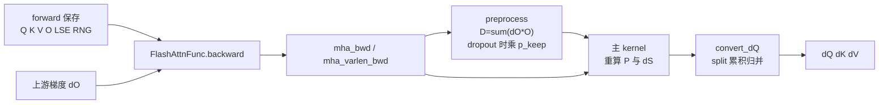

# Backward

> 这组笔记回答一个训练侧问题：FlashAttention forward 不保存完整 attention matrix，backward 还能怎样得到正确的 `dQ/dK/dV`？

## 读者任务

读完本专题，你应该能处理三类问题：

| 任务 | 读完能做什么 |
|------|--------------|
| 读训练反向 | 复述 `dO + Q/K/V/O/LSE/RNG -> dQ/dK/dV` 的生命周期 |
| 排查梯度问题 | 从 LSE/mask/RNG 一致性、`D` 的 dropout 标尺、deterministic split、GQA sum、varlen layout 定位错误边界 |
| 改 backward kernel | 知道 Python autograd、C++ 参数装配、launch template、CUDA 主循环分别守住什么不变量 |

## 首次阅读路径

| 顺序 | 文件 | 读法 |
|------|------|------|
| 1 | [[FlashAttention-Backward-核心概念]] | 先建立“重算 `P`，不保存 `P`”的心理模型 |
| 2 | [[FlashAttention-Backward-源码走读]] | 沿一条 dense training backward 主线读源码 |
| 3 | [[FlashAttention-Backward-数据流]] | 对齐 dense、varlen、dropout、GQA 的数据形态 |
| 4 | [[FlashAttention-Backward-排障指南]] | 用症状表定位常见梯度、性能和 layout 问题 |
| 5 | [[FlashAttention-Backward-学习检查]] | 做最小 autograd 验证，确认理解能落到运行现象 |

如果你还没有读过 forward，先读 [[FlashAttention-FA2-Forward]]。Backward 的很多字段来自 forward 保存的 `out`、`softmax_lse` 和 RNG 状态。

## 源码范围

| 源码文件 | 在 backward 中的角色 |
|----------|----------------------|
| `flash_attn/flash_attn_interface.py` | `FlashAttnFunc.forward/backward` 保存上下文并调用 backward custom op |
| `csrc/flash_attn/flash_api.cpp` | `mha_bwd` / `mha_varlen_bwd` 做检查、buffer 分配、`Flash_bwd_params` 装配 |
| `csrc/flash_attn/src/flash.h` | `Flash_bwd_params` 定义反向 kernel 能看到的全部指针与 stride |
| `csrc/flash_attn/src/flash_bwd_preprocess_kernel.h` | 计算 `D`；dropout 时乘 keep probability，并清理非 deterministic 的共享 `dQaccum` 区域 |
| `csrc/flash_attn/src/flash_bwd_launch_template.h` | 启动 preprocess、主 backward、`convert_dQ` 三段 kernel |
| `csrc/flash_attn/src/flash_bwd_kernel.h` | 重算 scores/probability，形成 `dS`，累积 `dQ/dK/dV` |

## 主线图

核心判断是：Backward 不是把 forward 简单反过来跑，而是用 forward 留下的紧凑状态在 tile 内重建同一个 softmax 结果，再把反向公式映射成几组 tiled GEMM。这里有三本不能混的缩放账：preprocess 让 `D` 与未乘 `1/p` 的 `dP` 对齐；主 kernel 形成未最终缩放的 `dS`；`dQ/dK` 写出时接管 `softmax_scale / p_keep`，`dV` 只接管 `1 / p_keep`。

`deterministic=True` 也不是单纯换一个布尔分支：它为 sequence-K 并行块分配彼此隔离的 `dQaccum` split，最后按固定 split 顺序归并；默认路径则在共享累积区执行 atomic add。理解这个所有权变化，比记住“确定性更慢”更重要。

## 继续读

- 想补数学不变量：读 [[FlashAttention-Online-Softmax]]。
- 想对比推理路径：读 [[FlashAttention-KV-Cache]]，注意 KV cache API 明确不是 autograd backward。
- 想看新架构后端：读 [[FlashAttention-Hopper与CuTe]]。
