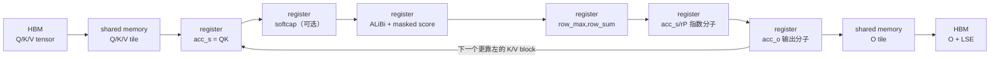

# FA2-Forward · 数据流

> 本页以基线 `002cce0` 的 FA2 CUDA 为准，不重复调用栈，而是追踪数据形态：同一份 Q/K/V 在 HBM、shared memory、寄存器、输出 HBM 中分别长什么样，以及 standard 与 SplitKV 在哪里分叉。

## 你为什么要读

FA2 forward 的对象会从 PyTorch tensor 变成 C++ 参数、模板常量和 CTA 内 fragment。本文专门追踪这些形态变化，说明 shape、stride、mask 和 head dim 在哪里被固化；这样遇到 dispatch 错误或 kernel 数值问题时，能先找到参数第一次变形的边界。

## 一张图看数据流



循环箭头表示同一个 query block 会不断扫描新的 K/V block。`acc_o` 不会在每个 K/V block 后写回 HBM，而是留在寄存器里持续累积。

## 生命周期表

| 数据 | 形态 | 位置 | 生命周期 |
|------|------|------|----------|
| 原始 Q | `(B,Sq,H,D)` tensor | HBM | 整个调用 |
| 原始 K/V | `(B,Sk,Hk,D)` tensor | HBM | 整个调用 |
| Q tile | `kBlockM x kHeadDim` | shared memory / register | 当前 CTA |
| K/V tile | `kBlockN x kHeadDim` | shared memory | 当前 K/V block |
| `acc_s` | 先是 score，online softmax 后原地变成指数分子 | register | 当前 Q block x 当前 K block |
| `rP` | `acc_s` 的 fp16/bf16 指数分子副本；可被 dropout 改写 | register | 当前 Q block x 当前 K block |
| `row_max/row_sum` | 每行 softmax 状态 | register | 当前 Q block 扫完所有 K block |
| `acc_o` | 尚未除最终 `row_sum` 的 output numerator | register | 当前 Q block 扫完所有 K block |
| `O` tile | `kBlockM x kHeadDim` | shared memory -> HBM | epilogue |
| `LSE` | 每个 query row 一个 fp32 | HBM | forward 结束后保留 |

表格依据：

- 原始 Q/K/V 指针与 stride：来源：csrc/flash_attn/src/flash.h L21-L44
- Q/K/V shared memory layout：来源：csrc/flash_attn/src/kernel_traits.h L79-L109
- Q tile 进入 kernel：来源：csrc/flash_attn/src/flash_fwd_kernel.h L250-L288
- K/V tile 加载：来源：csrc/flash_attn/src/flash_fwd_kernel.h L267-L317
- score tile 与 mask 前后状态：来源：csrc/flash_attn/src/flash_fwd_kernel.h L301-L330
- online softmax 状态：来源：csrc/flash_attn/src/softmax.h L128-L189
- `acc_o` 累积：来源：csrc/flash_attn/src/flash_fwd_kernel.h L283-L367
- O/LSE 写回：来源：csrc/flash_attn/src/flash_fwd_kernel.h L431-L494
- LSE 行写入：来源：csrc/flash_attn/src/flash_fwd_kernel.h L433-L477

## Q/K/V 的第一次变形：tensor 到 tile

在 tensor 进入 C++ 前，公开 Python autograd wrapper 可能先把原始 head dim pad 到 8 的倍数；C++ 参数中的 `d` 因而是 pad 后的逻辑计算维度，最终 `out[..., :head_size_og]` 才恢复 API 形状。launch 的模板 `kHeadDim` 还可能是覆盖 `d` 的更大 specialization（例如实际 `d` 与模板维度不相等时走 non-even-K 路径）。因此至少要分清三本账：用户原始 D、`params.d`、模板 `kHeadDim`。

C++ 入口保存的是 tensor 指针和 stride；kernel traits 定义的是 tile layout。`Flash_fwd_kernel_traits` 用 `SmemLayoutQ`、`SmemLayoutKV` 和 `GmemTiledCopyQKV` 描述 Q/K/V 如何从 HBM 搬到 shared memory。来源：csrc/flash_attn/src/kernel_traits.h L79-L137

在 `compute_attn` 开始阶段，kernel 将 Q tile 和 K tile 异步 copy 到 shared memory；如果 traits 要求 Q in registers，还会把 Q 从 shared memory copy 到寄存器视图。来源：csrc/flash_attn/src/flash_fwd_kernel.h L250-L281

这一步之后，读者要把 Q/K/V 从“完整 tensor”切换成“当前 CTA 看到的 tile”。

## Score tile 的生命周期很短

`acc_s` 起初是当前 Q tile 与当前 K tile 的 `QK^T` 结果。源码每轮都会创建并清零它，做 GEMM，先应用 softcap，再由 `Mask` 处理 ALiBi、越界、causal/local，然后进入 online softmax。standard kernel 从当前可见 K 范围的最右侧 block 向左扫描，因此最先遇到的往往是必须 mask 的边界 block。来源：csrc/flash_attn/src/flash_fwd_kernel.h L267-L344

`softmax_rescale_o` 会把 `acc_s` 原地改写为 `exp(score - 当前全局 row_max)`，它仍未除最终 `row_sum`。随后 `acc_s` 被转成 `rP`，立即用于权重乘 V；若启用 dropout，只改写这个送入 GEMM 的副本。`acc_s/rP` 都不会长期保存，也不会作为完整 attention matrix 写回。来源：csrc/flash_attn/src/flash_fwd_kernel.h L341-L367；来源：csrc/flash_attn/src/softmax.h L136-L167

## `row_max/row_sum` 是跨 block 的连接器

如果只看一个 K/V block，softmax 很简单；难点在于一个 query row 的 softmax 跨越所有 K blocks。`Softmax` 通过 `row_max` 和 `row_sum` 保存“已经扫过的 K/V blocks”的归一化状态。后续 block 到来时，源码先比较新旧 row max，再重缩放旧 `row_sum` 和旧 `acc_o`。来源：csrc/flash_attn/src/softmax.h L136-L167

最后 `normalize_softmax_lse` 计算 LSE，并把 `acc_o` 除以最终 row sum；dropout 路径还乘 `1 / p_keep`。整行无有效 key 时，non-split 与 split 局部分别使用 `+inf`、`-inf` LSE 哨兵。来源：csrc/flash_attn/src/softmax.h L169-L189

这就是为什么 `LSE` 可以替代完整概率矩阵成为 backward 的关键状态。

## Mask 发生在 score tile 内

`Mask::apply_mask` 把几类逻辑折到同一个 tile 修改步骤里：普通越界、causal、local window、ALiBi、非整齐 M/N 边界。普通越界按列号超过 `max_seqlen_k` 写 `-INFINITY`；causal 等价于左窗口无限、右窗口为 0 的 local mask，并按 `seqlen_k - seqlen_q` 做 bottom-right 对齐；local window 同时限制左右边界。softcap 不属于 `Mask`，它已经在前一步独立完成。来源：csrc/flash_attn/src/mask.h L14-L205；来源：csrc/flash_attn/src/flash_fwd_kernel.h L319-L330

因此 local attention、causal、ALiBi 不是“算完 attention 以后再处理”的后处理。它们会改变每个 score tile 在 softmax 前的数值。

## Standard 主数值输出在 epilogue 写回

主循环完成后，epilogue 才把 `acc_o` 做最终归一化、转成 fp16/bf16，并借助 shared memory 的 O tile 写回 global memory。LSE 则按 row 写入 `softmax_lse`。可选 `p/S_dmask` 是测试旁路，会在 tile 循环中写出，不能拿它反驳“主数值 O/LSE 在 epilogue 收口”。来源：csrc/flash_attn/src/flash_fwd_kernel.h L341-L367；来源：csrc/flash_attn/src/flash_fwd_kernel.h L431-L494

最终状态：

| 输出 | 位置 | 为什么保留 |
|------|------|------------|
| `out` | HBM | attention 的真正输出。 |
| `softmax_lse` | HBM | backward 和测试需要的归一化因子。 |
| `p/S_dmask` | HBM，可选 | 只在 dropout 测试路径中观测；缩放不保证等于最终概率，符号位还编码 keep/drop。 |

## Standard 与 SplitKV 的数据流分叉

fixed-length API 在 `set_params_fprop` 后还会运行 SplitKV heuristic：

```text
num_splits <= 1 && !force_split_kernel
  -> standard kernel
  -> acc_o / LSE 直接写最终 out / softmax_lse

force_split_kernel && num_splits == 1
  -> block-size aligned split kernel
  -> 追求与 standard bitwise identical，不 launch combine

num_splits > 1
  -> 多个 split kernel
  -> fp32 out_accum / softmax_lse_accum 写回 HBM
  -> combine kernel 按局部 LSE 权重合并成最终 O / LSE
```

所以“主路径不写完整 P”仍成立，但“只写一次 O/LSE”只适用于 standard 或单 aligned split。多 SplitKV 为了增加 K 维并行度，会引入 partial O/LSE 的额外 HBM 中间状态；它仍然没有 materialize 完整 attention matrix，而且不支持 dropout。

## 与上层 serving 的关系

SGLang/vLLM 这类 serving 系统把 prefill 或 decode 的 attention 需求交给 backend。FA2 forward 解释了 backend 为什么把 IO 当作一等设计约束：它刻意避免让完整 score/概率矩阵在 HBM 中物化和往返。实际瓶颈仍取决于硬件、shape、dtype 与 workload，不能只凭“长 prompt”下结论。

这也是从 FA2 forward 过渡到 [[FlashAttention-KV-Cache]] 的理由：decode 场景会把 K/V 变成 cache，问题从“怎么不保存完整 P”继续推进到“怎么高效读取历史 KV”。
