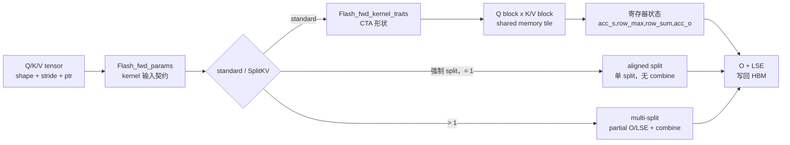

# FA2-Forward · 核心概念

> 本页以基线 `002cce0` 的 FA2 CUDA 为准，先建立四个模型：参数包、traits、online softmax 状态、dispatch 矩阵。后面的源码走读都围绕这四个模型展开；FA3/FA4 的 warp-specialized 组织不在本页范围内。

## 读者任务

读完本页，你应该能做到：

1. 把 `Flash_fwd_params` 解释成 kernel 的输入契约，而不是普通配置对象。
2. 把 `kBlockM/kBlockN/kHeadDim/kNWarps` 解释成一个 CTA 的工作形状。
3. 把 `row_max/row_sum/acc_o` 解释成分块 softmax 合并状态，并说明 `acc_s/rP` 为什么还不是最终概率。
4. 把 `HEADDIM_SWITCH`、`BOOL_SWITCH`、`DROPOUT_SWITCH` 解释成运行时到编译期的桥。
5. 区分 fixed-length API、standard kernel 与 SplitKV kernel，不把它们误认为同一层概念。

## 一个 query block 的心理模型

这条线里最容易漏掉的是：FA2 forward 的核心状态不在 Python，不在 C++ tensor，也不在完整 attention matrix，而在每个 CTA 扫描 K/V block 时维护的寄存器片段里。

## 参数包是 kernel 的输入契约

`Qkv_params` 持有 Q/K/V 的裸指针、batch/row/head stride、Q heads、K/V heads 和 `h_h_k_ratio`；`Flash_fwd_params` 再加输出指针、`p_ptr`、`softmax_lse_ptr`、维度、rounded 维度、scale、`cu_seqlens_*`、dropout、window、随机状态和 causal 标志。来源：csrc/flash_attn/src/flash.h L21-L130

这意味着 CUDA kernel 不再理解 PyTorch tensor。它只知道：

| 信息 | 在 kernel 中解决什么问题 |
|------|--------------------------|
| `q_ptr/k_ptr/v_ptr/o_ptr` | 从哪里读 Q/K/V，最终往哪里写 O。 |
| batch/row/head stride | 如何从 `(batch, row, head, dim)` 算到线性地址。 |
| `h/h_k/h_h_k_ratio` | MHA、MQA、GQA 的 head 映射。 |
| `seqlen_q/seqlen_k/d` | tile 边界和输出形状。 |
| `scale_softmax/scale_softmax_log2` | 数学 scale 与 `exp2` 路径使用的换底 scale。 |
| `cu_seqlens_*` | 区分 dense fixed-length 与 varlen。 |
| `p_ptr/softmax_lse_ptr` | 前者只服务受限的 dropout 测试/调试输出，写出的不是普通最终概率矩阵；后者保存 backward 所需 LSE。 |
| `softcap/window_size_*/alibi_slopes_ptr` | 决定 score 在进入 online softmax 前如何被压缩、偏置和 mask。 |
| `num_splits/oaccum_ptr/softmax_lseaccum_ptr` | 决定 standard、aligned split 或多 split partial+combine 的写回协议。 |

`set_params_fprop` 把 tensor 的 `data_ptr()`、stride、shape、scale、dropout、window、causal 等全部写入参数包。fixed-length forward 传入的 `cu_seqlens_q/k` 是 `nullptr`，所以 kernel 走规则 batch stride。来源：csrc/flash_attn/flash_api.cpp L70-L159；来源：csrc/flash_attn/flash_api.cpp L452-L470

公开 `flash_attn_func` 还有一层容易被 C++ 入口遮住的适配：`FlashAttnFunc.forward` 会把非 8 倍数的原始 head dim pad 到 8 的倍数，C++ 因而可以坚持 `head_size % 8 == 0`；返回前再裁回原维度。这个 padding 只解决 C++ 对齐前提，不会绕过 `head_size <= 256`。

## Kernel traits 固化 CTA 形状

`Flash_fwd_kernel_traits` 把 head dim、query block、key block、warp 数、shared memory layout 和 global memory copy layout 变成编译期常量。源码里 `kBlockM` 是 query 行块大小，`kBlockN` 是每次扫描的 K/V 列块大小，`kHeadDim` 是 head dim specialization，`kNThreads = kNWarps * 32`。来源：csrc/flash_attn/src/kernel_traits.h L48-L119

这解释了为什么 FA2 不是一个“全形状通用 kernel”。head dim、dropout、causal、GPU 架构会改变 tile 选择。例如 head_dim=64 无 dropout 可以用 `128 x 128`，dropout 会改成 `128 x 64`；head_dim=256 还要看设备 shared memory 能力。来源：csrc/flash_attn/src/flash_fwd_launch_template.h L195-L325

## Online softmax 是数值状态机

每个 K/V block 都会生成一个局部 score tile `acc_s`。standard kernel 从当前可见 K 范围的最右侧 block 向左扫描，先处理需要 causal/local/尾部 mask 的边界块。如果直接对每个 block 单独 softmax，结果当然不对；FA2 的做法是让 `Softmax` 保存每行的 `row_max` 和 `row_sum`，当新 block 的最大值改变时，先重缩放旧的 `row_sum` 和 `acc_o`，再把新 block 融进去。来源：csrc/flash_attn/src/flash_fwd_kernel.h L267-L302；来源：csrc/flash_attn/src/softmax.h L128-L167

这里最重要的命名纠偏是：`softmax_rescale_o` 返回后，`acc_s` 已被原地改写为以当前全局行最大值为标尺的指数分子，`rP` 只是它的 fp16/bf16 副本；二者尚未除最终 `row_sum`。所以源码变量名里的 `P` 不能直接读成数学上已经归一化完成的概率矩阵。dropout 也只改写送入权重乘 V 的 `rP`，不会把 `row_sum` 改成 dropout 后分母。

epilogue 时，`normalize_softmax_lse` 才把 `row_sum` 做跨线程规约，计算 `lse = row_max * scale + log(row_sum)`，并用 `1 / row_sum` 归一化 `acc_o`；dropout 路径还乘 `rp_dropout = 1 / p_keep`。若整行没有有效 key，non-split LSE 使用 `+inf`，split 局部 LSE 使用 `-inf` 作为不同阶段的工程哨兵。来源：csrc/flash_attn/src/softmax.h L169-L189

所以 `softmax_lse` 不是可有可无的调试输出。它是 forward 对每行完整 softmax 归一化因子的压缩保存，给 backward 和测试使用。

## Dispatch 把运行时条件变成模板常量

入口 `run_mha_fwd` 先按 dtype、head dim、causal 和 SplitKV 选择大类。`num_splits <= 1 && !force_split_kernel` 时走 standard `run_mha_fwd_`，否则进入 SplitKV dispatch。关键是 fixed-length `mha_fwd` 自己也会先以 `num_splits=0` 调用 `set_params_splitkv`，让 heuristic 决定是否需要多个 split；所以“普通 Python API”不能作为“standard kernel”的充分证据。还要区分：强制 split 且 `num_splits == 1` 会走 block-size aligned kernel、不 launch combine；只有 `num_splits > 1` 才产生 partial O/LSE 并合并。来源：csrc/flash_attn/flash_api.cpp L243-L328；来源：csrc/flash_attn/flash_api.cpp L470-L477；来源：csrc/flash_attn/src/flash_fwd_launch_template.h L101-L191

`run_flash_fwd` 再计算 grid，并把 even shape、even K、local、return softmax、ALiBi、softcap 等条件通过 switch 宏转成模板常量，最后 launch `flash_fwd_kernel<...>`。softcap 在 QK GEMM 后、`Mask` 前独立执行；`Mask` 才负责 ALiBi、越界、causal 与 local。来源：csrc/flash_attn/src/flash_fwd_launch_template.h L54-L99；来源：csrc/flash_attn/src/flash_fwd_kernel.h L319-L330

这类宏不是为了炫技，而是为了让 kernel 内部少走动态分支。代价也很清楚：编译组合变多，源码文件和二进制体积都会膨胀。

## 源码阅读口诀

读 FA2 forward 时按这四问走：

1. 这个字段在 `Flash_fwd_params` 里是什么？
2. 这个形状在 `Flash_fwd_kernel_traits` 里是什么？
3. 这个运行时开关在哪个 switch 里变成模板常量？
4. 这个局部状态在 `compute_attn` 的哪个阶段更新？

能回答这四问，后面的源码就不会只是模板和宏的噪音。
