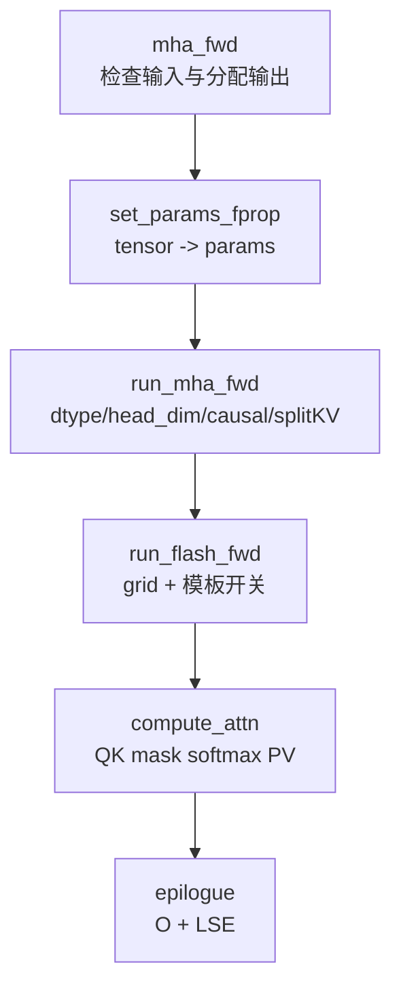

# FA2-Forward · 源码走读

> 本页只走 fixed-length forward 主路径：`mha_fwd -> set_params_fprop -> run_mha_fwd -> run_flash_fwd -> flash_fwd_kernel -> compute_attn -> epilogue`。varlen、KV cache、backward、FA3/FA4 不在这条线里展开。

## 长文读法

这篇按 FA2 fixed-length forward 的 C++/CUDA 主路径读：`mha_fwd` 先锁死 dtype、shape、head dim 和设备前提，输出策略只保留 `out` / `softmax_lse`，`set_params_fprop` 把 tensor 变成指针和 stride，dispatch 选择大类，launch 生成 grid 与模板实例，kernel 主循环完成 QK、mask、online softmax、PV，epilogue 写回。

| 你的任务 | 先读 | 抓住什么 |
|----------|------|----------|
| 建立 forward 主线 | 设计主线、1 到 3 | C++ 入口先检查并装配参数，kernel 不再处理高层 Tensor 语义 |
| 排查输出和可选 P | 2 | 常规路径写 `out` / `softmax_lse`，attention probs 只是测试辅助 |
| 排查参数装配 | 3 到 4 | tensor、stride、ALiBi、splitKV 等在参数阶段定边界 |
| 排查 dispatch / launch | 5 到 6 | 运行时开关在这里变成模板常量和 grid |
| 理解主循环和 IO | 7 到 8 | tile 内生成 `S/P`，立即消费成 `P @ V`，最后写 `O/LSE` |
| 做源码验证 | 9 | 用 grep 跟 `mha_fwd`、`set_params_fprop`、`run_mha_fwd`、`compute_attn` |

## 设计主线

FA2 forward 的设计可以压成一句话：在 C++ 入口把所有不适合 kernel 动态判断的事情提前确定；在 launch 处把运行时开关变成模板常量；在 kernel 里让一个 query block 扫描多个 K/V block，用 online softmax 累积输出，避免把完整 attention matrix 写回 HBM。



## 源码阅读依据

- C++ 入口检查：来源：csrc/flash_attn/flash_api.cpp L350-L405
- 输出与参数装配：来源：csrc/flash_attn/flash_api.cpp L420-L511
- 参数写入：来源：csrc/flash_attn/flash_api.cpp L70-L159
- 参数结构：来源：csrc/flash_attn/src/flash.h L21-L130
- splitKV 与 ALiBi 辅助参数：来源：csrc/flash_attn/flash_api.cpp L299-L348
- dispatch 大类选择：来源：csrc/flash_attn/flash_api.cpp L243-L255
- CUDA launch：来源：csrc/flash_attn/src/flash_fwd_launch_template.h L54-L99
- head-dim traits 选择：来源：csrc/flash_attn/src/flash_fwd_launch_template.h L195-L325
- kernel 主循环：来源：csrc/flash_attn/src/flash_fwd_kernel.h L250-L430
- online softmax：来源：csrc/flash_attn/src/softmax.h L128-L189
- mask：来源：csrc/flash_attn/src/mask.h L14-L205
- epilogue 写回：来源：csrc/flash_attn/src/flash_fwd_kernel.h L431-L494

## 1. `mha_fwd` 先锁死 kernel 前提

`mha_fwd` 不是简单 binding 函数。它先用 `CUDAGuard` 把当前 device 绑定到 Q 所在设备，然后检查 Ampere+、fp16/bf16、Q/K/V dtype 一致、CUDA device、最后一维 contiguous、batch 正数、head dim 不超过 256、head dim 是 8 的倍数、Q heads 能被 K/V heads 整除。来源：csrc/flash_attn/flash_api.cpp L350-L395

这些检查的意义是让后面 kernel 可以大胆假设：

| 检查 | 后续依赖 |
|------|----------|
| Ampere+ | launch template 与 kernel 宏只支持 sm80-sm90 路径。 |
| fp16/bf16 | dtype switch 只为半精度输入实例化。 |
| `stride(-1) == 1` | global memory copy 和 vectorized store 按连续 head dim 组织。 |
| `head_size <= 256` | head-dim helpers 只覆盖有限 specialization。 |
| `head_size % 8 == 0` | fixed-length C++ 入口要求对齐，Python 层会先 pad 原始非 8 倍数 head dim。 |
| `num_heads % num_heads_k == 0` | MQA/GQA 需要稳定的 `h_h_k_ratio` 映射。 |

同一段入口还会处理 softcap/dropout、window、causal 和 decode 小形状优化：softcap 暂不支持 dropout；window 超过 K 长度会折回无限窗口；`seqlen_q == 1` 且没有 ALiBi 时 causal 会被关闭；特定 GQA decode 场景会转置 Q 布局。来源：csrc/flash_attn/flash_api.cpp L397-L412

这里的阅读重点不是背错误消息，而是记住：能进入 kernel 的输入已经被 C++ 入口裁剪成少数可实例化组合。

## 2. 输出策略：常规路径只保留 `out` 和 `softmax_lse`

输入检查通过后，`mha_fwd` 要么校验用户传入的 `out_`，要么创建 `torch::empty_like(q)`。它总是创建 fp32 的 `softmax_lse`，形状是 `{batch_size, num_heads, seqlen_q}`。完整 `p` 只有在 `return_softmax` 且 dropout 打开时才分配，否则只是空 tensor。来源：csrc/flash_attn/flash_api.cpp L420-L450

这一段回答了“为什么 forward 不返回 attention matrix”：常规 forward 的持久输出只有 O 和 LSE。局部 score/probability tile 会在 kernel 内部短暂存在，但不会作为 `B x H x Sq x Sk` 的完整矩阵写回。

## 3. `set_params_fprop` 把 tensor 变成 kernel 参数

创建输出后，C++ 入口构造 `Flash_fwd_params params`，并调用 `set_params_fprop`。这个函数把 Q/K/V/O 的 data pointer、row/head/batch stride、heads、sequence length、rounded length、head dim、P 指针、LSE 指针、dropout、scale、window、softcap、causal 等写入参数包。来源：csrc/flash_attn/flash_api.cpp L70-L159；来源：csrc/flash_attn/flash_api.cpp L452-L470

fixed-length forward 的关键标志是：`cu_seqlens_q_d`、`cu_seqlens_k_d`、`seqused_k` 全部传 `nullptr`。这让 kernel 用规则 batch stride 定位每个样本。varlen 路径会在这里换成累计长度数组，所以不要把两条线混读。

参数包的结构在 `flash.h` 里：`Qkv_params` 提供 Q/K/V 指针与 stride，`Flash_fwd_params` 增加输出、LSE、维度、scale、window、dropout、RNG、causal 等字段。来源：csrc/flash_attn/src/flash.h L21-L130

## 4. 辅助路径也在参数装配期定边界

`set_params_splitkv` 会根据 K blocks、SM 数、batch/head/mblock 并行度决定 `num_splits`，并在需要 split 时分配 `softmax_lse_accum` 和 `out_accum`。它明确说明 SplitKV 不支持 dropout，并限制 `num_splits <= 128`。来源：csrc/flash_attn/flash_api.cpp L299-L328

`set_params_alibi` 则校验 ALiBi slopes 是 fp32、在 CUDA 上、最后一维 contiguous，shape 必须是 `{num_heads}` 或 `{batch_size, num_heads}`，然后把指针和 batch stride 写入 params。来源：csrc/flash_attn/flash_api.cpp L331-L348

这两个函数说明一个工程规律：FA2 尽量在 launch 前把“特性是否启用、额外指针在哪里、布局是否合法”定下来，让 kernel 主循环只消费已经整理好的参数。

## 5. `run_mha_fwd` 选择大类

`mha_fwd` 完成参数装配后，如果 `seqlen_k > 0`，就取当前 CUDA stream 并调用 `run_mha_fwd(params, stream)`；如果 K 为空，它不会 launch kernel，而是直接把 `out` 置零、`softmax_lse` 置为 infinity。来源：csrc/flash_attn/flash_api.cpp L497-L511

`run_mha_fwd` 的第一层 dispatch 按 dtype、head dim、causal 和 `num_splits` 选择普通 forward 或 SplitKV forward。fixed-length 普通路径满足 `num_splits <= 1 && !force_split_kernel`，会进入 `run_mha_fwd_<elem_type, kHeadDim, Is_causal>`。来源：csrc/flash_attn/flash_api.cpp L243-L255

这里读者要看的是分界：

```text
普通 forward: 一个 CTA 负责一个 query block，扫描 K/V blocks
SplitKV:      K/V 维度切成多个 split，先算 partial O/LSE，再 combine
```

本页后面继续走普通 forward。

## 6. `run_flash_fwd` 生成 grid 和模板实例

进入 launch template 后，`run_flash_fwd` 先计算 `num_m_block = ceil(seqlen_q / kBlockM)`，grid 设为 `(num_m_block, batch, heads)`。这就是“一个 CTA 负责一个 query block、一个 batch、一个 head”的直接证据。来源：csrc/flash_attn/src/flash_fwd_launch_template.h L54-L65

随后它判断：

| 条件 | 用途 |
|------|------|
| `is_even_MN` | Q/K sequence 是否刚好对齐 block，决定是否可走少边界检查路径。 |
| `is_even_K` | 实际 head dim 是否等于模板 head dim。 |
| `return_softmax` | 是否需要写测试用 `p`。 |
| local / ALiBi / softcap | 决定 score tile 需要哪些修正。 |
| dropout | 决定是否启用随机 mask 和不同 traits。 |

这些 bool 最终通过 switch 宏进入 `flash_fwd_kernel<Kernel_traits, ...>` 的模板参数。来源：csrc/flash_attn/src/flash_fwd_launch_template.h L63-L99

head dim helper 再决定具体 tile traits。例如 `run_mha_fwd_hdim64` 在无 dropout 时使用 `Flash_fwd_kernel_traits<64, 128, 128, 4, ...>`，dropout 时改用 `128 x 64`；`run_mha_fwd_hdim128` 会根据 GPU 架构、causal 和 dropout 在 `128 x 32`、`64 x 64`、`128 x 64` 之间选择；`hdim256` 还要检查设备 shared memory。来源：csrc/flash_attn/src/flash_fwd_launch_template.h L195-L325

所以看到大量 head_dim 文件时，不要逐个打开。先读这层 helper，理解 head dim 如何映射到 traits。

## 7. `compute_attn` 的主循环

`flash_fwd_kernel` 只是薄包装，真正的主循环在 `compute_attn`。CTA 开始时会把 Q tile、K tile 从 HBM 搬进 shared memory，必要时把 Q 搬进寄存器，清零 `acc_o`，并构造 `Softmax` 和 `Mask`。来源：csrc/flash_attn/src/flash_fwd_kernel.h L250-L288

每处理一个 K/V block，主循环按这个顺序推进：

| 顺序 | 局部对象 | 含义 |
|------|----------|------|
| 1 | `acc_s` | `Q @ K^T` 当前 score tile。 |
| 2 | `Mask` | 对越界、causal、local、ALiBi、softcap 等修正 score。 |
| 3 | `Softmax` | 用 `row_max/row_sum` 把当前 block 合入全行 softmax。 |
| 4 | `rP` | 将当前概率 tile 转回输入元素类型。 |
| 5 | `acc_o` | 执行 `P @ V`，把当前 block 的贡献累积到输出。 |

源码里先加载 V tile，做 QK GEMM，应用 softcap 和 mask，预取下一个 K tile，再调用 `softmax_rescale_o`，最后用 `gemm_rs` 完成 `P @ V`。第一段循环处理必须 mask 的尾部/causal/local block，第二段循环处理不需要复杂 masking 的 block。来源：csrc/flash_attn/src/flash_fwd_kernel.h L290-L430

`softmax_rescale_o` 的关键是后续 block 会用新旧 row max 的差值重缩放旧 `row_sum` 和旧 `acc_o`，因此分块扫描仍然能得到整行 softmax 的等价结果。来源：csrc/flash_attn/src/softmax.h L128-L167

mask 也不是单独后处理。`Mask::apply_mask` 在 score tile 上直接加 ALiBi 或写 `-INFINITY`，并处理 causal/local/非整齐边界。来源：csrc/flash_attn/src/mask.h L14-L205

## 8. Epilogue 写回 `O` 和 `LSE`

主循环结束后，epilogue 调 `normalize_softmax_lse`，得到每行 LSE，并把 `acc_o` 按 `row_sum` 归一化。随后 `acc_o` 从 fp32 accumulator 转回 fp16/bf16，先写到 shared memory 的输出 tile，再写回 global memory 的 `out`；LSE 写入 `softmax_lse`。来源：csrc/flash_attn/src/flash_fwd_kernel.h L431-L494

到这里，forward 的持久结果只有：

```text
out          B x Sq x H x D
softmax_lse B x H x Sq
p           测试/dropout路径才分配
rng_state   dropout/backward 对齐所需状态
```

这就是 FA2 forward 主线的终点。

## 9. 读完后怎么验证

在有 CUDA 环境时，可以用小 shape 比较 `flash_attn_func` 与 PyTorch `scaled_dot_product_attention` 的输出误差；上游 `test_flash_attn_output` 也是构造 Q/K/V，调用 FlashAttention，再用 reference attention 比较 forward、backward 和 dropout 误差。来源：tests/test_flash_attn.py L903-L1130

没有 CUDA 环境时，也能做静态验证：

1. 在 `flash_api.cpp` 里确认输入检查覆盖了你关心的失败条件。
2. 在 `flash_fwd_launch_template.h` 里确认该 head dim 会选哪个 traits。
3. 在 `flash_fwd_kernel.h` 里确认 score tile 是否经过 mask 和 `softmax_rescale_o`。
4. 在 epilogue 确认只写回 `out` 和 `softmax_lse`。
