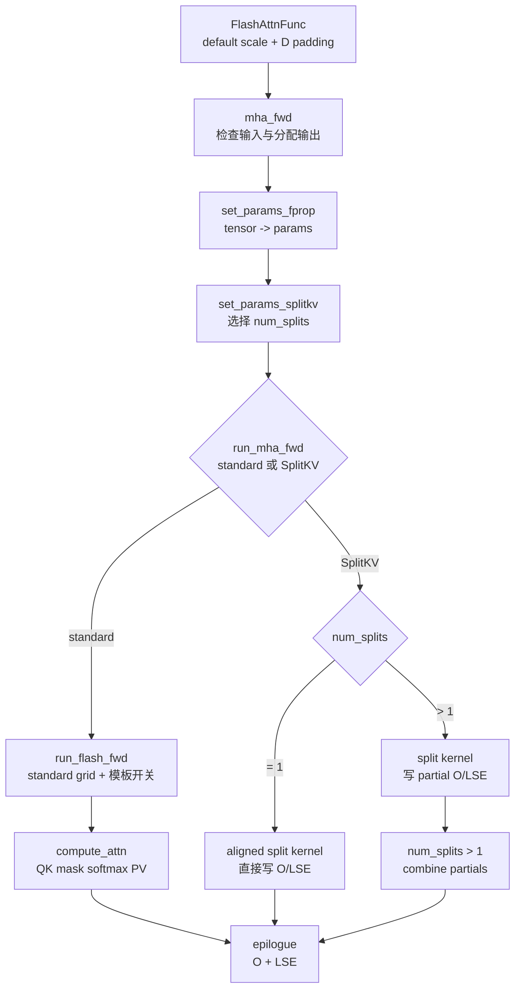

# FA2-Forward · 源码走读

> 本页以仓库基线 `002cce0` 的 FA2 CUDA 实现为准，沿 fixed-length API 进入 forward dispatch，再重点走 standard kernel：`FlashAttnFunc -> mha_fwd -> set_params_fprop / set_params_splitkv -> run_mha_fwd -> run_flash_fwd -> flash_fwd_kernel -> compute_attn -> epilogue`。varlen、KV cache、backward、FA3/FA4 不展开；SplitKV 只讲清分叉条件和代价。不要把这里的 CTA、tile 或流水组织外推成 FA3 的实现。

## 长文读法

这篇按 FA2 fixed-length forward 的 C++/CUDA 主路径读：Python wrapper 先处理默认 scale 与 head-dim padding；`mha_fwd` 锁死 dtype、shape、stride 和设备前提；参数阶段准备 `out` / `softmax_lse`、可选 `p` 与 RNG state，并决定是否需要 SplitKV；standard kernel 再完成 QK、mask、online softmax、PV 和 epilogue 写回。

| 你的任务 | 先读 | 抓住什么 |
|----------|------|----------|
| 建立 forward 主线 | 设计主线、1 到 3 | C++ 入口先检查并装配参数，kernel 不再处理高层 Tensor 语义 |
| 排查输出和可选 P | 2 | 常规路径写 `out` / `softmax_lse`，attention probs 只是测试辅助 |
| 排查参数装配 | 3 到 4 | tensor、stride、ALiBi、splitKV 等在参数阶段定边界 |
| 排查 dispatch / launch | 5 到 6 | 运行时开关在这里变成模板常量和 grid |
| 理解主循环和 IO | 7 到 8 | tile 内生成 score 与未归一化指数权重，立即消费到输出累加器，最后才归一化并写 `O/LSE` |
| 做源码验证 | 9 | 用 grep 跟 `mha_fwd`、`set_params_fprop`、`run_mha_fwd`、`compute_attn` |

## 设计主线

FA2 forward 的设计可以压成一句话：在 C++ 入口把所有不适合 kernel 动态判断的事情提前确定；在 launch 处把运行时开关变成模板常量；在 kernel 里让一个 query block 扫描多个 K/V block，用 online softmax 累积输出，避免把完整 attention matrix 写回 HBM。



## 源码阅读依据

- C++ 入口检查：来源：csrc/flash_attn/flash_api.cpp L350-L405
- 输出与参数装配：来源：csrc/flash_attn/flash_api.cpp L420-L511
- 参数写入：来源：csrc/flash_attn/flash_api.cpp L70-L159
- 参数结构：来源：csrc/flash_attn/src/flash.h L21-L130
- splitKV 与 ALiBi 辅助参数：来源：csrc/flash_attn/flash_api.cpp L299-L348
- dispatch 大类选择：来源：csrc/flash_attn/flash_api.cpp L243-L255
- CUDA launch 与 SplitKV 分界：来源：csrc/flash_attn/src/flash_fwd_launch_template.h L54-L191
- head-dim traits 选择：来源：csrc/flash_attn/src/flash_fwd_launch_template.h L195-L325
- kernel 主循环：来源：csrc/flash_attn/src/flash_fwd_kernel.h L250-L430
- online softmax：来源：csrc/flash_attn/src/softmax.h L128-L189
- mask：来源：csrc/flash_attn/src/mask.h L14-L205
- epilogue 写回：来源：csrc/flash_attn/src/flash_fwd_kernel.h L431-L494

## 1. `mha_fwd` 先锁死 kernel 前提

在 C++ 检查之前，公开 Python API 已经处理原始 head dim 的非 8 对齐：

```python
# 来源：flash_attn/flash_attn_interface.py L845-L867
        is_grad = is_grad_enabled and any(
            x.requires_grad for x in [q, k, v]
        )
        if softmax_scale is None:
            softmax_scale = q.shape[-1] ** (-0.5)
        head_size_og = q.size(3)
        if head_size_og % 8 != 0:
            q = torch.nn.functional.pad(q, [0, 8 - head_size_og % 8])
            k = torch.nn.functional.pad(k, [0, 8 - head_size_og % 8])
            v = torch.nn.functional.pad(v, [0, 8 - head_size_og % 8])
        out_padded, softmax_lse, S_dmask, rng_state = _wrapped_flash_attn_forward(
            q,
            k,
            v,
            dropout_p,
            softmax_scale,
            causal=causal,
            window_size_left=window_size[0],
            window_size_right=window_size[1],
            softcap=softcap,
            alibi_slopes=alibi_slopes,
            return_softmax=return_softmax and dropout_p > 0,
        )
```

这张证据卡只证明“公开 Python 路径会 pad”；直接调用底层 custom op / C++ binding 时，调用者仍必须满足 C++ 对齐检查。

`mha_fwd` 不是简单 binding 函数。它先用 `CUDAGuard` 把当前 device 绑定到 Q 所在设备，然后检查 Ampere+、fp16/bf16、Q/K/V dtype 一致、CUDA device、最后一维 contiguous、batch 正数、head dim 不超过 256、head dim 是 8 的倍数、Q heads 能被 K/V heads 整除。来源：csrc/flash_attn/flash_api.cpp L350-L395

这些检查的意义是让后面 kernel 可以大胆假设：

| 检查 | 后续依赖 |
|------|----------|
| Ampere+ | launch template 与 kernel 宏只支持 sm80-sm90 路径。 |
| fp16/bf16 | dtype switch 只为半精度输入实例化。 |
| `stride(-1) == 1` | global memory copy 和 vectorized store 按连续 head dim 组织。 |
| `head_size <= 256` | head-dim helpers 只覆盖有限 specialization。 |
| `head_size % 8 == 0` | fixed-length C++ 入口要求对齐，Python 层会先 pad 原始非 8 倍数 head dim。 |
| `num_heads % num_heads_k == 0` | MQA/GQA 需要稳定的 `h_h_k_ratio` 映射。 |

同一段入口还会处理 softcap/dropout、window、causal 和 decode 小形状优化：softcap 暂不支持 dropout；window 超过 K 长度会折回无限窗口；`seqlen_q == 1` 且没有 ALiBi 时 causal 会被关闭；特定 GQA decode 场景会转置 Q 布局。来源：csrc/flash_attn/flash_api.cpp L397-L412

这里的阅读重点不是背错误消息，而是记住：能进入 kernel 的输入已经被 C++ 入口裁剪成少数可实例化组合。

## 2. 输出策略：主数值结果是 `out` 和 `softmax_lse`

输入检查通过后，`mha_fwd` 要么校验用户传入的 `out_`，要么创建 `torch::empty_like(q)`。它总是创建 fp32 的 `softmax_lse`，形状是 `{batch_size, num_heads, seqlen_q}`。完整 `p` 只有在 `return_softmax` 且 dropout 打开时才分配，否则只是空 tensor。来源：csrc/flash_attn/flash_api.cpp L420-L450

这一段回答了“为什么 forward 不返回 attention matrix”：主数值结果是 O 和 LSE，`p` 只在受限测试/dropout 路径分配；binding 还总会返回一个两元素 `rng_state` tensor，以便 dropout backward 对齐。kernel 内部短暂存在的是 score tile，以及以当前全局行最大值为标尺的未归一化指数权重 tile；它们不会作为 `B x H x Sq x Sk` 的完整概率矩阵写回。若 heuristic 选择多 split，还会暂存 partial O/LSE，再由 combine kernel 合并。

## 3. `set_params_fprop` 把 tensor 变成 kernel 参数

创建输出后，C++ 入口构造 `Flash_fwd_params params`，并调用 `set_params_fprop`。这个函数把 Q/K/V/O 的 data pointer、row/head/batch stride、heads、sequence length、rounded length、head dim、P 指针、LSE 指针、dropout、scale、window、softcap、causal 等写入参数包。来源：csrc/flash_attn/flash_api.cpp L70-L159；来源：csrc/flash_attn/flash_api.cpp L452-L470

fixed-length forward 的关键标志是：`cu_seqlens_q_d`、`cu_seqlens_k_d`、`seqused_k` 全部传 `nullptr`。这让 kernel 用规则 batch stride 定位每个样本。varlen 路径会在这里换成累计长度数组，所以不要把两条线混读。

参数包的结构在 `flash.h` 里：`Qkv_params` 提供 Q/K/V 指针与 stride，`Flash_fwd_params` 增加输出、LSE、维度、scale、window、dropout、RNG、causal 等字段。来源：csrc/flash_attn/src/flash.h L21-L130

## 4. 辅助路径也在参数装配期定边界

`set_params_splitkv` 会根据 K blocks、SM 数、batch/head/mblock 并行度决定 `num_splits`，并在需要 split 时分配 `softmax_lse_accum` 和 `out_accum`。它明确说明 SplitKV 不支持 dropout，并限制 `num_splits <= 128`。更重要的是，fixed-length `mha_fwd` 也会调用它：

```cpp
// 来源：csrc/flash_attn/flash_api.cpp L470-L480
                     );

    // Keep references to these tensors to extend their lifetime
    at::Tensor softmax_lse_accum, out_accum;
    std::tie(softmax_lse_accum, out_accum) = set_params_splitkv(
        params, batch_size, num_heads, head_size, seqlen_k, seqlen_q,
        head_size_rounded, p_dropout, /*num_splits*/ 0, get_num_sm(get_current_device()), opts);

    // number of times random will be generated per thread, to offset philox counter in thc random
    // state
    // We use a custom RNG that increases the offset by batch_size * nheads * 32.
```

因此本篇后半段的 standard kernel 是 dispatch 的一条结果，不是 fixed-length API 的无条件同义词。这里还要把三个容易混在一起的状态拆开：

| 状态 | launch 与结果 |
|------|---------------|
| standard | grid 为 `(m_block, batch, head)`，一个 CTA 扫完自己负责的 K/V blocks。 |
| 强制 split kernel 且 `num_splits == 1` | 进入 `run_mha_fwd_splitkv_align`，把 `kBlockN` 对齐 standard kernel，以追求两条 kernel 路径 bitwise identical；不需要 combine。 |
| `num_splits > 1` | grid 把 split 编进 y/z 维，各 split 先写 partial O/LSE，随后 launch combine kernel。 |

源码还把 SplitKV 的 dropout 能力直接关掉，所以不能把 standard kernel 的 dropout 路径套到 SplitKV 上。来源：csrc/flash_attn/flash_api.cpp L299-L329；来源：csrc/flash_attn/src/flash_fwd_launch_template.h L101-L191

`set_params_alibi` 则校验 ALiBi slopes 是 fp32、在 CUDA 上、最后一维 contiguous，shape 必须是 `{num_heads}` 或 `{batch_size, num_heads}`，然后把指针和 batch stride 写入 params。来源：csrc/flash_attn/flash_api.cpp L331-L348

这两个函数说明一个工程规律：FA2 尽量在 launch 前把“特性是否启用、额外指针在哪里、布局是否合法”定下来，让 kernel 主循环只消费已经整理好的参数。

## 5. `run_mha_fwd` 选择大类

`mha_fwd` 完成参数装配后，如果 `seqlen_k > 0`，就取当前 CUDA stream 并调用 `run_mha_fwd(params, stream)`；如果 K 为空，它不会 launch kernel，而是直接把 `out` 置零、`softmax_lse` 置为 infinity。来源：csrc/flash_attn/flash_api.cpp L497-L511

`run_mha_fwd` 的第一层 dispatch 按 dtype、head dim、causal、`num_splits` 和 `force_split_kernel` 选择 standard 或 SplitKV。注意条件是 `num_splits <= 1 && !force_split_kernel`：正常 fixed-length heuristic 得到 1 时仍走 standard；显式强制 split kernel 时，`num_splits == 1` 才会进入上面的 aligned split 专用路径。来源：csrc/flash_attn/flash_api.cpp L243-L255

```cpp
// 来源：csrc/flash_attn/flash_api.cpp L243-L255
void run_mha_fwd(Flash_fwd_params &params, cudaStream_t stream, bool force_split_kernel=false) {
    FP16_SWITCH(!params.is_bf16, [&] {
        HEADDIM_SWITCH(params.d, [&] {
            BOOL_SWITCH(params.is_causal, Is_causal, [&] {
                if (params.num_splits <= 1 && !force_split_kernel) {  // If we don't set it num_splits == 0
                    run_mha_fwd_<elem_type, kHeadDim, Is_causal>(params, stream);
                } else {
                    run_mha_fwd_splitkv_dispatch<elem_type, kHeadDim, Is_causal>(params, stream);
                }
            });
        });
    });
}
```

这里读者要看的是分界：

```text
普通 forward: 一个 CTA 负责一个 query block，扫描 K/V blocks
SplitKV(>1):  K/V 维度切成多个 split，先算 partial O/LSE，再 combine
SplitKV(=1):  专用 aligned kernel；没有多个 partial，也不 launch combine
```

本页后面继续走普通 forward。

## 6. `run_flash_fwd` 生成 grid 和模板实例

进入 launch template 后，`run_flash_fwd` 先计算 `num_m_block = ceil(seqlen_q / kBlockM)`，grid 设为 `(num_m_block, batch, heads)`。这就是“一个 CTA 负责一个 query block、一个 batch、一个 head”的直接证据。来源：csrc/flash_attn/src/flash_fwd_launch_template.h L54-L65

```cpp
// 来源：csrc/flash_attn/src/flash_fwd_launch_template.h L63-L69
    const int num_m_block = (params.seqlen_q + Kernel_traits::kBlockM - 1) / Kernel_traits::kBlockM;
    dim3 grid(num_m_block, params.b, params.h);
    const bool is_even_MN = params.cu_seqlens_q == nullptr && params.cu_seqlens_k == nullptr && params.seqlen_k % Kernel_traits::kBlockN == 0 && params.seqlen_q % Kernel_traits::kBlockM == 0;
    const bool is_even_K = params.d == Kernel_traits::kHeadDim;
    const bool return_softmax = params.p_ptr != nullptr;
    BOOL_SWITCH(is_even_MN, IsEvenMNConst, [&] {
        EVENK_SWITCH(is_even_K, IsEvenKConst, [&] {
```

随后它判断：

| 条件 | 用途 |
|------|------|
| `is_even_MN` | Q/K sequence 是否刚好对齐 block，决定是否可走少边界检查路径。 |
| `is_even_K` | 实际 head dim 是否等于模板 head dim。 |
| `return_softmax` | 是否需要写测试用 `p`。 |
| local / ALiBi | 决定 `Mask` 如何修正 score tile。 |
| softcap | 决定是否在 mask 之前对 score 独立执行 softcap。 |
| dropout | 决定是否启用随机 mask 和不同 traits。 |

这些 bool 最终通过 switch 宏进入 `flash_fwd_kernel<Kernel_traits, ...>` 的模板参数。模板实例还明确写成 `Is_dropout && !Is_softcap`，返回 softmax 的实例也限定为 `ReturnSoftmaxConst && Is_dropout && !Is_softcap`；这和 C++ 入口禁止 softcap 与 dropout 同时启用互相呼应。来源：csrc/flash_attn/src/flash_fwd_launch_template.h L63-L99

head dim helper 再决定具体 tile traits。例如 `run_mha_fwd_hdim64` 在无 dropout 时使用 `Flash_fwd_kernel_traits<64, 128, 128, 4, ...>`，dropout 时改用 `128 x 64`；`run_mha_fwd_hdim128` 会根据 GPU 架构、causal 和 dropout 在 `128 x 32`、`64 x 64`、`128 x 64` 之间选择；`hdim256` 还要检查设备 shared memory。来源：csrc/flash_attn/src/flash_fwd_launch_template.h L195-L325

所以看到大量 head_dim 文件时，不要逐个打开。先读这层 helper，理解 head dim 如何映射到 traits。

## 7. `compute_attn` 的主循环

`flash_fwd_kernel` 只是薄包装，真正的主循环在 `compute_attn`。CTA 开始时会把 Q tile、K tile 从 HBM 搬进 shared memory，必要时把 Q 搬进寄存器，清零 `acc_o`，并构造 `Softmax` 和 `Mask`。扫描不是从 K 的开头机械向后走：源码先令 `n_block = n_block_max - 1`，从当前 query block 可见范围的最右侧 K block 向左递减。这样最先处理的正是最容易碰到序列尾部、causal 或 local 边界的块。来源：csrc/flash_attn/src/flash_fwd_kernel.h L250-L302

每处理一个 K/V block，主循环按这个顺序推进：

| 顺序 | 局部对象 | 含义 |
|------|----------|------|
| 1 | `acc_s` | `Q @ K^T` 当前 score tile。 |
| 2 | `apply_softcap` | 若启用 softcap，先独立压缩 score；它不属于 `Mask`。 |
| 3 | `Mask` | 加 ALiBi，并把越界、causal 或 local 禁止位置写成 `-INFINITY`。 |
| 4 | `Softmax` | 更新全局 `row_max/row_sum`，重缩放旧 `acc_o`；此后 `acc_s` 保存未归一化指数分子。 |
| 5 | `rP` | 把 `acc_s` 的未归一化指数权重转回 fp16/bf16；dropout 可在这里改写它。 |
| 6 | `acc_o` | 用 `rP @ V` 累加尚未除以最终 `row_sum` 的输出分子。 |

源码里先加载 V tile，做 QK GEMM，依次应用 softcap 和 mask，预取左侧下一个 K tile，再调用 `softmax_rescale_o`，最后用 `gemm_rs` 完成权重乘 V。第一段循环处理必须 mask 的序列尾部、causal 或 local block，第二段循环继续向左处理不需要复杂 masking 的 block；第二段仍调用 `Mask`，但以 `Causal_mask=false` 的模板常量裁掉 causal 分支，并保留可能需要的 local/ALiBi 处理。来源：csrc/flash_attn/src/flash_fwd_kernel.h L290-L430

`softmax_rescale_o` 的关键是后续 block 会用新旧 row max 的差值重缩放旧 `row_sum` 和旧 `acc_o`，因此分块扫描仍然能得到整行 softmax 的等价结果。调用返回后，`acc_s` 已从 score 原地变成 `exp(score - 当前全局行最大值)`；它不是已经除过整行分母的最终概率。来源：csrc/flash_attn/src/softmax.h L128-L167

未归一化指数权重 tile 被生成后立即消费的代码证据是：

```cpp
// 来源：csrc/flash_attn/src/flash_fwd_kernel.h L341-L367
        // TODO: when we have key_padding_mask we'll need to Check_inf
        masking_step == 0
            ? softmax.template softmax_rescale_o</*Is_first=*/true,  /*Check_inf=*/Is_causal || Is_local>(acc_s, acc_o, params.scale_softmax_log2)
            : softmax.template softmax_rescale_o</*Is_first=*/false, /*Check_inf=*/Is_causal || Is_local>(acc_s, acc_o, params.scale_softmax_log2);

        // Convert acc_s from fp32 to fp16/bf16
        Tensor rP = FLASH_NAMESPACE::convert_type<Element>(acc_s);
        int block_row_idx = m_block * (kBlockM / 16) + tidx / 32;
        int block_col_idx = n_block * (kBlockN / 32);
        if (Return_softmax) {
            Tensor rP_drop = make_fragment_like(rP);
            cute::copy(rP, rP_drop);
            dropout.template apply_dropout</*encode_dropout_in_sign_bit=*/true>(
                rP_drop, block_row_idx, block_col_idx, kNWarps
            );
            cute::copy(rP_drop, tSgS);
            tSgS.data() = tSgS.data() + (-kBlockN);
        }
        if (Is_dropout) {
            dropout.apply_dropout(rP, block_row_idx, block_col_idx, kNWarps);
        }

        // Reshape rP from (MMA=4, MMA_M, MMA_N) to ((4, 2), MMA_M, MMA_N / 2)
        // if using m16n8k16 or (4, MMA_M, MMA_N) if using m16n8k8.
        Tensor tOrP = make_tensor(rP.data(), FLASH_NAMESPACE::convert_layout_acc_Aregs<typename Kernel_traits::TiledMma>(rP.layout()));
        // if (cute::thread0()) { print(tOrP); }
        FLASH_NAMESPACE::gemm_rs(acc_o, tOrP, tOrVt, tOsVt, tiled_mma, smem_tiled_copy_V, smem_thr_copy_V);
```

这张卡要连着 epilogue 读：`rP` 被立即送入 `gemm_rs`，但这里没有除最终 `row_sum`；最终归一化发生在主循环之后。若启用 dropout，dropout 只改写送入“权重乘 V”的 `rP`，softmax 的 `row_sum` 仍代表未 dropout 的分母，epilogue 再用 `rp_dropout = 1 / p_keep` 校正输出。

mask 也不是单独后处理。`Mask::apply_mask` 在 score tile 上直接加 ALiBi 或写 `-INFINITY`，并处理 causal/local/非整齐边界；softcap 则在调用 `Mask` 之前已经完成。causal 的右边界按 bottom-right 对齐，即相对位置包含 `seqlen_k - seqlen_q` 的偏移，不能用左上角三角矩阵想当然。来源：csrc/flash_attn/src/mask.h L14-L205

## 8. Epilogue 写回 `O` 和 `LSE`

主循环结束后，epilogue 调 `normalize_softmax_lse`，才得到每行 LSE，并把 `acc_o` 按最终 `row_sum` 归一化；dropout 路径还在这里乘 `rp_dropout`。随后 `acc_o` 从 fp32 accumulator 转回 fp16/bf16，先写到 shared memory 的输出 tile，再写回 global memory 的 `out`；LSE 写入 `softmax_lse`。来源：csrc/flash_attn/src/flash_fwd_kernel.h L431-L494

还有一个不经过 kernel 的边界：若 `seqlen_k == 0`，C++ 入口直接令 `out = 0`、`softmax_lse = +inf`。这个 `+inf` 是 fixed-length non-split API 的工程哨兵，不要从普通 softmax 数学式反推成 `-inf`。来源：csrc/flash_attn/flash_api.cpp L497-L504

到这里，standard kernel 直接写出的主数值状态是：

```text
out          B x Sq x H x D
softmax_lse B x H x Sq
p           测试/dropout路径才分配
rng_state   dropout/backward 对齐所需状态
```

这就是 FA2 forward 主线的终点。

## 9. 读完后怎么验证

先用下面的纯 PyTorch 脚本验证本篇最关键的算法判断：逆序分块 online softmax 的输出与一次性 full attention 等价，而且 causal 使用 bottom-right 对齐。它不需要 FlashAttention extension，因此也适合作为静态阅读后的最低运行门槛。

```python
import math
import torch

torch.manual_seed(0)
q = torch.randn(2, 3, 5, 16, dtype=torch.float64)  # B, H, Sq, D
k = torch.randn(2, 3, 7, 16, dtype=torch.float64)
v = torch.randn(2, 3, 7, 16, dtype=torch.float64)
scale = 1 / math.sqrt(q.shape[-1])

def allowed_mask(sq, sk, causal):
    row = torch.arange(sq)[:, None]
    col = torch.arange(sk)[None, :]
    return torch.ones(sq, sk, dtype=torch.bool) if not causal else col <= row + sk - sq

def full(q, k, v, causal):
    s = torch.einsum("bhqd,bhkd->bhqk", q, k) * scale
    s = s.masked_fill(~allowed_mask(q.shape[-2], k.shape[-2], causal), -torch.inf)
    return torch.softmax(s, dim=-1) @ v

def tiled_online(q, k, v, causal, block_n=3):
    m = torch.full(q.shape[:-1], -torch.inf, dtype=q.dtype)
    ell = torch.zeros_like(m)
    acc = torch.zeros_like(q)
    # 模拟 FA2：从最右侧 K block 向左扫描。
    for end in range(k.shape[-2], 0, -block_n):
        start = max(0, end - block_n)
        s = torch.einsum("bhqd,bhkd->bhqk", q, k[..., start:end, :]) * scale
        keep = allowed_mask(q.shape[-2], k.shape[-2], causal)[:, start:end]
        s = s.masked_fill(~keep, -torch.inf)
        block_m = s.amax(dim=-1)
        new_m = torch.maximum(m, block_m)
        # 最右侧 causal tile 可能整块被 mask；对应 FA2 的 Check_inf 兜底。
        alpha = torch.where(torch.isfinite(new_m), torch.exp(m - new_m), 1.0)
        p_num = torch.where(keep, torch.exp(s - new_m[..., None]), 0.0)
        ell = alpha * ell + p_num.sum(dim=-1)
        acc = alpha[..., None] * acc + p_num @ v[..., start:end, :]
        m = new_m
    return acc / ell[..., None]

for causal in (False, True):
    got = tiled_online(q, k, v, causal)
    ref = full(q, k, v, causal)
    print(f"causal={causal}: finite={torch.isfinite(got).all().item()}, "
          f"max_abs={(got - ref).abs().max().item():.3e}")
    torch.testing.assert_close(got, ref, rtol=1e-12, atol=1e-12)
```

预期：两种模式都打印 `finite=True`，`max_abs` 在 float64 舍入误差量级，并通过 `assert_close`。

在有可加载 CUDA extension 的环境时，再用小 shape 比较 `flash_attn_func` 与同一 reference 的输出；上游 `test_flash_attn_output` 也是构造 Q/K/V，调用 FlashAttention，再与 reference attention 比较 forward、backward 和 dropout 误差。来源：tests/test_flash_attn.py L903-L1130

若当前机器没有可加载的 CUDA extension，上面的纯 PyTorch 对照能验证算法模型，但不能冒充 GPU kernel 验收。还应继续做静态验证：

1. 在 `flash_api.cpp` 里确认输入检查覆盖了你关心的失败条件。
2. 在 `flash_fwd_launch_template.h` 里确认该 head dim 会选哪个 traits。
3. 在 `flash_fwd_kernel.h` 里确认 score tile 是否经过 mask 和 `softmax_rescale_o`。
4. 在 epilogue 确认最终除法、dropout 校正，以及 `out` / `softmax_lse` 写回。
5. 在 split launch 中确认 `num_splits == 1` 不走 combine，`num_splits > 1` 才写 partial 并合并。
