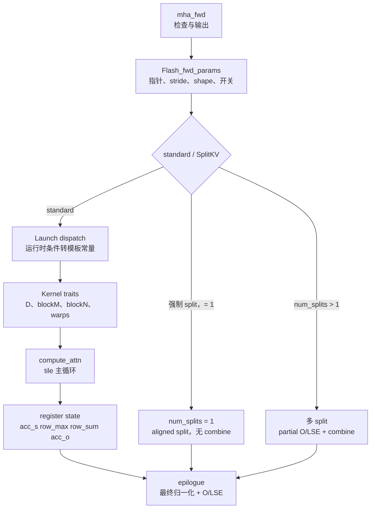

# FA2-Forward

> 这个专题以基线 `002cce0` 的 FA2 CUDA 为准，回答一个问题：fixed-length forward 如何把 `Q/K/V` 从 HBM 分块搬入片上存储，沿 `QK -> softcap（可选）-> mask/ALiBi -> online softmax -> 权重乘 V` 累积结果，常规数值路径最终只把 `O` 和 `LSE` 写回 HBM。

本专题的主走读对象是 standard forward kernel，但“fixed-length API”不等于“必走 standard kernel”。当前 `mha_fwd` 在参数装配后同样调用 `set_params_splitkv(..., num_splits=0, ...)`：heuristic 可能把短 Q、长 K/V、并行度不足的调用转到 SplitKV。读者应始终分清 API 形态、dispatch 选择和最终 kernel 三层边界；也不要把 FA2 的 CTA/tile 组织外推成 FA3。

## 为什么要读

如果你只想知道 Python 调用怎么进 kernel，先读 [[FlashAttention-前向全链路]]。如果你已经知道调用链，但还不清楚以下问题，就读本专题：

| 读者问题 | 本专题给出的能力 |
|----------|------------------|
| `mha_fwd` 里那么多检查到底保护什么？ | 能把 Python padding 与 C++ dtype、head dim、stride、GQA、softcap/dropout 约束对应到 kernel 前提。 |
| 为什么源码里到处是 `HEADDIM_SWITCH`、`BOOL_SWITCH`、`DROPOUT_SWITCH`？ | 能理解运行时参数如何被转成编译期模板实例。 |
| `flash_fwd_kernel` 内部到底在存什么？ | 能说清 score 如何原地变成未归一化指数权重，以及 `row_max`、`row_sum`、`acc_o` 的生命周期。 |
| 为什么代码里的 `rP` 还不是最终概率？ | 能指出最终除 `row_sum` 在 epilogue；dropout 只改送入权重乘 V 的副本。 |
| fixed-length 为什么仍可能出现 SplitKV？ | 能区分 standard、`num_splits == 1` aligned split 与多 split partial+combine。 |
| 性能或正确性出问题时先看哪里？ | 能按入口检查、参数包、dispatch、tile 主循环、epilogue 分层定位。 |

## 首次阅读路径

| 文件 | 读完应该会什么 |
| ------ | ---------------- |
| [[FlashAttention-FA2-Forward-核心概念]] | 建立 `Flash_fwd_params`、kernel traits、未归一化权重、online softmax 与 dispatch 的共同模型。 |
| [[FlashAttention-FA2-Forward-源码走读]] | 沿 `mha_fwd -> set_params_fprop -> run_mha_fwd -> run_flash_fwd -> compute_attn` 走完主路径。 |
| [[FlashAttention-FA2-Forward-数据流]] | 把每个局部对象放回 HBM、shared memory、register 的位置和生命周期。 |
| [[FlashAttention-FA2-Forward-排障指南]] | 用“症状 -> 源码入口 -> 验证”排查常见误解和异常。 |
| [[FlashAttention-FA2版本演进]] | 知道 FA2.0 到 FA2.7 的功能为什么会扩张 API 和 kernel 分支。 |
| [[FlashAttention-FA2-Forward-学习检查]] | 验收自己是否能独立复述主线并定位源码。 |

## 源码入口

| 源码文件 | 读法 |
|----------|------|
| `csrc/flash_attn/flash_api.cpp` | 从 `mha_fwd` 看入口检查、输出分配、参数装配、splitKV 和 ALiBi 参数。 |
| `csrc/flash_attn/src/flash.h` | 把 `Flash_fwd_params` 当作 Python/C++ 与 CUDA kernel 的输入契约。 |
| `csrc/flash_attn/src/kernel_traits.h` | 看 head dim、blockM、blockN、warp 数、shared memory layout 如何固化。 |
| `csrc/flash_attn/src/flash_fwd_launch_template.h` | 看 dtype/head_dim/causal/dropout/local/alibi/softcap 如何进入模板实例。 |
| `csrc/flash_attn/src/flash_fwd_kernel.h` | 看 K block 从右向左扫描、masking/unmasked 双循环、权重乘 V 与 epilogue。 |
| `csrc/flash_attn/src/softmax.h`、`csrc/flash_attn/src/mask.h` | 看 online softmax 如何维护全局行状态，以及 bottom-right causal/local/ALiBi 如何改 score；softcap 不在 `Mask` 内。 |
| `flash_attn/flash_attn_interface.py` | 看公开 API 如何补默认 scale、把非 8 倍数 head dim pad 后进入 C++，再裁回原维度。 |

## 主题地图

读这个专题时要一直追一个对象：一个 query row block。它在 C++ 入口只是 tensor 的 shape 和 pointer，在 standard launch 时变成 grid x 维的一个 `m_block`，在 kernel 里变成 shared memory 里的 Q tile 和寄存器里的 `acc_o`。它从当前可见 K 范围的右端向左扫描：边界复杂的 block 先走 masking loop，后续 block 走裁掉 causal 分支的循环；每次只生成未归一化指数权重并立即消费，直到 epilogue 才除最终分母并写回 `out`。

把全篇压成四条不变量：

1. `acc_s/rP` 是未归一化指数权重，不是已经除完整行分母的最终概率。
2. softcap 先于 `Mask` 独立执行；`Mask` 负责 ALiBi、越界、causal 与 local。
3. fixed-length 描述输入布局，不承诺一定走 standard kernel。
4. `seqlen_k == 0` 不 launch kernel：`O = 0`，non-split `LSE = +inf`。

## 下一步

读完 FA2 forward 后，再去 [[FlashAttention-KV-Cache]]。KV cache、paged KV、SplitKV、decode 场景会复用 FA2 的 online softmax 与 tiled IO 思想，但参数所有权、grid 和写回协议都已扩张，不能把它们当作本专题 standard kernel 的简单别名。
