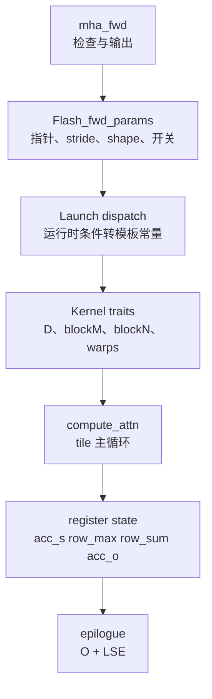

# FA2-Forward

> 这个专题回答一个问题：FA2 fixed-length forward 如何把 `Q/K/V` 从 HBM 读成 tile，在寄存器里完成 `QK -> mask -> online softmax -> PV`，最后只写回 `O` 和 `LSE`。

## 为什么要读

如果你只想知道 Python 调用怎么进 kernel，先读 [[FlashAttention-前向全链路]]。如果你已经知道调用链，但还不清楚以下问题，就读本专题：

| 读者问题 | 本专题给出的能力 |
|----------|------------------|
| `mha_fwd` 里那么多检查到底保护什么？ | 能把 dtype、head dim、stride、GQA、softcap/dropout 约束对应到 kernel 前提。 |
| 为什么源码里到处是 `HEADDIM_SWITCH`、`BOOL_SWITCH`、`DROPOUT_SWITCH`？ | 能理解运行时参数如何被转成编译期模板实例。 |
| `flash_fwd_kernel` 内部到底在存什么？ | 能说清 `acc_s`、`row_max`、`row_sum`、`acc_o` 的生命周期。 |
| 性能或正确性出问题时先看哪里？ | 能按入口检查、参数包、dispatch、tile 主循环、epilogue 分层定位。 |

## 首次阅读路径

| 文件 | 读完应该会什么 |
| ------ | ---------------- |
| [[FlashAttention-FA2-Forward-核心概念]] | 建立 `Flash_fwd_params`、kernel traits、online softmax、dispatch 的共同模型。 |
| [[FlashAttention-FA2-Forward-源码走读]] | 沿 `mha_fwd -> set_params_fprop -> run_mha_fwd -> run_flash_fwd -> compute_attn` 走完主路径。 |
| [[FlashAttention-FA2-Forward-数据流]] | 把每个局部对象放回 HBM、shared memory、register 的位置和生命周期。 |
| [[FlashAttention-FA2-Forward-排障指南]] | 用“症状 -> 源码入口 -> 验证”排查常见误解和异常。 |
| [[FlashAttention-FA2版本演进]] | 知道 FA2.0 到 FA2.7 的功能为什么会扩张 API 和 kernel 分支。 |
| [[FlashAttention-FA2-Forward-学习检查]] | 验收自己是否能独立复述主线并定位源码。 |

## 源码入口

| 源码文件 | 读法 |
|----------|------|
| `csrc/flash_attn/flash_api.cpp` | 从 `mha_fwd` 看入口检查、输出分配、参数装配、splitKV 和 ALiBi 参数。 |
| `csrc/flash_attn/src/flash.h` | 把 `Flash_fwd_params` 当作 Python/C++ 与 CUDA kernel 的输入契约。 |
| `csrc/flash_attn/src/kernel_traits.h` | 看 head dim、blockM、blockN、warp 数、shared memory layout 如何固化。 |
| `csrc/flash_attn/src/flash_fwd_launch_template.h` | 看 dtype/head_dim/causal/dropout/local/alibi/softcap 如何进入模板实例。 |
| `csrc/flash_attn/src/flash_fwd_kernel.h` | 看 tile 主循环和 epilogue。 |
| `csrc/flash_attn/src/softmax.h`、`csrc/flash_attn/src/mask.h` | 看 online softmax 与 mask 如何在 tile 内更新局部 score。 |

## 主题地图

读这个专题时要一直追一个对象：一个 query row block。它在 C++ 入口只是 tensor 的 shape 和 pointer，在 launch 时变成 grid x 维的一个 `m_block`，在 kernel 里变成 shared memory 里的 Q tile 和寄存器里的 `acc_o`，最后才重新变成 HBM 里的 `out` 行块。

## 下一步

读完 FA2 forward 后，再去 [[FlashAttention-KV-Cache]]。KV cache、paged KV、SplitKV、decode 场景会复用 FA2 的很多概念，但它们已经不再是这个 fixed-length forward 的朴素主线。
