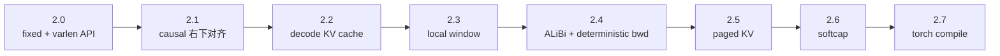

# FlashAttention FA2 版本演进

> 本页不按 changelog 背版本号，而是看 FA2 的能力边界如何扩张：从 fixed-length/varlen forward，到 decode KV cache，再到 local、ALiBi、paged KV、softcap 和 torch compile。

## 读者任务

读完本页，你应该能回答：

| 问题 | 应能定位到哪里 |
|------|----------------|
| FA2 为什么不只是 FA1 的更快 kernel？ | API 从 fixed-length、packed、varlen、KV cache 到 backward 全部收敛到 C++ extension。 |
| 为什么 fixed-length 和 varlen 是两套入口？ | fixed-length 使用规则 batch stride，varlen 使用 `cu_seqlens_q/k` 和 total token layout。 |
| 为什么 decode 不能只当成小 batch forward？ | `flash_attn_with_kvcache` 会原地更新 cache、处理 RoPE、paged KV、SplitKV。 |
| 新模型特性如何改变 kernel 边界？ | local、ALiBi、softcap、dropout、SplitKV 都会进入 C++ 参数和模板分支。 |

本页源码依据：

- C++ extension 函数表：来源：csrc/flash_attn/flash_api.cpp L1481-L1488
- fixed-length Python API：来源：flash_attn/flash_attn_interface.py L1156-L1229
- varlen Python API：来源：flash_attn/flash_attn_interface.py L1391-L1482
- KV cache Python API：来源：flash_attn/flash_attn_interface.py L1485-L1627
- SplitKV 与 ALiBi 参数：来源：csrc/flash_attn/flash_api.cpp L299-L348
- softcap、window、causal 入口归一化：来源：csrc/flash_attn/flash_api.cpp L397-L412

## 能力扩张地图



这条线的含义是：FA2 的核心 forward 主循环没有被每个版本推翻，但 API 边界、参数包字段、mask 语义和 dispatch 组合不断变多。读版本增量时，要问“这个能力会落到哪里”，而不是只记“哪个版本新增了什么”。

## 2.0：从 FA1 算法验证走向主包工程边界

README 把 2.0 描述为 complete rewrite，并把旧的 unpadded API 改名为 varlen；同一 batch 序列长度相同时，推荐使用 fixed-length 的 `flash_attn_func` 或 packed API。来源：README.md L405-L420

这对源码阅读的影响是：

| 增量 | 源码边界 |
|------|----------|
| fixed-length API | `flash_attn_func(q,k,v)` 走规则 batch stride。 |
| varlen API | `flash_attn_varlen_func` 接收 total token layout、`cu_seqlens_q/k`、`max_seqlen_q/k`。 |
| C++ extension | pybind 同时导出 `fwd/varlen_fwd/bwd/varlen_bwd/fwd_kvcache`。 |

所以 FA2 的“第二版”不是单一 kernel 名称，而是一个稳定的 attention backend 边界。

## 2.1：causal mask 语义改成右下对齐

README 说明当 `seqlen_q != seqlen_k` 且 `causal=True` 时，causal mask 改为右下对齐，并且全 mask 行输出为 0。来源：README.md L421-L448

Python API 文档也把这个语义写进 `flash_attn_func`：当 Q/K 长度不同，mask 的坐标要按 K 序列末尾对齐。来源：flash_attn/flash_attn_interface.py L1175-L1189

这件事对 decode 很关键。KV cache 场景里，新 query token 往往对应已有 K/V 序列尾部，如果按左上角直觉理解 causal mask，会把可见 token 范围读错。

## 2.2：decode KV cache 成为单独能力

README 把 2.2 的目标放在 iterative decoding：query 很短时，瓶颈变成快速读取 KV cache，并可能把 K/V 读取拆到多个 thread block，再用 combine kernel 合并。来源：README.md L450-L458

`flash_attn_with_kvcache` 的签名说明它不是普通 forward 的小 shape 版本。它接收 `k_cache/v_cache`、可选新 `k/v`、RoPE、`cache_seqlens`、`cache_batch_idx`、`cache_leftpad`、`block_table`、`num_splits`，并可原地更新 cache。来源：flash_attn/flash_attn_interface.py L1485-L1627

这就是为什么本专题只讲 fixed-length forward，decode 要放到 [[FlashAttention-KV-Cache]]：对象已经从“输入 K/V tensor”变成“历史 KV cache + 当前 token + cache metadata”。

## 2.3：local window 进入 mask 和 dispatch

README 说明 2.3 引入 sliding window / local attention。来源：README.md L463-L467

在 Python API 里，`window_size=(-1,-1)` 表示无限窗口；非默认值表示 query 只能看一个相对 K 序列位置的左右窗口。来源：flash_attn/flash_attn_interface.py L1187-L1202

C++ 入口会把过大的 window 归一化成无限窗口；如果是 causal，则把 `window_size_right` 设为 0。来源：csrc/flash_attn/flash_api.cpp L397-L404

local 不是后处理 mask。它会进入 launch template 的 `LOCAL_SWITCH`，并在 kernel 内改变 score tile 的有效列范围。来源：csrc/flash_attn/src/flash_fwd_launch_template.h L63-L99；来源：csrc/flash_attn/src/mask.h L111-L205

## 2.4：ALiBi 与 deterministic backward 进入训练栈需求

README 说明 2.4 引入 ALiBi 和 deterministic backward。来源：README.md L469-L473

ALiBi 在 fixed-length forward 里先由 `set_params_alibi` 校验 dtype、device、stride、shape，然后把 slope 指针和 batch stride 写入 params。来源：csrc/flash_attn/flash_api.cpp L331-L348

kernel mask 逻辑会在 score tile 上加 ALiBi bias，而不是在输出后再修正。来源：csrc/flash_attn/src/mask.h L111-L205

deterministic backward 不改变本页的 forward 主循环，但它改变训练可复现性需求：forward 保存的 `softmax_lse`、RNG state、输出等状态要能支撑 backward 路径重建。

## 2.5：paged KV 把 serving 内存管理推到 API 边界

README 说明 2.5 支持 paged KV cache。来源：README.md L475-L478

`flash_attn_with_kvcache` 的文档把 cache 形态分成两种：没有 `block_table` 时是 dense cache；有 `block_table` 时，`k_cache/v_cache` 形状按 physical page blocks 组织，并要求 page block size 满足约束。来源：flash_attn/flash_attn_interface.py L1548-L1569

这说明 paged KV 不是 kernel 内部偷偷优化一下地址计算，而是上层 serving runtime 与 attention backend 之间的协议变化。读 serving 对接时，要把 `block_table` 当作 cache 地址翻译表。

## 2.6：softcap 扩张 score 变换路径

README 说明 2.6 支持 softcapping attention，用于 Gemma-2、Grok 等模型。来源：README.md L480-L483

Python API 把 `softcap` 作为参数传入 fixed-length、varlen 和 KV cache 入口。来源：flash_attn/flash_attn_interface.py L1156-L1229；来源：flash_attn/flash_attn_interface.py L1391-L1482；来源：flash_attn/flash_attn_interface.py L1485-L1627

C++ fixed-length forward 当前显式禁止 `softcap > 0` 与 dropout 同时启用。来源：csrc/flash_attn/flash_api.cpp L397-L404

这类限制是读 backend 的重点：模型特性不是出现在 Python 参数里就一定能和所有训练开关组合。

## 2.7：torch compile 兼容影响 Python 边界

README 只简短记录 2.7 兼容 torch compile。来源：README.md L485-L485

在当前 Python 入口中，`_flash_attn_forward` 使用 PyTorch custom op wrapper，并注册 fake implementation；PyTorch 2.4 以后 `_wrapped_flash_attn_forward` 指向 `torch.ops.flash_attn._flash_attn_forward`。来源：flash_attn/flash_attn_interface.py L61-L150

这不改变 CUDA 主循环，但改变上层图编译能否理解这个算子的 shape、fake tensor 和 dispatcher 边界。

## 新特性矩阵

| 能力 | API 表达 | C++ / CUDA 落点 | 常见风险 |
|------|----------|-----------------|----------|
| fixed-length | `flash_attn_func` | `mha_fwd`、规则 batch stride | 把 varlen 的 `cu_seqlens` 思维混进 dense path |
| varlen | `flash_attn_varlen_func` | `varlen_fwd`、`cu_seqlens_q/k` | 累计长度错误导致跨样本污染 |
| causal 右下对齐 | `causal=True` 且 Q/K 长度不同 | mask 坐标 | decode 可见范围误判 |
| local | `window_size` | `LOCAL_SWITCH`、`Mask::apply_mask` | window 边界与 K/Q 长度关系读错 |
| ALiBi | `alibi_slopes` | `set_params_alibi`、mask score bias | slope shape/head 对齐错误 |
| KV cache | `flash_attn_with_kvcache` | `fwd_kvcache`、cache metadata | dense cache 与 paged cache 地址语义混用 |
| SplitKV | `num_splits` / heuristic | accum buffer + combine kernel | 额外 HBM 写回换并行度 |
| paged KV | `block_table` | page addressing | page size、table stride、batch index 混用 |
| softcap | `softcap` | score transform、dispatch | 与 dropout 组合受限 |
| torch compile | custom op / fake impl | Python dispatcher | 编译器无法推导 shape 或副作用 |

## 读完后的判断

如果你在读 FA2 forward 主循环，先回到 [[FlashAttention-FA2-Forward-源码走读]]；如果你在读 decode、paged KV、SplitKV 的 serving 语义，进入 [[FlashAttention-KV-Cache]]。版本增量页的作用是告诉你：哪些能力还属于 fixed-length forward 的主线，哪些已经是新的专题边界。

## 运行验证

这页覆盖的是版本增量和 API/kernel 边界。静态核对时先确认这些特性仍在 README、Python wrapper、C++ 参数校验和 launch template 中可见：

```powershell
rg -n 'flash_attn_with_kvcache|block_table|window_size|alibi|softcap|_flash_attn_forward|torch\.ops\.flash_attn|LOCAL_SWITCH|Mask|set_params_alibi|causal mask' flash-attn/flash-attention/README.md flash-attn/flash-attention/flash_attn/flash_attn_interface.py flash-attn/flash-attention/csrc/flash_attn/flash_api.cpp flash-attn/flash-attention/csrc/flash_attn/src/flash_fwd_launch_template.h flash-attn/flash-attention/csrc/flash_attn/src/mask.h
```

如果 `flash_attn_with_kvcache`、`block_table`、`LOCAL_SWITCH`、`set_params_alibi` 或 `softcap` 的落点迁移，本页的“专题边界”表要跟着更新。
