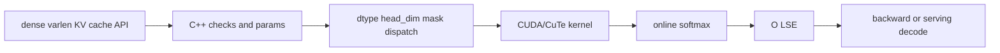

# FlashAttention 学习指南

## 你为什么要读

FlashAttention 没有把 attention 公式换掉，它改变的是中间结果住在哪里、活多久、搬几次。这套文档帮助你理解 exact attention 为什么受 HBM traffic 限制，以及 Q/K/V 如何从 PyTorch API 进入 C++/CUDA/CuTe kernel，最终把“IO-aware”落实到参数、tile、online softmax 和写回对象。

## 第一次阅读

1. [[GPU内存与算子]]
2. [[Attention算子主线]]
3. [[FlashAttention-算法原点]]
4. [[FlashAttention-Attention-IO]]
5. [[FlashAttention-Online-Softmax]]
6. [[FlashAttention-前向全链路]]
7. [[FlashAttention-FA2-Forward]]
8. 按任务选择 [[FlashAttention-Backward]] 或 [[FlashAttention-KV-Cache]]
9. [[FlashAttention性能实验]]

## 三种使用方式

| 当前任务 | 阅读入口 |
|----------|----------|
| 首次学习 | [[FlashAttention-导读与总览]] · [[FlashAttention-学习路径]] |
| 排查数值、安装、性能 | [[knowledge_maps/排障指南.base]] |
| 准备改 kernel | [[knowledge_maps/FlashAttention内容.base]]，筛选 walkthrough/dataflow |

## 系统地图

## 专题入口

| 领域 | 入口 |
|------|------|
| IO 原理 | [[FlashAttention-Attention-IO]] |
| Online softmax | [[FlashAttention-Online-Softmax]] |
| Python 与 binding | [[FlashAttention-Python-API]] |
| FA2 forward | [[FlashAttention-FA2-Forward]] |
| Backward | [[FlashAttention-Backward]] |
| KV cache / SplitKV | [[FlashAttention-KV-Cache]] |
| Hopper / CuTeDSL | [[FlashAttention-Hopper与CuTe]] |

## 完成标准

- 能解释为什么完整 S/P 不应落到 HBM。
- 能解释 row max、row sum、acc_o 和 LSE。
- 能从 API 追到 params、dispatch 和 kernel loop。
- 能用 reference、Nsight 和 shape sweep 验证正确性与性能判断。

源码基线：`002cce0`。FA3/FA4、ROCm 和硬件支持范围需要按当前 upstream 再核对。
