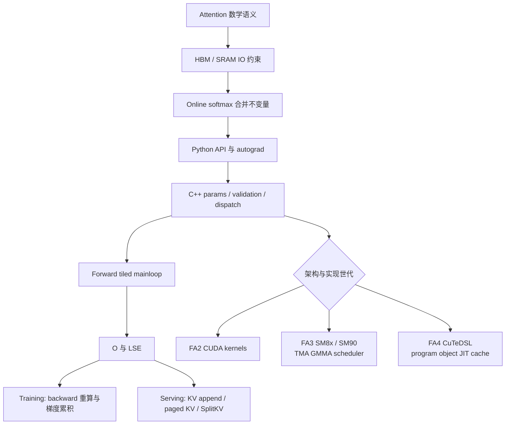

# FlashAttention 学习指南

## 你为什么要读

FlashAttention 没有改写 attention 公式，它改写的是执行计划：中间量住在寄存器、shared memory 还是 HBM，活过几个 tile，跨层搬几次，何时合并，怎样进入 backward 或 KV-cache serving。真正学会后，你看到的不再是一段“很快的 CUDA”，而是一条从数学等价性、IO 下界、online softmax、API/binding、模板分派到架构专属 kernel 的因果链。

本指南的目标不是让你把 60 篇笔记顺序读完，而是让你在三种尺度之间自由切换：

- 数学尺度：为什么分块后仍是 exact attention；
- kernel 尺度：一个 Q tile 如何反复消费 K/V tile，维护 `m/l/O` 状态；
- 系统尺度：Python 调用如何经过参数归一化、binding、dispatch、cache 和 scheduler 到达具体实现。

## 先记住一张总图

图中有两条不能颠倒的主线：先证明数学与 IO，再读实现；先确认实际入口与架构对象，再谈性能。跳过前者会把 online softmax 当技巧背诵，跳过后者会把 FA2/FA3/FA4 错画成自动替代链。

## 三遍学习法

### 第一遍：建立不变量，不钻模板

目标：能用自己的话解释“为什么 exact attention 可以分块算”。

1. 基础不足先读 [[GPU内存与算子]]、[[Attention算子主线]]、[[FlashAttention-零基础先修]]。
2. 用 [[FlashAttention-算法原点]] 建立 naive attention 的物化与 IO 问题。
3. 读 [[FlashAttention-Attention-IO]]，理解优化对象是 HBM traffic，而不只是 FLOPs。
4. 读 [[FlashAttention-Online-Softmax]]，掌握旧块与新块如何通过 running max/sum 合并。
5. 用两篇学习检查证明自己能手算与解释：[[FlashAttention-Attention-IO-学习检查]]、[[FlashAttention-Online-Softmax-学习检查]]。

第一遍的退出条件：不看笔记写出单行在线状态 `m`、归一化和 `O` 重标定的意义，并解释为什么完整 score/probability matrix 不必落到 HBM。

### 第二遍：沿一次 forward 追对象

目标：把公式对应到真实调用链，不按文件名堆代码。

1. [[FlashAttention-前向全链路]]：先得到 Q/K/V→params→dispatch→mainloop→O/LSE 的骨架。
2. [[FlashAttention-Python-API]]：区分 dense、varlen、KV-cache API、custom op 与 autograd wrapper。
3. [[FlashAttention-Python-API-数据流]]：跟踪 shape、stride、`cu_seqlens`、返回值和保存状态。
4. [[FlashAttention-FA2-Forward]]：理解 tile、线程组织、shared memory 与 epilogue。
5. [[FlashAttention-FA2-Forward-源码走读]]：沿调用生命周期对照正式源码卡。

第二遍的退出条件：给定 `flash_attn_func(q,k,v)`，能画出 Python wrapper、C++ binding、params、static dispatch、kernel mainloop、O/LSE 的对象所有权与 shape 变化；遇到 varlen 时能说明 `cu_seqlens` 描述的是 ragged 边界而不是 padding mask。

### 第三遍：按任务进入分支

目标：理解 forward 之外的状态生命周期与新架构实现。

| 你的任务 | 阅读主线 | 必须带走的判断 |
|---|---|---|
| 训练与梯度 | [[FlashAttention-Backward]] → [[FlashAttention-Backward-数据流]] → [[FlashAttention-Backward-源码走读]] | backward 通过保存 LSE/输出与重算局部概率，避免保存完整 S/P；`dQ` 与 `dK/dV` 的归约方式不同 |
| 推理与 KV cache | [[FlashAttention-KV-Cache]] → [[FlashAttention-KV-Cache-数据流]] → [[FlashAttention-KV-Cache-源码走读]] | cache append、paged layout、rotary、SplitKV 是不同状态轴；combine 是 partial O/LSE 的数值合并 |
| Hopper/Blackwell | [[FlashAttention-Hopper与CuTe]] → [[FlashAttention-FA3-Hopper演进]] → [[FlashAttention-FA4-CuTeDSL演进]] | FA3/FA4 与 FA2 并存；TMA 是条件路径；FA4 是 program object + compile key + callable + cache 系统 |
| API/安装排障 | [[FlashAttention-Python-API-排障指南]]、[[FlashAttention-Hopper与CuTe-排障指南]] | 先确定导入哪个包/符号，再区分 arch、validation、compile、launch 与数值层 |
| 改 kernel | [[FlashAttention-源码地图]]、对应专题的 `核心概念→数据流→源码走读→学习检查` | 先写要保持的不变量、对象生命周期与验证矩阵，再改局部实现 |

第三遍没有统一顺序。训练读者不必先穷尽 KV cache，serving 读者也不必先吃透所有 backward 模板；但两者都不能跳过 IO 与 online softmax。

## 每个专题怎样读

本库多数核心专题采用六篇结构。它不是重复解释，而是六种认知任务：

| 文档角色 | 你要解决的问题 | 读完产物 |
|---|---|---|
| 专题入口 | 这个主题在全链路哪里，为什么存在？ | 一张局部地图 |
| 核心概念 | 哪些对象和不变量最重要？ | 一组可解释概念卡 |
| 数据流 | tensor、索引、状态和所有权怎样变化？ | 一条对象生命周期 |
| 源码走读 | 哪些 upstream 证据证明判断？ | 可复核的 checkpoint |
| 排障指南 | 失败先落到哪一层？ | 症状→原因→入口→操作→预期 |
| 学习检查 | 能否独立迁移到新 shape/版本？ | 可执行验证与口述答案 |

推荐顺序是入口→核心概念→数据流→源码走读；排障和学习检查分别用于“出问题时”和“以为自己懂了时”。具体方法见 [[FlashAttention-阅读方法]]。

## 四本账贯穿全程

阅读任何一段源码，都同时维护四本账：

1. 数学账：该状态对应 `S/P/O/LSE/dQ/dK/dV` 中什么量，等价性靠什么不变量保证？
2. 内存账：对象位于 HBM、shared memory、register 还是临时 workspace，谁分配、谁写、何时释放？
3. 分派账：dtype、head dim、causal/local、varlen、GQA、arch、SplitKV 等条件最终选择了哪个实例？
4. 验证账：reference 比什么，容差为什么合理，性能结论绑定什么硬件与 workload？

只记数学账会看不懂优化，只记 kernel 账会丢失正确性，只记 benchmark 数字会把偶然配置当规律。

## 按问题快速进入

| 现象或问题 | 第一入口 | 下一步 |
|---|---|---|
| 不理解为什么更快 | [[FlashAttention-Attention-IO-核心概念]] | [[FlashAttention-Attention-IO-数据流]] |
| online softmax 容易混乱 | [[FlashAttention-Online-Softmax-核心概念]] | 手做 [[FlashAttention-Online-Softmax-学习检查]] |
| 不知道调用了哪个实现 | [[FlashAttention-Python-API-排障指南]] | 检查模块路径、dtype/shape、arch 与 binding |
| forward 数值错 | [[FlashAttention-FA2-Forward-排障指南]] | 固定小 shape 对 reference，逐层看 mask/LSE/O |
| backward 才出错 | [[FlashAttention-Backward-排障指南]] | 区分保存状态、重算、原子归约与 deterministic 路径 |
| decode/cache 错位 | [[FlashAttention-KV-Cache-排障指南]] | 对 page table、cache batch idx、append 与回读做对象级核对 |
| 首次请求慢 | [[FlashAttention-Hopper与CuTe-排障指南]] | 区分进程内 miss、持久化 miss、fingerprint/key 变化 |
| 想比较版本 | [[FlashAttention-版本演进全景]] | 再读具体 FA2/FA3/FA4 演进篇，不用版本号代替路径证据 |

## 实验顺序

性能实验必须晚于正确性和路径确认：

1. 用小 shape 与高精度/reference 对齐输出、LSE 和梯度；
2. 固定 dtype、mask、layout、dropout、arch 与实现入口；
3. 做 warmup，区分 JIT/build cold start 与 steady state；
4. sweep batch、seqlen、heads、head dim、causal/varlen/GQA；
5. 用 profiler 检查 HBM traffic、occupancy、kernel 数与 launch 间隙；
6. 记录硬件、CUDA、Torch、FlashAttention baseline、命令和原始结果。

实验入口：[[FlashAttention性能实验]]。没有目标 GPU 时，至少执行各专题给出的静态定位与 CPU/reference 替代；不要编造吞吐或阈值。

## 毕业标准

满足下列条件，才算“深刻理解”而不只是读完：

- [ ] 能从 naive attention 推导出不物化完整 S/P 的 IO 动机。
- [ ] 能手工解释多个 K/V tile 合并时 running max、running sum、O accumulator 和 LSE 的更新。
- [ ] 能从 public API 追到 binding、params、dispatch 和 kernel loop，并标出 shape/stride/所有权。
- [ ] 能解释 backward 为什么重算概率、保存哪些量，以及 dQ 与 dK/dV 的并行归约差异。
- [ ] 能解释 KV append、paged KV、RoPE、SplitKV partial/combine 是四类不同机制。
- [ ] 能区分 FA3 发布契约与 live SM8x/SM90 路径，说明 TMA/GMMA 与 scheduler 的条件边界。
- [ ] 能解释 FA4 的 program object、compile key、compiled callable、进程内 cache 和持久化 cache。
- [ ] 能设计 reference correctness、shape sweep、冷/热启动与 profiler 验证，不写脱离环境的性能结论。
- [ ] 能面对新 baseline 重新定位证据，而不是沿用旧行号与旧硬件结论。

最后完成 [[FlashAttention-总结复盘]]。若其中任何一条只能背定义，回到相应专题的“数据流→源码走读→学习检查”闭环。

## 基线边界

本知识库当前源码基线为 `002cce0`。文档中的行号、架构能力和 feature 组合都只对该 baseline 负责；README 的发行描述、当前 Python/C++ 门禁、编译产物与真实硬件支持可能处在不同时间轴。升级 upstream 时必须重新跑源码证据与语义终审。
