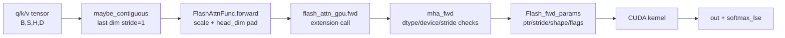
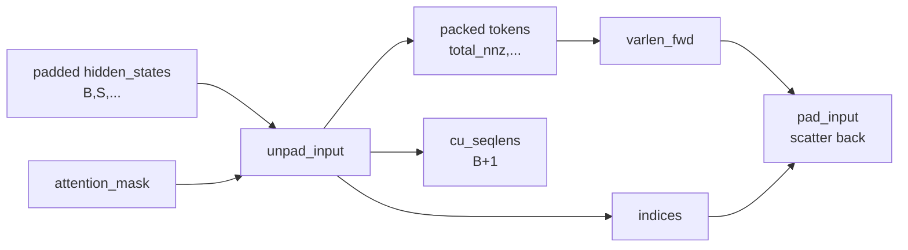

# Python-API · 数据流

## 读者任务

这篇只看对象生命周期：同一个 attention 调用在 Python、C++、CUDA 边界上分别长什么样。读完后你应该能说明：

- dense forward 如何从 PyTorch tensor 变成 C++ `Flash_fwd_params`。
- varlen 如何从 padded batch 变成连续 token，再 scatter 回 padded batch。
- 返回值里 `out/softmax_lse/S_dmask/rng_state` 分别服务谁。
- KV cache decode 为什么多了 cache 长度、batch index、block table 和 RoPE 这些状态。

## Dense forward：tensor 到参数包



C++ fixed-length forward 首先把 Python tensor 约束成 kernel 能接受的形态。

```cpp
// 来源：csrc/flash_attn/flash_api.cpp L351-L395
mha_fwd(at::Tensor &q,         // batch_size x seqlen_q x num_heads x round_multiple(head_size, 8)
        const at::Tensor &k,         // batch_size x seqlen_k x num_heads_k x round_multiple(head_size, 8)
        const at::Tensor &v,         // batch_size x seqlen_k x num_heads_k x round_multiple(head_size, 8)
        std::optional<at::Tensor> &out_,             // batch_size x seqlen_q x num_heads x round_multiple(head_size, 8)
        std::optional<at::Tensor> &alibi_slopes_, // num_heads or batch_size x num_heads
        const float p_dropout,
        const float softmax_scale,
        bool is_causal,
        int window_size_left,
        int window_size_right,
        const float softcap,
        const bool return_softmax,
        std::optional<at::Generator> gen_) {

    // Otherwise the kernel will be launched from cuda:0 device
    at::cuda::CUDAGuard device_guard{q.device()};

    auto [cc_major, cc_minor] = get_compute_capability(get_current_device());
    bool is_sm8x_min = cc_major >= 8;
    TORCH_CHECK(is_sm8x_min, "FlashAttention only supports Ampere GPUs or newer.");

    auto q_dtype = q.dtype();
    TORCH_CHECK(q_dtype == torch::kFloat16 || q_dtype == torch::kBFloat16,
                "FlashAttention only support fp16 and bf16 data type");
    TORCH_CHECK(k.dtype() == q_dtype, "query and key must have the same dtype");
    TORCH_CHECK(v.dtype() == q_dtype, "query and value must have the same dtype");

    CHECK_DEVICE(q); CHECK_DEVICE(k); CHECK_DEVICE(v);

    TORCH_CHECK(q.stride(-1) == 1, "Input tensor must have contiguous last dimension");
    TORCH_CHECK(k.stride(-1) == 1, "Input tensor must have contiguous last dimension");
    TORCH_CHECK(v.stride(-1) == 1, "Input tensor must have contiguous last dimension");

    const auto sizes = q.sizes();

    const int batch_size = sizes[0];
    int seqlen_q = sizes[1];
    int num_heads = sizes[2];
    const int head_size = sizes[3];
    const int seqlen_k = k.size(1);
    const int num_heads_k = k.size(2);
    TORCH_CHECK(batch_size > 0, "batch size must be positive");
    TORCH_CHECK(head_size <= 256, "FlashAttention forward only supports head dimension at most 256");
    TORCH_CHECK(head_size % 8 == 0, "query, key, value, and out_ must have a head_size that is a multiple of 8");
    TORCH_CHECK(num_heads % num_heads_k == 0, "Number of heads in key/value must divide number of heads in query");
```

随后 Python 语义被固化进参数包。fixed-length 路径里 `cu_seqlens_q/k` 是 `nullptr`，这和 varlen 路径形成清晰边界。

```cpp
// 来源：csrc/flash_attn/flash_api.cpp L452-L470
    Flash_fwd_params params;
    set_params_fprop(params,
                     batch_size,
                     seqlen_q, seqlen_k,
                     seqlen_q_rounded, seqlen_k_rounded,
                     num_heads, num_heads_k,
                     head_size, head_size_rounded,
                     q, k, v, out,
                     /*cu_seqlens_q_d=*/nullptr,
                     /*cu_seqlens_k_d=*/nullptr,
                     /*seqused_k=*/nullptr,
                     return_softmax ? p.data_ptr() : nullptr,
                     softmax_lse.data_ptr(),
                     p_dropout,
                     softmax_scale,
                     window_size_left,
                     window_size_right,
                     softcap
                     );
```

## Varlen：padded batch 到连续 token



`unpad_input` 的输出同时服务 kernel 和回填：

```python
# 来源：flash_attn/bert_padding.py L111-L126
    all_masks = (attention_mask + unused_mask) if unused_mask is not None else attention_mask
    seqlens_in_batch = all_masks.sum(dim=-1, dtype=torch.int32)
    used_seqlens_in_batch = attention_mask.sum(dim=-1, dtype=torch.int32)
    indices = torch.nonzero(all_masks.flatten(), as_tuple=False).flatten()
    max_seqlen_in_batch = seqlens_in_batch.max().item()
    cu_seqlens = F.pad(torch.cumsum(seqlens_in_batch, dim=0, dtype=torch.int32), (1, 0))
    # TD [2022-03-04] We don't want to index with a bool mask, because Pytorch will expand the
    # bool mask, then call nonzero to get the indices, then index with those. The indices is @dim
    # times larger than it needs to be, wasting memory. It's faster and more memory-efficient to
    # index with integer indices. Moreover, torch's index is a bit slower than it needs to be,
    # so we write custom forward and backward to make it a bit faster.
    return (
        index_first_axis(rearrange(hidden_states, "b s ... -> (b s) ..."), indices),
        indices,
        cu_seqlens,
        max_seqlen_in_batch,
```

回填则只需要 packed output 和原始 indices：

```python
# 来源：flash_attn/bert_padding.py L204-L218
def pad_input(hidden_states, indices, batch, seqlen):
    """
    Arguments:
        hidden_states: (total_nnz, ...), where total_nnz = number of tokens in selected in attention_mask.
        indices: (total_nnz), the indices that represent the non-masked tokens of the original padded input sequence.
        batch: int, batch size for the padded sequence.
        seqlen: int, maximum sequence length for the padded sequence.
    Return:
        hidden_states: (batch, seqlen, ...)
    """
    dim = hidden_states.shape[-1]
    # output = torch.zeros((batch * seqlen), dim, device=hidden_states.device, dtype=hidden_states.dtype)
    # output[indices] = hidden_states
    output = index_put_first_axis(hidden_states, indices, batch * seqlen)
    return rearrange(output, "(b s) ... -> b s ...", b=batch)
```

## 返回值：四类消费者

| 返回值 | 生产者 | 消费者 | 语义 |
|--------|--------|--------|------|
| `out` | CUDA forward | 上层模型 | attention 输出 |
| `softmax_lse` | CUDA forward | backward、测试、可选用户返回 | 每行 logsumexp 摘要 |
| `S_dmask` | CUDA forward 可选 | 测试 | 概率/dropout mask 调试输出，不是主路径 |
| `rng_state` | CUDA forward dropout 路径 | backward | 对齐 dropout 随机状态 |

`FlashAttnFunc.forward` 只在需要梯度时保存 backward 所需对象：

```python
# 来源：flash_attn/flash_attn_interface.py L855-L878
        out_padded, softmax_lse, S_dmask, rng_state = _wrapped_flash_attn_forward(
            q,
            k,
            v,
            dropout_p,
            softmax_scale,
            causal=causal,
            window_size_left=window_size[0],
            window_size_right=window_size[1],
            softcap=softcap,
            alibi_slopes=alibi_slopes,
            return_softmax=return_softmax and dropout_p > 0,
        )
        if is_grad:
            ctx.save_for_backward(q, k, v, out_padded, softmax_lse, rng_state)
            ctx.dropout_p = dropout_p
            ctx.softmax_scale = softmax_scale
            ctx.causal = causal
            ctx.window_size = window_size
            ctx.softcap = softcap
            ctx.alibi_slopes = alibi_slopes
            ctx.deterministic = deterministic
        out = out_padded[..., :head_size_og]
        return out if not return_softmax else (out, softmax_lse, S_dmask)
```

## KV cache：cache 状态参与输入契约

模型层 decode fast path 会把 q、新 kv、历史 cache、cache length、RoPE 和 ALiBi 都传给 `flash_attn_with_kvcache`。

```python
# 来源：flash_attn/modules/mha.py L526-L569
        context = flash_attn_with_kvcache(
            q,
            kv_cache[:, :, 0],
            kv_cache[:, :, 1],
            kv[:, :, 0],
            kv[:, :, 1],
            rotary_cos=rotary_cos,
            rotary_sin=rotary_sin,
            cache_seqlens=cache_seqlens,
            softmax_scale=self.inner_cross_attn.softmax_scale,
            causal=self.inner_cross_attn.causal,
            rotary_interleaved=self.rotary_emb.interleaved if self.rotary_emb_dim > 0 else False,
            alibi_slopes=alibi_slopes,
        )
        return context

    def _update_kvcache_attention(self, q, kv, inference_params):
        """Write kv to inference_params, then do attention"""
        if (
            inference_params.seqlen_offset == 0
            or flash_attn_with_kvcache is None
            or not self.use_flash_attn
        ):
            # TODO: this only uses seqlen_offset and not lengths_per_sample.
            kv = self._update_kv_cache(kv, inference_params)
            return self.inner_cross_attn(q, kv)
        else:
            batch = q.shape[0]
            kv_cache = inference_params.key_value_memory_dict[self.layer_idx][:batch]
            cache_seqlens = (
                inference_params.lengths_per_sample[:batch]
                if inference_params.lengths_per_sample is not None
                else inference_params.seqlen_offset
            )
            alibi_slopes = getattr(self.inner_cross_attn, "alibi_slopes", None)
            return flash_attn_with_kvcache(
                q,
                kv_cache[:, :, 0],
                kv_cache[:, :, 1],
                kv[:, :, 0],
                kv[:, :, 1],
                cache_seqlens=cache_seqlens,
                softmax_scale=self.inner_cross_attn.softmax_scale,
                causal=self.inner_cross_attn.causal,
```

读者抓手：KV cache 数据流不是“多一个参数”，而是多了一组状态账：cache memory、当前长度、batch index、page table、RoPE position。

## 运行验证

| 验证 | 方法 | 预期 |
|------|------|------|
| dense 对象形态 | 打印 `q.shape`、`q.stride()`，再调用 `flash_attn_func` | last dim stride 为 1 时不额外复制 |
| varlen 边界 | 检查 `cu_seqlens[0] == 0` 和 `cu_seqlens[-1] == packed.shape[0]` | packed token 数和边界一致 |
| 回填 | `pad_input(unpadded, indices, batch, seqlen)` | shape 回到 `(batch, seqlen, ...)` |
| KV cache | 传 int `cache_seqlens` | Python 层会转为 batch 维 int32 tensor |

## 复盘

Python API 层的数据流可以看成三张账：dense 账管 tensor 到 params，varlen 账管 padding 到边界数组，decode 账管 cache 状态。读 [[FlashAttention-FA2-Forward]] 前，至少要能画出这三张账。
