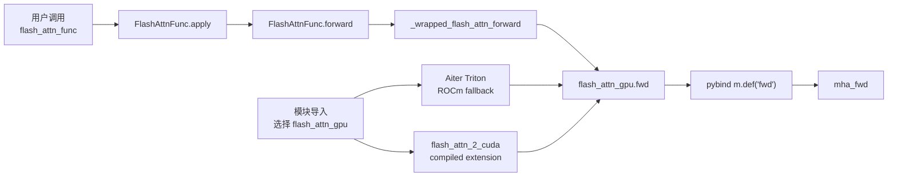

# Python-API · 源码走读

## 读者任务

这篇沿一条真实调用主线走源码：`flash_attn_func(q, k, v)` 如何从公开 API 进入 autograd Function，再根据 PyTorch 版本经过 custom op 或直接 Python wrapper，并根据平台进入 compiled extension 或 ROCm Triton backend。读完后你应该能定位：

- 用户参数在哪一层被解释。
- Q/K/V 什么时候被补齐 head dim 或转成 contiguous。
- `softmax_lse` 和 `rng_state` 为什么在 Python autograd 层保存。
- varlen 和 KV cache 为什么不是 dense forward 的普通参数分支。
- 哪些结论只适用于 `flash_attn_2_cuda` 分支，不能外推到 ROCm Triton fallback。

## 长文读法

这篇按 Python 到 backend 的边界读：模块导入先决定 `flash_attn_gpu` 指向 Aiter Triton 还是 compiled extension；公开 API 收集用户意图；`FlashAttnFunc` 决定 autograd 保存什么；PyTorch 2.4+ custom op 提供 `torch.ops` 与 fake/meta 形状协议，旧版本则直接调用 Python wrapper；compiled-extension 分支再由 pybind 把 `fwd` / `varlen_fwd` / `fwd_kvcache` 接到不同 C++ 入口。

| 你的任务 | 先读 | 抓住什么 |
|----------|------|----------|
| 第一次追 dense forward | 第零步到第四步 | 先判断 backend 与 PyTorch 版本，再追 `flash_attn_func -> FlashAttnFunc.apply -> wrapped op -> flash_attn_gpu.fwd` |
| 排查用户参数解释 | 第一步 | API 层稳定签名和默认值，但不做 kernel dispatch |
| 排查 backward 需要的状态 | 第二步 | Python autograd 保存 `q/k/v/out/softmax_lse/rng_state`，不保存完整 attention matrix |
| 排查 contiguous / head dim | 第二步到第三步 | head dim padding 在 autograd 层，last-dim contiguous 在 wrapper / C++ 边界检查 |
| 排查 pybind 名称 | 第四步 | 只有 compiled-extension 分支才由 pybind 导出 `fwd`、`varlen_fwd`、`fwd_kvcache` |
| 分清 varlen / KV cache | 第五步到第六步 | varlen 改 batch 形态，KV cache 是 decode 专用入口 |

## 主线图



## 第零步：先确认 `flash_attn_gpu` 究竟是谁

模块导入时，CUDA 路径直接导入 `flash_attn_2_cuda`。HIP 环境若显式开启 Triton，或 HIP extension 导入失败，则改用 Aiter Triton 实现并统一别名为 `flash_attn_gpu`。

```python
# 来源：flash_attn/flash_attn_interface.py L10-L23
# isort: off
# We need to import the CUDA kernels after importing torch
USE_TRITON_ROCM = os.getenv("FLASH_ATTENTION_TRITON_AMD_ENABLE", "FALSE") == "TRUE"
if not USE_TRITON_ROCM and getattr(torch.version, 'hip', None) is not None:
    try:
        import flash_attn_2_cuda
    except ImportError:
        warnings.warn("flash_attn_2_cuda (which has ROCm/HIP kernels) not found, falling back to Triton implementation")
        USE_TRITON_ROCM = True

if USE_TRITON_ROCM:
    from aiter.ops.triton._triton_kernels.flash_attn_triton_amd import flash_attn_2 as flash_attn_gpu
else:
    import flash_attn_2_cuda as flash_attn_gpu
```

边界要说准确：HIP 有 fallback；普通 CUDA 分支没有在这里捕获 extension 导入失败。若 CUDA wheel/ABI 不匹配，模块导入会失败，而不是自动退到 Triton。

custom-op 层也有版本分叉：PyTorch 2.4+ 使用 `torch.library.custom_op/register_fake`；更旧版本的装饰器是 no-op，`_wrapped_flash_attn_forward` 直接指向 Python 函数。

```python
# 来源：flash_attn/flash_attn_interface.py L61-L81
# torch.compile() support is only enabled for pytorch >= 2.4
# The reason for this is that we are using the new custom_op and register_fake
# APIs, which support inplace modification of inputs in the function itself
if torch.__version__ >= "2.4.0":
    _torch_custom_op_wrapper = torch.library.custom_op
    _torch_register_fake_wrapper = torch.library.register_fake
else:
    def noop_custom_op_wrapper(name, fn=None, /, *, mutates_args, device_types=None, schema=None):
        def wrap(func):
            return func
        if fn is None:
            return wrap
        return fn
    def noop_register_fake_wrapper(op, fn=None, /, *, lib=None, _stacklevel=1):
        def wrap(func):
            return func
        if fn is None:
            return wrap
        return fn
    _torch_custom_op_wrapper = noop_custom_op_wrapper
    _torch_register_fake_wrapper = noop_register_fake_wrapper
```

```python
# 来源：flash_attn/flash_attn_interface.py L147-L150
if torch.__version__ >= "2.4.0":
    _wrapped_flash_attn_forward = torch.ops.flash_attn._flash_attn_forward
else:
    _wrapped_flash_attn_forward = _flash_attn_forward
```

## 第一步：公开 API 只收集用户意图

`flash_attn_func` 的职责是稳定用户接口。它不直接实现 attention，也不做 kernel dispatch；它把用户参数交给 `FlashAttnFunc.apply`。

```python
# 来源：flash_attn/flash_attn_interface.py L1156-L1230
def flash_attn_func(
    q,
    k,
    v,
    dropout_p=0.0,
    softmax_scale=None,
    causal=False,
    window_size=(-1, -1),  # -1 means infinite context window
    softcap=0.0, # 0.0 means deactivated
    alibi_slopes=None,
    deterministic=False,
    return_attn_probs=False,
):
    """dropout_p should be set to 0.0 during evaluation
    Supports multi-query and grouped-query attention (MQA/GQA) by passing in KV with fewer heads
    than Q. Note that the number of heads in Q must be divisible by the number of heads in KV.
    For example, if Q has 6 heads and K, V have 2 heads, head 0, 1, 2 of Q will attention to head
    0 of K, V, and head 3, 4, 5 of Q will attention to head 1 of K, V.

    If causal=True, the causal mask is aligned to the bottom right corner of the attention matrix.
    For example, if seqlen_q = 2 and seqlen_k = 5, the causal mask (1 = keep, 0 = masked out) is:
        1 1 1 1 0
        1 1 1 1 1
    If seqlen_q = 5 and seqlen_k = 2, the causal mask is:
        0 0
        0 0
        0 0
        1 0
        1 1
    If the row of the mask is all zero, the output will be zero.

    If window_size != (-1, -1), implements sliding window local attention. Query at position i
    will only attend to keys between
    [i + seqlen_k - seqlen_q - window_size[0], i + seqlen_k - seqlen_q + window_size[1]] inclusive.

    Arguments:
        q: (batch_size, seqlen, nheads, headdim)
        k: (batch_size, seqlen, nheads_k, headdim)
        v: (batch_size, seqlen, nheads_k, headdim)
        dropout_p: float. Dropout probability.
        softmax_scale: float. The scaling of QK^T before applying softmax.
            Default to 1 / sqrt(headdim).
        causal: bool. Whether to apply causal attention mask (e.g., for auto-regressive modeling).
        window_size: (left, right). If not (-1, -1), implements sliding window local attention.
        alibi_slopes: (nheads,) or (batch_size, nheads), fp32. A bias of
            (-alibi_slope * |i + seqlen_k - seqlen_q - j|)
            is added to the attention score of query i and key j.
        deterministic: bool. Whether to use the deterministic implementation of the backward pass,
            which is slightly slower and uses more memory. The forward pass is always deterministic.
        return_attn_probs: bool. Whether to return the attention probabilities. This option is for
           testing only. The returned probabilities are not guaranteed to be correct
           (they might not have the right scaling).
    Return:
        out: (batch_size, seqlen, nheads, headdim).
        softmax_lse [optional, if return_attn_probs=True]: (batch_size, nheads, seqlen). The
            logsumexp of each row of the matrix QK^T * scaling (e.g., log of the softmax
            normalization factor).
        S_dmask [optional, if return_attn_probs=True]: (batch_size, nheads, seqlen, seqlen).
            The output of softmax (possibly with different scaling). It also encodes the dropout
            pattern (negative means that location was dropped, nonnegative means it was kept).
    """
    return FlashAttnFunc.apply(
        q,
        k,
        v,
        dropout_p,
        softmax_scale,
        causal,
        window_size,
        softcap,
        alibi_slopes,
        deterministic,
        return_attn_probs,
        torch.is_grad_enabled(),
    )
```

判断：API docstring 给出 MQA/GQA、causal 对齐、local window、testing-only `return_attn_probs` 等用户契约；后续 backend 负责校验可支持的 dtype/shape/组合并执行。文档契约不等于所有平台、架构与参数组合都必然可用。

## 第二步：Autograd Function 决定保存什么

`FlashAttnFunc.forward` 补默认 scale、pad 非 8 倍 head dim，然后调用 `_wrapped_flash_attn_forward`。如果需要梯度，它保存 Q/K/V、输出、LSE 和 RNG。

```python
# 来源：flash_attn/flash_attn_interface.py L828-L878
class FlashAttnFunc(torch.autograd.Function):
    @staticmethod
    def forward(
        ctx,
        q,
        k,
        v,
        dropout_p,
        softmax_scale,
        causal,
        window_size,
        softcap,
        alibi_slopes,
        deterministic,
        return_softmax,
        is_grad_enabled,
    ):
        is_grad = is_grad_enabled and any(
            x.requires_grad for x in [q, k, v]
        )
        if softmax_scale is None:
            softmax_scale = q.shape[-1] ** (-0.5)
        head_size_og = q.size(3)
        if head_size_og % 8 != 0:
            q = torch.nn.functional.pad(q, [0, 8 - head_size_og % 8])
            k = torch.nn.functional.pad(k, [0, 8 - head_size_og % 8])
            v = torch.nn.functional.pad(v, [0, 8 - head_size_og % 8])
        out_padded, softmax_lse, S_dmask, rng_state = _wrapped_flash_attn_forward(
            q,
            k,
            v,
            dropout_p,
            softmax_scale,
            causal=causal,
            window_size_left=window_size[0],
            window_size_right=window_size[1],
            softcap=softcap,
            alibi_slopes=alibi_slopes,
            return_softmax=return_softmax and dropout_p > 0,
        )
        if is_grad:
            ctx.save_for_backward(q, k, v, out_padded, softmax_lse, rng_state)
            ctx.dropout_p = dropout_p
            ctx.softmax_scale = softmax_scale
            ctx.causal = causal
            ctx.window_size = window_size
            ctx.softcap = softcap
            ctx.alibi_slopes = alibi_slopes
            ctx.deterministic = deterministic
        out = out_padded[..., :head_size_og]
        return out if not return_softmax else (out, softmax_lse, S_dmask)
```

判断：autograd wrapper 已经解释了三个重要边界：head dim padding 是 Python 兼容层措施；`return_attn_probs=True` 决定公开 API 是否返回三元组，但只有 dropout 开启时才要求 backend 生成 `S_dmask`，所以 dropout 为 0 时不能把第三项当成真实概率矩阵；LSE/RNG 是 backward 协议字段。只有 grad mode 开启且 Q/K/V 至少一个需要梯度时，才保存这些张量。

backward 会把 `dout` 补到同一 head dim，调用底层 backward，再把 `dq/dk/dv` 裁回调用方原始维度：

```python
# 来源：flash_attn/flash_attn_interface.py L882-L910
        q, k, v, out, softmax_lse, rng_state = ctx.saved_tensors
        dq, dk, dv = torch.empty_like(q), torch.empty_like(k), torch.empty_like(v)
        head_size_og = dout.size(3)
        dout_padded = dout
        if head_size_og % 8 != 0:
            dout_padded = torch.nn.functional.pad(dout, [0, 8 - head_size_og % 8])
        _wrapped_flash_attn_backward(
            dout_padded,
            q,
            k,
            v,
            out,
            softmax_lse,
            dq,
            dk,
            dv,
            ctx.dropout_p,
            ctx.softmax_scale,
            ctx.causal,
            ctx.window_size[0],
            ctx.window_size[1],
            ctx.softcap,
            ctx.alibi_slopes,
            ctx.deterministic,
            rng_state=rng_state,
        )
        dq = dq[..., : dout.shape[-1]]  # We could have padded the head dimension
        dk = dk[..., : dout.shape[-1]]
        dv = dv[..., : dout.shape[-1]]
```

## 第三步：Custom op wrapper 调用 extension

`_flash_attn_forward` 是 backend 调用 wrapper。它声明 dense forward 不原地修改输入，做 last-dim contiguous 归一化，然后调用当前选中的 `flash_attn_gpu.fwd`。在 PyTorch 2.4+ 它注册为 custom op；旧版本仍是普通 Python 函数。

```python
# 来源：flash_attn/flash_attn_interface.py L84-L113
@_torch_custom_op_wrapper("flash_attn::_flash_attn_forward", mutates_args=(), device_types="cuda")
def _flash_attn_forward(
    q: torch.Tensor,
    k: torch.Tensor,
    v: torch.Tensor,
    dropout_p: float,
    softmax_scale: float,
    causal: bool,
    window_size_left: int,
    window_size_right: int,
    softcap: float,
    alibi_slopes: Optional[torch.Tensor],
    return_softmax: bool
) -> Tuple[torch.Tensor, torch.Tensor, torch.Tensor, torch.Tensor]:
    q, k, v = [maybe_contiguous(x) for x in (q, k, v)]
    out, softmax_lse, S_dmask, rng_state = flash_attn_gpu.fwd(
        q,
        k,
        v,
        None,
        alibi_slopes,
        dropout_p,
        softmax_scale,
        causal,
        window_size_left,
        window_size_right,
        softcap,
        return_softmax,
        None,
    )
```

判断：这不是 Python attention 实现。wrapper 统一参数顺序与内存末维，但真正计算在 `flash_attn_gpu`。compiled-extension 分支的 shape/dtype/device 检查和 kernel dispatch 在 C++ 后面；ROCm Triton 分支则不能套用“必经 C++”这句话。

PyTorch 2.4+ 的 fake 实现不做数值计算，而是为 `torch.compile`/FakeTensor 构造输出元数据。`S_dmask` 默认是空 tensor；只有 `return_softmax` 为真才按平台构造相应形状：

```python
# 来源：flash_attn/flash_attn_interface.py L131-L144
    q, k, v = [maybe_contiguous(x) for x in (q, k, v)]
    batch_size, seqlen_q, num_heads, head_size = q.shape
    seqlen_k = k.shape[1]
    out = torch.empty_like(q)
    softmax_lse = torch.empty((batch_size, num_heads, seqlen_q), dtype=torch.float32, device=q.device, layout=q.layout)
    p = torch.empty((0,), dtype=q.dtype, device=q.device, layout=q.layout)
    if return_softmax:
        if torch.cuda.is_available() and torch.version.hip:
            p = torch.empty((batch_size, num_heads, seqlen_q, seqlen_k), dtype=q.dtype, device=q.device, layout=q.layout)
        else:
            p = torch.empty((batch_size, num_heads, round_multiple(seqlen_q, 128), round_multiple(seqlen_k, 128)), dtype=q.dtype, device=q.device, layout=q.layout)
    rng_state = torch.empty((2,), dtype=torch.int64, device=q.device)

    return out, softmax_lse, p, rng_state
```

## 第四步：compiled extension 才由 pybind 映射到 C++

当 `flash_attn_gpu` 指向 `flash_attn_2_cuda` 时，`fwd` 对应 C++ `mha_fwd`；同一个 extension 还暴露 varlen、backward 和 KV cache 入口。若第零步选中 ROCm Triton，这张 pybind 表不是实际调用链。

```cpp
// 来源：csrc/flash_attn/flash_api.cpp L1481-L1488
PYBIND11_MODULE(TORCH_EXTENSION_NAME, m) {
    m.doc() = "FlashAttention";
    m.def("fwd", &FLASH_NAMESPACE::mha_fwd, "Forward pass");
    m.def("varlen_fwd", &FLASH_NAMESPACE::mha_varlen_fwd, "Forward pass (variable length)");
    m.def("bwd", &FLASH_NAMESPACE::mha_bwd, "Backward pass");
    m.def("varlen_bwd", &FLASH_NAMESPACE::mha_varlen_bwd, "Backward pass (variable length)");
    m.def("fwd_kvcache", &FLASH_NAMESPACE::mha_fwd_kvcache, "Forward pass, with KV-cache");
}
```

判断：compiled extension 的不同入口不是靠一个万能 C++ 函数分叉，而是映射到不同 C++ ABI。读 dense forward 时不要把 `varlen_fwd` 和 `fwd_kvcache` 混进主线，也不要把这张 C++ 导出表外推成所有平台 backend 的实现结构。

## 第五步：Varlen 先改变 batch 形态

varlen API 需要 Q/K/V 先变成连续 token，并用 `cu_seqlens` 表示每条样本边界。

```python
# 来源：flash_attn/flash_attn_interface.py L1391-L1408
def flash_attn_varlen_func(
    q,
    k,
    v,
    cu_seqlens_q,
    cu_seqlens_k,
    max_seqlen_q,
    max_seqlen_k,
    dropout_p=0.0,
    softmax_scale=None,
    causal=False,
    window_size=(-1, -1),  # -1 means infinite context window
    softcap=0.0, # 0.0 means deactivated
    alibi_slopes=None,
    deterministic=False,
    return_attn_probs=False,
    block_table=None,
):
```

`unpad_input` 是常见上游入口：它产出连续 token、scatter 回原始 batch 所需的 indices、kernel 需要的 `cu_seqlens`，以及第五个 `used_seqlens_in_batch`。

```python
# 定位：flash_attn/bert_padding.py L111-L128（摘要/骨架；去除 upstream 尾随空格）
    all_masks = (attention_mask + unused_mask) if unused_mask is not None else attention_mask
    seqlens_in_batch = all_masks.sum(dim=-1, dtype=torch.int32)
    used_seqlens_in_batch = attention_mask.sum(dim=-1, dtype=torch.int32)
    indices = torch.nonzero(all_masks.flatten(), as_tuple=False).flatten()
    max_seqlen_in_batch = seqlens_in_batch.max().item()
    cu_seqlens = F.pad(torch.cumsum(seqlens_in_batch, dim=0, dtype=torch.int32), (1, 0))
    # TD [2022-03-04] We don't want to index with a bool mask, because Pytorch will expand the
    # bool mask, then call nonzero to get the indices, then index with those. The indices is @dim
    # times larger than it needs to be, wasting memory. It's faster and more memory-efficient to
    # index with integer indices. Moreover, torch's index is a bit slower than it needs to be,
    # so we write custom forward and backward to make it a bit faster.
    return (
        index_first_axis(rearrange(hidden_states, "b s ... -> (b s) ..."), indices),
        indices,
        cu_seqlens,
        max_seqlen_in_batch,
        used_seqlens_in_batch,
    )
```

判断：varlen 的 correctness 依赖 packed token 与边界数组，而不是 Python list 里的 ragged tensor。还要区分两个长度：`seqlens_in_batch` 来自 `attention_mask + unused_mask`，决定打包、indices、`cu_seqlens` 和 max length；第五个返回值却来自 `attention_mask` 本身。当前 docstring 把 `seqused` 描述成包含 unused token，但代码返回的是 `used_seqlens_in_batch`，两者存在文档/实现不一致，应以实际返回表达式为准并在调用处核对用途。

另一个边界是 public varlen API 虽暴露 `block_table`，但 `FlashAttnVarlenFunc.forward` 保存的 backward 状态里没有 block table，backward 调用也不再传它（`flash_attn_interface.py L946-L1012`）。upstream 测试因此只在 `block_table is None` 时执行 backward：

```python
# 来源：tests/test_flash_attn.py L1687-L1695
    g = torch.randn_like(out)
    do_o = (g.float() * out.float()).sum(-1)
    test_backward = block_table is None
    if test_backward:
        (
            dq_unpad,
            dk_unpad,
            dv_unpad,
        ) = torch.autograd.grad(out, (q_unpad, k_unpad, v_unpad), g)
```

所以当前证据只支持“varlen paged KV forward 受测”，不能把普通 varlen 的 backward 能力无条件外推给 `block_table` 路径。

## 第六步：KV cache 是 decode 专用入口

`flash_attn_with_kvcache` 的语义更重：它可以原地更新 cache、应用 RoPE、读取 paged KV，并可让 SplitKV 介入。

```python
# 来源：flash_attn/flash_attn_interface.py L1593-L1627
    assert k_cache.stride(-1) == 1, "k_cache must have contiguous last dimension"
    assert v_cache.stride(-1) == 1, "v_cache must have contiguous last dimension"
    q, k, v = [maybe_contiguous(x) for x in (q, k, v)]
    if softmax_scale is None:
        softmax_scale = q.shape[-1] ** (-0.5)
    if cache_seqlens is not None and isinstance(cache_seqlens, int):
        cache_seqlens = torch.full(
            (q.shape[0],), cache_seqlens, dtype=torch.int32, device=k_cache.device
        )
        cache_seqlens = maybe_contiguous(cache_seqlens)
    cache_batch_idx = maybe_contiguous(cache_batch_idx)
    block_table = maybe_contiguous(block_table)
    out, softmax_lse = flash_attn_gpu.fwd_kvcache(
        q,
        k_cache,
        v_cache,
        k,
        v,
        cache_seqlens,
        rotary_cos,
        rotary_sin,
        cache_batch_idx,
        cache_leftpad,
        block_table,
        alibi_slopes,
        None,
        softmax_scale,
        causal,
        window_size[0],
        window_size[1],
        softcap,
        rotary_interleaved,
        num_splits,
    )
    return (out, softmax_lse) if return_softmax_lse else out
```

判断：decode 路径和 dense forward 共用一些参数，但问题重心完全不同。这里的第一排障入口是 cache shape、cache length、block table、RoPE 和 SplitKV。它直接调用 `flash_attn_gpu.fwd_kvcache`，没有经过本文件中 dense/varlen 的 `_torch_custom_op_wrapper + register_fake` 路径；同时 API 明示不支持 backward。不要仅因函数位于同一 Python 文件，就假定三条入口拥有相同的 compile/autograd 行为。

## 运行验证

| 验证目标 | 操作 | 预期 |
|----------|------|------|
| backend 选择 | import 后打印 `flash_attn_interface.USE_TRITON_ROCM` 与 `flash_attn_gpu` | CUDA compiled、HIP extension 或 HIP Triton 三者之一，与环境一致 |
| dense API 入口 | `from flash_attn import flash_attn_func` | 依赖与 backend 可加载时成功；失败先按 CUDA/HIP 分支排查，不宣称自动 fallback |
| custom op 路径 | import 成功后检查 `torch.__version__` 与 `hasattr(torch.ops.flash_attn, "_flash_attn_forward")` | PyTorch 2.4+ 注册 op；旧版本走直接 Python wrapper |
| varlen 边界 | 构造 attention/unused mask 后调用 `unpad_input` | `cu_seqlens[-1] == packed token 数`，第五返回值只统计 attention mask |
| KV cache 边界 | 传 int `cache_seqlens` | Python 层转成 device 上的 int32 batch tensor；该入口无 backward |

当前环境若无法加载 extension 或缺 Aiter/einops，只做静态替代：

```powershell
@'
import ast
from pathlib import Path
for path in [
    "flash-attn/flash-attention/flash_attn/flash_attn_interface.py",
    "flash-attn/flash-attention/flash_attn/bert_padding.py",
]:
    ast.parse(Path(path).read_text(encoding="utf-8"))
print("AST parse: PASS")
'@ | python -

rg -n 'USE_TRITON_ROCM|noop_custom_op_wrapper|register_fake|_wrapped_flash_attn_forward|fwd_kvcache' flash-attn/flash-attention/flash_attn/flash_attn_interface.py
```

预期 AST 通过，并同时定位 backend 分叉、2.4 前后的 wrapper 分叉、fake 注册和 KV-cache 直调。静态检查不证明 extension ABI、GPU 数值或 `torch.compile` 图实际可执行。

## 复盘

Python 源码走读的核心不是“函数很多”，而是先分清两层路由，再看对象契约：模块导入决定 Triton/compiled backend，PyTorch 版本决定 custom op/直接 wrapper；dense 是 Q/K/V + autograd 状态契约，varlen 是 packed token + `cu_seqlens` 契约，KV cache 是原地 cache 状态契约。下一篇 [[FlashAttention-Python-API-数据流]] 会把对象形态串成生命周期。
