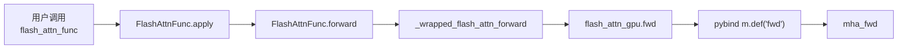

# Python-API · 源码走读

## 读者任务

这篇沿一条真实调用主线走源码：`flash_attn_func(q, k, v)` 如何从公开 API 进入 autograd Function、custom op、`flash_attn_2_cuda.fwd`，再和 C++ `mha_fwd` 衔接。读完后你应该能定位：

- 用户参数在哪一层被解释。
- Q/K/V 什么时候被补齐 head dim 或转成 contiguous。
- `softmax_lse` 和 `rng_state` 为什么在 Python autograd 层保存。
- varlen 和 KV cache 为什么不是 dense forward 的普通参数分支。

## 长文读法

这篇按 Python 到 CUDA extension 的边界读：公开 API 只收集用户意图，`FlashAttnFunc` 决定 autograd 要保存什么，custom op wrapper 做 contiguous 和 mutation 声明，pybind 把 `fwd` / `varlen_fwd` / `fwd_kvcache` 名称接到 C++，varlen 和 KV cache 是独立入口，不是 dense forward 的小分支。

| 你的任务 | 先读 | 抓住什么 |
|----------|------|----------|
| 第一次追 dense forward | 第一步到第四步 | `flash_attn_func -> FlashAttnFunc.apply -> custom op -> flash_attn_2_cuda.fwd -> mha_fwd` |
| 排查用户参数解释 | 第一步 | API 层稳定签名和默认值，但不做 kernel dispatch |
| 排查 backward 需要的状态 | 第二步 | Python autograd 保存 `q/k/v/out/softmax_lse/rng_state`，不保存完整 attention matrix |
| 排查 contiguous / head dim | 第二步到第三步 | head dim padding 在 autograd 层，last-dim contiguous 在 wrapper / C++ 边界检查 |
| 排查 pybind 名称 | 第四步 | Python 调用的是 extension 导出的 `fwd`、`varlen_fwd`、`fwd_kvcache` |
| 分清 varlen / KV cache | 第五步到第六步 | varlen 改 batch 形态，KV cache 是 decode 专用入口 |

## 主线图



## 第一步：公开 API 只收集用户意图

`flash_attn_func` 的职责是稳定用户接口。它不直接实现 attention，也不做 kernel dispatch；它把用户参数交给 `FlashAttnFunc.apply`。

```python
# 来源：flash_attn/flash_attn_interface.py L1156-L1230
def flash_attn_func(
    q,
    k,
    v,
    dropout_p=0.0,
    softmax_scale=None,
    causal=False,
    window_size=(-1, -1),  # -1 means infinite context window
    softcap=0.0, # 0.0 means deactivated
    alibi_slopes=None,
    deterministic=False,
    return_attn_probs=False,
):
    """dropout_p should be set to 0.0 during evaluation
    Supports multi-query and grouped-query attention (MQA/GQA) by passing in KV with fewer heads
    than Q. Note that the number of heads in Q must be divisible by the number of heads in KV.
    For example, if Q has 6 heads and K, V have 2 heads, head 0, 1, 2 of Q will attention to head
    0 of K, V, and head 3, 4, 5 of Q will attention to head 1 of K, V.

    If causal=True, the causal mask is aligned to the bottom right corner of the attention matrix.
    For example, if seqlen_q = 2 and seqlen_k = 5, the causal mask (1 = keep, 0 = masked out) is:
        1 1 1 1 0
        1 1 1 1 1
    If seqlen_q = 5 and seqlen_k = 2, the causal mask is:
        0 0
        0 0
        0 0
        1 0
        1 1
    If the row of the mask is all zero, the output will be zero.

    If window_size != (-1, -1), implements sliding window local attention. Query at position i
    will only attend to keys between
    [i + seqlen_k - seqlen_q - window_size[0], i + seqlen_k - seqlen_q + window_size[1]] inclusive.

    Arguments:
        q: (batch_size, seqlen, nheads, headdim)
        k: (batch_size, seqlen, nheads_k, headdim)
        v: (batch_size, seqlen, nheads_k, headdim)
        dropout_p: float. Dropout probability.
        softmax_scale: float. The scaling of QK^T before applying softmax.
            Default to 1 / sqrt(headdim).
        causal: bool. Whether to apply causal attention mask (e.g., for auto-regressive modeling).
        window_size: (left, right). If not (-1, -1), implements sliding window local attention.
        alibi_slopes: (nheads,) or (batch_size, nheads), fp32. A bias of
            (-alibi_slope * |i + seqlen_k - seqlen_q - j|)
            is added to the attention score of query i and key j.
        deterministic: bool. Whether to use the deterministic implementation of the backward pass,
            which is slightly slower and uses more memory. The forward pass is always deterministic.
        return_attn_probs: bool. Whether to return the attention probabilities. This option is for
           testing only. The returned probabilities are not guaranteed to be correct
           (they might not have the right scaling).
    Return:
        out: (batch_size, seqlen, nheads, headdim).
        softmax_lse [optional, if return_attn_probs=True]: (batch_size, nheads, seqlen). The
            logsumexp of each row of the matrix QK^T * scaling (e.g., log of the softmax
            normalization factor).
        S_dmask [optional, if return_attn_probs=True]: (batch_size, nheads, seqlen, seqlen).
            The output of softmax (possibly with different scaling). It also encodes the dropout
            pattern (negative means that location was dropped, nonnegative means it was kept).
    """
    return FlashAttnFunc.apply(
        q,
        k,
        v,
        dropout_p,
        softmax_scale,
        causal,
        window_size,
        softcap,
        alibi_slopes,
        deterministic,
        return_attn_probs,
        torch.is_grad_enabled(),
    )
```

判断：API docstring 已经给出 MQA/GQA、causal 对齐、local window、testing-only `return_attn_probs` 等语义。后续 C++/CUDA 只是消费这些语义的低层表达。

## 第二步：Autograd Function 决定保存什么

`FlashAttnFunc.forward` 补默认 scale、pad 非 8 倍 head dim，然后调用 `_wrapped_flash_attn_forward`。如果需要梯度，它保存 Q/K/V、输出、LSE 和 RNG。

```python
# 来源：flash_attn/flash_attn_interface.py L828-L878
class FlashAttnFunc(torch.autograd.Function):
    @staticmethod
    def forward(
        ctx,
        q,
        k,
        v,
        dropout_p,
        softmax_scale,
        causal,
        window_size,
        softcap,
        alibi_slopes,
        deterministic,
        return_softmax,
        is_grad_enabled,
    ):
        is_grad = is_grad_enabled and any(
            x.requires_grad for x in [q, k, v]
        )
        if softmax_scale is None:
            softmax_scale = q.shape[-1] ** (-0.5)
        head_size_og = q.size(3)
        if head_size_og % 8 != 0:
            q = torch.nn.functional.pad(q, [0, 8 - head_size_og % 8])
            k = torch.nn.functional.pad(k, [0, 8 - head_size_og % 8])
            v = torch.nn.functional.pad(v, [0, 8 - head_size_og % 8])
        out_padded, softmax_lse, S_dmask, rng_state = _wrapped_flash_attn_forward(
            q,
            k,
            v,
            dropout_p,
            softmax_scale,
            causal=causal,
            window_size_left=window_size[0],
            window_size_right=window_size[1],
            softcap=softcap,
            alibi_slopes=alibi_slopes,
            return_softmax=return_softmax and dropout_p > 0,
        )
        if is_grad:
            ctx.save_for_backward(q, k, v, out_padded, softmax_lse, rng_state)
            ctx.dropout_p = dropout_p
            ctx.softmax_scale = softmax_scale
            ctx.causal = causal
            ctx.window_size = window_size
            ctx.softcap = softcap
            ctx.alibi_slopes = alibi_slopes
            ctx.deterministic = deterministic
        out = out_padded[..., :head_size_og]
        return out if not return_softmax else (out, softmax_lse, S_dmask)
```

判断：Python 层已经解释了三个重要边界：head dim padding 是 API 层兼容措施；`return_attn_probs` 只有 dropout 时才下传；LSE/RNG 是 backward 协议字段。

## 第三步：Custom op wrapper 调用 extension

`_flash_attn_forward` 是 PyTorch custom op 的实际 wrapper。它只做 last-dim contiguous 归一化，然后调用 `flash_attn_gpu.fwd`。

```python
# 来源：flash_attn/flash_attn_interface.py L84-L113
@_torch_custom_op_wrapper("flash_attn::_flash_attn_forward", mutates_args=(), device_types="cuda")
def _flash_attn_forward(
    q: torch.Tensor,
    k: torch.Tensor,
    v: torch.Tensor,
    dropout_p: float,
    softmax_scale: float,
    causal: bool,
    window_size_left: int,
    window_size_right: int,
    softcap: float,
    alibi_slopes: Optional[torch.Tensor],
    return_softmax: bool
) -> Tuple[torch.Tensor, torch.Tensor, torch.Tensor, torch.Tensor]:
    q, k, v = [maybe_contiguous(x) for x in (q, k, v)]
    out, softmax_lse, S_dmask, rng_state = flash_attn_gpu.fwd(
        q,
        k,
        v,
        None,
        alibi_slopes,
        dropout_p,
        softmax_scale,
        causal,
        window_size_left,
        window_size_right,
        softcap,
        return_softmax,
        None,
    )
```

判断：这不是 Python attention 实现。所有真正的 shape/dtype/device 检查和 kernel dispatch 都在 extension 后面。

## 第四步：pybind 把 Python 名称映射到 C++ 函数

`flash_attn_gpu.fwd` 对应 C++ `mha_fwd`。同一个 extension 还暴露 varlen、backward 和 KV cache 入口。

```cpp
// 来源：csrc/flash_attn/flash_api.cpp L1481-L1488
PYBIND11_MODULE(TORCH_EXTENSION_NAME, m) {
    m.doc() = "FlashAttention";
    m.def("fwd", &FLASH_NAMESPACE::mha_fwd, "Forward pass");
    m.def("varlen_fwd", &FLASH_NAMESPACE::mha_varlen_fwd, "Forward pass (variable length)");
    m.def("bwd", &FLASH_NAMESPACE::mha_bwd, "Backward pass");
    m.def("varlen_bwd", &FLASH_NAMESPACE::mha_varlen_bwd, "Backward pass (variable length)");
    m.def("fwd_kvcache", &FLASH_NAMESPACE::mha_fwd_kvcache, "Forward pass, with KV-cache");
}
```

判断：Python API 的不同入口最终不是靠一个万能 C++ 函数分叉，而是映射到不同 C++ 入口。读 dense forward 时不要把 `varlen_fwd` 和 `fwd_kvcache` 混进主线。

## 第五步：Varlen 先改变 batch 形态

varlen API 需要 Q/K/V 先变成连续 token，并用 `cu_seqlens` 表示每条样本边界。

```python
# 来源：flash_attn/flash_attn_interface.py L1391-L1408
def flash_attn_varlen_func(
    q,
    k,
    v,
    cu_seqlens_q,
    cu_seqlens_k,
    max_seqlen_q,
    max_seqlen_k,
    dropout_p=0.0,
    softmax_scale=None,
    causal=False,
    window_size=(-1, -1),  # -1 means infinite context window
    softcap=0.0, # 0.0 means deactivated
    alibi_slopes=None,
    deterministic=False,
    return_attn_probs=False,
    block_table=None,
):
```

`unpad_input` 是常见上游入口：它产出连续 token、scatter 回原始 batch 所需的 indices，以及 kernel 需要的 `cu_seqlens`。

```python
# 来源：flash_attn/bert_padding.py L111-L126
    all_masks = (attention_mask + unused_mask) if unused_mask is not None else attention_mask
    seqlens_in_batch = all_masks.sum(dim=-1, dtype=torch.int32)
    used_seqlens_in_batch = attention_mask.sum(dim=-1, dtype=torch.int32)
    indices = torch.nonzero(all_masks.flatten(), as_tuple=False).flatten()
    max_seqlen_in_batch = seqlens_in_batch.max().item()
    cu_seqlens = F.pad(torch.cumsum(seqlens_in_batch, dim=0, dtype=torch.int32), (1, 0))
    # TD [2022-03-04] We don't want to index with a bool mask, because Pytorch will expand the
    # bool mask, then call nonzero to get the indices, then index with those. The indices is @dim
    # times larger than it needs to be, wasting memory. It's faster and more memory-efficient to
    # index with integer indices. Moreover, torch's index is a bit slower than it needs to be,
    # so we write custom forward and backward to make it a bit faster.
    return (
        index_first_axis(rearrange(hidden_states, "b s ... -> (b s) ..."), indices),
        indices,
        cu_seqlens,
        max_seqlen_in_batch,
```

判断：varlen 的 correctness 依赖边界数组，而不是 Python list 里的 ragged tensor。

## 第六步：KV cache 是 decode 专用入口

`flash_attn_with_kvcache` 的语义更重：它可以原地更新 cache、应用 RoPE、读取 paged KV，并可让 SplitKV 介入。

```python
# 来源：flash_attn/flash_attn_interface.py L1593-L1627
    assert k_cache.stride(-1) == 1, "k_cache must have contiguous last dimension"
    assert v_cache.stride(-1) == 1, "v_cache must have contiguous last dimension"
    q, k, v = [maybe_contiguous(x) for x in (q, k, v)]
    if softmax_scale is None:
        softmax_scale = q.shape[-1] ** (-0.5)
    if cache_seqlens is not None and isinstance(cache_seqlens, int):
        cache_seqlens = torch.full(
            (q.shape[0],), cache_seqlens, dtype=torch.int32, device=k_cache.device
        )
        cache_seqlens = maybe_contiguous(cache_seqlens)
    cache_batch_idx = maybe_contiguous(cache_batch_idx)
    block_table = maybe_contiguous(block_table)
    out, softmax_lse = flash_attn_gpu.fwd_kvcache(
        q,
        k_cache,
        v_cache,
        k,
        v,
        cache_seqlens,
        rotary_cos,
        rotary_sin,
        cache_batch_idx,
        cache_leftpad,
        block_table,
        alibi_slopes,
        None,
        softmax_scale,
        causal,
        window_size[0],
        window_size[1],
        softcap,
        rotary_interleaved,
        num_splits,
    )
    return (out, softmax_lse) if return_softmax_lse else out
```

判断：decode 路径和 dense forward 共用一些参数，但问题重心完全不同。这里的第一排障入口是 cache shape、cache length、block table、RoPE 和 SplitKV。

## 运行验证

| 验证目标 | 操作 | 预期 |
|----------|------|------|
| dense API 入口 | `from flash_attn import flash_attn_func` | import 成功 |
| custom op 路径 | `hasattr(torch.ops, "flash_attn")` 并检查 `_flash_attn_forward` | PyTorch 2.4+ 应可见 |
| extension 入口 | import `flash_attn_2_cuda` | 成功说明主包 extension 可加载 |
| varlen 边界 | 构造 attention mask 后调用 `unpad_input` | `cu_seqlens[-1] == total_nnz` |
| KV cache 边界 | 传 int `cache_seqlens` | Python 层转成 int32 tensor |

## 复盘

Python 源码走读的核心不是“函数很多”，而是每条路径都把上层意图压成更底层的契约：dense 是 Q/K/V 契约，varlen 是连续 token + `cu_seqlens` 契约，KV cache 是 cache 状态契约。下一篇 [[FlashAttention-Python-API-数据流]] 会把对象形态串成生命周期。
