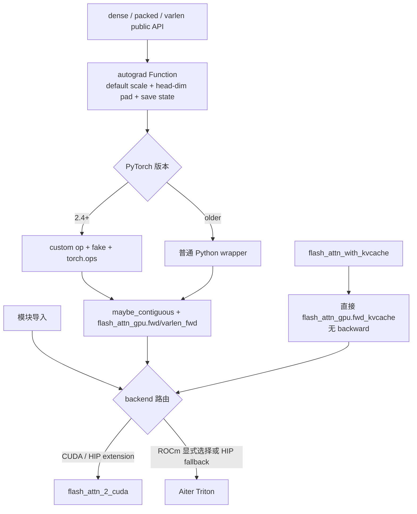

# Python-API

## 读者任务

这个专题解决“Python 入口到底做了什么”的问题。读完后你应该能做到：

- 区分 dense、packed、varlen、KV cache 四类 API 形态。
- 解释 `flash_attn_func` 为什么不是 Python 实现 attention，而是 API 契约、autograd、custom op 与 backend 的交界面。
- 从 `flash_attn_func(q, k, v)` 先追到 `_wrapped_flash_attn_forward → flash_attn_gpu.fwd`，再判断当前 backend 是否继续经过 pybind `m.def("fwd") → mha_fwd`。
- 判断 import error、stride/dtype 报错、`return_attn_probs` 误用、varlen 边界错、KV cache decode 慢分别该看哪一层。

## 先建立模型：Python 层是“入口海关”



第一层路由发生在模块导入：CUDA compiled extension、HIP compiled extension 与 ROCm Triton 并非同一实现链；只有 HIP 分支会在 extension 导入失败时自动切到 Triton，普通 CUDA import 失败不会自动 fallback。第二层路由由 PyTorch 版本决定：2.4+ 注册 custom op/fake，旧版本 decorator 退化为 no-op。KV-cache 在当前基线直接调用 backend，不经过 dense/varlen 的 custom-op/fake 路径。

这层不负责 tile、online softmax 或 kernel 主循环。它负责把上层框架的张量和参数意图变成 backend 契约；只有 compiled-extension 分支才继续经过 pybind/C++，不能把这条链外推给 ROCm Triton。

## 源码范围

| 文件 | 本专题怎么看 |
|------|--------------|
| `flash_attn/__init__.py` | 公开 API 表面，区分 dense、packed、varlen、KV cache |
| `flash_attn/flash_attn_interface.py` | wrapper、custom op、fake tensor、autograd、KV cache API |
| `flash_attn/bert_padding.py` | padded batch 到 packed token + `cu_seqlens` 的转换 |
| `flash_attn/modules/mha.py` | 模型层如何选择 FlashAttention 与 KV cache fast path |
| `csrc/flash_attn/flash_api.cpp` | pybind 暴露哪些 C++ 入口，以及 C++ 检查从哪里开始 |

## 阅读顺序

| 顺序 | 文件 | 读者任务 |
|------|------|----------|
| 1 | [[FlashAttention-Python-API-核心概念]] | 建立 API 形态、dispatcher、autograd、varlen、KV cache 的心理模型 |
| 2 | [[FlashAttention-Python-API-源码走读]] | 沿 dense forward、varlen、KV cache 三条入口看源码证据 |
| 3 | [[FlashAttention-Python-API-数据流]] | 看对象从 tensor 到 params、从 padded 到 packed、从 cache 到 output 的生命周期 |
| 4 | [[FlashAttention-Python-API-排障指南]] | 按症状排查 import、ABI、stride、fake tensor、return probs、varlen 和 KV cache 问题 |
| 5 | [[FlashAttention-Python-API-学习检查]] | 用命令和口述自测确认能进入下一层 FA2 forward |

## 静态验收

```powershell
rg -n 'USE_TRITON_ROCM|noop_custom_op_wrapper|register_fake|_wrapped_flash_attn_forward|fwd_kvcache' flash-attn/flash-attention/flash_attn/flash_attn_interface.py
```

预期能同时定位 backend 分叉、PyTorch 2.4 前后的 wrapper 分叉、dense/varlen wrapped op 与 KV-cache 直调。若只能找到一条从 public API 到 C++ 的直线，说明尚未建立本专题要求的两层路由模型。静态定位不证明 extension、GPU 数值或 compile 图可执行。

## 读完后的下一跳

| 你要继续看 | 下一篇 |
|------------|--------|
| C++ 参数包与 forward launch | [[FlashAttention-FA2-Forward]] |
| backward 保存和重算 | [[FlashAttention-Backward]] |
| varlen 对 kernel 的影响 | [[FlashAttention-FA2-Forward-源码走读]] |
| decode / KV cache | [[FlashAttention-KV-Cache]] |
| FA4 CuTeDSL API | [[FlashAttention-FA4-CuTeDSL演进]] |

## 复盘

Python API 层的核心价值不是“包装 CUDA”，而是把训练、推理、变长、cache、autograd、compiler 生态统一到几个可维护入口上。读这层时始终追问：这个参数在哪一层被解释，哪个对象持有状态，下一跳消费者是谁。
