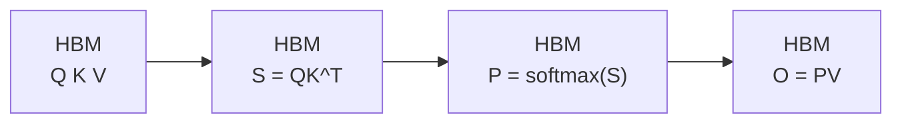
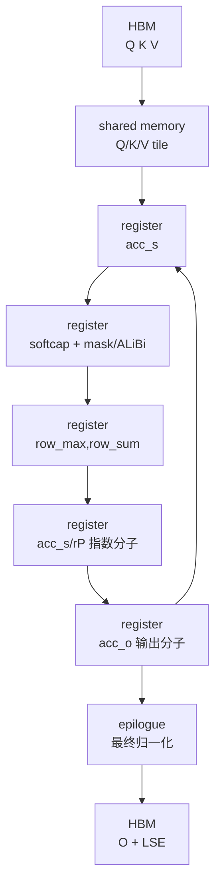

# Attention-IO · 数据流

> 本页以基线 `002cce0` 的 FA2 standard 非测试 forward 为主，把公式里的 score、softmax 权重和 O 放回实际存储层级。读完后，你应该能看到每个对象在哪里出生、在哪里被消费、是否写回 HBM。

## 你为什么要读

Attention IO 的关键不是变量改了几次名，而是数据在哪一层存储停留。本文沿 `Q/K/V -> score tile -> online softmax 状态 -> O/LSE` 追踪 HBM、shared memory 与 register 的交接；当性能或数值异常时，你可以先判断是哪次搬运或缩放出了问题。

## 物化式 attention 数据流



这是一种用于对照的物化式实现，不代表所有“非 FlashAttention”kernel 都必然逐步写出两张矩阵。它的危险点是 score/P 不是最终产物，却可能成为 `Sq x Sk` 的 HBM 中间状态；self-attention 且 Q/K 等长时才退化成 `N x N`。

## FlashAttention 数据流



循环箭头表示同一个 query block 从当前可见 K 范围的右端向左继续扫描 K/V。score 和指数权重不消失，但它们变成 register 里的短生命周期 tile；`rP` 尚未除最终 `row_sum`，不能标成最终概率。

## 生命周期表

| 数据 | 形态 | 存储位置 | 生命周期 |
|------|------|----------|----------|
| Q/K/V | 完整输入 tensor | HBM | 整个调用 |
| `mQ/mK/mV` | HBM view | HBM 地址视图 | 当前 kernel |
| `gQ/gK/gV` | 当前 CTA 的 HBM tile | HBM tile view | 当前 block |
| `sQ/sK/sV` | Q/K/V tile staging | shared memory | 当前 CTA |
| `acc_s` | 先是 score，online softmax 后原地变成指数分子 | register | 当前 K/V block |
| `row_max/row_sum` | softmax 行状态 | register | 当前 Q block 扫完所有 K/V |
| `rP` | 指数分子的低精度副本；dropout 可改写 | register | 当前 K/V block |
| `acc_o` | 尚未除最终 `row_sum` 的输出分子 | register | 当前 Q block 扫完所有 K/V |
| `gO/gLSE` | 输出 tile 与 LSE tile | HBM view | epilogue |

表格依据：

- HBM view 与 tile：来源：csrc/flash_attn/src/flash_fwd_kernel.h L138-L177
- Q/K/V copy 与初始化：来源：csrc/flash_attn/src/flash_fwd_kernel.h L250-L288
- score/指数权重/output accumulator：来源：csrc/flash_attn/src/flash_fwd_kernel.h L301-L367
- online softmax state：来源：csrc/flash_attn/src/softmax.h L128-L189
- O/LSE 写回：来源：csrc/flash_attn/src/flash_fwd_kernel.h L431-L494

## 命名规律

| 前缀/变量 | 读法 |
|-----------|------|
| `m*` | memory view，完整 HBM tensor 视图。 |
| `g*` | global-memory tile，当前 CTA 访问的 HBM tile。 |
| `s*` | shared memory tile。 |
| `t*` | 某个 copy/MMA 线程视角下的 partition。 |
| `acc_*` | register accumulator。 |
| `rP/rO` | 从 accumulator 转成元素类型后的 register tile；字母 P 不保证已完成最终归一化。 |

这个命名规律比单独背 CuTe 类型更重要。先判断变量在哪个存储层，再读具体 layout。

## 数据如何跨层级移动

1. C++ 参数包提供 Q/K/V/O 指针和 stride。来源：csrc/flash_attn/src/flash.h L21-L71
2. kernel 用这些指针构造 `mQ/mK/mV`，再用 `local_tile` 得到 `gQ/gK/gV`。来源：csrc/flash_attn/src/flash_fwd_kernel.h L138-L177
3. traits 定义 `GmemTiledCopyQKV`，把 HBM tile copy 到 `sQ/sK/sV`。来源：csrc/flash_attn/src/kernel_traits.h L111-L137
4. 主循环把 shared memory tile 喂给 MMA，生成 register 里的 `acc_s` 和 `acc_o`。来源：csrc/flash_attn/src/flash_fwd_kernel.h L301-L367
5. epilogue 把 `acc_o` 经 shared memory 重排后写回 `gO`，并写 `gLSE`。来源：csrc/flash_attn/src/flash_fwd_kernel.h L431-L494

## 读图时的判断标准

看到一个对象，先问三件事：

1. 它是不是完整 `Sq x Sk` 状态（等长 self-attention 时为 `N x N`）？
2. 它是否跨 K/V blocks 保留？
3. 它最终是否写回 HBM？

`acc_s` 和 `rP` 的答案分别是：局部 `kBlockM x kBlockN`、不跨 block、standard 非测试路径不写回。`acc_o` 的答案是：局部 `kBlockM x D`、跨 block，epilogue 归一化后写回 O。`row_max/row_sum` 的答案是：每行状态、跨 block，共同生成 LSE。

例外要单列：`Return_softmax` 会把带 dropout 符号编码、缩放不保证正确的 `S_dmask` 写到 HBM；multi-split 会写 partial O/LSE 再 combine。它们改变写回集合，但不等于常规完整最终 P。

这就是 Attention IO 的数据流核心。

## 运行验证

这篇讲的是变量生命周期，最直接的验证是核对命名和写回点仍在 forward kernel 与 softmax helper 中：

```powershell
rg -n 'mQ|mK|mV|gQ|gK|gV|sQ|sK|sV|acc_s|acc_o|row_max|row_sum|gO|gLSE|GmemTiledCopyQKV|softmax_lse' flash-attn/flash-attention/csrc/flash_attn/src/flash.h flash-attn/flash-attention/csrc/flash_attn/src/flash_fwd_kernel.h flash-attn/flash-attention/csrc/flash_attn/src/kernel_traits.h flash-attn/flash-attention/csrc/flash_attn/src/softmax.h
```

预期：输出能串成“HBM view → shared memory tile → score/指数分子 → 跨 tile 行状态与输出分子 → epilogue O/LSE”。若只看到变量名而不能指出 `rP` 是否归一化、是否写 HBM，说明验证尚未通过。
