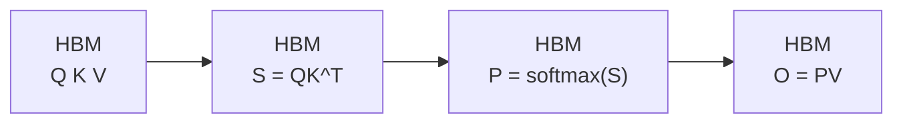
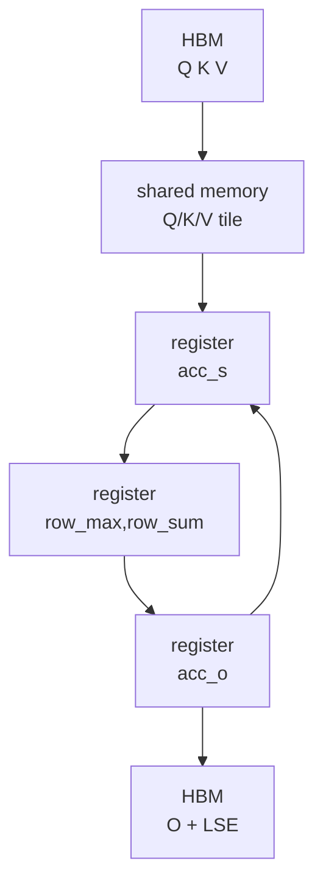

# Attention-IO · 数据流

> 本页把公式里的 `S/P/O` 放回实际存储层级。读完后，你应该能看到每个对象在哪里出生、在哪里被消费、是否写回 HBM。

## 你为什么要读

Attention IO 的关键不是变量改了几次名，而是数据在哪一层存储停留。本文沿 `Q/K/V -> score tile -> online softmax 状态 -> O/LSE` 追踪 HBM、shared memory 与 register 的交接；当性能或数值异常时，你可以先判断是哪次搬运或缩放出了问题。

## 标准 attention 数据流



这个模型的危险点是 `S/P`。它们不是最终产物，却可能成为 `N x N` 的 HBM 中间状态。

## FlashAttention 数据流



循环箭头表示同一个 query block 会继续扫描下一块 K/V。`S/P` 不消失，但它们变成 register 里的短生命周期 tile。

## 生命周期表

| 数据 | 形态 | 存储位置 | 生命周期 |
|------|------|----------|----------|
| Q/K/V | 完整输入 tensor | HBM | 整个调用 |
| `mQ/mK/mV` | HBM view | HBM 地址视图 | 当前 kernel |
| `gQ/gK/gV` | 当前 CTA 的 HBM tile | HBM tile view | 当前 block |
| `sQ/sK/sV` | Q/K/V tile staging | shared memory | 当前 CTA |
| `acc_s` | 当前 Q block x K block score | register | 当前 K/V block |
| `row_max/row_sum` | softmax 行状态 | register | 当前 Q block 扫完所有 K/V |
| `rP` | 当前概率 tile | register | 当前 K/V block |
| `acc_o` | 输出累积 | register | 当前 Q block 扫完所有 K/V |
| `gO/gLSE` | 输出 tile 与 LSE tile | HBM view | epilogue |

表格依据：

- HBM view 与 tile：来源：csrc/flash_attn/src/flash_fwd_kernel.h L138-L177
- Q/K/V copy 与初始化：来源：csrc/flash_attn/src/flash_fwd_kernel.h L250-L288
- score/probability/output accumulator：来源：csrc/flash_attn/src/flash_fwd_kernel.h L301-L367
- online softmax state：来源：csrc/flash_attn/src/softmax.h L128-L189
- O/LSE 写回：来源：csrc/flash_attn/src/flash_fwd_kernel.h L431-L494

## 命名规律

| 前缀/变量 | 读法 |
|-----------|------|
| `m*` | memory view，完整 HBM tensor 视图。 |
| `g*` | global-memory tile，当前 CTA 访问的 HBM tile。 |
| `s*` | shared memory tile。 |
| `t*` | 某个 copy/MMA 线程视角下的 partition。 |
| `acc_*` | register accumulator。 |
| `rP/rO` | 从 accumulator 转成元素类型后的 register tile。 |

这个命名规律比单独背 CuTe 类型更重要。先判断变量在哪个存储层，再读具体 layout。

## 数据如何跨层级移动

1. C++ 参数包提供 Q/K/V/O 指针和 stride。来源：csrc/flash_attn/src/flash.h L21-L71
2. kernel 用这些指针构造 `mQ/mK/mV`，再用 `local_tile` 得到 `gQ/gK/gV`。来源：csrc/flash_attn/src/flash_fwd_kernel.h L138-L177
3. traits 定义 `GmemTiledCopyQKV`，把 HBM tile copy 到 `sQ/sK/sV`。来源：csrc/flash_attn/src/kernel_traits.h L111-L137
4. 主循环把 shared memory tile 喂给 MMA，生成 register 里的 `acc_s` 和 `acc_o`。来源：csrc/flash_attn/src/flash_fwd_kernel.h L301-L367
5. epilogue 把 `acc_o` 经 shared memory 重排后写回 `gO`，并写 `gLSE`。来源：csrc/flash_attn/src/flash_fwd_kernel.h L431-L494

## 读图时的判断标准

看到一个对象，先问三件事：

1. 它是不是完整 `N x N` 状态？
2. 它是否跨 K/V blocks 保留？
3. 它最终是否写回 HBM？

`acc_s` 和 `rP` 的答案分别是：局部 `kBlockM x kBlockN`、不跨 block、常规不写回。`acc_o` 的答案是：局部 `kBlockM x D`、跨 block、最终写回 O。`row_max/row_sum` 的答案是：每行状态、跨 block、最终压成 LSE。

这就是 Attention IO 的数据流核心。

## 运行验证

这篇讲的是变量生命周期，最直接的验证是核对命名和写回点仍在 forward kernel 与 softmax helper 中：

```powershell
rg -n 'mQ|mK|mV|gQ|gK|gV|sQ|sK|sV|acc_s|acc_o|row_max|row_sum|gO|gLSE|GmemTiledCopyQKV|softmax_lse' flash-attn/flash-attention/csrc/flash_attn/src/flash.h flash-attn/flash-attention/csrc/flash_attn/src/flash_fwd_kernel.h flash-attn/flash-attention/csrc/flash_attn/src/kernel_traits.h flash-attn/flash-attention/csrc/flash_attn/src/softmax.h
```

读输出时按“HBM view → shared memory tile → register accumulator → O/LSE 写回”的顺序串起来，而不是逐个背变量名。
