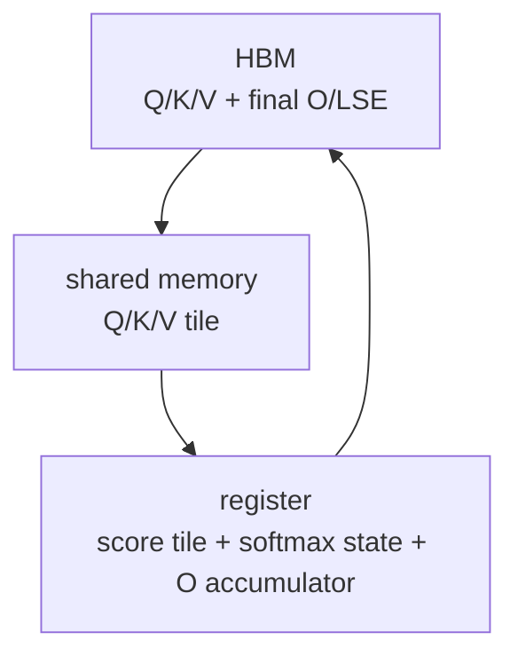

# Attention-IO · 核心概念

> 本页先建立直觉：FlashAttention 的核心不是把 attention 变成近似算法，而是改变中间状态在 GPU 存储层级里的生命周期。

## 读者任务

读完本页，你应该能做到：

1. 解释标准 attention 为什么会产生 `N x N` 级别的 HBM 中间状态。
2. 区分 HBM、shared memory、register 在 FlashAttention 里的职责。
3. 解释 `S/P` 为什么可以是 tile 内短生命周期对象。
4. 解释 `O/LSE` 为什么是长期输出，而完整 `P` 不是常规路径。

## 标准 attention 的危险状态

标准 attention 的公式很短：

```text
S = QK^T
P = softmax(S)
O = PV
```

如果把 `S` 和 `P` 都 materialize 成 HBM 里的完整矩阵，它们的形状是 `seqlen_q x seqlen_k`。序列长度翻倍，`Q/K/V/O` 近似线性增长，但 `S/P` 的读写按二次方增长。FlashAttention 的问题意识就在这里：不要把局部中间状态升级成长期 HBM 状态。

## 三层存储模型

| 存储层 | 容量/速度直觉 | FlashAttention 中的角色 |
|--------|---------------|--------------------------|
| HBM | 容量大、慢 | 保存输入 Q/K/V，最终 O，LSE。 |
| shared memory | 容量小、快 | 暂存当前 CTA 需要的 Q/K/V tile。 |
| register | 最快、最稀缺 | 保存 `acc_s`、`row_max`、`row_sum`、`acc_o`。 |



这张图里没有完整 `P` 的 HBM 节点。局部 `P` 仍然会被算出来，但它在寄存器 tile 中马上参与 `P @ V`，不作为长期矩阵保存。

## Exact attention 的关键状态

FlashAttention 不近似 softmax。它让每个 query row 在扫描多个 K/V tile 时维护两类跨 tile 状态：

| 状态 | 含义 | 为什么必须保留 |
|------|------|----------------|
| `row_max` | 已扫描 K/V blocks 的行最大值 | 新 block 可能改变 softmax 的数值基准。 |
| `row_sum` | 已扫描 K/V blocks 的指数和 | 最终归一化需要完整行的分母。 |
| `acc_o` | 已扫描 K/V blocks 对 O 的累计贡献 | `P @ V` 的跨 block 输出累积。 |

`Softmax` 结构体在源码里正是保存 `row_max` 和 `row_sum`。后续 block 到来时，`softmax_rescale_o` 会用新旧 max 的差值重缩放旧 `row_sum` 和旧 `acc_o`。来源：csrc/flash_attn/src/softmax.h L128-L167

最后 `normalize_softmax_lse` 计算每行 LSE，并归一化 `acc_o`。来源：csrc/flash_attn/src/softmax.h L169-L189

## 源码里的长期状态

`Flash_fwd_params` 继承 `Qkv_params`，保存 Q/K/V 指针和 stride；forward 额外保存 O 指针、可选 `p_ptr`、`softmax_lse_ptr`、维度、scale、dropout、window、随机状态等。来源：csrc/flash_attn/src/flash.h L21-L143

从 IO 角度看，最重要的是：

| 字段 | IO 含义 |
|------|---------|
| `q_ptr/k_ptr/v_ptr` | 必须从 HBM 读取的输入。 |
| `o_ptr` | 必须写回 HBM 的最终输出。 |
| `softmax_lse_ptr` | 每行 softmax 归一化因子的压缩状态。 |
| `p_ptr` | 可选测试/dropout路径，不是常规持久输出。 |
| `oaccum_ptr/softmax_lseaccum_ptr` | SplitKV 等路径的 partial accumulation，不是完整 `P`。 |

fixed-length forward 的 C++ 入口总是分配 `softmax_lse`，但只有 `return_softmax` 打开时才分配 `p`，并且要求 dropout 大于 0。随后 `set_params_fprop` 把 `return_softmax ? p.data_ptr() : nullptr` 和 `softmax_lse.data_ptr()` 写入参数包。来源：csrc/flash_attn/flash_api.cpp L420-L470

这就是源码层面的判断标准：看到结构体里有 `p_ptr` 不等于常规路径保存完整 attention matrix；要看调用入口是否分配、是否传非空指针、kernel 是否实际写出。

## IO-aware 不等于只看显存峰值

显存峰值下降只是结果。更本质的问题是 HBM traffic：

| 常规路径风险 | FlashAttention 做法 |
|--------------|---------------------|
| 写出完整 `S`，再读回做 softmax | `acc_s` 在 register tile 内生成并处理。 |
| 写出完整 `P`，再读回乘 V | `rP` 立即乘 V，累积到 `acc_o`。 |
| backward 依赖保存概率矩阵 | forward 保存 LSE，backward 可重算局部概率。 |

源码主循环展示了这个顺序：QK GEMM 生成 `acc_s`，mask 后调用 `softmax_rescale_o`，再把 `acc_s` 转成 `rP`，马上做 `gemm_rs(acc_o, P, V)`。来源：csrc/flash_attn/src/flash_fwd_kernel.h L301-L367

## 一句话

FlashAttention 的核心不是“不算 `S/P`”，而是“`S/P` 只在 tile 级别出现，出现后立刻被消费；跨 tile 长期保存的是 `row_max/row_sum/acc_o`，跨 kernel 长期写回的是 `O/LSE`”。
