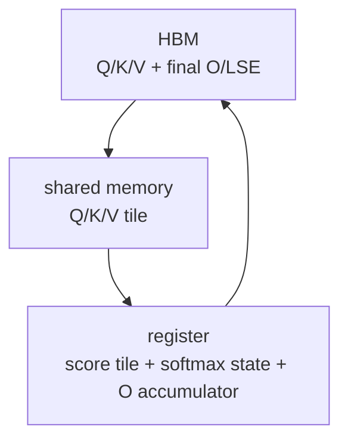

# Attention-IO · 核心概念

> 本页以基线 `002cce0` 的 FA2 standard forward 为实现落点，先建立直觉：FlashAttention 的核心不是把 attention 变成近似算法，而是改变中间状态在 GPU 存储层级里的生命周期。

## 读者任务

读完本页，你应该能做到：

1. 解释物化式 self-attention 为什么会产生 `N x N`、一般 Q/K 为什么会产生 `Sq x Sk` 的 HBM 中间状态。
2. 区分 HBM、shared memory、register 在 FlashAttention 里的职责。
3. 解释 score 与未归一化指数权重为什么可以是 tile 内短生命周期对象。
4. 解释 `O/LSE` 为什么是长期输出，而完整 `P` 不是常规路径。

## 标准 attention 的危险状态

标准 attention 的公式很短：

```text
S = QK^T
P = softmax(S)
O = PV
```

如果把 `S` 和 `P` 都 materialize 成 HBM 里的完整矩阵，它们的形状是 `seqlen_q x seqlen_k`。在 self-attention 且 Q/K 同步增长的特例中，序列长度翻倍会让这块二维中间态面积约增至四倍；更一般地，代价按 `Sq x Sk` 增长。FlashAttention 的问题意识就在这里：不要把局部中间状态升级成长期 HBM 状态。实际耗时仍取决于 kernel、硬件、dtype 与 shape，不能由复杂度单独推出固定加速比。

## 三层存储模型

| 存储层 | 容量/速度直觉 | FlashAttention 中的角色 |
|--------|---------------|--------------------------|
| HBM | 相对容量大、片外访问代价高 | 保存输入 Q/K/V，最终 O，LSE。 |
| shared memory | CTA 内共享、容量受限 | 暂存当前 CTA 需要的 Q/K/V tile。 |
| register | 线程私有、最稀缺 | 保存 `acc_s`、`row_max`、`row_sum`、`acc_o` fragment。 |



这张图里没有常规完整 P 的 HBM 节点。online softmax 后的 `acc_s` 是以当前全局行最大值为标尺的未归一化指数分子，`rP` 是其低精度副本；它马上参与权重乘 V，不作为长期矩阵保存。最终除完整行分母发生在 epilogue。

## Exact attention 的关键状态

FlashAttention 不近似 softmax。它让每个 query row 在扫描多个 K/V tile 时维护三类跨 tile 状态：

| 状态 | 含义 | 为什么必须保留 |
|------|------|----------------|
| `row_max` | 已扫描 K/V blocks 的行最大值 | 新 block 可能改变 softmax 的数值基准。 |
| `row_sum` | 已扫描 K/V blocks 的指数和 | 最终归一化需要完整行的分母。 |
| `acc_o` | 尚未除最终 `row_sum` 的输出分子 | 未归一化权重乘 V 的跨 block 累积。 |

`Softmax` 结构体在源码里正是保存 `row_max` 和 `row_sum`。后续 block 到来时，`softmax_rescale_o` 会用新旧 max 的差值重缩放旧 `row_sum` 和旧 `acc_o`。来源：csrc/flash_attn/src/softmax.h L128-L167

最后 `normalize_softmax_lse` 才计算每行 LSE，并归一化 `acc_o`；dropout 路径还乘 `1 / p_keep`。整行无有效 key 时，non-split 与 split partial 分别使用 `+inf`、`-inf` LSE 工程哨兵。来源：csrc/flash_attn/src/softmax.h L169-L189

## 源码里的长期状态

`Flash_fwd_params` 继承 `Qkv_params`，保存 Q/K/V 指针和 stride；forward 额外保存 O 指针、可选 `p_ptr`、`softmax_lse_ptr`、维度、scale、dropout、window、随机状态等。来源：csrc/flash_attn/src/flash.h L21-L143

从 IO 角度看，最重要的是：

| 字段 | IO 含义 |
|------|---------|
| `q_ptr/k_ptr/v_ptr` | 必须从 HBM 读取的输入。 |
| `o_ptr` | 必须写回 HBM 的最终输出。 |
| `softmax_lse_ptr` | 每行 softmax 归一化因子的压缩状态。 |
| `p_ptr` | 可选 dropout 测试路径；`S_dmask` 缩放不保证等于最终概率，并用符号编码 keep/drop。 |
| `oaccum_ptr/softmax_lseaccum_ptr` | SplitKV 等路径的 partial accumulation，不是完整 `P`。 |

fixed-length forward 的 C++ 入口总是分配 `softmax_lse`，但只有 `return_softmax` 打开时才分配 `p`，并且要求 dropout 大于 0。随后 `set_params_fprop` 把 `return_softmax ? p.data_ptr() : nullptr` 和 `softmax_lse.data_ptr()` 写入参数包。来源：csrc/flash_attn/flash_api.cpp L420-L470

这就是源码层面的判断标准：看到结构体里有 `p_ptr` 不等于常规路径保存完整 attention matrix；要看调用入口是否分配、是否传非空指针、launch 是否启用 `Return_softmax`、kernel 是否实际写出。来源：flash_attn/flash_attn_interface.py L1052-L1062

## IO-aware 不等于只看显存峰值

显存峰值下降只是结果。更本质的问题是 HBM traffic：

| 常规路径风险 | FlashAttention 做法 |
|--------------|---------------------|
| 写出完整 `S`，再读回做 softmax | `acc_s` 在 register tile 内生成并处理。 |
| 写出完整 `P`，再读回乘 V | 未归一化 `rP` 立即乘 V，累积到 `acc_o`，epilogue 再统一归一化。 |
| backward 依赖保存概率矩阵 | forward 保存 LSE，backward 可重算局部概率。 |

源码主循环展示了这个顺序：QK GEMM 生成 `acc_s`，先 softcap、再 mask/ALiBi，然后调用 `softmax_rescale_o` 把它改写为指数分子，再转成 `rP`，马上做 `gemm_rs(acc_o, rP, V)`。来源：csrc/flash_attn/src/flash_fwd_kernel.h L301-L367

## 一句话

FlashAttention 的核心不是“不算 score 和 softmax 权重”，而是“它们只在 tile 级别出现并立即被消费；跨 tile 保存的是 `row_max/row_sum/acc_o`，standard 非测试路径跨 kernel 写回的主数值状态是 `O/LSE`”。测试 `S_dmask` 与 multi-split partial O/LSE 是显式例外。
