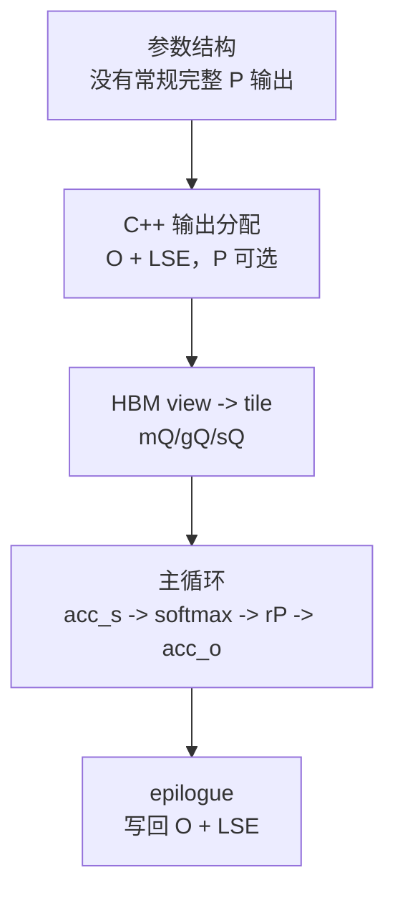

# Attention-IO · 源码走读

> 本页只证明一个主张：常规 forward 的长期 HBM 状态是 `Q/K/V -> O/LSE`，局部 `S/P` 只在 tile 内生成、修正、消费。

## 设计主线



本页不逐行讲所有 CuTe layout，而是沿 IO 证据链读：结构体允许什么长期状态，C++ 入口实际分配什么，kernel 内部让 `S/P` 活多久，最后 HBM 写回什么。

## 长文读法

这篇只证明一个 IO 主张：常规 forward 的长期 HBM 状态是 `Q/K/V -> O/LSE`，完整 `S/P` 不应长期落回 HBM。读的时候沿“参数结构允许什么、C++ 分配什么、kernel tile 内生成什么、epilogue 写回什么”这条证据链走。

| 你的任务 | 先读 | 抓住什么 |
|----------|------|----------|
| 建立 IO 证据链 | 设计主线、源码依据 | 这篇不是性能口号，而是用结构体、C++ 分配和 kernel 写回证明状态边界 |
| 排查长期状态 | 1 到 2 | 参数和 C++ 输出分配显示常规路径只保留 O / LSE |
| 排查 HBM 读写 | 3 到 4 | traits 和 tile view 决定 Q/K/V 如何进入片上计算 |
| 理解 `S/P` 生命周期 | 5 | score / probability 只在 tile 内生成、修正、消费 |
| 理解写回 | 6 | epilogue 把累计输出和 LSE 写回 HBM |
| 做源码验证 | 验证方式 | grep 参数结构、`mha_fwd`、`compute_attn`、`normalize_softmax_lse` |

## 源码依据

- 参数结构：来源：csrc/flash_attn/src/flash.h L21-L143
- C++ 输出分配与参数写入：来源：csrc/flash_attn/flash_api.cpp L420-L470
- kernel traits 与 HBM copy layout：来源：csrc/flash_attn/src/kernel_traits.h L48-L137
- HBM view 与 tile：来源：csrc/flash_attn/src/flash_fwd_kernel.h L138-L177
- Q/K/V copy 与片上状态初始化：来源：csrc/flash_attn/src/flash_fwd_kernel.h L250-L288
- tile 主循环：来源：csrc/flash_attn/src/flash_fwd_kernel.h L301-L367
- online softmax：来源：csrc/flash_attn/src/softmax.h L128-L189
- O/LSE 写回：来源：csrc/flash_attn/src/flash_fwd_kernel.h L431-L494

## 1. 参数结构先暴露长期状态边界

`Qkv_params` 保存 Q/K/V 指针、stride、head 数和 GQA 比例；`Flash_fwd_params` 增加输出 O、可选 P、LSE、维度、scale、dropout、window、cache 和 splitKV 等字段。来源：csrc/flash_attn/src/flash.h L21-L143

从 IO 角度看，字段可以分成三类：

| 类型 | 字段例子 | 含义 |
|------|----------|------|
| 必要 HBM 输入/输出 | `q_ptr/k_ptr/v_ptr/o_ptr` | 输入 Q/K/V 与最终 O。 |
| 压缩状态 | `softmax_lse_ptr` | 每行 softmax 归一化因子。 |
| 可选/变体路径 | `p_ptr`、`oaccum_ptr`、`softmax_lseaccum_ptr` | 测试/dropout返回、SplitKV partial accumulation。 |

这里已经能看到第一条证据：结构体的中心不是完整 `P`，而是 O、LSE 和必要的输入指针。

## 2. C++ 入口实际只固定分配 O 与 LSE

`mha_fwd` 要么复用并校验外部 `out_`，要么 `empty_like(q)` 创建 O。它总是分配 fp32 `softmax_lse`，但 `p` 只有在 `return_softmax` 为真时才分配，并且 C++ 明确要求 `p_dropout > 0`。随后 `set_params_fprop` 把 `return_softmax ? p.data_ptr() : nullptr` 与 `softmax_lse.data_ptr()` 传入参数包。来源：csrc/flash_attn/flash_api.cpp L420-L470

判断常规 IO 路径时，看这一层比看结构体字段更可靠：

```text
常规 forward: p_ptr = nullptr, softmax_lse_ptr != nullptr
测试/dropout返回: p_ptr != nullptr
```

所以 `p_ptr` 的存在不是“主路径仍保存完整 attention matrix”的证据。真正的分界在 C++ 输出分配和传参。

## 3. 必要 HBM 访问也被 traits 约束

FlashAttention 不是完全不读写 HBM。Q/K/V 必须读，O/LSE 必须写。`Flash_fwd_kernel_traits` 用 `kBlockM/kBlockN/kHeadDim/kNWarps` 固化 CTA 形状，用 shared memory layout 描述 Q/K/V/O tile，并用 128-bit copy layout 组织 global memory 访问。来源：csrc/flash_attn/src/kernel_traits.h L48-L137

这一步证明了 IO-aware 的第二层含义：

| 层次 | 目标 |
|------|------|
| 算法层 | 不把完整 `S/P` 写回 HBM。 |
| kernel 层 | 对必须发生的 Q/K/V/O HBM 访问做 coalesced/vectorized copy。 |

减少 HBM 状态和优化必要 HBM transaction 是两件事，源码里两者都存在。

## 4. kernel 把 HBM tensor 切成当前 CTA 的 tile

`compute_attn` 先用 Q/K/V 指针和 stride 构造 HBM view：`mQ/mK/mV`。再用 `local_tile` 得到当前 query block 的 `gQ`，以及 K/V 的 block 视图 `gK/gV`。随后用 traits layout 在 shared memory 里构造 `sQ/sK/sV`。来源：csrc/flash_attn/src/flash_fwd_kernel.h L138-L177

读这里要记住命名层级：

| 源码变量 | 存储层级 |
|----------|----------|
| `mQ/mK/mV` | HBM tensor view |
| `gQ/gK/gV` | 当前 HBM tile view |
| `sQ/sK/sV` | shared memory tile |
| `tSrQ`、`acc_s`、`acc_o` | register fragment |

从这一刻开始，kernel 不再面对完整 attention matrix，而是处理一个 query block 和一组 K/V blocks。

## 5. 主循环让 `S/P` 只活在 tile 内

进入主循环前，kernel 先 copy Q tile，预取一个 K tile，必要时把 Q retile 到寄存器，清零 `acc_o`，并构造 `Softmax` 与 `Mask`。来源：csrc/flash_attn/src/flash_fwd_kernel.h L250-L288

每一轮 K/V block 中，源码顺序是：

1. 创建并清零 `acc_s`。
2. 用 Q/K 做 GEMM 得到局部 score tile。
3. 对 `acc_s` 做 softcap/mask。
4. 调 `softmax_rescale_o` 更新 `row_max/row_sum` 并重缩放旧 `acc_o`。
5. 将 `acc_s` 转成 `rP`。
6. 用 `gemm_rs(acc_o, P, V)` 把概率 tile 乘 V 并累积输出。

主循环证据：来源：csrc/flash_attn/src/flash_fwd_kernel.h L301-L367

online softmax 证据：来源：csrc/flash_attn/src/softmax.h L128-L189

这一段是 FA01 的核心：`acc_s` 生成即被修正和 softmax，`rP` 生成即被乘 V。跨 K/V block 留下的是 `row_max/row_sum/acc_o`，不是完整 `S/P`。

## 6. Epilogue 只把 O 与 LSE 写回 HBM

扫描完所有 K/V blocks 后，epilogue 调 `normalize_softmax_lse` 得到 LSE，并归一化 `acc_o`。之后 `acc_o` 转成输出 dtype，经 shared memory 输出 tile 重排，再写回 `gO`；每行 LSE 写入 `gLSE`。来源：csrc/flash_attn/src/flash_fwd_kernel.h L431-L494

这闭合了整条 IO 证据链：

```text
HBM 读入: Q/K/V
tile 内:  acc_s -> row_max/row_sum -> rP -> acc_o
HBM 写出: O + LSE
```

## 验证方式

静态验证：

- 在 `flash_api.cpp` 确认 `p` 不是常规分配。
- 在 `flash_fwd_kernel.h` 确认 `acc_s/rP` 没有常规 HBM 写回路径。
- 在 epilogue 确认写回目标是 `gO` 与 `gLSE`。

运行验证：

用小 shape 比较 `flash_attn_func` 与 PyTorch reference 的 `out`，再观察 `return_attn_probs=False` 时没有完整概率矩阵返回。完整 correctness 测试可参考上游 `test_flash_attn_output`。来源：tests/test_flash_attn.py L903-L1130
