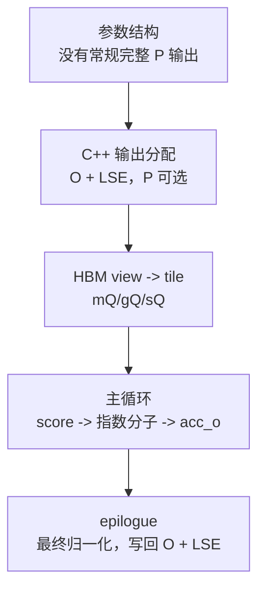

# Attention-IO · 源码走读

> 本页以基线 `002cce0` 的 FA2 fixed-length standard forward、`return_softmax=false` 为主，只证明一个主张：长期 HBM 主数值状态是 `Q/K/V -> O/LSE`；score 与未归一化指数权重只在 tile 内生成、修正、消费。测试 `S_dmask` 与 multi-split partial O/LSE 是明确例外，不应偷换成常规路径。

## 设计主线



本页不逐行讲所有 CuTe layout，而是沿 IO 证据链读：结构体允许什么长期状态，C++ 入口实际分配什么，kernel 内部让 score/指数分子活多久，最后 HBM 写回什么。这里讨论的是“物化哪些张量”，不是在没有硬件、shape 与 profiler 证据时声称每一笔 transaction 的精确数量。

## 长文读法

这篇只证明一个 IO 主张：standard、非测试 forward 的长期 HBM 主数值状态是 `Q/K/V -> O/LSE`，完整 score/概率矩阵不落回 HBM。读的时候沿“参数结构允许什么、C++ 分配什么、kernel tile 内生成什么、epilogue 写回什么”这条证据链走。

| 你的任务 | 先读 | 抓住什么 |
|----------|------|----------|
| 建立 IO 证据链 | 设计主线、源码依据 | 这篇不是性能口号，而是用结构体、C++ 分配和 kernel 写回证明状态边界 |
| 排查长期状态 | 1 到 2 | 参数和 C++ 输出分配显示常规路径只保留 O / LSE |
| 排查 HBM 读写 | 3 到 4 | traits 和 tile view 决定 Q/K/V 如何进入片上计算 |
| 理解局部权重生命周期 | 5 | score 原地变成未归一化指数分子，随后立即参与权重乘 V |
| 理解写回 | 6 | epilogue 把累计输出和 LSE 写回 HBM |
| 做源码验证 | 验证方式 | grep 参数结构、`mha_fwd`、`compute_attn`、`normalize_softmax_lse` |

## 源码依据

- 参数结构：来源：csrc/flash_attn/src/flash.h L21-L143
- C++ 输出分配与参数写入：来源：csrc/flash_attn/flash_api.cpp L420-L470
- kernel traits 与 HBM copy layout：来源：csrc/flash_attn/src/kernel_traits.h L48-L137
- HBM view 与 tile：来源：csrc/flash_attn/src/flash_fwd_kernel.h L138-L177
- Q/K/V copy 与片上状态初始化：来源：csrc/flash_attn/src/flash_fwd_kernel.h L250-L288
- tile 主循环：来源：csrc/flash_attn/src/flash_fwd_kernel.h L301-L367
- online softmax：来源：csrc/flash_attn/src/softmax.h L128-L189
- O/LSE 写回：来源：csrc/flash_attn/src/flash_fwd_kernel.h L431-L494

## 1. 参数结构先暴露长期状态边界

`Qkv_params` 保存 Q/K/V 指针、stride、head 数和 GQA 比例；`Flash_fwd_params` 增加输出 O、可选 P、LSE、维度、scale、dropout、window、cache 和 splitKV 等字段。来源：csrc/flash_attn/src/flash.h L21-L143

从 IO 角度看，字段可以分成三类：

| 类型 | 字段例子 | 含义 |
|------|----------|------|
| 必要 HBM 输入/输出 | `q_ptr/k_ptr/v_ptr/o_ptr` | 输入 Q/K/V 与最终 O。 |
| 压缩状态 | `softmax_lse_ptr` | 每行 softmax 归一化因子。 |
| 可选/变体路径 | `p_ptr`、`oaccum_ptr`、`softmax_lseaccum_ptr` | dropout 测试旁路、SplitKV partial accumulation。 |

这里能提出第一条候选判断：结构体的中心不是完整 P，而是 O、LSE 和必要输入指针。但“字段存在/不存在”还不足以证明实际分配，所以必须继续看 C++ 入口和 kernel 写回。

## 2. C++ 入口实际只固定分配 O 与 LSE

`mha_fwd` 要么复用并校验外部 `out_`，要么 `empty_like(q)` 创建 O。它总是分配 fp32 `softmax_lse`；`p` 只有在 `return_softmax` 为真时才分配，并且 C++ 明确要求 `p_dropout > 0`。随后 `set_params_fprop` 把 `return_softmax ? p.data_ptr() : nullptr` 与 `softmax_lse.data_ptr()` 传入参数包。来源：csrc/flash_attn/flash_api.cpp L420-L470

```cpp
// 来源：csrc/flash_attn/flash_api.cpp L441-L464
    auto softmax_lse = torch::empty({batch_size, num_heads, seqlen_q}, opts.dtype(at::kFloat));
    at::Tensor p;
    // Only return softmax if there's dropout to reduce compilation time
    if (return_softmax) {
        TORCH_CHECK(p_dropout > 0.0f, "return_softmax is only supported when p_dropout > 0.0");
        p = torch::empty({ batch_size, num_heads, seqlen_q_rounded, seqlen_k_rounded }, opts);
    }
    else {
        p = torch::empty({ 0 }, opts);
    }

    Flash_fwd_params params;
    set_params_fprop(params,
                     batch_size,
                     seqlen_q, seqlen_k,
                     seqlen_q_rounded, seqlen_k_rounded,
                     num_heads, num_heads_k,
                     head_size, head_size_rounded,
                     q, k, v, out,
                     /*cu_seqlens_q_d=*/nullptr,
                     /*cu_seqlens_k_d=*/nullptr,
                     /*seqused_k=*/nullptr,
                     return_softmax ? p.data_ptr() : nullptr,
                     softmax_lse.data_ptr(),
```

判断常规 IO 路径时，看这一层比看结构体字段更可靠：

```text
常规 forward: p_ptr = nullptr, softmax_lse_ptr != nullptr
dropout 测试旁路: p_ptr != nullptr
```

所以 `p_ptr` 的存在不是“生产主路径仍保存最终 attention 概率”的证据。公开接口明确说明 `S_dmask` 只用于测试、缩放不保证正确，符号位还编码 dropout keep/drop。真正的分界在 C++ 输出分配、launch 模板和 tile 写回。来源：flash_attn/flash_attn_interface.py L1052-L1062

## 3. 必要 HBM 访问也被 traits 约束

FlashAttention 不是完全不读写 HBM。Q/K/V 必须读，O/LSE 必须写。`Flash_fwd_kernel_traits` 用 `kBlockM/kBlockN/kHeadDim/kNWarps` 固化 CTA 形状，用 shared memory layout 描述 Q/K/V/O tile，并用 128-bit copy layout 组织 global memory 访问。来源：csrc/flash_attn/src/kernel_traits.h L48-L137

这一步证明了 IO-aware 的第二层含义：

| 层次 | 目标 |
|------|------|
| 算法层 | 不把完整 score/概率矩阵写回 HBM。 |
| kernel 层 | 用 traits 固化 copy atom 与线程布局，组织必要的 Q/K/V/O 向量化、合并访问。 |

减少 HBM 状态和优化必要 HBM transaction 是两件事，源码里两者都存在。

## 4. kernel 把 HBM tensor 切成当前 CTA 的 tile

`compute_attn` 先用 Q/K/V 指针和 stride 构造 HBM view：`mQ/mK/mV`。再用 `local_tile` 得到当前 query block 的 `gQ`，以及 K/V 的 block 视图 `gK/gV`。随后用 traits layout 在 shared memory 里构造 `sQ/sK/sV`。来源：csrc/flash_attn/src/flash_fwd_kernel.h L138-L177

读这里要记住命名层级：

| 源码变量 | 存储层级 |
|----------|----------|
| `mQ/mK/mV` | HBM tensor view |
| `gQ/gK/gV` | 当前 HBM tile view |
| `sQ/sK/sV` | shared memory tile |
| `tSrQ`、`acc_s`、`acc_o` | register fragment |

从这一刻开始，kernel 不再面对完整 attention matrix，而是处理一个 query block 和一组 K/V blocks。

## 5. 主循环让 score/指数分子只活在 tile 内

进入主循环前，kernel 先 copy Q tile，预取一个 K tile，必要时把 Q retile 到寄存器，清零 `acc_o`，并构造 `Softmax` 与 `Mask`。来源：csrc/flash_attn/src/flash_fwd_kernel.h L250-L288

standard kernel 从当前可见 K 范围的右端向左扫描。每一轮 K/V block 中，源码顺序是：

1. 创建并清零 `acc_s`。
2. 用 Q/K 做 GEMM 得到局部 score tile。
3. 先对 `acc_s` 做可选 softcap，再做 mask/ALiBi。
4. 调 `softmax_rescale_o` 更新 `row_max/row_sum` 并重缩放旧 `acc_o`。
5. 此时 `acc_s` 已原地变成 `exp(score - 当前全局 row_max)`，再转成低精度 `rP`。
6. 用 `gemm_rs(acc_o, rP, V)` 把未归一化权重乘 V 并累积输出分子。

主循环证据：来源：csrc/flash_attn/src/flash_fwd_kernel.h L301-L367

online softmax 证据：来源：csrc/flash_attn/src/softmax.h L128-L189

```cpp
// 来源：csrc/flash_attn/src/flash_fwd_kernel.h L319-L330
        FLASH_NAMESPACE::gemm</*A_in_regs=*/Kernel_traits::Is_Q_in_regs>(
            acc_s, tSrQ, tSrK, tSsQ, tSsK, tiled_mma, smem_tiled_copy_Q, smem_tiled_copy_K,
            smem_thr_copy_Q, smem_thr_copy_K
        );
        // if (cute::thread0()) { print(acc_s); }
        if constexpr (Is_softcap){
            FLASH_NAMESPACE::apply_softcap(acc_s, params.softcap);
        }

        mask.template apply_mask<Is_causal, Is_even_MN>(
            acc_s, n_block * kBlockN, m_block * kBlockM + (tidx / 32) * 16 + (tidx % 32) / 4, kNWarps * 16
        );
```

这张卡只证明 score 变换顺序：QK GEMM → softcap → mask/ALiBi。它不证明 `acc_s` 已经成为概率。

```cpp
// 来源：csrc/flash_attn/src/flash_fwd_kernel.h L341-L367
        // TODO: when we have key_padding_mask we'll need to Check_inf
        masking_step == 0
            ? softmax.template softmax_rescale_o</*Is_first=*/true,  /*Check_inf=*/Is_causal || Is_local>(acc_s, acc_o, params.scale_softmax_log2)
            : softmax.template softmax_rescale_o</*Is_first=*/false, /*Check_inf=*/Is_causal || Is_local>(acc_s, acc_o, params.scale_softmax_log2);

        // Convert acc_s from fp32 to fp16/bf16
        Tensor rP = FLASH_NAMESPACE::convert_type<Element>(acc_s);
        int block_row_idx = m_block * (kBlockM / 16) + tidx / 32;
        int block_col_idx = n_block * (kBlockN / 32);
        if (Return_softmax) {
            Tensor rP_drop = make_fragment_like(rP);
            cute::copy(rP, rP_drop);
            dropout.template apply_dropout</*encode_dropout_in_sign_bit=*/true>(
                rP_drop, block_row_idx, block_col_idx, kNWarps
            );
            cute::copy(rP_drop, tSgS);
            tSgS.data() = tSgS.data() + (-kBlockN);
        }
        if (Is_dropout) {
            dropout.apply_dropout(rP, block_row_idx, block_col_idx, kNWarps);
        }

        // Reshape rP from (MMA=4, MMA_M, MMA_N) to ((4, 2), MMA_M, MMA_N / 2)
        // if using m16n8k16 or (4, MMA_M, MMA_N) if using m16n8k8.
        Tensor tOrP = make_tensor(rP.data(), FLASH_NAMESPACE::convert_layout_acc_Aregs<typename Kernel_traits::TiledMma>(rP.layout()));
        // if (cute::thread0()) { print(tOrP); }
        FLASH_NAMESPACE::gemm_rs(acc_o, tOrP, tOrVt, tOsVt, tiled_mma, smem_tiled_copy_V, smem_thr_copy_V);
```

这一段是 Attention-IO 专题的核心：`acc_s` 生成后立即被修正并改写成指数分子，`rP` 生成后立即被乘 V。跨 K/V block 留下的是 `row_max/row_sum/acc_o`，不是完整 score 或最终概率矩阵。dropout 只改写送入权重乘 V 的 `rP`；最终分母仍由未 dropout 的 `row_sum` 表示。

## 6. Standard 非测试 epilogue 收口 O 与 LSE

扫描完所有 K/V blocks 后，epilogue 调 `normalize_softmax_lse` 才得到 LSE，并用最终 `row_sum` 归一化 `acc_o`；dropout 路径同时乘 `1 / p_keep`。之后 `acc_o` 转成输出 dtype，经 shared memory 输出 tile 重排，再写回 `gO`；每行 LSE 写入 `gLSE`。来源：csrc/flash_attn/src/flash_fwd_kernel.h L431-L494

```cpp
// 来源：csrc/flash_attn/src/flash_fwd_kernel.h L431-L455
    // Epilogue

    Tensor lse = softmax.template normalize_softmax_lse<Is_dropout>(acc_o, params.scale_softmax, params.rp_dropout);

    // Convert acc_o from fp32 to fp16/bf16
    Tensor rO = FLASH_NAMESPACE::convert_type<Element>(acc_o);
    Tensor sO = make_tensor(sQ.data(), typename Kernel_traits::SmemLayoutO{});    // (SMEM_M,SMEM_N)
    // Partition sO to match the accumulator partitioning
    auto smem_tiled_copy_O = make_tiled_copy_C(typename Kernel_traits::SmemCopyAtomO{}, tiled_mma);
    auto smem_thr_copy_O = smem_tiled_copy_O.get_thread_slice(tidx);
    Tensor taccOrO = smem_thr_copy_O.retile_S(rO);        // ((Atom,AtomNum), MMA_M, MMA_N)
    Tensor taccOsO = smem_thr_copy_O.partition_D(sO);     // ((Atom,AtomNum),PIPE_M,PIPE_N)

    // sO has the same size as sQ, so we don't need to sync here.
    if (Kernel_traits::Share_Q_K_smem) { __syncthreads(); }

    cute::copy(smem_tiled_copy_O, taccOrO, taccOsO);

    Tensor mO = make_tensor(make_gmem_ptr(reinterpret_cast<Element*>(params.o_ptr)
                                          + binfo.q_offset(params.o_batch_stride, params.o_row_stride, bidb)),
                            make_shape(binfo.actual_seqlen_q, params.h, params.d),
                            make_stride(params.o_row_stride, params.o_head_stride, _1{}));
    Tensor gO = local_tile(mO(_, bidh, _), Shape<Int<kBlockM>, Int<kHeadDim>>{},
                           make_coord(m_block, 0));  // (kBlockM, kHeadDim)
    Tensor gLSE = get_lse_tile<ElementAccum, Params, kBlockM, Is_even_MN>(params, bidb, bidh, m_block, binfo);
```

这闭合了整条 IO 证据链：

```text
HBM 读入: Q/K/V
tile 内:  score -> row_max/row_sum -> 指数分子 rP -> acc_o 输出分子
HBM 写出: O + LSE
```

这条闭环只描述 standard 非测试主数值路径。若 `return_softmax` 开启，tile 循环会额外写测试 `S_dmask`；若 `num_splits > 1`，split kernel 会把 partial O/LSE 写入 HBM 后再 combine。二者都没有推翻“常规路径不物化完整最终概率矩阵”，但会增加例外写回，必须在讨论 IO 时显式标注。

## 验证方式

静态验证：

- 在 `flash_api.cpp` 确认 `p` 不是常规分配。
- 在 `flash_fwd_kernel.h` 确认 `acc_s/rP` 没有 standard 非测试 HBM 写回路径，并识别 `Return_softmax` 旁路。
- 在 epilogue 确认写回目标是 `gO` 与 `gLSE`。
- 在 split launch 确认只有 `num_splits > 1` 才 launch combine。

运行验证：

用固定 B/H/Sq/Sk/D、dtype、causal 和 GPU 的小 shape 比较 `flash_attn_func` 与 PyTorch reference 的 `out`，再观察 `return_attn_probs=False` 时没有完整概率矩阵返回。预期是输出数值通过相对低精度基线验收，API 只返回 O；这证明接口与数学结果，不直接证明某个性能倍数或精确 HBM transaction 数。完整 correctness 测试可参考上游 `test_flash_attn_output`。来源：tests/test_flash_attn.py L903-L1130
