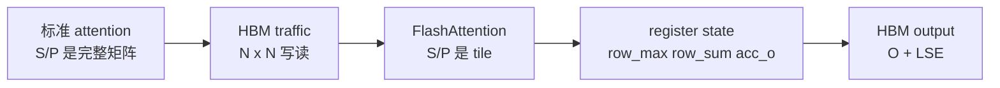

# Attention-IO

> 这个专题先回答“FlashAttention 到底省了什么”：不是少算 `QK^T`，而是不把完整 `S=QK^T` 和 `P=softmax(S)` 长期写回 HBM。

## 为什么要读

如果只记住“FlashAttention 更快”，后面读 FA2/FA3/FA4 kernel 会很容易迷失在 template、CuTe layout 和 launch helper 里。FA01 要建立的是一个更稳的判断：

| 读者问题 | 本专题给出的能力 |
|----------|------------------|
| 为什么标准 attention 会被长序列拖垮？ | 能指出 `S/P` 是 `N x N` 中间状态，问题在 HBM traffic。 |
| FlashAttention 为什么不是近似 attention？ | 能解释 tile 内仍然计算局部 `S/P`，只是生成即消费。 |
| `softmax_lse` 为什么重要？ | 能说明它是完整行 softmax 归一化因子的压缩保存。 |
| 源码里怎么确认没有保存完整 `P`？ | 能从 C++ 输出分配、`Flash_fwd_params`、kernel 主循环和 epilogue 找证据。 |

## 首次阅读路径

| 文件 | 读完应该会什么 |
| ------ | ---------------- |
| [[FlashAttention-Attention-IO-核心概念]] | 建立 HBM、shared memory、register 三层模型。 |
| [[FlashAttention-算法原点]] | 理解 FA1 的 exact attention、IO-aware 和 online softmax 不变量。 |
| [[FlashAttention-Attention-IO-源码走读]] | 用 FA2 当前源码证明 `O/LSE` 是长期状态，`S/P` 是 tile 内短生命周期状态。 |
| [[FlashAttention-Attention-IO-数据流]] | 把 `mQ/gQ/sQ/acc_s/acc_o/gO/gLSE` 放回存储层级。 |
| [[FlashAttention-Attention-IO-排障指南]] | 按“症状 -> 源码入口 -> 验证”排查常见误解。 |
| [[FlashAttention-Attention-IO-学习检查]] | 验收自己是否能从公式讲到源码证据。 |

## 心理模型

读这个专题时一直追两个问题：

1. 哪些东西必须长期放在 HBM：`Q/K/V`、最终 `O`、每行 `LSE`。
2. 哪些东西只应该在 tile 内短暂存在：局部 `S`、局部 `P`、mask 后 score。

## 源码范围

- 论文与版本定位：来源：README.md L1-L15
- FA2 fixed-length API 背景：来源：README.md L405-L420
- 参数结构：来源：csrc/flash_attn/src/flash.h L21-L143
- C++ 输出分配：来源：csrc/flash_attn/flash_api.cpp L420-L470
- kernel traits 与必要 HBM 访问：来源：csrc/flash_attn/src/kernel_traits.h L48-L137
- HBM tile 到 shared memory：来源：csrc/flash_attn/src/flash_fwd_kernel.h L138-L177
- Q/K/V 预取与片上状态初始化：来源：csrc/flash_attn/src/flash_fwd_kernel.h L250-L288
- tile 主循环：来源：csrc/flash_attn/src/flash_fwd_kernel.h L301-L367
- online softmax：来源：csrc/flash_attn/src/softmax.h L128-L189
- O/LSE 写回：来源：csrc/flash_attn/src/flash_fwd_kernel.h L431-L494

## 读完后的去向

如果你对 `row_max/row_sum` 的数学等价性还不稳，读 [[FlashAttention-Online-Softmax]]。如果你已经能解释 IO 模型，进入 [[FlashAttention-FA2-Forward]] 看它如何落成 C++ 参数、dispatch 和 CUDA kernel。
