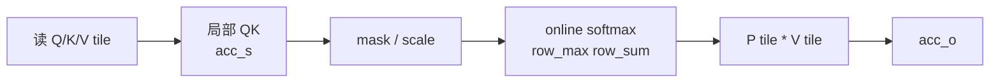

# FlashAttention 算法原点

## 你为什么要读

本页解决一个基础判断：FlashAttention-1 到底改了 attention 的哪一层。读完后，你应该能把“exact attention 不变”和“IO 生命周期改变”分开，并能用当前 FA2 源码里的 `out`、`softmax_lse`、online softmax 主线验证这个判断。

> FA1 的贡献可以压成两个词：exact attention 和 IO-awareness。它没有改 attention 数学定义，而是改了中间矩阵在 memory hierarchy 中的生命周期。

## 源码与论文定位

当前 upstream README 明确列出两篇核心论文：FlashAttention: Fast and Memory-Efficient Exact Attention with IO-Awareness，以及 FlashAttention-2: Faster Attention with Better Parallelism and Work Partitioning。来源：README.md L1-L15

当前仓库主源码已经是 FA2 系列实现，不保留一套独立 FA1 kernel 主路径。这个 vault 读 FA1 时不编造旧目录，而是抓住 FA1 的算法不变量，再看这些不变量如何在当前 FA2 源码中继续存在。

## FA1 要解决的原始问题

标准 attention 如果直接 materialize `S` 和 `P`：

```text
S = QK^T          # seqlen_q x seqlen_k
P = softmax(S)   # seqlen_q x seqlen_k
O = PV
```

长序列下，`S/P` 的 HBM 读写会成为二次方中间状态。FA1 问的是：

> 能不能保持 softmax attention 的精确结果，同时不把完整 `S/P` 长期写回 HBM？

答案是把 K/V 分块扫描，并为每个 query row 维护 online softmax 状态和输出累积。

## 三个不变量

| 不变量 | 含义 | 当前源码证据 |
|--------|------|--------------|
| 不保存完整 `P` | 局部概率 tile 生成后立即乘 V | `p` 只在可选 `return_softmax` 路径分配。 |
| online softmax 精确等价 | 每个 block 更新全局 row max / row sum | `Softmax` 保存 `row_max/row_sum` 并重缩放旧 `acc_o`。 |
| forward 保存压缩状态 | backward 不依赖完整概率矩阵 | epilogue 写出 `softmax_lse`。 |

源码依据：

- C++ 输出分配：来源：csrc/flash_attn/flash_api.cpp L420-L470
- online softmax：来源：csrc/flash_attn/src/softmax.h L128-L189
- kernel epilogue 写出 LSE：来源：csrc/flash_attn/src/flash_fwd_kernel.h L431-L494

这三个不变量贯穿 FA2、FA3、FA4。后续版本可以换 API、换调度、换硬件特化，但不能让常规路径回到“完整 `P` 常驻 HBM”。

## 一轮 tile 内发生什么



这张图里，`P tile` 是真实算出来的概率块，但它不会成为完整 HBM 矩阵。它马上乘 V，被折叠进 `acc_o`。当前 FA2 kernel 的主循环正是这个顺序：`gemm` 生成 `acc_s`，mask，`softmax_rescale_o`，转换成 `rP`，再 `gemm_rs` 累积 `acc_o`。来源：csrc/flash_attn/src/flash_fwd_kernel.h L301-L367

## FA1 与标准 attention 的差异

| 维度 | 标准 attention 心理模型 | FA1 心理模型 |
|------|--------------------------|--------------|
| 性能瓶颈 | 两次矩阵乘 FLOPs | HBM 读写与片上复用 |
| 中间状态 | `S/P` 是完整矩阵 | `S/P` 是 tile 内短生命周期对象 |
| softmax | 对完整行一次性归一化 | 分块维护 `row_max/row_sum` |
| backward | 更容易依赖保存的概率矩阵 | 保存 LSE，重算局部概率 |
| 长上下文 | 激活和 IO 二次方膨胀 | 长期状态围绕 `O/LSE` |

这也是为什么 FA1 对 AI infra 重要：它把“长上下文为什么慢/贵”从模型层抽象问题，变成了 kernel 可以操作的内存层级问题。

## FA2 为什么还需要出现

FA1 给出了 IO-aware exact attention 的路线，但工程上还需要更好的并行度、work partitioning、API 边界和更多模型特性。README 的 FA2 版本说明提到 complete rewrite，并把 fixed-length API 和 varlen API 区分出来。来源：README.md L405-L420

因此 FA2 不是推翻 FA1，而是把 FA1 的不变量继续工程化：更清晰的 Python/C++ API、更细的 head_dim specialization、更复杂的 dispatch、更完整的 serving/decode 适配。

## 自测

- [ ] 能解释 FA1 为什么是 exact attention，而不是近似 attention。
- [ ] 能解释 `S/P` 不落 HBM 对显存和 HBM traffic 的意义。
- [ ] 能写出 online softmax 需要维护的 `row_max/row_sum/acc_o`。
- [ ] 能解释 forward 为什么保存 LSE，而不是保存完整概率矩阵。
- [ ] 能说明 FA2 为什么是 FA1 的工程化延续。
