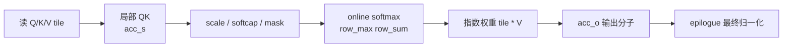

# FlashAttention 算法原点

## 你为什么要读

本页解决一个基础判断：FlashAttention-1 到底改了 attention 的哪一层。读完后，你应该能把“exact attention 数学目标不变”和“IO 生命周期改变”分开，并能用基线 `002cce0` 的 FA2 `out`、`softmax_lse`、online softmax 主线验证这一算法血缘。本页不是 FA1 论文定理与 IO 下界证明的替代品；历史定位只采用 upstream README 明示内容。

> FA1 的贡献可以压成两个词：exact attention 和 IO-awareness。它没有改 attention 数学定义，而是改了中间矩阵在 memory hierarchy 中的生命周期。

## 源码与论文定位

当前 upstream README 明确列出两篇核心论文：FlashAttention: Fast and Memory-Efficient Exact Attention with IO-Awareness，以及 FlashAttention-2: Faster Attention with Better Parallelism and Work Partitioning。来源：README.md L1-L15

当前仓库主源码已经是 FA2 系列实现，不保留一套独立 FA1 kernel 主路径。这个 vault 读 FA1 时不编造旧目录，而是抓住 FA1 的算法不变量，再看这些不变量如何在当前 FA2 源码中继续存在。

## FA1 要解决的原始问题

标准 attention 如果直接 materialize `S` 和 `P`：

```text
S = QK^T          # seqlen_q x seqlen_k
P = softmax(S)   # seqlen_q x seqlen_k
O = PV
```

若采用物化式实现，score/P 会成为 `Sq x Sk` 的 HBM 中间状态；等长 self-attention 时才是 `N x N`。FA1 问的是：

> 能不能保持 softmax attention 的精确结果，同时不把完整 `S/P` 长期写回 HBM？

答案是把 K/V 分块扫描，并为每个 query row 维护 online softmax 状态和输出累积。

## 三个不变量

| 不变量 | 含义 | 当前源码证据 |
|--------|------|--------------|
| 不保存完整最终 `P` | 局部指数权重生成后立即乘 V，epilogue 再统一归一化 | `p` 只在可选 dropout 测试路径分配。 |
| online softmax 精确等价 | 每个 block 更新全局 row max / row sum | `Softmax` 保存 `row_max/row_sum` 并重缩放旧 `acc_o`。 |
| forward 保存压缩状态 | backward 不依赖完整概率矩阵 | epilogue 写出 `softmax_lse`。 |

源码依据：

- C++ 输出分配：来源：csrc/flash_attn/flash_api.cpp L420-L470
- online softmax：来源：csrc/flash_attn/src/softmax.h L128-L189
- kernel epilogue 写出 LSE：来源：csrc/flash_attn/src/flash_fwd_kernel.h L431-L494

这三个问题构成阅读后续实现的检查表：是否保持 exact 目标、是否避免常规完整 P 常驻 HBM、是否保存足够的压缩状态供 backward 重算。FA2 当前源码给出肯定答案；FA3/FA4 应分别按各自源码重新验证，不能只凭版本继承关系下结论。

## 一轮 tile 内发生什么



这张图里，softmax 指数权重确实被计算，但当前 FA2 的 `acc_s/rP` 尚未除完整行的最终分母。它马上乘 V，被折叠进 `acc_o` 输出分子，直到 epilogue 才统一归一化。当前 FA2 kernel 的顺序是：`gemm` 生成 `acc_s`，可选 softcap，mask/ALiBi，`softmax_rescale_o`，转换成 `rP`，再 `gemm_rs` 累积 `acc_o`。来源：csrc/flash_attn/src/flash_fwd_kernel.h L301-L367；来源：csrc/flash_attn/src/softmax.h L128-L189

## FA1 与标准 attention 的差异

| 维度 | 标准 attention 心理模型 | FA1 心理模型 |
|------|--------------------------|--------------|
| 性能分析起点 | 只数两次矩阵乘 FLOPs | 同时核对中间态物化、HBM traffic 与片上复用；最终瓶颈需实测 |
| 中间状态 | 对照模型物化完整 score/P | score/指数权重是 tile 内短生命周期对象 |
| softmax | 对完整行一次性归一化 | 分块维护 `row_max/row_sum` |
| backward | 物化式实现可能保存概率矩阵 | 保存 LSE 等紧凑状态，重算局部权重 |
| 长上下文中间态 | 物化 score/P 的容量与往返按 `Sq x Sk` 增长 | 不让完整 score/P 成为常规长期 HBM 状态；Q/K/V/O/LSE 仍需保存或访问 |

这也是为什么 FA1 对 AI infra 重要：它把长上下文成本的一部分从抽象复杂度落到可检查的 kernel 状态生命周期与存储层级。至于某个模型为何慢、节省多少显存或加速多少，仍必须给定硬件、dtype、shape、前后向范围和实现基线。

## FA2 为什么还需要出现

FA1 给出了 IO-aware exact attention 的路线，但工程上还需要更好的并行度、work partitioning、API 边界和更多模型特性。README 的 FA2 版本说明提到 complete rewrite，并把 fixed-length API 和 varlen API 区分出来。来源：README.md L405-L420

因此 FA2 不是推翻 FA1，而是把 FA1 的不变量继续工程化：更清晰的 Python/C++ API、更细的 head_dim specialization、更复杂的 dispatch、更完整的 serving/decode 适配。

## 自测

- [ ] 能解释 FA1 为什么是 exact attention，而不是近似 attention。
- [ ] 能解释完整 score/P 不落 HBM 对中间态容量和 traffic 的意义，并说明测试/multi-split 例外。
- [ ] 能写出 online softmax 需要维护的 `row_max/row_sum/acc_o`。
- [ ] 能解释 forward 为什么保存 LSE，而不是保存完整概率矩阵。
- [ ] 能说明当前 FA2 如何延续 FA1 的 exact/IO-aware 主线，同时避免替 FA3/FA4 未经源码核验地背书。
