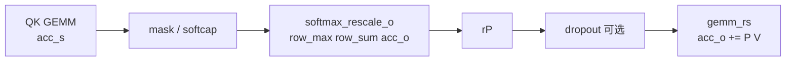
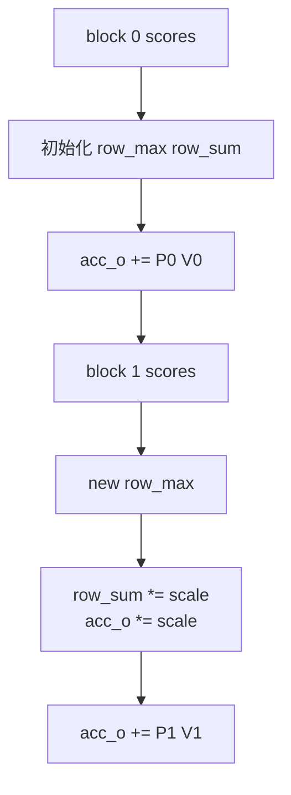
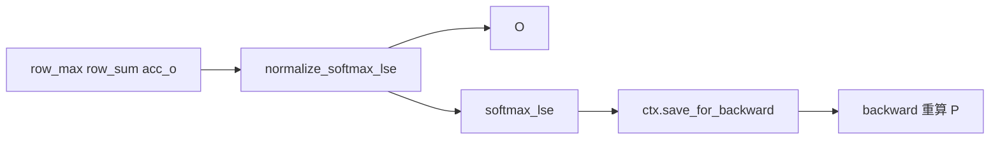

# Online-Softmax · 数据流

## 读者任务

这篇只看对象如何变形：`acc_s`、`row_max`、`row_sum`、`acc_o`、`rP`、`lse` 在 forward kernel 和 autograd 之间如何交接。

## 对象生命周期

| 对象 | 所在层 | 生命周期 | 关键变化 |
|------|--------|----------|----------|
| `acc_s` | CUDA register fragment | 当前 K block | raw score -> mask/softcap 后 score -> probability tile |
| `row_max` | `Softmax<kNRows>` | 一个 query tile 扫完整条 K | 记录已扫描 block 的全局行最大值 |
| `row_sum` | `Softmax<kNRows>` | 一个 query tile 扫完整条 K | 在当前 max 标尺下累计分母 |
| `acc_o` | CUDA accumulator | 一个 query tile 扫完整条 K | 未归一化 `P @ V`，后续 block 会重标尺 |
| `rP` | CUDA register fragment | 当前 K block | 概率 tile 的 element 类型副本，立即参与 `P @ V` |
| `lse` | CUDA epilogue / Python ctx | forward 到 backward | 每行一个稳定归一化摘要 |

## Forward block 内的数据流



源码顺序与图一致：

```cpp
// 来源：csrc/flash_attn/src/flash_fwd_kernel.h L320-L367
FLASH_NAMESPACE::gemm(
    acc_s, tSrQ, tSrK, tSsQ, tSsK, tiled_mma, smem_tiled_copy_Q, smem_tiled_copy_K,
    smem_thr_copy_Q, smem_thr_copy_K
);
if constexpr (Is_softcap){
    FLASH_NAMESPACE::apply_softcap(acc_s, params.softcap);
}
mask.template apply_mask<Is_causal, Is_even_MN>(acc_s, n_block * kBlockN, row_offset, kNWarps * 16);
masking_step == 0
    ? softmax.template softmax_rescale_o</*Is_first=*/true,  /*Check_inf=*/Is_causal || Is_local>(acc_s, acc_o, params.scale_softmax_log2)
    : softmax.template softmax_rescale_o</*Is_first=*/false, /*Check_inf=*/Is_causal || Is_local>(acc_s, acc_o, params.scale_softmax_log2);
Tensor rP = FLASH_NAMESPACE::convert_type<Element>(acc_s);
if (Is_dropout) {
    dropout.apply_dropout(rP, block_row_idx, block_col_idx, kNWarps);
}
Tensor tOrP = make_tensor(rP.data(), FLASH_NAMESPACE::convert_layout_acc_Aregs<typename Kernel_traits::TiledMma>(rP.layout()));
FLASH_NAMESPACE::gemm_rs(acc_o, tOrP, tOrVt, tOsVt, tiled_mma, smem_tiled_copy_V, smem_thr_copy_V);
```

`Return_softmax` 只复制一份概率用于测试/调试；常规 forward 不把 `P` 写出。

## 跨 block 状态流



后续 block 的关键是同步缩放：

```cpp
// 来源：csrc/flash_attn/src/softmax.h L146-L166
Tensor scores_max_prev = make_fragment_like(row_max);
cute::copy(row_max, scores_max_prev);
FLASH_NAMESPACE::template reduce_max</*zero_init=*/false>(scores, row_max);
Tensor acc_o_rowcol = make_tensor(acc_o.data(), FLASH_NAMESPACE::convert_layout_acc_rowcol(acc_o.layout()));
for (int mi = 0; mi < size(row_max); ++mi) {
    float scores_scale = exp2f((scores_max_prev(mi) - scores_max_cur) * softmax_scale_log2);
    row_sum(mi) *= scores_scale;
    for (int ni = 0; ni < size<1>(acc_o_rowcol); ++ni) {
        acc_o_rowcol(mi, ni) *= scores_scale;
    }
}
FLASH_NAMESPACE::scale_apply_exp2(scores, row_max, softmax_scale_log2);
FLASH_NAMESPACE::reduce_sum</*zero_init=*/false>(scores, row_sum);
```

这段保证分母账和输出分子账始终在同一个最大值标尺下。它是分块 exact softmax 的数据一致性边界。

## Epilogue 到 autograd 的协议



`normalize_softmax_lse` 把内部状态落成输出和 LSE：

```cpp
// 来源：csrc/flash_attn/src/softmax.h L169-L185
quad_allreduce_(row_sum, row_sum, sum_op);
TensorT lse = make_fragment_like(row_sum);
Tensor acc_o_rowcol = make_tensor(acc_o.data(), FLASH_NAMESPACE::convert_layout_acc_rowcol(acc_o.layout()));
for (int mi = 0; mi < size<0>(acc_o_rowcol); ++mi) {
    float sum = row_sum(mi);
    float inv_sum = (sum == 0.f || sum != sum) ? 1.f : 1.f / sum;
    lse(mi) = (sum == 0.f || sum != sum) ? (Split ? -INFINITY : INFINITY) : row_max(mi) * softmax_scale + __logf(sum);
    float scale = !Is_dropout ? inv_sum : inv_sum * rp_dropout;
    for (int ni = 0; ni < size<1>(acc_o_rowcol); ++ni) { acc_o_rowcol(mi, ni) *= scale; }
}
```

Python autograd 保存 LSE：

```python
# 来源：flash_attn/flash_attn_interface.py L855-L878
out_padded, softmax_lse, S_dmask, rng_state = _wrapped_flash_attn_forward(
    q, k, v, dropout_p, softmax_scale,
    causal=causal,
    window_size_left=window_size[0],
    window_size_right=window_size[1],
    softcap=softcap,
    alibi_slopes=alibi_slopes,
    return_softmax=return_softmax and dropout_p > 0,
)
if is_grad:
    ctx.save_for_backward(q, k, v, out_padded, softmax_lse, rng_state)
```

Backward 的数据依赖因此是 `q/k/v/out/dout/softmax_lse/rng_state`，不是完整 `P`。

## Dropout 与 RNG 的边界

Forward kernel 注释说明 dropout pattern 的定位方式要让 fwd/bwd 一致：使用 batch、head、lane 以及 16x32 attention block 位置生成同一随机模式。

```cpp
// 来源：csrc/flash_attn/src/flash_fwd_kernel.h L1083-L1091
// We want the fwd and bwd to generate the same dropout pattern (RNG), without restricting
// them to have the same number of threads or have to traverse the attention matrix
// in the same order.
// In the Philox RNG, we use the offset to store the batch, head, and the lane id
// (within a warp). We use the subsequence to store the location of the 16 x 32 blocks within
// the attention matrix. This way, as long as we have the batch, head, and the location of
// the 16 x 32 block within the attention matrix, we can generate the exact same dropout pattern.
```

这解释了为什么 `rng_state` 是 forward/backward 协议字段，而不是调试附属品。

## 复盘

- `P` 的主路径生命周期只在当前 block 的寄存器里。
- `acc_o` 既是输出累积，也是 online softmax 状态的一部分。
- `LSE` 是 forward 结束时从 `row_max/row_sum` 压缩出的协议字段。
- dropout 引入的不是新 softmax 公式，而是 forward/backward 随机模式一致性要求。
