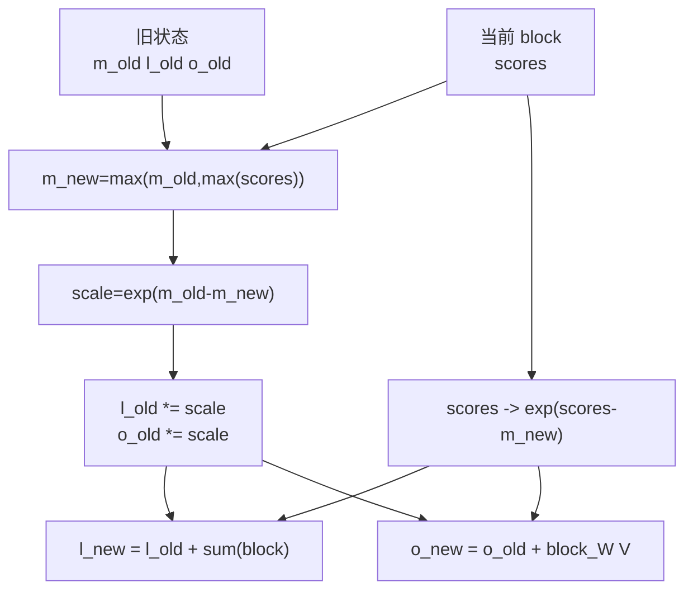

# Online-Softmax · 核心概念

## 读者为什么要读

FlashAttention 的 IO 优化依赖一个前提：standard 主路径不把完整 `S = QK^T` 和 `P = softmax(S)` 存下来，但输出必须等价于全量 softmax。本页以基线 `002cce0` 的 FA2 为落点，建立 online softmax 的数学与源码共同边界。

这篇只建立心理模型。读完你应该能解释：

- 为什么“每个 K block 单独 softmax 再相加”是错的。
- `row_max`、`row_sum`、`acc_o` 分别保存什么。
- 新 block 出现更大 score 时，为什么历史分母和历史输出都要缩放。
- `softmax_lse` 为什么是 forward 到 backward 的压缩协议。

## 先建立模型

对一个 query 行，标准 softmax 需要完整行的最大值和分母：

```text
P_j = exp(S_j - max(S)) / sum_k exp(S_k - max(S))
O   = sum_j P_j V_j
```

分块扫描 K/V 时，当前 kernel 一次只看到一段 `S_j`。Online softmax 的做法是维护三本账：

| 账 | 源码状态 | 含义 |
|----|----------|------|
| 最大值账 | `row_max` | 已扫描 K block 中每个 query 行的最大 score |
| 分母账 | `row_sum` | 在当前 `row_max` 标尺下的 `sum(exp(score-row_max))` |
| 分子账 | `acc_o` | 在当前 `row_max` 标尺下的指数权重乘 V 累积，尚未除最终分母 |

新 K block 到来后，如果它让 `row_max` 变大，历史 `row_sum` 和 `acc_o` 都必须乘同一个 `exp(old_max - new_max)`。这样历史贡献就被搬到新标尺下，再和当前 block 合并。



## 源码里的真实状态

`Softmax<kNRows>` 只显式保存 `row_max` 和 `row_sum`；`acc_o` 由调用方传进 `softmax_rescale_o`，因为它同时也是 forward 主循环的输出累积寄存器。

```cpp
// 来源：csrc/flash_attn/src/softmax.h L128-L142
template <int kNRows>
struct Softmax {

    using TensorT = decltype(make_tensor<float>(Shape<Int<kNRows>>{}));
    TensorT row_max, row_sum;

    __forceinline__ __device__ Softmax() {};

    template<bool Is_first, bool Check_inf=false, typename Tensor0, typename Tensor1>
    __forceinline__ __device__ void softmax_rescale_o(Tensor0 &acc_s, Tensor1 &acc_o, float softmax_scale_log2) {
        // Reshape acc_s from (MMA=4, MMA_M, MMA_N) to (nrow=(2, MMA_M), ncol=(2, MMA_N))
        Tensor scores = make_tensor(acc_s.data(), FLASH_NAMESPACE::convert_layout_acc_rowcol(acc_s.layout()));
        static_assert(decltype(size<0>(scores))::value == kNRows);
        if (Is_first) {
            FLASH_NAMESPACE::template reduce_max</*zero_init=*/true>(scores, row_max);
```

这段代码把概念落到三个源码对象：

- `acc_s`：当前 K block 的 score tile，进入函数后会被原地改成 `exp(score - 当前全局 row_max)` 指数分子，不是最终概率。
- `row_max/row_sum`：跨 K block 保留的行级 softmax 状态。
- `acc_o`：跨 K block 累积的输出分子，必须跟着 `row_max` 改变而重标尺。

## 第一块和后续块不是同一条路径

第一块没有历史状态，直接初始化；后续块必须把历史状态搬到新最大值标尺下。

```cpp
// 来源：csrc/flash_attn/src/softmax.h L136-L166
    template<bool Is_first, bool Check_inf=false, typename Tensor0, typename Tensor1>
    __forceinline__ __device__ void softmax_rescale_o(Tensor0 &acc_s, Tensor1 &acc_o, float softmax_scale_log2) {
        // Reshape acc_s from (MMA=4, MMA_M, MMA_N) to (nrow=(2, MMA_M), ncol=(2, MMA_N))
        Tensor scores = make_tensor(acc_s.data(), FLASH_NAMESPACE::convert_layout_acc_rowcol(acc_s.layout()));
        static_assert(decltype(size<0>(scores))::value == kNRows);
        if (Is_first) {
            FLASH_NAMESPACE::template reduce_max</*zero_init=*/true>(scores, row_max);
            FLASH_NAMESPACE::scale_apply_exp2(scores, row_max, softmax_scale_log2);
            FLASH_NAMESPACE::reduce_sum</*zero_init=*/true>(scores, row_sum);
        } else {
            Tensor scores_max_prev = make_fragment_like(row_max);
            cute::copy(row_max, scores_max_prev);
            FLASH_NAMESPACE::template reduce_max</*zero_init=*/false>(scores, row_max);
            // Reshape acc_o from (MMA=4, MMA_M, MMA_K) to (nrow=(2, MMA_M), ncol=(2, MMA_K))
            Tensor acc_o_rowcol = make_tensor(acc_o.data(), FLASH_NAMESPACE::convert_layout_acc_rowcol(acc_o.layout()));
            static_assert(decltype(size<0>(acc_o_rowcol))::value == kNRows);
            #pragma unroll
            for (int mi = 0; mi < size(row_max); ++mi) {
                float scores_max_cur = !Check_inf
                    ? row_max(mi)
                    : (row_max(mi) == -INFINITY ? 0.0f : row_max(mi));
                float scores_scale = exp2f((scores_max_prev(mi) - scores_max_cur) * softmax_scale_log2);
                row_sum(mi) *= scores_scale;
                #pragma unroll
                for (int ni = 0; ni < size<1>(acc_o_rowcol); ++ni) { acc_o_rowcol(mi, ni) *= scores_scale; }
            }
            FLASH_NAMESPACE::scale_apply_exp2(scores, row_max, softmax_scale_log2);
            // We don't do the reduce across threads here since we don't need to use the row_sum.
            // We do that reduce at the end when we need to normalize the softmax.
            FLASH_NAMESPACE::reduce_sum</*zero_init=*/false>(scores, row_sum);
        }
```

这里最重要的不变量是：`row_sum` 和 `acc_o` 使用同一个 `scores_scale`。只缩放分母，不缩放输出分子，会得到错误的 `O`。

## LSE 是最终账本

扫完所有 K block 后，`normalize_softmax_lse` 做两件事：

- 用最终 `row_sum` 归一化 `acc_o`，得到用户看到的输出 `O`。
- 生成 `LSE = row_max * softmax_scale + log(row_sum)`，给 backward 重算局部权重。

```cpp
// 来源：csrc/flash_attn/src/softmax.h L169-L185
    template<bool Is_dropout=false, bool Split=false, typename Tensor0>
    __forceinline__ __device__ TensorT normalize_softmax_lse(Tensor0 &acc_o, float softmax_scale, float rp_dropout=1.0) {
        SumOp<float> sum_op;
        quad_allreduce_(row_sum, row_sum, sum_op);
        TensorT lse = make_fragment_like(row_sum);
        Tensor acc_o_rowcol = make_tensor(acc_o.data(), FLASH_NAMESPACE::convert_layout_acc_rowcol(acc_o.layout()));
        static_assert(decltype(size<0>(acc_o_rowcol))::value == kNRows);
        #pragma unroll
        for (int mi = 0; mi < size<0>(acc_o_rowcol); ++mi) {
            float sum = row_sum(mi);
            float inv_sum = (sum == 0.f || sum != sum) ? 1.f : 1.f / sum;
            lse(mi) = (sum == 0.f || sum != sum) ? (Split ? -INFINITY : INFINITY) : row_max(mi) * softmax_scale + __logf(sum);
            float scale = !Is_dropout ? inv_sum : inv_sum * rp_dropout;
            #pragma unroll
            for (int ni = 0; ni < size<1>(acc_o_rowcol); ++ni) { acc_o_rowcol(mi, ni) *= scale; }
        }
        return lse;
```

`softmax_lse` 的大小是每个 query 行一个标量；完整 P 是每个 query-key 对一个值。LSE 是 backward 重算的关键标尺之一，但不是唯一保存状态：当前 autograd 还保存 Q/K/V、O 和 RNG state（dropout 时使用）。整行无有效 key 时，non-split 与 split partial 分别使用 `+inf`、`-inf` LSE 工程哨兵。

## 复盘

1. Online softmax 是 exact softmax 的流式写法，不是近似。
2. `row_max` 解决数值稳定，`row_sum` 解决全局分母，`acc_o` 解决输出分子。
3. 新最大值出现时，历史分母和历史输出必须一起重标尺。
4. LSE 把最终最大值和分母合成一个稳定标量，是 forward/backward 的协议字段；dropout 只改写送入权重乘 V 的 `rP`，最终分母仍来自未 dropout 的 `row_sum`。
